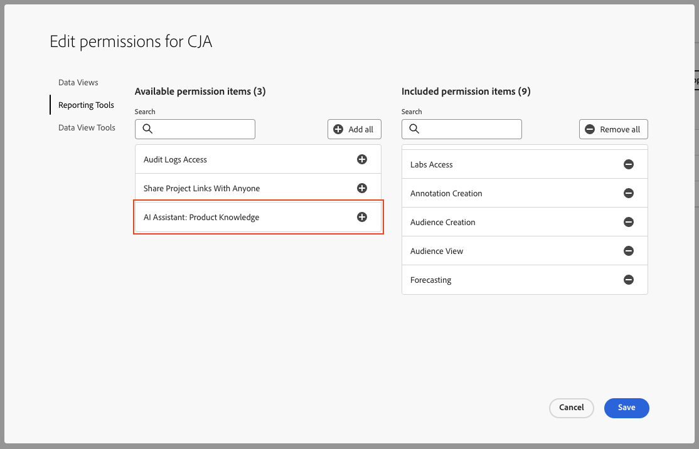

# AI Assistant voor Adobe Customer Journey Analytics

De Medewerker van AI is een conversatie ervaring die artsen toestaat om taken in een snel tempo uit te voeren - of het begrip concepten, het oplossen van problemenproblemen, of het zoeken door informatie is. Het stelt ook niet-deskundigen in staat om deskundig taken uit te voeren en verhoogt de algemene kwaliteit van het werk.

De AI Assistant in Customer Journey Analytics is getraind op basis van de Adobe Experience League-documentatie. Als een vraag wordt gesteld, antwoordt AI Assistant met een handig antwoord waarmee u snel kunt leren.

Als beginnende gebruiker, kunt u de Medewerker van AI gebruiken om de concepten van de Customer Journey Analytics te leren en aan boord te hebben aan producten en eigenschappen die u met onbekend bent. Als ervaren gebruiker, kunt u de Medewerker van AI gebruiken om geavanceerdere gebruiksgevallen of uiteinden en trucs voor te stellen.

Voorbeelden van vragen over concepten zijn:

* Wat is het verschil tussen batch- en streaming-opname?
* Wanneer wordt Customer Journey Analytics het beste voorgeschreven?
* Hoe stel ik een gegevensweergave in?

Vragen die buiten het toepassingsgebied van de Customer Journey Analytics vallen, zoals vragen over andere producten van de Adobe zoals Adobe Target en de Adobe Creative Cloud Suite, kunnen niet worden beantwoord.

AI Assistant voor Customer Journey Analytics is beschikbaar voor alle productlagen.

## Productkennis {#knowledge}

Het model voor het opvragen van productkennis is opgeleid voor Customer Journey Analytics. Andere mogelijkheden, zoals gegevensanalyse, zullen op een recentere datum worden uitgevoerd.

| Productkennis | Voorbeelden |
| --- | --- |
| Aanbevolen lessen | <ul><li>Wat is het verschil tussen Adobe Analytics en Customer Journey Analytics?</li><li>Hoe bouwt ik een berekende metrisch?</li></ul> |
| Openbare detectie | <ul><li>Hoe kan ik een project van de Werkruimte uitvoeren?</li><li>Hoe kan ik dubbele werkruimtecomponenten vinden?</li></ul> |
| Problemen oplossen | <ul><li>Hoe lang duurt het voordat gegevens in CJA komen?</li><li>Hoeveel afgeleide gebieden kan ik in een Customer Journey Analytics verbinding hebben?</li></ul> |

## Toegang tot functies

In deze eerste versie wordt de toegang tot de functie AI Assistant bepaald door de volgende parameters:

* **Toegang tot oplossing**: De AI-assistent is beschikbaar in Customer Journey Analytics, maar niet in Adobe Analytics. Het is ook beschikbaar in Adobe Experience Platform, Adobe Journey Optimizer, Adobe Real-Time CDP en aanvullende Experience Platform-apps.

* **Contractuele toegang**: Als u geen AI Assistant kunt gebruiken, neemt u contact op met de beheerder of de Adobe-accountvertegenwoordiger van uw organisatie. Voordat AI Assistant door uw organisatie kan worden gebruikt, moet uw bedrijf akkoord gaan met bepaalde wettelijke voorwaarden die betrekking hebben op GenAI.

* **Machtigingen**: In [!UICONTROL Adobe Admin Console]de [!UICONTROL Reporting Tools] De toestemming van &quot;AI Medewerker: van de Kennis van het Product&quot;bepaalt toegang tot dit hulpmiddel. A [productprofielbeheer](https://helpx.adobe.com/enterprise/using/manage-product-profiles.html) moet deze stappen in Admin Console volgen:
   1. Navigeren naar [!UICONTROL Admin Console] > [!UICONTROL Products and services] > [!UICONTROL Customer Journey Analytics] > [!UICONTROL Product Profile] > [!UICONTROL Permissions] > [!UICONTROL Edit Reporting Tools].
   1. Voeg &quot;AI Assistant: Product Knowledge&quot; toe.
      

## De Hulp van AI van de toegang in de UI van de Customer Journey Analytics

1. Als u AI Assistant wilt starten, selecteert u het AI-assistent-pictogram in de bovenste koptekst van een pagina in de gebruikersinterface van de Customer Journey Analytics.

   

   Als u AI Assistant voor het eerst gebruikt, wordt een disclaimer weergegeven met bepaalde gebruiksvoorwaarden voor de assistent.

1. In het meegeleverde vak stelt u een specifieke vraag over de natuurlijke taal van de AI Assistant.

   

1. (Optioneel) Als u bronnen wilt weergeven, klikt u op **[!UICONTROL Show Sources]** en worden de documentatiebron(nen) weergegeven die het antwoord heeft meegedeeld.

1. (Optioneel) U kunt ook een duimbreed- of duimbreed-stem uitbrengen over de wenselijkheid van een bepaald antwoord.

1. (Optioneel) U kunt het antwoord op onjuiste of schadelijke inhoud markeren.
