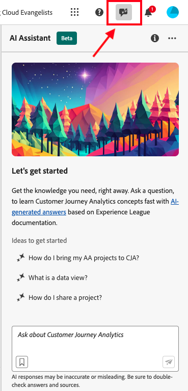

# AI Assistant voor Adobe Customer Journey Analytics

AI Assistant is een conversatie-ervaring waarmee artsen snel taken kunnen uitvoeren. Of de taak concepten moet begrijpen, problemen oplossen, of door informatie zoeken. Met AI Assistant kunnen niet-deskundigen ook taken van experts uitvoeren en de algemene kwaliteit van het werk verhogen.

De AI Assistant in Customer Journey Analytics is getraind op basis van de Adobe Experience League-documentatie. Als een vraag wordt gesteld, antwoordt AI Assistant met een handig antwoord waarmee u snel kunt leren.

Als beginnende gebruiker, kunt u de Medewerker van AI gebruiken om de concepten van de Customer Journey Analytics te leren en aan boord te hebben aan producten en eigenschappen die u met onbekend bent. Als ervaren gebruiker, kunt u de Medewerker van AI gebruiken om geavanceerdere gebruiksgevallen of uiteinden en trucs voor te stellen.

Voorbeelden van vragen over concepten zijn:

* Wat is het verschil tussen batch- en streaming-opname?
* Wanneer wordt Customer Journey Analytics het beste voorgeschreven?
* Hoe stel ik een gegevensweergave in?

Vragen die buiten het toepassingsgebied van de Customer Journey Analytics vallen, zoals vragen over andere producten van de Adobe zoals Adobe Target en de Adobe Creative Cloud Suite, kunnen niet worden beantwoord.

AI Assistant voor Customer Journey Analytics is beschikbaar voor alle productlagen.

## Productkennis {#knowledge}

Het model voor het opvragen van productkennis is opgeleid voor Customer Journey Analytics. Andere mogelijkheden, zoals gegevensanalyse, zullen later worden uitgevoerd.

| Productkennis | Voorbeelden |
| --- | --- |
| Aanbevolen lessen | <ul><li>Wat is het verschil tussen Adobe Analytics en Customer Journey Analytics?</li><li>Hoe bouwt ik een berekende metrisch?</li></ul> |
| Openbare detectie | <ul><li>Hoe kan ik een Workspace-project exporteren?</li><li>Hoe kan ik dubbele Workspace-componenten vinden?</li></ul> |
| Problemen oplossen | <ul><li>Hoe lang duurt het voordat gegevens in CJA komen?</li><li>Hoeveel afgeleide gebieden kan ik in een Customer Journey Analytics verbinding hebben?</li></ul> |

## Toegang tot functies

De volgende parameters bepalen de toegang tot de functie AI Assistant:

* **de toegang van de Oplossing**: De AI Medewerker is beschikbaar in Customer Journey Analytics, maar niet in Adobe Analytics. Het is ook beschikbaar in Adobe Experience Platform, Adobe Journey Optimizer, Adobe Real-Time CDP en aanvullende Experience Platform-apps.

* **Contractuele toegang**: Als u geen Medewerker kunt gebruiken AI, gelieve te contacteren de beheerder of de Vertegenwoordiger van de Rekening van de Adobe van uw organisatie. Voordat uw organisatie AI Assistant kan gebruiken, moet u akkoord gaan met bepaalde juridische voorwaarden die betrekking hebben op GenAI.

* **Toestemmingen**: In [!UICONTROL Adobe Admin Console], bepaalt de [!UICONTROL Reporting Tools] **[!UICONTROL AI Assistant: Product Knowledge]** toestemming toegang tot dit hulpmiddel. Admin van het a [ productprofiel ](https://helpx.adobe.com/enterprise/using/manage-product-profiles.html) moet deze stappen in [!UICONTROL Admin Console] volgen:
   1. Ga naar **[!UICONTROL Admin Console]** > **[!UICONTROL Products and services]** > **[!UICONTROL Customer Journey Analytics]** > **[!UICONTROL Product Profiles]**
   1. Selecteer de titel van het productprofiel waartoe u toegang wilt verlenen aan [!UICONTROL AI Assistant: Product Knowledge] .
   1. Selecteer **[!UICONTROL Permissions]** in het specifieke productprofiel.
   1. Selecteer  om uit te geven **[!UICONTROL Reporting Tools]**.
   1. Selecteer  om **Medewerker AI toe te voegen: De Kennis van het Product** aan **[!UICONTROL Included permission items]**.

       toe.

   1. Selecteer **[!UICONTROL Save]** om de machtigingen op te slaan.

Zie [ controle van de Toegang ](/help/technotes/access-control.md#access-control) voor meer informatie.

## De Hulp van AI van de toegang in de UI van de Customer Journey Analytics

1. Als u AI Assistant wilt starten, selecteert u het AI-assistent-pictogram in de bovenste koptekst van een pagina in de gebruikersinterface van de Customer Journey Analytics.

   

   Als u AI Assistant voor het eerst gebruikt, wordt een disclaimer weergegeven met bepaalde gebruiksvoorwaarden voor de assistent.

1. In het meegeleverde vak stelt u een specifieke vraag over de natuurlijke taal van de AI Assistant.

   

1. (Optioneel) Als u bronnen wilt weergeven, klikt u op **[!UICONTROL Show Sources]** en ziet u de documentatiebron of -bronnen die het antwoord hebben meegedeeld.

1. (Optioneel) U kunt ook een duimbreed- of duimbreed-stem uitbrengen over de wenselijkheid van een bepaald antwoord.

1. (Optioneel) U kunt het antwoord op onjuiste of schadelijke inhoud markeren.
