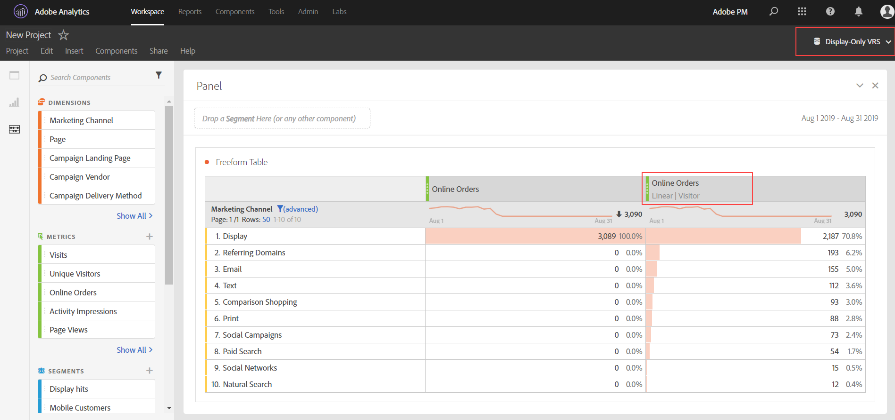

# Veelgestelde vragen over attributie

>[!NOTE]
>
>U bekijkt de documentatie voor de Werkruimte van de Analyse in de Analyse van de Reis van de Klant. Zijn eigenschapreeks verschilt lichtjes van [De Werkruimte van de analyse in de traditionele Analyse van Adobe](https://docs.adobe.com/content/help/en/analytics/analyze/analysis-workspace/home.html). [Meer informatie...](/help/getting-started/cja-aa.md)

**Wat is het &quot;Geen&quot;lijnpunt wanneer het gebruiken van attributen?**

Het &#39;Geen&#39; lijnpunt is een catch-all punt dat alle omzettingen vertegenwoordigt die zonder enige aanrakingspunten binnen het terugkijkvenster gebeurden. Probeer met inbegrip van een langere tijdwaaier in uw rapporteringsvenster.

**Waarom zie ik soms datums buiten mijn rapporteringsvenster wanneer het gebruiken van attributiemodellen?**

Deze extra datums zijn toe te schrijven aan het terugkijkvenster van de bezoeker die terugblik melden. Zie [Gegevens die buiten het rapportagevenster verschijnen](https://helpx.adobe.com/analytics/kb/data-appearing-outside-reporting-window.html) in de Analytics KB voor meer informatie. Adobe is van plan om deze extra rijen in een aanstaande versie uit te filtreren.

**Wanneer zou ik een bezoek versus bezoekersattributie terugblik moeten gebruiken?**

De keus van attributieterugblik hangt van uw gebruiksgeval af. Als de omzettingen typisch langer dan één enkel bezoek duren, wordt een bezoekersraadpleging geadviseerd. Het creëren van een virtuele rapportreeks met een langere bezoekdefinitie is ook een potentiële oplossing.

**Hoe vergelijken props en eVars bij het gebruik van attributie?**

De attributen worden opnieuw berekend bij rapportruntime, zodat is er geen verschil tussen een steun of eVar (of een andere dimensie) voor het belang van attributiemodellen. De steunen kunnen het gebruiken van om het even welk terugkijkvenster of attributiemodel voortzetten, en de eVar toewijzing/vervalmontages worden genegeerd.

**Zijn de attributiemodellen slechts beschikbaar als ik een virtuele rapportreeks met toegelaten verwerking van de rapporttijd gebruik?**

De modellen van de attributen zijn beschikbaar buiten virtuele rapportreeksen. Terwijl zij de verwerking van de rapporttijd op het achtereind gebruiken, zijn de attributiemodellen beschikbaar aan zowel standaardrapportreeksen als virtuele rapportreeksen.

**Welke afmetingen en metriek worden niet gesteund?**

Het attributiepaneel ondersteunt alle dimensies. Niet-ondersteunde gegevens zijn onder meer:

* Unieke bezoekers
* Bezoeken
* Voorvallen
* Paginaweergaven
* A4T-metriek
* Meetgegevens tijdsverloop
* Bounces
* Afvalpercentage
* Geopend
* Gesloten
* Pagina&#39;s niet gevonden
* Zoekopdrachten
* Bezoeken op één pagina
* Eenmalige toegang

**Werkt de toekenning met classificaties?**

Ja, classificaties worden volledig ondersteund.

**Werkt de toewijzing met gegevensbronnen?**

Ja, de meeste gegevensbronnen worden ondersteund. De attributen zijn niet mogelijk met summiere-vlakke gegevensbronnen omdat zij niet aan een de bezoekersidentificator van de Analyse verbinden. De de gegevensbronnen van identiteitskaart van de transactie worden ook gesteund, tenzij zij in een virtuele rapportreeks met toegelaten verwerking van de rapporttijd worden gebruikt.

**Werkt attributie met de integratie van Advertising Analytics?**

De afmetingen van meta-gegevens, zoals gelijke type en sleutelwoord, werken met attributen. Nochtans, gebruiken de metriek (met inbegrip van indrukken, kosten, klikken, gemiddelde positie, en gemiddelde kwaliteitsscore) summiere-vlakke gegevensbronnen, en zijn daarom onverenigbaar.

**Hoe werkt toewijzing met marketingkanalen?**

Toen de marketingkanalen voor het eerst werden geïntroduceerd, hadden ze alleen de eerste en laatste touchdimensies. De expliciete eerste/laatste aanrakingsafmetingen zijn niet meer nodig met de huidige versie van attributen. Adobe verstrekt generische &quot;het Kanaal van de Marketing&quot;en &quot;het Detail van het Kanaal van de Marketing&quot;afmetingen zodat kunt u hen met uw gewenst attributiemodel gebruiken. Deze generische afmetingen gedragen zich identiek aan de Afmetingen van het Kanaal van de Laatste Aanraking, maar worden verschillend geëtiketteerd om verwarring te verhinderen wanneer het gebruiken van marketing kanalen met een verschillend attributiemodel.

Aangezien de afmetingen van marketingkanalen afhangen van een traditionele bezoekdefinitie (zoals gedefinieerd door hun verwerkingsregels), kan hun bezoekdefinitie niet worden gewijzigd met behulp van virtuele rapportsuites.

**Hoe werkt attributie met multi-value variabelen, zoals lijst vars?**

Sommige afmetingen in Analytics kunnen veelvoudige waarden op één enkele klap bevatten. De gemeenschappelijke voorbeelden omvatten lijst vars en de productvariabele.

Wanneer de attributie op multi-waardeklappen wordt toegepast, krijgen alle waarden in de zelfde klap het zelfde krediet. Aangezien vele waarden dit krediet kunnen ontvangen, kan het rapporttotaal verschillend zijn dan als u elk individueel lijnpunt optelde. Het rapporttotaal wordt gededupliceerd, terwijl elk individueel afmetingspunt juist krediet krijgt.

**Hoe werkt attributie met segmentatie?**

De attributen lopen altijd vóór segmentatie, en de segmentatielooppas alvorens rapportfilters worden toegepast. Dit concept is ook van toepassing op virtuele rapportreeksen die segmenten gebruiken.

Bijvoorbeeld, als u VRS met een toegepast segment &quot;van de Beeldschalen&quot;creeert, kon u andere kanalen in een lijst zien gebruikend sommige attributiemodellen.

>[!NOTE]
>
>Als een segment treffers onderdrukt die uw metrisch bevatten, zullen die metrische instanties niet aan om het even welke afmeting worden toegeschreven. Nochtans, zal een gelijkaardige rapportfilter eenvoudig sommige afmetingspunten verbergen, zonder enige invloed op metriek die per het attributiemodel wordt verwerkt. Dientengevolge, kan een segment lagere waarden dan een filter met een vergelijkbare definitie terugkeren.
