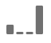

# Attributiemodellen en terugkijkvensters

>[!NOTE]
>
>U bekijkt de documentatie voor de Werkruimte van de Analyse in de Analyse van de Reis van de Klant. Zijn eigenschapreeks verschilt lichtjes van [De Werkruimte van de analyse in de traditionele Analyse van Adobe](https://docs.adobe.com/content/help/en/analytics/analyze/analysis-workspace/home.html). [Meer informatie...](/help/getting-started/cja-aa.md)

Het concept attributie in de Analyse van Adobe vereist twee componenten:

* **Attributiemodel:** Het model beschrijft de distributie van omzettingen in de hits in een groep. Bijvoorbeeld, eerste aanraking of laatste aanraking.
* **Het terugkijkvenster van de attributen:** Het terugkijkvenster beschrijft welke groeperingen van hits voor elk model worden overwogen. Bijvoorbeeld bezoek of bezoeker.

## Attributiemodellen

| UI-pictogram | Attributiemodel | Definitie | Wanneer te gebruiken |
| --- | --- | --- | --- |
|  | Laatste aanraking | Geeft 100% krediet aan het aanrakingspunt dat onlangs voor omzetting voorkomt. | Het meest fundamentele en gemeenschappelijke attributiemodel. Het wordt vaak gebruikt voor omzettingen met een korte bezinningscyclus. Last Touch wordt algemeen gebruikt door teams die zoekmarketing beheren of interne zoektrefwoorden analyseren. |
|  | Eerste aanraking | Geeft 100% krediet aan het aanrakingspunt dat eerst in het de terugkijkvenster van de attributie wordt gezien. | Een ander gemeenschappelijk attributiemodel dat nuttig is voor het analyseren van marketingkanalen die bedoeld zijn om merkbekendheid te geven of klanten aan te schaffen. Het wordt vaak gebruikt door tentoonstellings of sociale marketing teams, maar is ook groot voor het beoordelen van de doeltreffendheid van de onsite productaanbeveling. |
|  | Zelfde aanraking | Geeft 100% krediet aan de zeer hit waar de conversie plaatsvond. Als een aanrakingspunt niet op de zelfde klap zoals een omzetting gebeurt, wordt het geknipt onder &quot;niets&quot;. | Een nuttig model wanneer het evalueren van de inhoud of de gebruikerservaring die onmiddellijk op het tijdstip van omzetting werd voorgesteld. Product- of ontwerpteams gebruiken vaak dit model om de effectiviteit van een pagina te beoordelen waar conversie plaatsvindt. |
|  | Lineair | Biedt evenveel krediet aan elk aanraakpunt dat wordt gezien voor een conversie. | Nuttig voor conversies met langere evaluatiecycli of gebruikerservaringen die een frequentere klantenservice nodig hebben. Het wordt vaak gebruikt door teams die mobiele app berichtdoeltreffendheid of met op abonnement-gebaseerde producten meten. |
|  | U-vorm | Geeft 40% krediet aan de eerste interactie, 40% krediet aan de laatste interactie, en verdeelt de resterende 20% aan om het even welke aanrakingspunten binnen. Voor omzettingen met één aanraakpunt, wordt 100% krediet gegeven. Voor omzettingen met twee aanrakingspunten, wordt 50% krediet gegeven aan allebei. | Een goed model voor degenen die interacties waarderen die een omzetting introduceerden of gesloten, maar nog willen het bijstaan van interactie erkennen. U-vormige attributie wordt algemeen gebruikt door teams die een evenwichtiger benadering nemen maar meer krediet aan kanalen willen geven die een omzetting vonden of sluiten. |
|  | J-Shaped | Geeft 60% krediet aan de laatste interactie, 20% krediet aan de eerste interactie, en verdeelt de resterende 20% aan om het even welke aanrakingspunten binnen. Voor omzettingen met één aanraakpunt, wordt 100% krediet gegeven. Voor omzettingen met twee aanrakingspunten, wordt 75% krediet gegeven aan de laatste interactie, en wordt 25% krediet gegeven aan de eerste. | Dit model is groot voor degenen die aan vinders en sluiters voorrang geven, maar zich bij het sluiten van interactie willen concentreren. J-vormige attributie wordt vaak gebruikt door teams die een evenwichtiger benadering kiezen en meer krediet willen verlenen aan kanalen die een omzetting sluiten. |
|  | Invers J | Geeft 60% krediet aan het eerste aanraakpunt, 20% krediet aan het laatste aanraakpunt, en verdeelt de resterende 20% aan om het even welke aanrakingspunten binnen. Voor omzettingen met één aanraakpunt, wordt 100% krediet gegeven. Voor omzettingen met twee aanrakingspunten, wordt 75% krediet gegeven aan de eerste interactie, en wordt 25% krediet gegeven aan het laatste. | Dit model is ideaal voor degenen die aan vinders en sluiters voorrang geven, maar zich op het vinden van interactie willen concentreren. De omgekeerde eigenschap van J wordt gebruikt door teams die een evenwichtiger benadering kiezen en meer krediet aan kanalen willen geven die een omzetting in werking stelden. |
|  | Aangepast | Hiermee kunt u het gewicht opgeven dat u wilt geven aan de eerste aanraakpunten, de laatste aanraakpunten en alle tussenliggende aanraakpunten. De gespecificeerde waarden worden genormaliseerd aan 100% zelfs als de ingegane douanenummers niet aan 100 toevoegen. Voor omzettingen met één aanraakpunt, wordt 100% krediet gegeven. Voor interactie met twee aanrakingspunten, wordt de middenparameter genegeerd. De eerste en laatste aanraakpunten worden dan genormaliseerd aan 100%, en de kredieten worden dienovereenkomstig toegewezen. | Dit model is ideaal voor diegenen die volledige controle over hun toewijzingsmodel willen en specifieke behoeften hebben waaraan andere toewijzingsmodellen niet voldoen. |
|  | Tijd-Verval | Volgt en exponentieel verval met een parameter van de douanehalfwaardetijd, waar het gebrek 7 dagen is. Het gewicht van elk kanaal hangt van de hoeveelheid tijd af die tussen de initiatie van het aanrakingspunt en de uiteindelijke omzetting overging. De formule voor de bepaling van het krediet is `2^(-t/halflife)`, waarbij `t` is de hoeveelheid tijd tussen een aanraakpunt en een conversie. Alle aanraakpunten worden dan genormaliseerd tot 100%. | Ideaal voor teams die regelmatig videoreclame maken of op de markt brengen tegen evenementen met een vooraf bepaalde datum. Hoe langer een conversie plaatsvindt na een marketinggebeurtenis, hoe minder krediet wordt gegeven. |
|  | Deelname | Biedt 100% krediet aan alle unieke aanraakpunten. Het totale aantal omzettingen wordt opgepompt in vergelijking met andere toerekeningsmodellen. De participatie dedupliceert kanalen die veelvoudige tijden worden gezien. | Uitstekend om te begrijpen wie vaak aan een bepaalde interactie wordt blootgesteld. De organisaties van media gebruiken vaak dit model om inhoudssnelheid te berekenen. De detailhandelorganisaties gebruiken vaak dit model om te begrijpen welke delen van hun plaats aan omzetting kritiek zijn. |
|  | [Algoritme](/help/analysis-workspace/attribution/algorithmic.md) | Maakt gebruik van statistische technieken om de optimale allocatie van krediet voor de gekozen maatstaf dynamisch te bepalen. | Handig om giswerk of heuristiek te voorkomen bij het kiezen van het juiste toewijzingsmodel voor uw bedrijf. |

## Referentievensters

Een terugkijkvenster is de hoeveelheid tijd een omzetting zou moeten terugkijken om aanrakingspunten te omvatten. De modellen van de attributen die meer krediet aan eerste interactie geven zien grotere verschillen wanneer het bekijken van verschillende raadplegingsvensters.

* **Het terugkijkvenster van het bezoek:** Het kijkt terug naar het begin van een bezoek waar een conversie plaatsvond. De de terugkijkvensters van het bezoek zijn smal, aangezien zij niet voorbij het bezoek kijken. De de raadplegingsvensters van het bezoek respecteren de gewijzigde bezoekdefinitie in virtuele rapportreeksen.

* **Het terugkijkvenster van de bezoeker:** Bekijk alle bezoeken file tot de 1st van de maand van de huidige datumwaaier. De de terugkijkvensters van de bezoeker zijn breed, aangezien zij vele bezoeken kunnen overspannen. De terugblik van de bezoeker overweegt alle waarden van het begin van de maand van de de datumwaaier van het rapport. Bijvoorbeeld, als de waaier van de rapportdatum 15 september - september 30 is, omvat de de datumwaaier van de bezoekersraadpleging 1 - september 30.

* **Aangepast terugkijkvenster:** Staat u toe om het attributievenster voorbij de rapporteringsdatumwaaier tot maximaal 90 dagen uit te breiden. De de raadplegingsvensters van de douane worden geëvalueerd op elke omzetting in de rapporteringsperiode. Bijvoorbeeld, voor een omzetting die op 20th feb voorkomt, zou een terugkijkvenster van 10 dagen alle afmetingstouchpoints van 10e tot 20e feb in het attributiemodel evalueren.

>[!NOTE]
>
>**[!UICONTROL Custom lookback windows]** momenteel in beperkte mate worden getest. Zie [Adobe Analytics-functies](https://docs.adobe.com/content/help/nl-NL/analytics/landing/an-releases.html) voor meer informatie .

## Voorbeeld

Overweeg het volgende voorbeeld:

1. Op 15 september arriveert een bezoeker via een betaalde zoekadvertentie naar je site, waarna hij vertrekt.
2. Op 18 september arriveert de bezoeker opnieuw naar je site via een sociale mediablink die hij van een vriend kreeg. Ze voegen verschillende objecten toe aan hun winkelwagentje, maar kopen niets.
3. Op 24 september stuurt uw marketingteam hen een e-mail met een coupon voor enkele objecten in hun winkelwagen. Zij passen de coupon toe, maar bezoeken verschillende andere plaatsen om te zien of er andere coupons beschikbaar zijn. Ze vinden er een andere via een advertentie, en maken dan uiteindelijk een aankoop voor $50.

Afhankelijk van uw terugkijkvenster en attributiemodel, ontvangen de kanalen verschillend krediet. Hieronder volgen enkele opmerkelijke voorbeelden:

* Gebruiken **eerste aanraking** en **terugkijkvenster** De toeschrijving heeft alleen betrekking op het derde bezoek. Tussen e-mail en weergave was e-mail het eerst, dus e-mail krijgt 100% krediet voor de aankoop van $50.
* Gebruiken **eerste aanraking** en **terugkijkvenster bezoeker** De toeschrijving kijkt naar alle drie de bezoeken. Betaalde zoekopdracht was het eerst, dus krijgt het 100% krediet voor de aankoop van $50.
* Gebruiken **lineair** en **terugkijkvenster**, wordt het krediet verdeeld over e-mail en weergave. Beide kanalen krijgen elk $25 krediet.
* Gebruiken **lineair** en **terugkijkvenster bezoeker**, creditering wordt verdeeld tussen betaalde zoekopdrachten, sociale, e-mail- en weergavekredieten. Elk kanaal krijgt $12.50 krediet voor deze aankoop.
* Gebruiken **J-vormig** en **terugkijkvenster bezoeker**, creditering wordt verdeeld tussen betaalde zoekopdrachten, sociale, e-mail- en weergavekredieten.
   * Voor $30 wordt 60% krediet aan display gegeven.
   * Er wordt 20% krediet gegeven voor betaalde zoekopdrachten, voor $10.
   * De resterende 20% is verdeeld over sociale en e-mail, wat elk $5 oplevert.
* Gebruiken **Tijdsvertraging** en **terugkijkvenster bezoeker**, creditering wordt verdeeld tussen betaalde zoekopdrachten, sociale, e-mail- en weergavekredieten. Gebruikend de standaard halfwaardetijd van 7 dagen:
   * Gap van 0 dagen tussen aanraakpunt en conversie van beeldscherm. `2^(-0/7) = 1`
   * Graad 0 dagen tussen het aanraakpunt per e-mail en de conversie. `2^(-0/7) = 1`
   * Een kloof van 6 dagen tussen het sociale aanraakpunt en de conversie. `2^(-6/7) = 0.552`
   * Slag van 9 dagen tussen betaald aanraakpunt en conversie. `2^(-9/7) = 0.41`
   * Het normaliseren van deze waarden resulteert in het volgende:
      * Weergave: 33,8%, $ 16,88
      * E-mail: 33,8% krijgt $ 16,88
      * Sociaal: 18,6%, met $ 9,32
      * Betaalde zoekopdracht: 13,8%, met $ 6,92

>[!NOTE]
>
>Andere conversiegebeurtenissen, zoals bestellingen of aangepaste gebeurtenissen, worden ook verdeeld als het krediet tot meer dan één kanaal behoort. Bijvoorbeeld, als twee kanalen aan een douanegebeurtenis gebruikend een Lineair attributiemodel bijdragen, krijgen beide kanalen 0.5 van de douanegebeurtenis. Deze gebeurtenisfracties worden samengeteld over alle bezoeken, dan rond gemaakt aan het meest dichtbijgelegen geheel voor rapportering.
