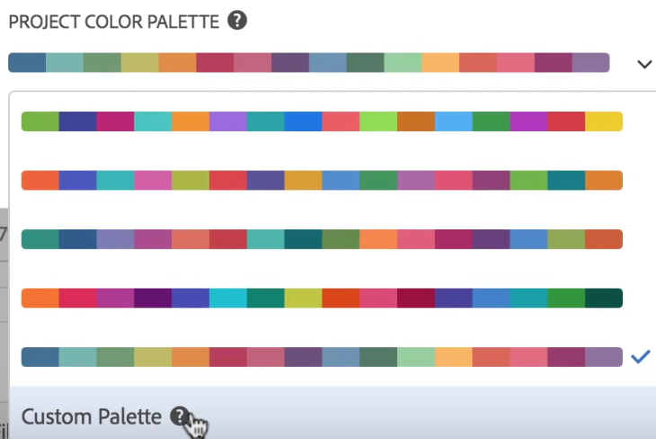

# Beeldvormingskleurenpalet

>[!NOTE]
>
>U bekijkt de documentatie voor de Werkruimte van de Analyse in de Analyse van de Reis van de Klant. Zijn eigenschapreeks verschilt lichtjes van [De Werkruimte van de analyse in de traditionele Analyse van Adobe](https://docs.adobe.com/content/help/en/analytics/analyze/analysis-workspace/home.html). [Meer informatie...](/help/getting-started/cja-aa.md)

U kunt het palet van de visualisatiekleur veranderen dat in Werkruimte door een verschillend kleurenpalet te kiezen of door uw eigen palet te specificeren wordt gebruikt dat de het brandmerken van uw bedrijf kleuren kon aanpassen. Deze eigenschap beïnvloedt de meeste visualisaties in Werkruimte, maar het doet **niet** beïnvloedt Summiere Verandering, het voorwaardelijke formatteren in de lijsten Freeform, en de visualisatie van de Kaart.

>[!NOTE]
>
>De steun van het kleurenpalet wordt niet toegelaten voor Internet Explorer 11.

Houd rekening met het volgende:

* Er zijn vijf vooraf ingestelde kleurenpaletten om van te kiezen. Het standaardpalet en hieronder zijn geoptimaliseerd voor optimaal contrast en zijn beide toegankelijker voor degenen die kleurenblind zijn.
* De derde tot vijfde kleurenpaletten onder de hoogste twee zijn geoptimaliseerd voor kleurenharmonie.

## Verander uw kleurenpalet:

1. Ga naar **[!UICONTROL Workspace]** > **[!UICONTROL Project]** > **[!UICONTROL Project Info & Settings]**.
1. van **[!UICONTROL Project Color Palette]** dropdown, kunt u één van vijf vooraf ingestelde kleurenregelingen kiezen.

   

1. Om uw eigen palet te specificeren, selecteer **[!UICONTROL Custom Palette]** onder de vooraf ingestelde opties.
1. Specificeer tot 16 komma-gescheiden hexadecimale waarden (bijvoorbeeld, #00a4e4) voor de kleuren u van plan bent te gebruiken. Als, bijvoorbeeld, u slechts vier waarden wilt gebruiken, zullen deze kleuren automatisch in visualisaties worden herhaald die meer kleuren bevatten.

