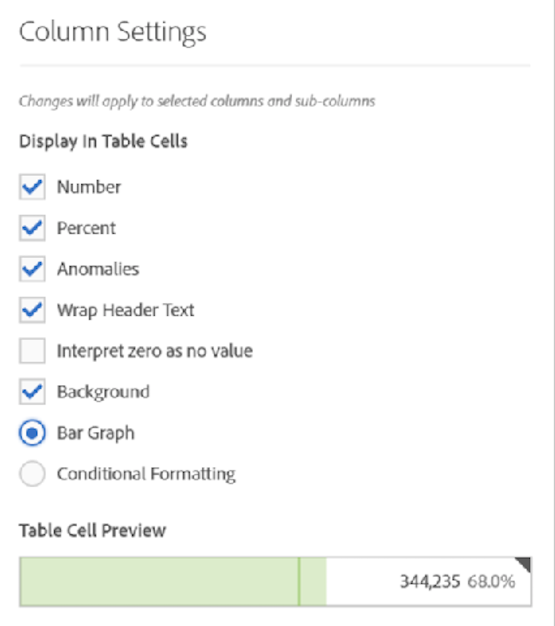

# [!UICONTROL Column Settings]

[!UICONTROL Column Settings] laat u kolom het formatteren vormen, wat waarvan voorwaardelijk kan zijn.

## Bewerken [!UICONTROL Column Settings] {#column-settings}

Toegang [!UICONTROL Column Settings], sleep een Lijst Freeform aan het project, dan klik het vistuigpictogram in de kolomrubriek.

U kunt instellingen bewerken **voor meerdere kolommen tegelijk**. Dit is heel eenvoudig: selecteer meerdere kolommen en klik op het instellingenpictogram van een van de kolommen. Alle wijzigingen die u aanbrengt, worden toegepast op alle kolommen waarin u cellen hebt geselecteerd.

| Element | Beschrijving |
| --- | --- |
| Aantal | Bepaalt als een cel de numerieke waarde voor metrisch toont/verbergt. Bijvoorbeeld, als metrisch de Meningen van de Pagina is, is de numerieke waarde het aantal paginameningen voor het rijpunt. |
| Percentage | Bepaalt als een cel de percentenwaarde voor metrisch toont/verbergt. Bijvoorbeeld, als metrisch de Meningen van de Pagina is, is de percentenwaarde het aantal paginameningen voor het rijpunt dat door de totale paginameningen voor de kolom wordt verdeeld.  Opmerking: We kunnen percentages van meer dan 100 procent tonen, om nauwkeuriger te zijn. Wij bewegen ook de bovengrens verbindende GLB naar 1.000% om ervoor te zorgen de kolommen in breedten te kunnen groeien. |
| Anomalies | Bepaalt als de anomalieopsporing op de waarden in deze kolom in werking wordt gesteld. |
| Tekst koptekst omloop | Laat u de kopbaltekst in Freeform lijsten verpakken om kopballen leesbaarder en lijsten aandeelbaarder te maken. Dit is nuttig voor .pdf het teruggeven en voor metriek met lange namen. Standaard ingeschakeld. |
| Interpreteer nul als geen waarde | Voor cellen met een 0 waarde, bepaalt of om een 0 of een lege cel te tonen. Dit is nuttig wanneer u gegevens voor elke dag van een maand bekijkt, en sommige dagen zijn nog niet gebeurd.  In plaats van het tonen van 0&#39;s voor toekomstige data, kunnen de lege cellen in plaats daarvan worden getoond. De grafieken respecteren eveneens dit het plaatsen (d.w.z., tonen zij geen lijn of bar met 0 waarden wanneer dit het plaatsen wordt gecontroleerd). |
| Achtergrond | Bepaalt als een cel al cel het formatteren, met inbegrip van de bargrafiek en het voorwaardelijke formatteren toont/verbergt. |
| Bar Graph | Toont een horizontale bargrafiek die de waarde van de cel met betrekking tot het totaal voor de kolom vertegenwoordigt. |
| Voorwaardelijke opmaak | Zie het gedeelte hieronder. |
| Voorbeeld tabelcel | Toont een voorproef van hoe elke cel met de momenteel geselecteerde het formatteren toegepaste opties verschijnt. |

## Voorwaardelijke opmaak {#conditional-formatting}

Het voorwaardelijke formatteren past het formatteren op hoger, middelpunt, en lagere grenzen toe die u kunt bepalen. Het toepassen van het voorwaardelijke formatteren (kleuren, enz.) binnen de lijsten Freeform wordt ook automatisch toegelaten op onderbrekingen, tenzij de &quot;grenzen van de Douane&quot;worden geselecteerd.

| Element | Beschrijving |
| --- | --- |
| Voorwaardelijke opmaak | Hiermee worden de volgende kleuren toegepast op cellen, op basis van datawaarden worden: <ul><li>Groen: hoge waarden</li><li>Geel: middelpuntwaarden</li><li>Rood: lage waarden</li></ul>   Als u een dimensie in de tabel vervangt, worden de limieten voor voorwaardelijke opmaak opnieuw ingesteld. Wanneer u een metric vervangt, worden de limieten voor die kolom opnieuw berekend (waarbij de metric op de X-as staat en de dimensie op de Y-as). |
| Percentagelimieten gebruiken | Verander de grenswaaier die op percentages eerder dan absolute waarden moet worden gebaseerd. Dit werkt voor metriek die uitsluitend gebaseerd percentage (als het Tarief van de Strijd) evenals voor metriek zijn die een telling en een percentage (als de Meningen van de Pagina) hebben. |
| Automatisch genereren | Berekent automatisch de boven-, midden- en ondergrenzen op basis van de gegevens. De bovengrens is de hoogste waarde in deze kolom. De ondergrens is de laagste en het middelpunt is het gemiddelde van de boven- en ondergrens. |
| Aangepast | Wijs manueel boven-/midden-/ondergrenzen toe. Dit biedt u de flexibiliteit om te bepalen wanneer een kolomwaarde goed, gemiddeld, of slecht wordt. |

## Niet-standaard toewijzingsmodel gebruiken {#attribution}

Ondersteuning voor analysewerkruimte [toeschrijving](../../attribution/overview.md) voor bijna elke metrieke.

1. Klik op het pictogram Instellingen (versnelling) in een kolom Freeform-tabel.

   

1. onder **[!UICONTROL Data Settings]**, controle **[!UICONTROL Use non-default attribution model]**. Zie voor meer informatie over verschillende toewijzingsmodellen: [Attributiemodellen](../../attribution/models.md).

   

>[!MORELIKETHIS]
>
>* [Databronnen beheren](/help/analysis-workspace/visualizations/t-sync-visualization.md)

