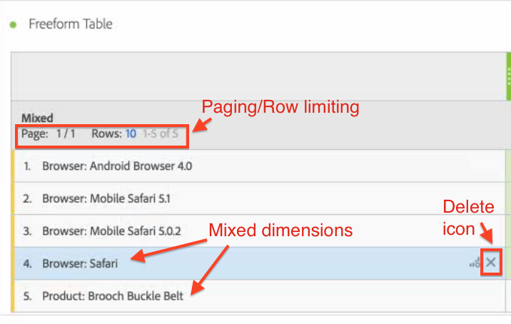

# Statische versus dynamische rijen

>[!NOTE]
>
>U bekijkt de documentatie voor Analysis Workspace in Customer Journey Analytics. De functieset verschilt enigszins van die van [Analysis Workspace in traditionele Adobe Analytics](https://docs.adobe.com/content/help/en/analytics/analyze/analysis-workspace/home.html). [Meer informatie...](/help/getting-started/cja-aa.md)

Analysis Workspace-tabellen genereren &#39;dynamische&#39; rijen wanneer u een dimensie in de tabel neerzet. Dit houdt in dat alle items die overeenkomen met de dimensie, voor een bepaalde metrische waarde, in de tabel worden geplaatst.

Wanneer u bijvoorbeeld de afmetingen van de browser naar de tabel sleept, worden alle bijbehorende dimensies (bijvoorbeeld Android-browser, Mobile Safari, Firefox, enz.) dynamisch in de tabel worden geplaatst.

Als u daarentegen handmatig een specifieke metrische, segment-, gegevensbereik- of afzonderlijke dimensie-item in een tabel selecteert en neerzet, is het resultaat een hardcodeerde of &quot;statische&quot; rij of lijst. U kunt nu op de volgende manieren werken met een statische rij:

* Klik op het pictogram Voorvertoning in statische rijen, zodat u een voorvertoning kunt weergeven van segmenten, maateenheden en datumbereiken.
* Klik op het pictogram &quot;x&quot; om die rij uit de tabel te verwijderen.
* Beperk het aantal rijen dat wordt weergegeven en schakel paginering in.
* Voeg &quot;items met gemengde dimensies&quot; toe. Voeg bijvoorbeeld een item uit een browserdimensie en een ander item uit een productdimensie toe.

   Hier volgt een illustratie:

   

Bovendien (slechts) wanneer u op een statische rijwijze bent, kunt u nu veranderen hoe de kolomtotalen worden berekend. Klik op het tandwielpictogram en schakel tussen deze twee opties:

| Optie | Beschrijving |
|---|---|
| (Standaard) Bereken totalen door de waarden op te tellen die momenteel in elke kolom staan. | Met deze optie worden alleen de rijen berekend die momenteel in de tabel staan. (Clientberekening) |
| Bereken totalen die op alle rijen voor elke metrisch worden gebaseerd. | Deze optie omvat alle afmetingspunten voor deze afmeting, zelfs die niet vermeld in de lijst. (Server-side berekening) |

