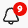

# Opmerkingen toevoegen en beheren in projecten {#comment-on-projects}

{{release-limited-testing}}

Met opmerkingen in Analysis Workspace kunt u inzichten delen en vragen stellen in het kader van een Analysis Workspace-project. Hierdoor kunnen discussies over de gegevens worden gestroomlijnd, waarbij gesprekken worden gevoerd binnen de context van de gegevens die worden besproken.

>[!NOTE]
>
>De capaciteit om commentaren op een project toe te voegen en te beheren kan of op het projectniveau of op het organisatieniveau worden onbruikbaar gemaakt. Als u geen opmerkingen kunt toevoegen en beheren zoals in deze sectie wordt beschreven, heeft de Customer Journey Analytics-beheerder of de eigenaar van het project deze mogelijkheid uitgeschakeld.
>
>* **Project:** de projecteigenaar kan deze functionaliteit voor het project onbruikbaar maken, zoals die in [ wordt beschreven creeer projecten ](/help/analysis-workspace/build-workspace-project/create-projects.md).
>* **Organisatie:** de beheerder van Customer Journey Analytics kan deze functionaliteit voor de organisatie onbruikbaar maken, zoals die in [ Voorkeur ](/help/analysis-workspace/user-preferences.md) wordt beschreven.

## Opmerkingen weergeven

U kunt opmerkingen bekijken in het gebied met opmerkingen in de rechtertrack of vanaf de commentaarbadge als deze bestaat.

>[!NOTE]
>
>Een project moet worden bewaard alvorens het commentaargebied in het juiste spoor zichtbaar is. Als het project niet eerder is bewaard, moet u het project ](/help/analysis-workspace/build-workspace-project/save-projects.md) bewaren [ alvorens commentaren toe te voegen.

### Opmerkingen weergeven in het gebied Opmerkingen

Alle opmerkingen die in een Analysis Workspace-project zijn gemaakt, zijn zichtbaar in het commentaargebied op de rechterspoorlijn.

1. Open het project in Analysis Workspace en selecteer het pictogram voor het opmerkingengebied in de rechterrail van Analysis Workspace.

   

   Elke opmerking bevat een tijdstempel van de dag waarop de opmerking is geplaatst. Als de opmerking op de huidige dag is geplaatst, wordt het tijdstip van de dag weergegeven. Plaats de muis over de dag of tijd om de volledige datum en tijd weer te geven waarop de opmerking is geplaatst.

1. (Facultatief) om het commentaargebied te zoeken, selecteer het onderzoekspictogram , dan typ een woord of een uitdrukking. In het gebied met opmerkingen worden alleen die opmerkingen opgenomen die dat woord of die woordgroep bevatten.

### Berichtenbadges in een project weergeven

De commentaren die [ op een specifiek gebied van het project ](#comment-on-a-specific-area-of-the-project) worden gemaakt hebben a **commentaarbadge**  die vertoningen over het gebied van het project heeft dat de commentaar tot heeft. Selecteer een badge om de opmerking weer te geven. Nadat u de badge hebt geselecteerd, kunt u de opmerking zelf selecteren om de opmerking te markeren in het opmerkingsgebied in de rechtertrack.

De aantallen tonen op elke badge in een project en worden bevolen in de orde zij werden gecreeerd. Als de veelvoudige commentaren in het zelfde gebied van een project worden geplaatst, toont de badge 3 punten . Selecteer de badge met drie punten om alle opmerkingen in dat gebied weer te geven.

<!-- Insert screeshot-->

Alle opmerkingbadges verbergen voor een project:

1. Met het project open in Analysis Workspace, selecteer het pictogram van het commentaargebied  in de juiste spoorlijn van Analysis Workspace.

1. Schakel onder aan het gebied met opmerkingen de optie **[!UICONTROL Hide placed badges]** in.

## Opmerkingen toevoegen

U kunt een opmerking toevoegen die verwijst naar een specifiek gebied van het project of u kunt een algemene opmerking toevoegen.

### Opmerking over een specifiek gebied van het project

Als u opmerkingen wilt maken over een specifiek gebied van het project (bijvoorbeeld een metrische waarde in een vrije-vormtabel):

1. Open het project in Analysis Workspace en klik met de rechtermuisknop op het gebied van het project waar u de opmerking wilt invoegen.

   Alle visualisaties ondersteunen commentaarbadges op de visualisatieheader, maar alleen de volgende visualisaties ondersteunen commentaarbadges op specifieke gegevenspunten binnen de visualisatie:

   * Vrije-vormtabel
   * Cohortingtabel
   * Lijn

   <!--add screenshot-->

1. Selecteer **[!UICONTROL Add comment]** .

1. Geef in het veld **[!UICONTROL New comment]** uw opmerking op.

   Opmerkingen kunnen uit maximaal 15.000 tekens bestaan en kunnen basisopmaakcodes, hyperlinks, lijsten met opsommingstekens en nummers en emojis bevatten.

1. (Optioneel) U kunt een andere persoon op de hoogte stellen van uw opmerking door het @-symbool te typen, gevolgd door de naam. Voor meer informatie over het gebruiken van het @ symbool om anderen op de hoogte te brengen, zie [ anderen in een commentaar ](#include-others-in-a-comment) omvatten.

1. Selecteer **[!UICONTROL Submit]** .

   A **commentaarbadge**  wordt geplaatst in het gebied van het project van Workspace waar u de commentaar toevoegde, zoals die in [ wordt beschreven commentaarbadges van de Mening in een project ](#view-comment-badges-in-a-project). De opmerking staat ook boven aan het commentaargebied in de rechterspoorlijn.

### Een algemene opmerking over het project toevoegen

Opmerkingen toevoegen aan een project in Analysis Workspace:

1. Met het project open in Analysis Workspace, selecteer het pictogram van het commentaargebied  in de juiste spoorlijn van Analysis Workspace. <!-- add screen shot -->

1. Geef in het veld **[!UICONTROL New comment]** uw opmerking op.

   Opmerkingen kunnen uit maximaal 15.000 tekens bestaan en kunnen basisopmaakcodes, hyperlinks, lijsten met opsommingstekens en nummers en emojis bevatten.

1. (Optioneel) U kunt een andere persoon op de hoogte stellen van uw opmerking door het @-symbool te typen, gevolgd door de naam. Voor meer informatie over het gebruiken van het @ symbool om anderen op de hoogte te brengen, zie [ anderen in een commentaar ](#include-others-in-a-comment) omvatten.

1. Selecteer **[!UICONTROL Submit]** .

   De commentaar verschijnt bij de bovenkant van het commentaargebied, zoals die in [ wordt beschreven commentaren van de Mening op het commentaargebied ](#view-comments-in-the-comments-area).

## Andere elementen in een opmerking opnemen

Met de functie voor opmerkingen in Analysis Workspace kunt u gemakkelijker met anderen samenwerken.

Houd rekening met het volgende wanneer u het @-symbool gebruikt om personen in een opmerking op te nemen:

* Personen die u omvat, ontvangen berichten op basis van hun Adobe Experience Cloud-meldingsinstellingen. Door gebrek, ontvangen zij een in-app bericht, zichtbaar van het [ het bericht van Experience Cloud ](https://experienceleague.adobe.com/en/docs/core-services/interface/features/account-preferences#view-notifications) pictogram  in Customer Journey Analytics.

  Bovendien, kunnen de mensen hun het berichtmontages van Experience Cloud vormen om e-mailberichten en de berichten van Slack te ontvangen door [ te abonneren aan e-mailberichten ](https://experienceleague.adobe.com/en/docs/core-services/interface/features/account-preferences#subscribe-to-in-app-and-email-notifications) en [ het intekenen aan de berichten van Slack ](https://experienceleague.adobe.com/en/docs/core-services/interface/features/account-preferences#slack).

* U kunt iedereen in uw organisatie in een commentaar omvatten, maar het doen van dit verleent hen niet automatisch toegang tot het project. Alleen mensen die al toegang hebben tot het project hebben toegang tot het project.

Een andere persoon in uw opmerking opnemen:

1. Typ het @-symbool en typ vervolgens de voornaam, achternaam of het e-mailadres van de persoon die u wilt opnemen.

   

1. Selecteer de naam van de persoon wanneer deze wordt weergegeven in het keuzemenu.

## Een opmerking beantwoorden

1. Met het project open in Analysis Workspace, selecteer het pictogram van het commentaargebied  in de juiste spoorlijn van Analysis Workspace.

1. Selecteer **[!UICONTROL Reply]** naast de opmerking waarop u wilt reageren.

   of

   Als u de tekst wilt opnemen van de opmerking waarop u antwoordt en de oorspronkelijke tekst in een aanhalingsteken staat, selecteert u het pictogram met drie punten naast de specifieke opmerking of het antwoord waarop u wilt reageren en selecteert u vervolgens **[!UICONTROL Quote reply]** . Een citaatantwoord is een goede manier om aan te geven naar welke opmerking of welk antwoord uw opmerking verwijst.

1. Geef in het veld **[!UICONTROL New comment]** uw opmerking op.

   Opmerkingen kunnen uit maximaal 15.000 tekens bestaan en kunnen basisopmaakcodes, hyperlinks, lijsten met opsommingstekens en nummers en emojis bevatten.

1. (Optioneel) U kunt een andere persoon op de hoogte stellen van uw opmerking door het @-symbool te typen, gevolgd door de naam. Voor meer informatie over het gebruiken van het @ symbool om anderen op de hoogte te brengen, zie [ anderen in een commentaar ](#include-others-in-a-comment) omvatten.

1. Selecteer **[!UICONTROL Submit]** .

## Een badge voor een bestaande opmerking plaatsen

Als er een opmerking beschikbaar is in het opmerkingengebied op de rechterspoorstaaf maar er nog geen badge in het project staat, kunt u de badge toevoegen.

1. Met het project open in Analysis Workspace, selecteer het pictogram van het commentaargebied  in de juiste spoorlijn van Analysis Workspace.

1. Selecteer het meer pictogram  naast de commentaar waarvoor u een badge wilt plaatsen, dan selecteren **[!UICONTROL Place badge]**.

1. Selecteer het gebied van het project waar u de badge voor de bestaande opmerking wilt plaatsen.

   A **commentaarbadge**  wordt geplaatst in het gebied van het project van Workspace dat u selecteerde. De opmerking staat ook boven aan het commentaargebied in de rechterspoorlijn.

   Zie [ de commentaarbadges van de Mening in een project ](#view-comment-badges-in-a-project) voor meer informatie.

Een badge verwijderen:

1. Selecteer het symbool dat u wilt verwijderen en selecteer vervolgens **[!UICONTROL Remove badge]** .

   De badge wordt verwijderd, maar de opmerking is nog steeds beschikbaar in het opmerkinggebied in de rechterspoorlijn.

## Een badge voor een bestaande opmerking verplaatsen

U kunt een opmerkingenbadge verplaatsen die al voor een bestaande opmerking is geplaatst.

1. Open het project in Analysis Workspace en zoek de badge voor de opmerking die u wilt verplaatsen.

1. Klik met de rechtermuisknop op de badge en selecteer vervolgens **[!UICONTROL Move placement]** .

1. Selecteer het gebied van het project waar u de badge wilt plaatsen.

<!-- add section about adding images to comments. will be available at GA. Include that "you can have a maximum of 5 images per comment, and each image can be up to 2 MB." -->

## De koppeling naar een opmerking kopiëren

U kunt de koppeling naar een opmerking kopiëren en de koppeling met anderen delen. Alleen mensen die al toegang hebben tot het project hebben toegang tot het project via de koppeling.

De koppeling naar een opmerking kopiëren:

1. Met het project open in Analysis Workspace, selecteer het pictogram van het commentaargebied  in de juiste spoorlijn van Analysis Workspace.

1. Selecteer het meer pictogram  naast de commentaar waarvan verbinding u wilt kopiëren, dan selecteren **[!UICONTROL Copy link]**.

   De koppeling wordt naar het systeemklembord gekopieerd. U kunt de koppeling in een e-mail of een ander berichttype plakken.

## De tekst van een opmerking kopiëren

U kunt de hoofdtekst van een opmerking kopiëren en deze met anderen delen.

De hoofdtekst van een opmerking kopiëren:

1. Met het project open in Analysis Workspace, selecteer het pictogram van het commentaargebied  in de juiste spoorlijn van Analysis Workspace.

1. Selecteer het meer pictogram  naast de commentaar die de tekst bevat u wilt kopiëren, dan selecteren **[!UICONTROL Copy body text]**.

   De hoofdtekst van de opmerking wordt naar het systeemklembord gekopieerd.

## Zoals een opmerking

1. Met het project open in Analysis Workspace, selecteer het pictogram van het commentaargebied  in de juiste spoorlijn van Analysis Workspace.

1. Selecteer **[!UICONTROL Like]** onder de opmerking die u wilt bevestigen.

## Een opmerking verwijderen

Wanneer u een opmerking verwijdert, worden de oorspronkelijke opmerking en eventuele reacties of bijlagen ook verwijderd.

Verwijderde opmerkingen kunnen niet worden hersteld.

Een opmerking verwijderen:

1. Met het project open in Analysis Workspace, selecteer het pictogram van het commentaargebied  in de juiste spoorlijn van Analysis Workspace.

1. Selecteer het meer pictogram  naast de commentaar dat u wilt schrappen, dan selecteren **[!UICONTROL Delete]**.

1. Selecteer nogmaals **[!UICONTROL Delete]** om de verwijdering te bevestigen.

## Een opmerking oplossen

Wanneer u een opmerking oplost, wordt de opmerking gemarkeerd als opgelost en verborgen in het opmerkingengebied. Als de opmerking een badge heeft, wordt de badge uit het project verwijderd.

Een opmerking oplossen:

1. Met het project open in Analysis Workspace, selecteer het pictogram van het commentaargebied  in de juiste spoorlijn van Analysis Workspace.

1. Selecteer het meer pictogram  naast de commentaar dat u wilt oplossen, dan selecteren **[!UICONTROL Resolve]**.

1. Selecteer nogmaals **[!UICONTROL Resolve]** om te bevestigen.

Standaard worden opgeloste opmerkingen verborgen in het gebied met opmerkingen. Opgeloste opmerkingen weergeven:

1. Selecteer het filterpictogram in het opmerkingengebied en schakel vervolgens de optie **[!UICONTROL Hide resolved comments]** uit.
