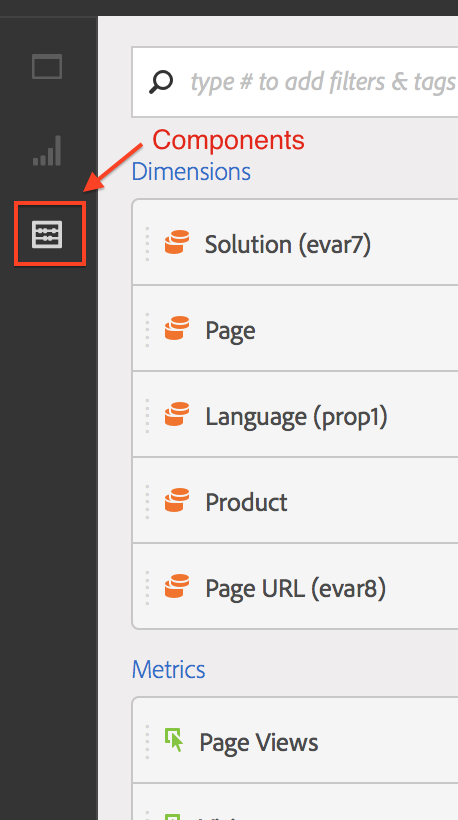

# Project maken - overzicht

**[!UICONTROL Analytics]** > **[!UICONTROL Workspace]**

U kunt een robuust project tot stand brengen Analytics dat op om het even welke combinatie visualisaties, rapportcomponenten, en gegevenslijsten wordt gebaseerd. Het brengt veel van de eigenschappen van de lijstbouwer van Ad Hoc Analysis in Analytics.

In Analysis Workspace kunt u gegevens vergelijken en scheiden op manieren die voorheen niet mogelijk waren. Bijvoorbeeld, vorm gerangschikte rapporten en breng directe herhalende veranderingen in de gegevensvraag aan, en heb dan toegang tot en manipuleer de waarden op het rapporteringsniveau.

De vraag gaat direct naar rapporterend motor-u kan veranderingen inline aanbrengen zonder andere rapporten op te nemen om uw analyse tot stand te brengen. Resultaten worden direct geretourneerd, zonder dat de browser wordt vernieuwd.

## Pagina {#section_39AA007D7C384F4E869F842F1C7B11F8} van de projectlijst van de werkruimte

Wanneer u eerst naar **[!UICONTROL Analytics]** > **[!UICONTROL Workspace]** gaat, maakt de pagina een lijst van alle projecten u bezit of toegang tot hebt verleend. U kunt deze pagina instellen als uw Adobe Analytics-openingspagina door op **[!UICONTROL Set as Landing Page]** te klikken. (Als deze optie niet wordt weergegeven, zoals in de onderstaande schermafbeelding, is het al uw openingspagina.)

De de projectlijstpagina van de Werkruimte bevat de volgende informatie:

| Element | Beschrijving |
|---|---|
| Nieuw project maken | Klik deze verbinding aan [begin een nieuw project van kras](/help/analysis-workspace/home.md). |
| Projecten beheren | Als u op deze koppeling klikt, gaat u naar Projectcomponentbeheer ( **[!UICONTROL Analytics]** > **[!UICONTROL Components]** > **[!UICONTROL Projects]**). Hierin worden al uw projecten vermeld en kunt u projecten labelen, delen, verwijderen, hernoemen, goedkeuren, kopiëren en exporteren naar CSV. |
| Instellen als bestemmingspagina | Hiermee wordt deze pagina omgezet in de bestemmingspagina van uw werkruimte. |
| Tutorials weergeven | Neemt u aan de [videoleerprogramma&#39;s van Analysis Workspace](https://docs.adobe.com/content/help/en/analytics-learn/tutorials/analysis-workspace/analysis-workspace-basics/analysis-workspace-introduction.html). |
| Naam | Naam van het project van de Werkruimte. |
| Eigenaar | De persoon die dit project heeft gemaakt (u of iemand die het project met u heeft gedeeld). |
| Type | Geeft aan of dit een werkruimteproject of een [mobiel scorebord](https://docs.adobe.com/content/help/nl-NL/analytics/analyze/mobapp/home.html) is. |
| Projectrol | Geeft aan of u de eigenaar bent, of u het project kunt bewerken of dat dit een Duplicaat-project is. |
| Tags | Tags die op het project zijn toegepast, in Projectcomponentbeheer of onder **[!UICONTROL Workspace]** > **[!UICONTROL Project]** > **[!UICONTROL Project Info & Settings]**. |
| Laatst gewijzigd | Datum en tijdstip waarop het project voor het laatst is gewijzigd. |
| Mijn favoriete projecten | Als u een project als favoriet wilt markeren, opent u het project en klikt u op de ster naast de naam ervan. De volgende keer dat u Workspace opent, wordt deze lijst weergegeven. |
| Veelgebruikte projecten | Hiermee geeft u alle projecten weer die u vaak opent, voor eenvoudige toegang. |

## Projectinfo en -instellingen {#section_63773D0B9E4543E88068ECECB9EEB4C6}

**[!UICONTROL Workspace]** > **[!UICONTROL Project]** > **[!UICONTROL Project Info & Settings]**

**[!UICONTROL Project Info & Settings]** verstrekt project-vlakke informatie over het momenteel actieve project.

| Instelling | Beschrijving |
|---|---|
| Projectnaam | De naam die aan het project is gegeven. U kunt dubbelklikken op de naam om deze te bewerken. |
| Gemaakt door | Naam eigenaar project |
| Laatst gewijzigd | Datum van laatste wijziging van het project. |
| Tags | Hier worden alle tags weergegeven die op een project zijn toegepast om het eenvoudiger te categoriseren. U kunt projecten ook labelen terwijl u ze opslaat. Bekijk de markeringen van een project op de het Landen Pagina van de Werkruimte in de [!UICONTROL Tags] kolom. |
| Beschrijving | Een beschrijving is nuttig om het doel van een project te verduidelijken. U kunt dubbelklikken op de beschrijving om deze te bewerken. |
| Aantal herhalingen in project | Geeft aan of herhalingsinstanties worden geteld in rapporten. Als u meerdere opeenvolgende waarden voor dezelfde variabele hebt, kunt u deze als één of als meerdere instanties van de laten tellen. |
| Visualisatiekleurenschema | U kunt het kleurenschema wijzigen dat in Workspace wordt gebruikt, door een keuze te maken in een ander kleurenpalet of door uw eigen palet op te geven. Deze functie is van invloed op veel zaken in Workspace, waaronder de meeste visualisaties. |
| Dichtheid weergeven | Hiermee kunt u meer gegevens op het scherm zien door de verticale opvulling van de linkerspoorstaaf, vrije-vormtabellen en cohortabellen te verminderen. |

## Menu Projecten {#section_850CDFCB86A64EB0A0AD5B9E0FCB7013}

Het bovenste menu Projecten ziet er als volgt uit:

De submenu&#39;s bevatten de volgende opties.

>[!NOTE]
>
>Opties gemarkeerd door een sterretje (*) worden alleen weergegeven met **opgeslagen** projecten.

| Project | Bewerken | Invoegen | Onderdelen | Delen | Help |
|---|---|---|---|---|---|
| Nieuw | Ongedaan maken | Nieuw deelvenster | Nieuw segment | Project delen | Video&#39;s |
| Open | Wissen | Nieuw deelvenster Vrije vorm | Nieuwe metrisch | Projectkoppeling ophalen* | Hotkeys |
| Opslaan | Alles wissen | Nieuw deelvenster voor segmentvergelijking | Nieuw datumbereik | Bestand nu verzenden* | Help-forum |
| Opslaan als* |  | Nieuwe tabel voor vrije vorm | Nieuwe waarschuwing | Bestand verzenden volgens schema* |  |
| Instellen als bestemmingspagina* |  | Nieuwe regel | Componenten vernieuwen | Cursieve projectgegevens |  |
| Project vernieuwen |  | Nieuwe balk |  |  |  |
| CSV downloaden |  |  |  |  |  |
| PDF downloaden* |  |  |  |  |  |
| Projectinfo en -instellingen |  |  |  |  |  |

## Linkerspoor {#section_271295C26EC840ABB2A8E7EC0498B60E}

De linkerrail heeft 3 pictogrammen, die u toegang tot Vensters, [Visualisaties](/help/analysis-workspace/visualizations/freeform-analysis-visualizations.md), en [Componenten](/help/components/overview.md) (Dimension, Metriek, Segmenten, de Waaier van Gegevens) met één klik verlenen:

  

Er is een **[!UICONTROL Blank Panel]** toegevoegd aan de lijst met panelen die toegankelijk zijn vanaf de linkerspoorstaaf. Als u een **nieuw deelvenster Cohort** wilt maken, sleept u in een leeg deelvenster en sleept u in de visualisatie van een kleurentabel.
