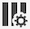

# Overzicht van projecten

Met werkruimteprojecten kunt u gegevenscomponenten, tabellen en visualisaties combineren om uw analyse te bundelen en met iedereen in uw organisatie te delen. Voordat u met het eerste project begint, leert u hoe u toegang kunt krijgen tot uw projecten en hoe u deze kunt beheren.

## Projectlijst {#project-list}

Wanneer je voor het eerst **[!UICONTROL Analytics]** > **[!UICONTROL Workspace]**, bevat de pagina alle projecten die u hebt of die u hebt gedeeld. Dit is ook de landingspagina voor Adobe Analytics, tenzij u eerder een aangepaste bestemmingspagina hebt ingesteld.

De pagina Projecten bevat de volgende informatie:

>[!NOTE]
>
>Sommige kolommen worden niet standaard weergegeven. Als u de kolommen die u ziet, wilt aanpassen, klikt u op de knop **Tabel aanpassen** pictogram .

| Element | Beschrijving |
|---|---|
| [Voorkeuren bewerken](/help/analysis-workspace/user-preferences.md) | Beheer instellingen voor Analysis Workspace en de bijbehorende componenten voor alle nieuwe projecten of deelvensters die u maakt. |
| [Map maken](/help/analysis-workspace/build-workspace-project/workspace-folders/create-folders.md) | Voeg een nieuwe map of submap toe aan de lijst met projecten en mappen. |
| [Project maken](/help/analysis-workspace/build-workspace-project/create-projects.md) | Een geheel nieuw project starten. |
| Meer weergeven | onthult opties voor het creëren van een leeg project of een mobiele scorecard, [weergeven, trainingszelfstudies](https://experienceleague.adobe.com/docs/analytics-learn/tutorials/analysis-workspace/analysis-workspace-basics/analysis-workspace-introduction.html), of [Opmerkingen bij de release weergeven](/help/release-notes/latest.md). |
| Mappen en projecten tonen | Geef op of u de mapstructuur van projecten wilt weergeven. Zie voor meer informatie [Over mappen in Analytics](/help/analysis-workspace/build-workspace-project/workspace-folders/about-folders.md). |
| Tabel aanpassen (pictogram) | Staat u toe om de informatie aan te passen die voor elk project op de pagina van Projecten toont. |
| Naam | Naam van het project van de Werkruimte. |
| Type | Geeft aan of dit een werkruimteproject, een map of een [Mobiel scorebord](https://experienceleague.adobe.com/docs/analytics/analyze/mobapp/home.html). |
| Tags | Tags die op het project zijn toegepast. |
| Gepland | Geeft aan of de projecten volgens planning per e-mail naar ontvangers moeten worden verzonden. Zie [Projectgegevens naar anderen sturen](/help/analysis-workspace/export/t-schedule-report.md). |
| Gedeelde koppeling (iedereen) | Projecten kunnen met iedereen worden gedeeld, zelfs met mensen die geen toegang hebben tot Analysis Workspace. Deze kolom toont of de projecten op deze manier zijn gedeeld. Zie [Een project delen met iedereen (geen aanmelding vereist)](/help/analysis-workspace/curate-share/share-projects.md#share-public-link) in [Projecten delen](/help/analysis-workspace/curate-share/share-projects.md) voor meer informatie . |
| Gegevens, weergave | De gegevensweergave waaraan het project is gekoppeld. |
| [Projectrol](https://experienceleague.adobe.com/docs/analytics/analyze/analysis-workspace/curate-share/share-projects.html) | Geeft uw rol voor het project aan: eigenaars, bewerken, dupliceren, weergeven. |
| Eigenaar | De persoon die dit project heeft gemaakt (u of iemand die het project met u heeft gedeeld). |
| Gedeeld met | Gebruikers waarmee het project is gedeeld. |
| Laatst gewijzigd | Datum en tijdstip waarop het project voor het laatst is gewijzigd. |
| Laatst geopend | Datum en tijdstip waarop het project voor het laatst is geopend. |
| Project-id | De id van het project. |
| Langste datumbereik | Het langste datumbereik van het project. |
| Aantal query&#39;s | Het totale aantal vragen in het project. |
| Locatie | De map waarin het project zich bevindt. |

## Menubalk {#menu-bar}

Binnen een project, verstrekt het menu opties om uw project te beheren, componenten toe te voegen, hulp, en meer vinden. Elke menuoptie is ook toegankelijk via het toetsenbord [sneltoetsen](/help/analysis-workspace/build-workspace-project/fa-shortcut-keys.md).

| Menu-item | Beschrijving |
|---|---|
| Project | Omvat gemeenschappelijke acties voor projectbeheer, met inbegrip van Nieuw, Open, sparen, en sparen als. U kunt het volledige project ook verfrissen om de meest recente gegevens en de definities terug te winnen door te klikken verfrist Project. [Projectgegevens downloaden](/help/analysis-workspace/export/download-send.md) kunt u gegevens exporteren uit Workspace. **Projectinfo en -instellingen** (zie hieronder) biedt vele opties voor het beheer van uw project. |
| Bewerken | De laatste handeling ongedaan maken of opnieuw uitvoeren. Met Alles wissen wordt het project opnieuw ingesteld op een leeg beginpunt. |
| Invoegen | Nieuwe deelvensters of visualisaties invoegen vanuit dit menu. U kunt ook nieuwe deelvensters en visualisaties invoegen vanuit de linkerrails. |
| [Onderdelen](/help/components/overview.md) | Creeer nieuwe filters, berekende metrisch, datumwaaier, of waakzame componenten van uw project. U kunt ook nieuwe componenten maken vanaf de linkerspoorstaaf. Als uw componentendefinities onlangs zijn veranderd, vernieuw Componenten zal de recentste definities terugwinnen. |
| [Delen](/help/analysis-workspace/curate-share/send-schedule-files.md) | De curate, deelt en plant PDF/CSV projecten aan ontvangers in uw organisatie. |
| Help | Toegang tot Help-documentatie, video&#39;s en Analytics [Experience League gemeenschap](https://experienceleaguecommunities.adobe.com/t5/adobe-analytics/ct-p/adobe-analytics-community). De zichtbaarheid van werkruimteterminfo en de [foutopsporing](https://www.adobe.io/apis/experiencecloud/analytics/docs.html#!AdobeDocs/analytics-2.0-apis/master/reporting-tricks.md). Meer informatie over de werkruimte en factoren die van invloed zijn op het project [prestaties](/help/admin/optimizing-performance.md). |
| Knop Delen of Eigenaar | Als u in een Eigen bent of voor het project uitgeeft, geeft de knoop van het Aandeel in top-right u met één klik toegang om uw projectontvangers te beheren. Als u in een Duplicaat of rol van de Mening voor het project bent, zult u de naam van de projecteigenaar zien. |

### Projectinfo en -instellingen {#info-settings}

**[!UICONTROL Workspace]** > **[!UICONTROL Project]** > **[!UICONTROL Project Info & Settings]** verstrekt project-vlakke informatie over het momenteel actieve project.

Voorbeelden van instellingen:

| Instelling | Beschrijving |
|---|---|
| Projectnaam | De naam die aan het project is gegeven. U kunt dubbelklikken op de naam om deze te bewerken. |
| Gemaakt door | Naam eigenaar project |
| Laatst gewijzigd | Datum van laatste wijziging van het project. |
| Tags | Hiermee geeft u alle tags weer die op een project zijn toegepast om het eenvoudiger te categoriseren. |
| Beschrijving | Een beschrijving is nuttig om het doel van een project te verduidelijken. U kunt dubbelklikken op de beschrijving om deze te bewerken. |
| Aantal herhalingen in project | Geeft aan of herhalingsinstanties worden geteld in rapporten. Opmerking: deze instelling is niet van toepassing op Wisselstroomvisualisaties of Fallout-visualisaties. |
| [Kleurenpalet Project](/help/analysis-workspace/build-workspace-project/color-palettes.md) | U kunt het categorische kleurenpalet veranderen dat in Workspace wordt gebruikt, door uit paletten te kiezen die uit-van-de-doos die voor kleurenblindheid zijn geoptimaliseerd, of door uw douanepalet te specificeren. Deze functie is van invloed op veel zaken in Workspace, waaronder de meeste visualisaties. |
| [Dichtheid weergeven](/help/analysis-workspace/build-workspace-project/view-density.md) | Hiermee kunt u meer gegevens op het scherm zien door de verticale opvulling van de linkerspoorstaaf, vrije-vormtabellen en cohortabellen te verminderen. |

## Linkerspoor {#left-rail}

Binnen een project [deelvensters](/help/analysis-workspace/c-panels/panels.md), tabellen, [visualisaties](/help/analysis-workspace/visualizations/freeform-analysis-visualizations.md), en [componenten] toegankelijk zijn vanaf de linkerspoorstaaf. Dit zijn uw projectbouwstenen.

U hebt ook toegang tot visualisaties en deelvensters via de [Leeg deelvenster](/help/analysis-workspace/c-panels/blank-panel.md) ook.

Componenten (Dimensionen, Metriek, Filters, Datumbereik) in de linkerrails hebben betrekking op de gegevensweergave van het actieve deelvenster. Het actieve deelvenster heeft een blauwe rand en de actieve gegevensweergave wordt boven aan de componentrail weergegeven.

## Projectcanvas {#canvas}

Het projectcanvas is waar u panelen, lijsten, visualisaties, en componenten samenbrengt om uw analyse te bouwen. Een project kan vele panelen bevatten, en elk paneel kan vele lijsten en visualisaties bevatten.

Deelvensters zijn handig wanneer u uw projecten wilt ordenen op basis van tijdsperioden, gegevensweergaven of het geval waarin de analyse wordt gebruikt. Het actieve deelvenster heeft een blauwe rand en bepaalt welke componenten beschikbaar zijn in het linkerspoor.

Afhankelijk van het beginpunt dat u voor uw projecten hebt gekozen, hebt u een van de volgende [vrije-vormtabel](/help/analysis-workspace/visualizations/freeform-table/freeform-table.md) of [leeg deelvenster](/help/analysis-workspace/c-panels/blank-panel.md) op het canvas om mee te beginnen. De snelste manier om te beginnen met analyseren is een of meerdere componenten te selecteren en deze gewoon naar het projectcanvas te slepen. Er wordt automatisch een tabel met gegevens voor u weergegeven. [Meer informatie](/help/analysis-workspace/visualizations/freeform-table/freeform-table.md) over de verschillende opties voor het samenstellen van een tabel of het benutten van onze [trainingszelfstudie](/help/analysis-workspace/home.md) voor meer hulp bij het bouwen van uw eerste project.

## Projectmanager {#manager}

Analysis Workspace-projecten kunnen in het kader van **Analyse > Componenten > Projecten**. De projectmanager toont de punten die een specifieke gebruiker creeerde. U kunt de eigendom van een project overdragen aan een nieuwe gebruiker via Beheer > Gebruikers en middelen voor analyse > Middelen overdragen.

In Projectbeheer kunt u onder andere toevoegen, labelen, delen, dupliceren/kopiëren. Zoek naar een project in de onderzoeksbar of door de filteropties in het linkerspoor te gebruiken. U kunt filteren op tag, eigenaars, projecttype en meer.

De volgende acties zijn algemene acties in de Projectmanager en kunnen worden uitgevoerd op een of meerdere projecten tegelijk:

| Handeling | Beschrijving |
|---|---|
| Toevoegen | Maak een geheel nieuw project. |
| Coderen of goedkeuren | Kies &quot;Tag&quot; of &quot;Goedkeuren&quot; om uw projecten te organiseren en ze gemakkelijker te maken om naar te zoeken. |
| [Delen](/help/analysis-workspace/curate-share/share-projects.md) | Een project beschikbaar stellen voor andere Analysis Workspace-gebruikers in uw organisatie. |
| Verwijderen | Verwijder uw project. |
| Naam wijzigen | Bewerk de naam van het project. |
| Kopiëren | Maak een kopie van uw project. Dit leidt tot een nieuw project en project identiteitskaart Delen of schema&#39;s die aan het oorspronkelijke project zijn gekoppeld, worden niet gekopieerd. |
| Exporteren naar CSV | Download uw project als CSV-bestand, dat normale tekstgegevens bevat. |
