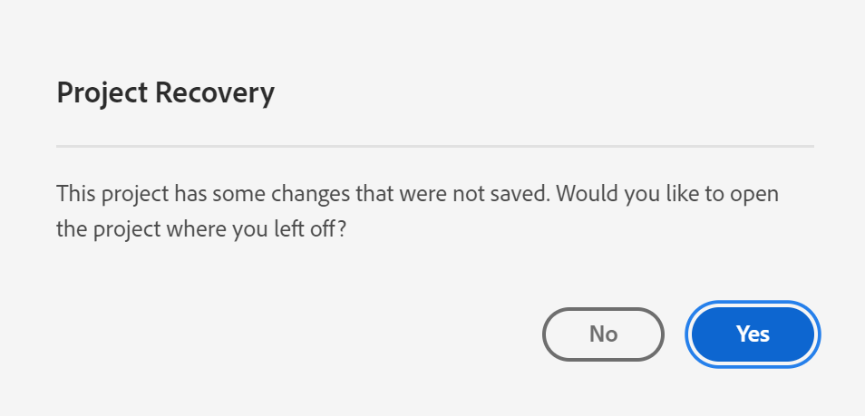

# Projecten opslaan

Ga naar de werkruimte om uw wijzigingen in een project op te slaan **[!UICONTROL Project]** -menu. In bepaalde gevallen worden projecten ook automatisch opgeslagen in de werkruimte.

## Projectopties opslaan {#Save}

Er zijn verschillende opslaghandelingen die u kunt uitvoeren in het kader van de **[!UICONTROL Project]** afhankelijk van hoe u in de toekomst toegang tot uw analyse wilt krijgen.

| Handeling | Beschrijving |
|---|---|
| **[!UICONTROL Save]** | Sla de wijzigingen in uw project op. Als het project wordt gedeeld, zullen de ontvangers van het project ook de veranderingen zien. Wanneer u uw project voor het eerst opslaat, wordt u gevraagd het project een naam, (optionele) beschrijving en (optionele) tags toe te voegen. |
| **[!UICONTROL Save with notes]** | Voordat uw project wordt opgeslagen, voegt u notities toe over de wijzigingen in het project. De nota&#39;s worden opgeslagen met de projectversie en zijn beschikbaar aan alle redacteurs onder [!UICONTROL Project] > [!UICONTROL Open previous version]. |
| **[!UICONTROL Save as]** | Maak een duplicaat van uw project. Dit heeft geen invloed op het oorspronkelijke project. |
| **[!UICONTROL Save as template]** | Uw project opslaan als een [aangepaste sjabloon](https://experienceleague.adobe.com/docs/analytics/analyze/analysis-workspace/build-workspace-project/starter-projects.html) die beschikbaar komt voor uw organisatie onder **[!UICONTROL Project > New]** |

## Automatisch opslaan {#Autosave}

Bestaande projecten, d.w.z. projecten die minstens één keer eerder zijn opgeslagen, worden elke twee minuten automatisch opgeslagen op uw lokale computer. Nieuwe projecten die nog nooit zijn opgeslagen, worden momenteel niet automatisch opgeslagen.

Er zijn een paar scenario&#39;s die u van niet bewaarde veranderingen in een project kunnen leiden, resulterend in verschillende beschikbare acties.

### Een ander Workspace-project openen

Adobe biedt de optie om op te slaan voordat u de pagina verlaat. Nadat u een bestaand project hebt verlaten, wordt de automatisch opgeslagen lokale kopie verwijderd.

### Navigeren weg of een tabblad sluiten

De browser waarschuwt dat niet-opgeslagen wijzigingen verloren gaan. U kunt kiezen om te vertrekken of te annuleren.

### Browsercrashes of sessietijden uit

Voor **bestaand** projecten, wanneer u terugkeert naar Workspace, ziet u een **Projectherstel** modal. Als u Ja selecteert, wordt het project hersteld met de automatisch opgeslagen lokale kopie. Met Nee verwijdert u de automatisch opgeslagen lokale kopie en opent u de laatst door de gebruiker opgeslagen versie van het project.

Voor **new** projecten die nooit zijn opgeslagen, niet-opgeslagen wijzigingen kunnen niet worden hersteld.

## Vorige versie openen {#previous-version}

Een vorige versie van een project openen:

1. Ga naar **[!UICONTROL Project]** > **[!UICONTROL Open previous version]**

   

1. Controleer de lijst met eerdere beschikbare versies.
   [!UICONTROL Timestamp] en [!UICONTROL Editor] worden weergegeven naast [!UICONTROL Notes] als deze bij de [!UICONTROL Editor] opgeslagen. Versies zonder aantekeningen worden gedurende 90 dagen opgeslagen; versies met notities worden gedurende 1 jaar opgeslagen .
1. Selecteer een vorige versie en klik op **[!UICONTROL Load]**.
De vorige versie wordt vervolgens geladen met een melding. De vorige versie wordt pas de huidige opgeslagen versie van het project als u op **[!UICONTROL Save]**. Als u bij de geladen versie vandaan navigeert, ziet u bij het retourneren de laatst opgeslagen versie van het project.
