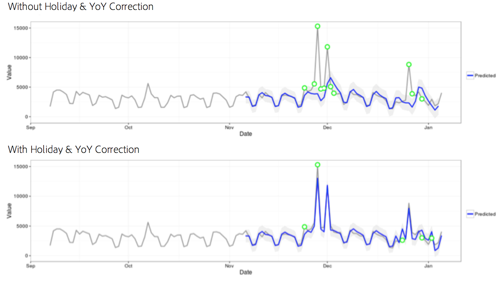

# Statistische technieken

Anomaly detection in Analysis Workspace maakt gebruik van een reeks geavanceerde statistische technieken om te bepalen of een waarneming al dan niet als abnormaal moet worden beschouwd.

Afhankelijk van de in het verslag gebruikte datum van granulariteit worden drie verschillende statistische technieken gebruikt, met name voor anomaliedetectie per uur, per dag, per week of per maand. Elke statistische techniek wordt hieronder beschreven.

## Anomalische detectie voor dagelijkse granulariteit

Voor dagelijkse granularity- rapporten, overweegt het algoritme verscheidene belangrijke factoren om de nauwkeurigste mogelijke resultaten te leveren. Ten eerste bepaalt het algoritme welk type model moet worden toegepast op basis van beschikbare gegevens waarvan het algoritme kiest tussen een van twee klassen - een op tijdreeksen gebaseerd model of een uitbijsteringsmodel (functionele segmentering genoemd).

De modelselectie van de tijdreeksen is gebaseerd op de volgende combinaties voor type van fout, trend, en seizoonaliteit (ETS) zoals die door [ wordt beschreven Hyndman et al. (2008) ](https://idp.springer.com/authorize?response_type=cookie&client_id=springerlink&redirect_uri=https%3A%2F%2Flink.springer.com%2Fbook%2F10.1007%2F978-3-540-71918-2). Specifiek, probeert het algoritme de volgende combinaties:

1. ANA (additieve fout, geen trend, additieve seizoensgebondenheid)
1. AAA (additieve fout, additieve trend, additieve seizoensgebondenheid)
1. MNM (multiplicatieve fout, geen trend, multiplicatieve seizoensgebondenheid)
1. MNA (multiplicatieve fout, geen trend, additieve seizoensgebondenheid)
1. AN (additieve fout, additieve trend, geen seizoensgebonden karakter)

Het algoritme test de geschiktheid van elk van deze combinaties door het te selecteren met het beste gemiddelde absolute foutenpercentage (MAPE). Als de MAPE van het beste tijdreeksmodel echter groter is dan 15%, wordt functionele segmentering toegepast. Doorgaans zijn gegevens met een hoge herhalingsgraad (bijvoorbeeld week in week of maand in maand) het meest geschikt voor een tijdreeksmodel.

Na modelselectie past het algoritme vervolgens de resultaten aan op basis van vakantie en seizoensgebondenheid van jaar tot jaar. Voor feestdagen controleert het algoritme of een van de volgende feestdagen aanwezig is in het rapportagedatumbereik:

* Herdenkingsdag
* Juli 4
* Thanksgiving
* Zwarte vrijdag
* Cyber maandag
* 24-26 december
* Januari 1
* December 31

Deze feestdagen werden gekozen op basis van een uitgebreide statistische analyse van vele datapunten van klanten om vast te stellen welke vakanties het meest tot het hoogste aantal trends van klanten hebben beïnvloed. Hoewel de lijst zeker niet uitputtend voor alle klanten of bedrijfscycli is, verbetert het toepassen van vakanties beduidend de prestaties van het algoritme over het algemeen voor bijna alle datasets van klanten.

Zodra het model is geselecteerd en de feestdagen zijn geïdentificeerd in de rapporteringsdatumreeks, gaat het algoritme op de volgende manier te werk:

1. De afwijkende referentieperiode samenstellen. Deze afwijkende referentieperiode omvat tot 35 dagen vóór de verslagdatum en een periode van één jaar daarvoor. Rekening voor schrikkeldagen wanneer dat nodig is en met alle van toepassing zijnde feestdagen die zich kunnen hebben voorgedaan op een andere kalenderdag van het voorgaande jaar.
1. Test of de feestdagen in de huidige periode (exclusief het voorafgaande jaar) op basis van de meest recente gegevens abnormaal zijn.
1. Als de vakantie in het huidige datumbereik afwijkend is, past u de verwachte waarde en betrouwbaarheidsinterval van de huidige vakantie aan op basis van de vakantie van het voorgaande jaar (rekening houdend met twee dagen voor en na). De correctie voor de huidige vakantie is gebaseerd op het laagste gemiddelde absolute foutenpercentage van:

   1. Additieve effecten
   1. Multiplicatieve effecten
   1. YoY-verschil

U ziet de dramatische verbetering van de prestaties op kerstdag en Nieuwjaarsdag in het volgende voorbeeld:

## Anomaly-detectie voor korrelvormigheid per uur

Uurgegevens zijn gebaseerd op dezelfde tijdreeksalgoritmebenadering als het algoritme voor dagelijkse granulariteit. Het is echter sterk afhankelijk van twee trendpatronen: de cyclus van 24 uur en de cyclus van weekend en weekdag. Om deze twee seizoenseffecten in aanmerking te nemen, bouwt het uuralgoritme twee afzonderlijke modellen voor een weekend en een weekdag volgens dezelfde hierboven beschreven aanpak.

De trainingsvensters voor trends per uur zijn gebaseerd op een terugzoekvenster van 336 uur.

## Anomalische detectie voor wekelijkse en maandelijkse granulariteiten

Wekelijks- en maandtrends vertonen niet dezelfde wekelijkse of dagelijkse trends die worden aangetroffen bij dagelijkse of uurmatige granulariteiten, zodat een dergelijk afzonderlijk algoritme wordt gebruikt. Voor elke week en elke maand wordt een tweestapsdetectieaanpak de Gegeneraliseerde Extreme Studentized Deviate (GESD) test genoemd. Bij deze test wordt rekening gehouden met het maximumaantal verwachte anomalieën in combinatie met de aangepaste box-plot-aanpak (een niet-parametrische methode voor de detectie van uitbijters) om het maximumaantal uitschieters te bepalen. De twee stappen zijn:

1. Aangepaste box-plot functie: deze functie bepaalt het maximumaantal anomalieën op basis van de inputgegevens.
1. GESD-functie: toegepast op de invoergegevens met de uitvoer uit stap 1.

De vakantie- en YoY-seizoensonaliteitsanomaliedetectiestap trekt de gegevens van vorig jaar af van de gegevens van dit jaar. Vervolgens worden de gegevens opnieuw in de vorm van het bovenstaande proces in twee stappen weergegeven om te controleren of anomalieën seizoensmatig geschikt zijn. Voor elk van deze datumgranulariteiten wordt een lookback van 15 perioden gebruikt, inclusief de geselecteerde rapporteringsdatumreeks (15 maanden of 15 weken) en een corresponderende datumbereik van 1 jaar geleden voor training.
