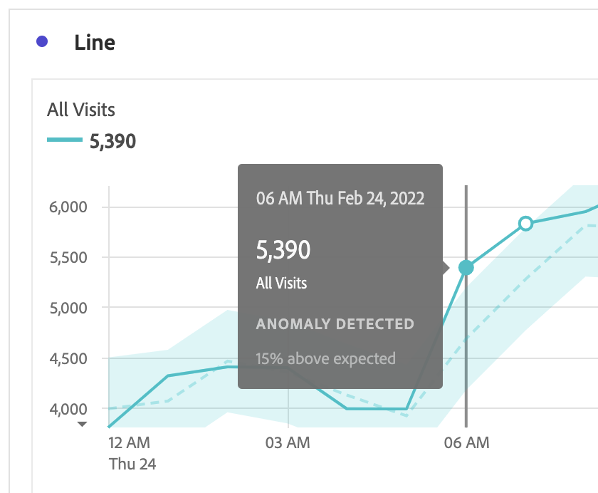

# anomalieën weergeven

U kunt anomalieën in Analysis Workspace in een lijst of in een lijngrafiek bekijken.

## anomalieën in een tabel weergeven {#section_869A87B92B574A38B017A980ED8A29C5}

U kunt anomalieën in een tijdreeks Freeform Lijst bekijken.

1. Selecteer het  in de kolomkopbal, dan zorg ervoor dat de **[!UICONTROL Show anomalies]** optie in de lijst van opties wordt geselecteerd. Voor meer informatie, zie [&#x200B; montages van de Kolom &#x200B;](/help/analysis-workspace/visualizations/freeform-table/column-row-settings/column-settings.md).

1. In de tabel worden als volgt anomen weergegeven:

   

   Een ◥ verschijnt in de hoger-juiste hoek van elke rij waar een gegevensanomalie wordt ontdekt.

   De **gekleurde verticale lijn** in elke rij ➋ wijst op de verwachte waarde. Het **gekleurde gearceerde gebied** in elke rij ➊ wijst op de daadwerkelijke waarde. Hoe de lijn (verwachte waarde) vergelijkt met het gearceerde gebied (werkelijke waarde) bepaalt of er een anomalie is. (Een observatie wordt beschouwd als anomalisch gebaseerd op de geavanceerde statistische technieken die in [&#x200B; worden beschreven Statistische technieken die in anomalieopsporing &#x200B;](/help/analysis-workspace/c-anomaly-detection/statistics-anomaly-detection.md) worden gebruikt.)

1. Selecteer ◥ in de rechterbovenhoek van een rij om details over de anomalie weer te geven. Dit geeft de mate (als percentage) aan waarin de werkelijke waarde boven of onder de verwachte waarde afwijkt.

## anomalieën weergeven in een lijndiagram

De grafieken van de lijn zijn de enige visualisatie die u toestaat om anomalieën te bekijken.

Om anomalieën in een lijngrafiek te bekijken:

1. Selecteer  in de visualisatiekop, dan zorg ervoor dat [!UICONTROL **anomalieën**] optie toont in de lijst van opties wordt geselecteerd. Voor meer informatie, zie [&#x200B; Lijn &#x200B;](/help/analysis-workspace/visualizations/line.md).

1. (Facultatief) om het betrouwbaarheidsinterval toe te staan om de grafiek te schrapen, uitgezochte  in de visualisatiekop, dan de optie, **[!UICONTROL Allow anomalies to Scale Y-axis]**.

   Deze optie is niet standaard geselecteerd, omdat het diagram hierdoor soms minder leesbaar wordt.

   Anomalies worden als volgt in het lijndiagram weergegeven:

   

   A **witte punt** verschijnt op de lijn waar een gegevensanomalie wordt ontdekt. (Een observatie wordt beschouwd als anomalisch gebaseerd op de geavanceerde statistische technieken die in [&#x200B; worden beschreven Statistische technieken die in anomalieopsporing &#x200B;](/help/analysis-workspace/c-anomaly-detection/statistics-anomaly-detection.md) worden gebruikt.)

   Het **licht gearceerde gebied** is de vertrouwensband, of de verwachte waaier, waar de waarden zouden moeten voorkomen. Elke waarde die buiten dit verwachte bereik valt, is een anomalie.

   Als u veelvoudige metriek in het lijndiagram hebt, slechts worden de anomalieën getoond en u moet over elke anomalie bewegen om de betrouwbaarheidsband voor die metrisch te zien.

   De **gestippelde lijn** is de nauwkeurige verwachte waarde.

1. Selecteer een anomalie (witte punt) om de volgende informatie te bekijken:

   * De datum waarop de anomalie is opgetreden.

   * De ruwe waarde van de anomalie.

   * De percentagewaarde boven of onder de verwachte waarde, die door de stevige groene lijn wordt vertegenwoordigd.

<!--
# View anomalies in Analysis Workspace

You can view anomalies in a table or in a line chart.

## View anomalies in a table {#table}

You can view anomalies in a time-series Freeform Table.

1. Select the column settings icon in the column header, then ensure that the [!UICONTROL **Anomalies**] option is selected in the list of options. For more information, see [Column settings](/help/analysis-workspace/visualizations/freeform-table/column-row-settings/column-settings.md).

1. Click away from the settings menu to view the updated table.

   

1. Anomalies are shown in the table as follows:

   A **dark gray triangle** appears in the upper-right corner of each row where a data anomaly is detected.

   The colored **vertical line** in each row indicates the expected value. The colored **shaded area** in each row indicates the actual value. How the line (expected value) compares with the shaded area (actual value) determines whether there is an anomaly. (An observation is considered anomolous based on the advanced statistical techniques described in [Statistical techniques used in anomaly detection](/help/analysis-workspace/c-anomaly-detection/statistics-anomaly-detection.md).)

1. Select the gray triangle in the upper-right corner of a row to view details about the anomaly. This shows the extent (as a percentage) to which the actual value diverges either above or below the expected value.

## View anomalies in a line chart {#line-chart}

A Line chart is the only visualization that allows you to view anomalies.

To view anomalies in a line chart:

1. Select the settings icon in the visualization header, then ensure that the [!UICONTROL **Show anomalies**] option is selected in the list of options. For more information, see [Line](/help/analysis-workspace/visualizations/line.md).

1. (Optional) To allow the confidence interval to scale the chart, select the settings icon in the visualization header, then select the option, **[!UICONTROL Allow anomalies to Scale Y-axis]**. 

   This option is not selected by default because it can sometimes make the chart less legible.
   
1. Click away from the settings menu to view the updated line chart.

      

   Anomalies are shown in the line chart as follows:
   
   A **white dot** appears on the line wherever a data anomaly is detected. (An observation is considered anomolous based on the advanced statistical techniques described in [Statistical techniques used in anomaly detection](/help/analysis-workspace/c-anomaly-detection/statistics-anomaly-detection.md).)

   The **light shaded area** is the confidence band, or expected range, where values should occur. Any value that falls outside of this expected range is an anomaly. 

   If you have multiple metrics in the line chart, only the anomalies are shown and you have to hover over each anomaly to see the confidence band for that metric. 

   The **dotted line** is the exact expected value.

1. Click an anomaly (white dot) to view the following information:

   * The date the anomaly occurred 
   
   * The raw value of the anomaly 
   
   * The percentage value above or below the expected value, which is represented by the solid green line.
   
-->
