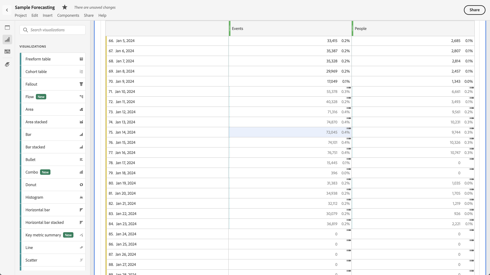
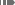

# Prognoses weergeven in Analysis Workspace

U kunt prognoses in een vrije-vormlijst of in een lijngrafiek bekijken.

## Prognoses weergeven in een tabel

U kunt prognoses in een tijdreeksvrije lijst bekijken. Als Voorspelling tonen is ingeschakeld voor tabel Freeform in [gebruikersvoorkeuren](../user-preferences.md), wordt het voorspellen automatisch getoond voor de eerste metrische kolom die aan de lijst wordt toegevoegd. Voor elke andere kolom:

1. Het pictogram voor kolominstellingen selecteren  in de kolomkop zorgt u ervoor dat **[!UICONTROL Show forecast]** wordt geselecteerd in de lijst met opties. Zie voor meer informatie [Kolominstellingen](../visualizations/freeform-table/column-row-settings/column-settings.md).

1. Klik buiten de **[!UICONTROL Column settings]** om de instelling op te slaan en de bijgewerkte tabel weer te geven.

De prognoses zijn als volgt weergegeven:

* De geraamde waarde en het percentage voor elke cel worden weergegeven in **donkergrijs**.
* Om een voorspelde waarde aan te geven, een voorspeld symbool  wordt in de rechterbovenhoek van de cel weergegeven.

## Prognoses weergeven in een lijndiagram

Een lijngrafiek is de enige visualisatie die u toestaat om prognoses te bekijken.

1. Het pictogram Instellingen selecteren  in de visualisatiekoptekst en zorg er vervolgens voor dat **[!UICONTROL Show forecast]** wordt geselecteerd in de lijst met opties.

1. (optioneel) Selecteer **[!UICONTROL Allow forecast to scale Y-axis]**. Deze optie is niet standaard geselecteerd omdat deze soms een minder leesbaar diagram kan weergeven.

1. Klik buiten de **[!UICONTROL Settings]** om het bijgewerkte regeldiagram weer te geven.

De prognoses worden als volgt weergegeven in het lijndiagram:

* De huidige waarden voor de metriek in het lijndiagram worden aangegeven door een verticale balk. Als u de cursor boven die verticale lijn houdt, wordt een pop-up weergegeven met de laatste huidige datum.
* De voorspelde waarden voor één of meerdere metriek worden getoond recht van de verticale bar gebruikend gestippelde lijnen. U kunt de muisaanwijzer boven elk gegevenspunt voor een metrische waarde plaatsen. Dit toont een popup met:
   * datum van de prognose
   * voorspelde waarde voor de metrische waarde
   * bovengrens van voorspelde waarde voor de metrische waarde
   * ondergrens van voorspelde waarde voor de metrische waarde
* de schaduw geeft de betrouwbaarheidsmarge van de voorspelling weer .

