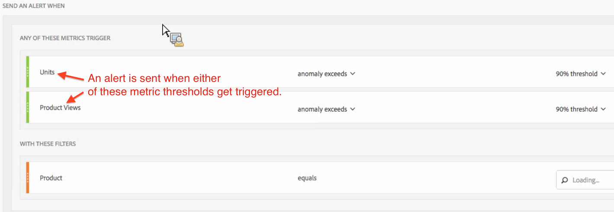

# Intelligente waarschuwingen - gebruiksgevallen

{{release-limited-testing}}

U kunt intelligente alarm tot stand brengen zoals die in [ wordt beschreven leidt tot alarm ](/help/analysis-workspace/c-intelligent-alerts/alert-builder.md).

In de volgende secties ziet u voorbeelden van gebruiksgevallen die u kunt overwegen wanneer u waarschuwingen maakt.

## Eenvoudige waarschuwing maken, gefilterd door twee filters {#section_2E96FFFA93D44F7D8DBCEC97203204AA}

<!-- 

Update screenshots for better readability.

 -->

## Consolideer waarschuwingen (stapel) in plaats van meerdere waarschuwingen te maken {#section_B27B0856BA104B9FB6D0BBB317633F18}

Het stapelen alarm zorgt ervoor dat de alarm wordt gecombineerd en u krijgt geen aantal afzonderlijke alarm.

