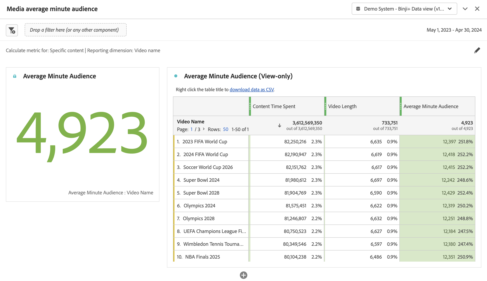

# Deelvenster Gemiddeld aantal minuten voor publiek {#media-average-minute-audience-panel}

<!-- markdownlint-disable MD034 -->

>[!CONTEXTUALHELP]
>id="cja_workspace_mediaminuteaverageaudience_button"
>title="Gemiddeld aantal minuten voor medium"
>abstract="Maak een deelvenster om het gemiddelde aantal minuten voor specifieke inhoud of over een bepaalde periode te analyseren."

<!-- markdownlint-enable MD034 -->

<!-- markdownlint-disable MD034 -->

>[!CONTEXTUALHELP]
>id="cja_workspace_mediaaverageminuteaudience_panel"
>title="Gemiddeld aantal minuten voor medium"
>abstract="Toont de prestaties van specifieke media inhoud of over een periode van de douanetijd.  **Algemene parameters ** **berekenen metrisch voor**: Selecteer metrisch aan gebruik voor het paneel. Selecteer **Specifieke inhoud** om gemiddeld minieme publiek voor specifieke inhoud of gebeurtenis te analyseren die op de inhoudslengte wordt gebaseerd. **Uitgezochte de tijdperiode van de Douane** om te analyseren hoe het gemiddelde minieme publiek over een douane geselecteerde periode verandert. **Meldend afmeting**: Uitgezocht om door **VideoNaam** van **te melden identiteitskaart van de Inhoud** afmeting. Alleen beschikbaar als u Specifieke inhoud hebt geselecteerd als de metrische waarde. **Korreligheid**: Selecteer granulariteit voor het melden. Alleen beschikbaar wanneer u Aangepaste tijdsperiode hebt geselecteerd als metrisch. **inhoud van de Filter door (facultatief)**: Selecteer een specifieke show, een seizoen, een episode, of selecteer een douaneafmeting om de inhoud te filtreren.  **Geavanceerde montages ** **de montages van de Lijst**: Selecteer of om berekeningswaarden in de lijst te tonen. **bestede tijd metrisch**: Selecteer welke tijd metrisch doorbracht u voor de specifieke inhoudsberekening zou willen gebruiken. Alleen beschikbaar als u Specifieke inhoud hebt geselecteerd als de metrische waarde."
>additional-url="https://experienceleague.adobe.com/en/docs/analytics/analyze/analysis-workspace/panels/average-minute-audience-panel#specific-content" text="Specifieke inhoud"
>additional-url="https://experienceleague.adobe.com/en/docs/analytics/analyze/analysis-workspace/panels/average-minute-audience-panel#custom-time-period" text="Aangepaste tijdsperiode"

<!-- markdownlint-enable MD034 -->

>[!NOTE]
>
>Het deelvenster **[!UICONTROL Media average minute audience]** is alleen beschikbaar voor klanten die de invoegtoepassing voor de verzameling van streaming media voor Customer Journey Analytics hebben aangeschaft.
>
>Neem voor meer informatie contact op met uw Adobe Verkoopvertegenwoordiger of accountteam van de Adobe.
>

In Analysis Workspace kan het gemiddelde minutenpubliek informatie geven over

* de tijd die is besteed aan het bekijken van een specifieke mediastream gedeeld door de duur van de inhoud, of
* De tijd die u hebt doorgebracht bij het bekijken tijdens een aangepaste tijdsperiode met de geselecteerde granulariteit.

Met het deelvenster Gemiddeld aantal minuten voor publiek in Media kunt u het gemiddelde verbruik van uw inhoud begrijpen door programma&#39;s van elke lengte of genre te vergelijken. U kunt bijvoorbeeld het gemiddelde verbruik begrijpen wanneer u een 30 minuten durende sitcom vergelijkt met een sportevenement van 3 uur.

Bovendien kunt u het deelvenster Mediagemiddelde aantal minuten publiek gebruiken om dit digitale gemiddelde minutenpubliek te vergelijken of toe te voegen aan lineaire gemiddelde tijdmetingen voor tv.

Het gemiddelde minieme deelvenster van het publiek van Media biedt de volgende voordelen ten opzichte van de metrische waarde Gemiddelde Minuut publiek:

* Ondersteunt aangepaste tijdsperioden

* Hiermee kunt u de indeling van de tijdsduur bijwerken nadat de weergaven zijn verwerkt (als de tijdclassificatie niet aanwezig was of moet worden gecorrigeerd)

  Als u deze update uitvoert wanneer u metrisch gebruikt, bestaat de duurclassificatie niet (als de classificatie niet aanwezig was). Of de indeling naar duur is verouderd (als de indeling wel aanwezig maar onjuist was).

## Gebruiken

Een deelvenster **[!UICONTROL Media average minute audience]** gebruiken:

1. Maak een deelvenster **[!UICONTROL Media average minute audience]** . Voor informatie over hoe te om een paneel tot stand te brengen, zie [ een paneel ](panels.md#create-a-panel) creëren.

1. Zorg ervoor dat u een gegevensweergave selecteert voor het deelvenster waarvoor componenten zijn geconfigureerd via de invoegtoepassing voor het streamen van mediaconzameling.

1. Specificeer de [ input ](#panel-input) voor het paneel.

1. Neem de [ output ](#panel-output) voor het paneel waar.

### Deelvensterinvoer

Met de invoerinstellingen die in deze sectie worden beschreven, kunt u het deelvenster Medium voor een gemiddeld aantal minuten publiek configureren.

1. Configureer de volgende invoerinstellingen:

   | Instelling | Beschrijving |
   |---------|------------|
   | **waaier van de paneeldatum** | Het gebrek van de waaier van de paneeldatum is [!UICONTROL **Deze maand**]. U kunt de presentatie bewerken om één dag of meerdere maanden tegelijk weer te geven.    Deze visualisatie is beperkt tot 1440 rijen met gegevens (bijvoorbeeld 24 uur bij granulariteit op minaniveau). Als een datumbereik en de combinatie van granulariteit meer dan 1440 rijen opleveren, wordt de granulariteit automatisch bijgewerkt om het volledige datumbereik te kunnen gebruiken. |
   | [!UICONTROL **Daling een segment hier (of een andere component)**] | Net als andere deelvensters worden met deze instelling de selecties gefilterd op basis van segmenten die u hebt gemaakt. Deze instelling is een uitstekende manier om naar specifieke platforms, live streams of andere veelgebruikte mediasegmenten te kijken. |
   | [!UICONTROL **berekent metrisch voor**] | Kies of u het gemiddelde aantal minuten voor [**[!UICONTROL Specific content]**](#specific-content) wilt zien. Of als u het gemiddelde aantal minuten voor een [**[!UICONTROL Custom time period]**](#custom-time-period) wilt zien.   Uitgezochte [!UICONTROL **de tijdperiode van de Douane**]: <ul><li>Als de duur niet beschikbaar is, of </li><li>als u het gemiddelde aantal minuten voor een tijdreeks met meerdere inhoud wilt weergeven, of</li><li>voor inhoud zonder een specifieke toegewezen duur (zoals tijdens een live stream of gebeurtenis)</li></ul></li></li></ul> 
Met deze instelling wijzigt u de workflow en de rapportuitvoer.
 |

1. Ga met [ Specifieke inhoud ](#specific-content) of [ de tijdperiode van de Douane ](#custom-time-period), afhankelijk van de optie voort u in [!UICONTROL **kiest metrisch voor**] drop-down lijst berekent.

#### Specifieke inhoud

1. Als u [!UICONTROL **Specifieke inhoud**] in [!UICONTROL **selecteerde berekent metrisch voor**] drop-down menu wanneer [ vormend paneelinput ](#panel-inputs), specificeer de volgende configuratieopties:

   | Instelling | Beschrijving |
   |---------|------------|
   | [!UICONTROL **Meldend afmeting**] | Wanneer u specifieke inhoud selecteert, kunt u de rapportoutput selecteren om of de videonaam of de gebieden van identiteitskaart van de inhoud te gebruiken om de inhoud en zijn bijbehorend gemiddeld minipubliek te tonen. |
   | [!UICONTROL **inhoud van de Filter door (facultatief)**] | Kies hoe u de specifieke inhoud wilt filteren, afhankelijk van de gewenste weergave of de structuur van de gegevens. <ul>[!UICONTROL **toon, seizoen, episode**]: Toont uw beschikbare shows in drop-down, die u het gebruiken van een onderzoek kunt filtreren (of door de shownaam van de linkerkolom te slepen en te laten vallen). Je kunt je selectie daar beëindigen om alle seizoenen van je show te zien, of je kunt filteren op individuele seizoenen en dan op individuele afleveringen. Deze instelling geeft de gegevens voor deze shows, seizoenen of episodes voor de geselecteerde tijdsperiode weer.</li><li>[!UICONTROL **de afmeting van de Douane**]: Als uw shownaam onder een douaneafmeting is, kunt u het vinden of door in de afmeting (facultatieve) drop-down te zoeken of door het linkerkolomonderzoek te gebruiken. Het dimensie-item wordt automatisch gevuld op basis van die selectie en wordt behandeld als een aflevering.</li><li>[!UICONTROL **niets**]: Toont alle videonamen die gemiddelde minieme publieksgegevens voor de selectie hebben u hebt gekozen. (Deze optie is standaard geselecteerd.)</li></ul> |

1. Ga met [ Specifieke inhoud Geavanceerde montages ](#specific-content-advanced-settings) verder om geavanceerde montages te vormen.

#### Geavanceerde instellingen voor specifieke inhoud

1. Met [!UICONTROL **Specifieke inhoud**] die in [!UICONTROL **wordt geselecteerd berekent metrisch voor**] drop-down menu, uitgezocht [!UICONTROL **toon geavanceerde montages**], dan specificeer de volgende configuratieopties:

   | Opties | Beschrijving |
   |---------|------------|
   | **[!UICONTROL Table settings]** | De standaardoptie **[!UICONTROL Show calculation values in table]** toont de teller en de noemer van het gemiddelde minieme publiek als voorafgaande kolommen in de lijst. Als u deze optie uitschakelt, worden deze twee kolommen verwijderd. De gemiddelde minieme publiekskolom blijft in de tabel naast de videonaam of inhoud-id. |
   | **[!UICONTROL Time spent metric]** | U kunt de standaardoptie **[!UICONTROL Content Time Spent]** kiezen, die slechts inhoudstijd omvat. U kunt ook **[!UICONTROL Media Time Spent]** gebruiken, dat inhoud en tijd bij elkaar opneemt als de tellerberekening voor het gemiddelde aantal minuten. |

1. Selecteer [!UICONTROL **bouwen**] om het gemiddelde minieme het publiek van Media te beëindigen.

1. Ga met [ output van het Comité ](#panel-output) voor informatie over hoe te om het gemiddelde minieme het publiekspaneel van Media te gebruiken.

#### Aangepaste tijdsperiode

1. Als u [!UICONTROL **de tijdsperiode van de Douane**] in [!UICONTROL **selecteerde berekent metrisch voor**] drop-down menu wanneer [ vormend paneelinput ](#panel-inputs), specificeer de volgende configuratieopties:

   | Opties | Beschrijving |
   |---------|------------|
   | **[!UICONTROL Granularity]** | De standaardgranulariteit is [!UICONTROL **5 - Minuut**], maar u kunt om het even welke granulariteiten kiezen die als noemer voor de tijdreeks binnen uw geselecteerde tijdspanne worden gebruikt. Als u bijvoorbeeld 12:00 tot 12:30 pm met een granulariteit van 5 minuten selecteert, wordt het gemiddelde aantal minuten voor het hele half uur en zes rijen geretourneerd met het gemiddelde aantal minuten voor elke periode van 5 minuten. Deze rijen worden gebruikt als datapoints voor de grafiek van de tijdreeks. |
   | [!UICONTROL **inhoud van de Filter door (facultatief)**] | Kies hoe u de specifieke inhoud wilt filteren, afhankelijk van de gewenste weergave of de structuur van de gegevens. <ul>[!UICONTROL **toon, seizoen, episode**]: Toont uw beschikbare shows in drop-down, die u het gebruiken van een onderzoek kunt filtreren (of door de shownaam van de linkerkolom te slepen en te laten vallen). Je kunt je selectie daar beëindigen om alle seizoenen van je show te zien, of je kunt filteren op individuele seizoenen en dan op individuele afleveringen. Deze instelling geeft de gegevens voor deze shows, seizoenen of episodes voor de geselecteerde tijdsperiode weer.</li><li>[!UICONTROL **de afmeting van de Douane**]: Als uw shownaam onder een douaneafmeting is, kunt u het vinden of door in de afmeting (facultatieve) drop-down te zoeken of door het linkerkolomonderzoek te gebruiken. Het dimensie-item wordt automatisch gevuld op basis van die selectie en wordt behandeld als een aflevering.</li><li>[!UICONTROL **niets**]: Toont alle videonamen die gemiddelde minieme publieksgegevens voor de selectie hebben u hebt gekozen. (Deze optie is standaard geselecteerd.)</li></ul> |

1. Ga met [ Geavanceerde montages van de tijdperiode van de Douane ](#custom-time-period-advanced-settings) verder om geavanceerde montages te vormen.

#### Geavanceerde instellingen voor aangepaste tijdsperiode

1. Met [!UICONTROL **de tijdsperiode van de Douane**] die in [!UICONTROL **wordt geselecteerd berekent metrisch voor**] drop-down menu, uitgezocht [!UICONTROL **toont geavanceerde montages**], dan specificeer de volgende configuratieoptie:

   | Optie | Beschrijving |
   |---------|------------|
   | **[!UICONTROL Table settings]** | Met de standaardinstelling worden de berekeningswaarden in de tabel weergegeven. In deze tabel worden de teller en de noemer van het gemiddelde aantal minuten voor het publiek weergegeven als de voorafgaande kolommen in de tabel. Als u deze optie uitschakelt, worden deze twee kolommen verwijderd, zodat alleen het gemiddelde aantal minuten naast de tijdsperiode overblijft. |

1. Selecteer [!UICONTROL **bouwen**] om het gemiddelde minieme het publiek van Media te beëindigen.

1. Ga met [ output van het Comité ](#panel-output) voor informatie over hoe te om het gemiddelde minieme het publiekspaneel van Media te gebruiken.

### Deelvensteruitvoer

De paneeloutput verschilt afhankelijk van of u [!UICONTROL **Specifieke inhoud**] of [!UICONTROL **de tijdperiode van de Douane**] in [!UICONTROL **berekent metrisch voor**] drop-down menu wanneer [ vormend paneelinput ](#panel-inputs) koos.

#### Specifieke inhoud

In het deelvenster Gemiddelde minieme publiek voor Media wordt het volgende geretourneerd:

* Totaal gemiddeld aantal minuten voor uw volledige selectie
* Filters en een gemiddeld aantal minuten publiek voor de afzonderlijke video&#39;s, weergegeven in een tabel
* De tijd van de inhoud en videolengte (duur) als die geavanceerde het plaatsen werd geselecteerd

Om het paneel op elk ogenblik uit te geven en te herbouwen, uitgezocht  in het hoogste recht uit.

#### Specifieke inhoudsgegevensbron

In het deelvenster Gemiddelde minieme doelgroep van Media wordt alleen de gemiddelde-minieme publieksmeting gebruikt om gegevens te verzamelen. In het deelvenster kunnen geen indelingen of andere maatstaven worden gebruikt.

| Metrisch | Beschrijving |
|--------|-------------|
| **[!UICONTROL Average minute audience]** | De weergavetijd van de mediastream gedeeld door de videolengte (duur) die via Classificaties wordt aangeboden. |

#### Aangepaste tijdsperiode {#custom-time-period-output}

In het deelvenster Gemiddelde minieme publiek voor Media wordt het volgende geretourneerd:

* Het totale gemiddelde aantal minuten voor uw volledige selectie

* Het maximum en minimum gemiddelde aantal minuten

* De grafiek van de lijnreeks die het gemiddelde minieme publiek over de volledige selectie toont.

* Een tabel waarin de filters en het gemiddelde aantal minuten voor de granulariteiten worden weergegeven, evenals de tijd die de inhoud heeft doorgebracht en de granulariteit voor elke tijdsperiode

  Deze lijst toont slechts als de optie onder geavanceerde montages genoemd [!UICONTROL **berekeningswaarden in lijst**] wordt geselecteerd.

Om het paneel op elk ogenblik uit te geven en te herbouwen, uitgezocht  in het hoogste recht uit.

#### Gegevensbron aangepaste tijdperiode

In het deelvenster Gemiddelde minieme doelgroep van Media wordt alleen de gemiddelde-minieme publieksmeting gebruikt om gegevens te verzamelen. In het deelvenster kunnen geen indelingen of andere maatstaven worden gebruikt.

| Metrisch | Beschrijving |
|---|---|
| **[!UICONTROL Average Minute Audience]** | De weergavetijd van de mediastream gedeeld door de totale selectie of geselecteerde granulariteit in minuten. |

>[!MORELIKETHIS]
>
> [ creeer een paneel ](/help/analysis-workspace/c-panels/panels.md#create-a-panel)
> [Deelvenster Mediagelijktijdige viewers ](media-concurrent-viewers.md)
> [De playbacktijd van media bestede paneel ](media-playback-time-spent.md)
>