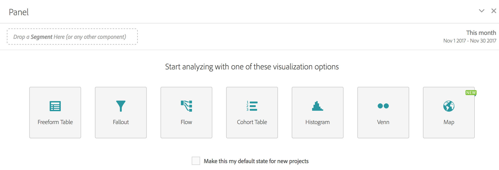

# Leeg deelvenster

In een leeg deelvenster worden alle visualisaties gemarkeerd die u kunt maken vanuit een deelvenster, inclusief Vrije vorm, Kaart, Fallout, Stroom, Histogram, Cohort en Venn. U kunt er ook voor kiezen om van het deelvenster Blanco de standaardstartstatus van het project te maken in plaats van een deelvenster met vrije vorm.

