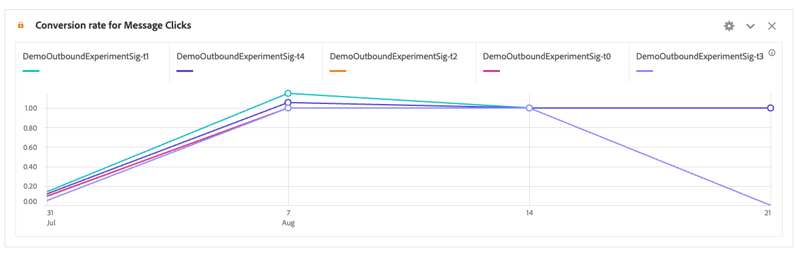

# Deelvenster Experimentatie

>[!NOTE]
>
>Deze functionaliteit is momenteel in [beperkte tests](/help/release-notes/releases.md).

De **[!UICONTROL Experimentation]** in dit deelvenster kunnen analisten verschillende gebruikerservaringen, marketing of berichtvariaties vergelijken om te bepalen wat het beste is om een bepaald resultaat te bepalen. U kunt de lift en het vertrouwen van om het even welk A/B experiment van om het even welk experimentatieplatform evalueren - online, off-line, van Adobe oplossingen, Adobe Journey Optimizer, en zelfs (breng-uw-eigen) gegevens BYO.

>[!IMPORTANT]
>
>Op dit punt [Adobe Analytics for Target](https://experienceleague.adobe.com/docs/target/using/integrate/a4t/a4t.html) (A4T) gegevens die via de Analytics Source Connector naar Adobe Experience Platform worden gebracht **kan** worden geanalyseerd in het [!UICONTROL Experimentation] deelvenster. We verwachten dat er in 2023 een resolutie over deze kwestie komt.

## Toegangsbeheer

Het deelvenster Experimentatie kan door alle Customer Journey Analytics-gebruikers (CJA) worden gebruikt. Er zijn geen beheerdersrechten of andere machtigingen vereist. Voor de installatie (stappen 1 en 2 hieronder) zijn echter handelingen vereist die alleen door beheerders kunnen worden uitgevoerd.

## Stap 1: Verbinding maken om gegevensset(s) te experimenteren

Het aanbevolen gegevensschema is dat de experimentele gegevens zich in een [Objectarray](https://experienceleague.adobe.com/docs/experience-platform/xdm/ui/fields/array.html?lang=en) die de experimentele gegevens en de variantgegevens in twee afzonderlijke dimensies bevat. Als u uw experimentele gegevens in één dimensie met experimentele en variantgegevens in een afgebakende tekenreeks hebt, kunt u de [substring](/help/data-views/component-settings/substring.md) het plaatsen in gegevensmeningen om hen in twee voor gebruik in het paneel te verdelen.

Nadat uw experimentele gegevens zijn [ingesloten](https://experienceleague.adobe.com/docs/experience-platform/ingestion/home.html) naar Adobe Experience Platform, [een verbinding maken in CJA](/help/connections/create-connection.md) naar een of meer experimentele gegevenssets.

## Stap 2: Contextlabels toevoegen in gegevensweergaven

In de weergave-instellingen van CJA-gegevensweergaven kunnen beheerders toevoegen [contextlabels](/help/data-views/component-settings/overview.md) aan een afmeting of metrisch en de diensten CJA zoals [!UICONTROL Experimentation] kunnen deze labels voor hun doeleinden gebruiken. Voor het deelvenster Experimentatie worden twee vooraf gedefinieerde labels gebruikt:

* [!UICONTROL Experimentation Experiment]
* [!UICONTROL Experimentation Variant]

In uw gegevensmening die experimentatiegegevens bevat, kies twee afmeting, één met de experimentatiegegevens en één met de variantgegevens. Geef vervolgens een label aan deze afmetingen met de **[!UICONTROL Experiment]** en de **[!UICONTROL Variant]** labels.

Zonder deze labels werkt het deelvenster Experimenteren niet, omdat er geen experimenten zijn om mee te werken.

## Stap 3: Het deelvenster Experimenteren configureren

1. Sleep het deelvenster Experimentatie naar een project in de CJA-werkruimte.

>[!IMPORTANT]
>Als de vereiste opstelling in CJA- gegevensmeningen niet is voltooid, zult u dit bericht ontvangen alvorens u kunt te werk gaan: &quot;[!UICONTROL Please configure the experiment and variant dimensions in Data Views]&quot;.

1. Configureer de instellingen voor deelvensterinvoer.

   | Instelling | Definitie |
   | --- | --- |
   | **[!UICONTROL Experiment]** | Een reeks variaties op een ervaring die aan eindgebruikers werden blootgesteld om te bepalen welke ervaring het beste in onbeperkte tijd kan worden bewaard. Een experiment bestaat uit twee of meer varianten, waarvan er één als de besturingsvariant wordt beschouwd. Deze instelling is vooraf gevuld met de afmetingen die zijn gelabeld met de  **[!UICONTROL Experiment]** in gegevensweergaven en de waarde van het experiment van de laatste drie maanden. |
   | **[!UICONTROL Control Variant]** | Een van twee of meer wijzigingen in de ervaring van een eindgebruiker die worden vergeleken om het betere alternatief te identificeren. Eén variant moet als controlevariant worden gekozen en slechts één variant kan als controlevariant worden beschouwd. Deze instelling is vooraf gevuld met de afmetingen die zijn gelabeld met de  **[!UICONTROL Variant]** label in gegevensweergaven. Deze instelling geeft de variantgegevens weer die bij dit experiment horen. |
   | **[!UICONTROL Success Metrics]** | De metrische of metrische waarde waarmee een gebruiker varianten vergelijkt. De variant met het meest gewenste resultaat voor de omzettingsmeting (hoogste of laagste) wordt de &quot;best presterende variant&quot; van een experiment genoemd. U kunt maximaal vijf metriek toevoegen. |
   | **[!UICONTROL Normalizing Metric]** | De basis ([!UICONTROL People], [!UICONTROL Sessions], of [!UICONTROL Events]) waarop een test wordt uitgevoerd. Een test kan bijvoorbeeld de conversiesnelheden van verschillende variaties vergelijken, waarbij **[!UICONTROL Conversion rate]** wordt berekend als **[!UICONTROL Conversions per session]** of **[!UICONTROL Conversions per person]**. |
   | **[!UICONTROL Date Range]** | Het datumbereik wordt automatisch ingesteld op basis van de eerste hit die in CJA is ontvangen voor het geselecteerde experiment. Indien nodig kunt u het datumbereik beperken of uitbreiden tot een specifieker tijdsbestek. |

1. Klik op **[!UICONTROL Build]**.

## Stap 4: De uitvoer van het deelvenster weergeven

Het deelvenster Experimentatie bevat een uitgebreide set gegevens en visualisaties waarmee u beter kunt begrijpen hoe uw experimenten werken. Boven in het deelvenster ziet u een samenvattingsregel waarmee u de deelvensterinstellingen die u hebt geselecteerd, kunt herinneren. U kunt het deelvenster op elk gewenst moment bewerken door in de rechterbovenhoek op het potlood te klikken.

U krijgt ook een tekstsamenvatting die aangeeft of het experiment al dan niet overtuigend is en die het resultaat samenvat. Conclusiviteit is gebaseerd op statistische significantie. (Zie &quot;Statistische methodologie&quot; hieronder.) U kunt samenvattingsnummers zien voor de best presterende variant met de hoogste lichtsterkte en betrouwbaarheid.

Voor elke succesmetrische metrische u selecteerde, zullen één vrije lijst en één omzettingstendens worden getoond.

De [!UICONTROL Line] de grafiek geeft u [!UICONTROL Control] versus [!UICONTROL Control Variant] prestaties:

>[!NOTE]
>
>Dit panel ondersteunt momenteel geen analyse van A/A-tests.

## Stap 5: De resultaten interpreteren

1. **Experimenteer is Sluiten**: Telkens wanneer u het experimentatierapport bekijkt, analyseert Adobe de gegevens die in het experiment tot op heden zijn verzameld en zal een experiment als &quot;Sluiten&quot; worden aangemerkt wanneer het altijd geldige vertrouwen een drempel van 95% overschrijdt voor *ten minste één* van de varianten (met een Bonferoni-correctie toegepast wanneer er meer dan twee armen zijn, om te corrigeren voor meervoudige hypothesetests).

2. **Best presterende variabele**: Wanneer een experiment overtuigend wordt verklaard, wordt de variant met de hoogste omrekeningskoers aangeduid als de best presterende variant. Deze variant moet ofwel de besturingsvariant of basislijnvariant zijn, ofwel een van de varianten die de 95% overschrijdt op een willekeurig moment geldige betrouwbaarheidsdrempel (met Bonferoni-correcties toegepast).

3. **Omzetsnelheid**: De omrekeningskoers die wordt getoond is een verhouding van de succes metrische waarde, aan de normaliserende metrische waarde. Merk op dat dit soms groter kan zijn dan 1, als metrisch niet binair is (1 of 0 voor elke eenheid in het experiment)

4. **Optillen**: De samenvatting van het experimentele rapport toont de Lift over de basislijn, die een maat is voor de procentuele verbetering van de conversiesnelheid van een bepaalde variant ten opzichte van de basislijn. Dit is het verschil in prestaties tussen een bepaalde variant en de basislijn, gedeeld door de prestaties van de basislijn, uitgedrukt als een percentage.

5. **Vertrouwen**: Het Geldige Vertrouwen van Anytime dat wordt getoond, is een probabilistische maatregel van hoeveel bewijs er is dat een bepaalde variant het zelfde als de controlevariant is. Een hoger vertrouwen geeft minder bewijs voor de aanname dat de besturingsvariant en de niet-besturingsvariant dezelfde prestaties leveren. Meer in het bijzonder is het vertrouwen dat wordt weergegeven een waarschijnlijkheid (uitgedrukt als een percentage) dat we een kleiner verschil in omrekeningskoersen tussen een bepaalde variant en het besturingselement zouden hebben gezien, als er in werkelijkheid geen verschil is in de werkelijke onderliggende omrekeningskoersen. In termen van *p*-waarden, het weergegeven vertrouwen is 1 - *p*-value.

>[!NOTE]
>
>Bij een volledige beschrijving van de resultaten moet rekening worden gehouden met alle beschikbare gegevens (bijv. opzet van het experiment, omvang van de steekproef, omrekeningskoersen, betrouwbaarheid enz.) en niet alleen met de vermelding van overtuigend of niet. Zelfs als een resultaat nog niet &quot;overtuigend&quot; is, kan er nog steeds overtuigend bewijs zijn dat de ene variant anders is dan de andere (zo zijn betrouwbaarheidsintervallen bijna niet-overlapt). Idealiter zou de besluitvorming moeten worden gebaseerd op alle statistische gegevens, die op een continu spectrum worden geïnterpreteerd.

## Adobe

Om gemakkelijk te interpreteren en veilige statistische conclusies te kunnen trekken, heeft Adobe een statistische methodologie aangenomen die gebaseerd is op [Altijd geldige betrouwbaarheidsreeksen](https://doi.org/10.48550/arXiv.2103.06476).

Een reeks van het Vertrouwen is een &quot;opeenvolgend&quot;analoog van een Interval van het Vertrouwen. Om te begrijpen wat een vertrouwensopeenvolging is, stel voor herhalend uw experimenten honderd keer, en het berekenen van een schatting van gemiddelde bedrijfsmetrisch (b.v. open tarief van een e-mail) en zijn bijbehorende 95%-Vertrouwensopeenvolging voor *elke nieuwe gebruiker* dat het experiment binnenkomt.

Een 95% Vertrouwensreeks zal de &quot;ware&quot;waarde van zaken metrisch in 95 van de 100 experimenten omvatten die u in werking stelde. (Een betrouwbaarheidsinterval van 95% kan slechts eenmaal per experiment worden berekend om dezelfde 95%-dekkingsgarantie te bieden; niet bij elke nieuwe gebruiker). Met vertrouwensreeksen kunt u dus voortdurend experimenten volgen zonder dat de foutpercentages worden verhoogd, d.w.z. dat met deze resultaten kan worden gespiekt.

## Nieuwe functies in Berekende metriek

Er zijn twee nieuwe geavanceerde functies toegevoegd: [!UICONTROL Lift] en [!UICONTROL Confidence]. Zie voor meer informatie [Referentie - geavanceerde functies](/help/components/calc-metrics/cm-adv-functions.md).