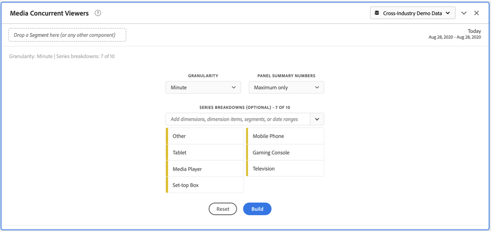

# Deelvenster Mediagelijktijdige viewers {#media-concurrent-viewers-panel}

<!-- markdownlint-disable MD034 -->

>[!CONTEXTUALHELP]
>id="cja_workspace_mediaconcurrentviewers_button"
>title="Gelijktijdige viewers voor media"
>abstract="Maak een deelvenster om het gemiddelde aantal minuten voor specifieke inhoud of over een bepaalde periode te analyseren."

<!-- markdownlint-enable MD034 -->

<!-- markdownlint-disable MD034 -->

>[!CONTEXTUALHELP]
>id="cja_workspace_mediaconcurrentviewers_panel"
>title="Gelijktijdige viewers voor media"
>abstract="Analyseer gelijktijdige viewers in de loop der tijd, bekijk de piektijkgelijktijdige, of onderbreek en vergelijk.  **Korreligheid**: Selecteer tijdspanne om gezamenlijke kijkers door te bekijken. **de summiere aantallen van het Comité**:  Optie om summiere aantallen met datum of tijddetails voor elke lijn te tonen. Bij Maximaal worden details voor de piekfrequentie weergegeven. Bij Minimaal worden details voor de trog weergegeven. **(Facultatieve) de indeling van de Reeks**: Onderbreking visualisatie door segmenten, dimensies, afmetingspunten of datumwaaiers. U kunt maximaal 10 regels tegelijk weergeven. Uitsplitsingen zijn beperkt tot één niveau."

<!-- markdownlint-enable MD034 -->

>[!NOTE]
>
>Het deelvenster Mediapubliek met een gemiddelde minuut is alleen beschikbaar voor klanten die de invoegtoepassing voor het streamen van media-verzamelingen voor Customer Journey Analytics hebben aangeschaft.
>
>Neem voor meer informatie contact op met uw Adobe Verkoopvertegenwoordiger of accountteam van de Adobe.
>

Met het deelvenster **[!UICONTROL Media concurrent viewers]** kunt u in de loop der tijd gelijktijdige viewers analyseren, met details over de piekfrequentie en de mogelijkheid om af te breken en te vergelijken.

U kunt gelijktijdige viewers analyseren om te begrijpen waar de piekgelijktijdige uitvoering plaatsvond of waar drop-outs waardevolle inzichten in de kwaliteit van de inhoud en de betrokkenheid van de kijker gaven. En voor hulp bij het oplossen van problemen of het plannen voor volume of schaal.

In Analysis Workspace is de metrische waarde voor Gelijktijdige viewers het aantal unieke personen dat uw mediastreams op een bepaald tijdstip weergeeft, ongeacht het aantal sessies.

+++ Bekijk een videodemonstratie van deze functionaliteit.

>[!VIDEO](https://video.tv.adobe.com/v/330177/?quality=12)

{{videoaa}}

+++

## Gebruiken

Een deelvenster **[!UICONTROL Media concurrent viewers]** gebruiken:

1. Maak een deelvenster **[!UICONTROL Media concurrent viewers]** . Voor informatie over hoe te om een paneel tot stand te brengen, zie [ een paneel ](panels.md#create-a-panel) creëren.

1. Zorg ervoor dat u een gegevensweergave selecteert voor het deelvenster waarvoor componenten zijn geconfigureerd via de invoegtoepassing voor het streamen van mediaconzameling.

1. Specificeer de [ input ](#panel-input) voor het paneel.

1. Neem de [ output ](#panel-output) voor het paneel waar.

### Deelvensterinvoer

U kunt het deelvenster Mediagelijktijdige viewers configureren met de volgende invoerinstellingen:

| Instelling | Beschrijving |
|---|---|
| **[!UICONTROL Panel date range]** | Het standaarddatumbereik van het deelvenster is Vandaag.  U kunt de presentatie bewerken om een enkele dag of maanden tegelijk weer te geven.     Deze visualisatie is beperkt tot 1440 rijen van gegevens (bijvoorbeeld, 24 uur bij miniem-vlakke granulariteit).  Als een datumbereik en de combinatie van granulariteit meer dan 1440 rijen opleveren, wordt de granulariteit automatisch bijgewerkt om het volledige datumbereik te kunnen gebruiken. |
| **[!UICONTROL Granularity]** | De standaardwaarde voor granulariteit is Minute.  Deze visualisatie is beperkt tot 1440 rijen van gegevens (bijvoorbeeld, 24 uur bij miniem-vlakke granulariteit).  Als een datumbereik en de combinatie van granulariteit meer dan 1440 rijen opleveren, wordt de granulariteit automatisch bijgewerkt om het volledige datumbereik te kunnen gebruiken. |
| **[!UICONTROL Panel summary numbers]** | Er is een samenvattingsnummer beschikbaar om de datum- of tijdgegevens van gelijktijdige viewers weer te geven. Bij Maximaal worden details voor de piekfrequentie weergegeven. In **[!UICONTROL Minimum]** worden de details van de trog weergegeven.  In het standaardvenster wordt alleen Maximum weergegeven, maar u kunt dit wijzigen in Minimum of zowel Maximaal als Minimaal.   als u onderverdelingen gebruikt, wordt een samenvattingsaantal getoond voor elk. |
| **[!UICONTROL Series breakdown]** | U kunt desgewenst de visualisatie opsplitsen in filters, dimensies, dimensiepunten of datumbereiken.  u kunt tot 10 lijnen tegelijkertijd bekijken. Uitsplitsingen zijn beperkt tot één niveau.  wanneer het slepen van een afmeting, worden de hoogste afmetingspunten geselecteerd automatisch gebaseerd op de geselecteerde waaier van de paneeldatum.  om datumwaaiers te vergelijken, sleep 2 of meer datumwaaiers in de filter van de reeksindeling. |

Hier volgt een voorbeeld van het deelvenster dat is geconfigureerd voor **[!UICONTROL Minute]** granularity, met **[!UICONTROL Maximum only]** -samenvattingsnummers. En gesplitst naar **[!UICONTROL Other]**, **[!UICONTROL Table]**, **[!UICONTROL Mobile Phone]**, **[!UICONTROL Gaming Console]**, **[!UICONTROL Media Player]**, **[!UICONTROL Set-top Box]**, **[!UICONTROL Television]** .

### Deelvensteruitvoer

Het deelvenster Mediagelijktijdige viewers retourneert een regeldiagram en een samenvattingsnummer met gegevens voor de maximum- en/of minimale gelijktijdige viewers.  Boven in het deelvenster ziet u een samenvattingsregel waarmee u de deelvensterinstellingen die u hebt geselecteerd, kunt herinneren.

Op elk ogenblik, uitgezocht  uit om het paneel uit te geven en opnieuw te bouwen.

Als u een reeksindeling selecteert, worden een regel in het lijndiagram en een samenvattingsnummer voor elke regel weergegeven:

### Gegevensbron

De enige metrische waarde die in dit deelvenster kan worden gebruikt, is **[!UICONTROL Concurrent viewers]** :

| Metrisch | Beschrijving |
|---|---|
| **[!UICONTROL Concurrent viewers]** | Het aantal unieke personen dat uw mediastreams op een bepaald tijdstip weergeeft, ongeacht het aantal sessies. |

In deze weergave is geen tabel voor vrije vorm beschikbaar.  Als u de gegevensbron wilt weergeven, kunt u de gegevensbron downloaden in het contextmenu voor de visualisatie van het lijndiagram en **[!UICONTROL Download data as CSV]** selecteren.  Uitsplitsingen naar reeksen worden opgenomen.

## Veelgestelde vragen

| Vraag | Antwoord |
|---|---|
| Waar is de tabel voor vrije vorm? Hoe kan ik de gegevensbron zien? | De tabel Freeform is niet beschikbaar in deze weergave.  U kunt de gegevensbron downloaden van het contextmenu van het lijndiagram en selecteren **[!UICONTROL Download data as CSV]**. |
| Waarom veranderde mijn granulariteit? | Deze visualisatie is beperkt tot 1440 rijen gegevens (bijvoorbeeld 24 uur bij granulariteit op minaniveau).  Als een datumbereik en de combinatie van granulariteit meer dan 1440 rijen opleveren, wordt de granulariteit automatisch bijgewerkt om het volledige datumbereik te kunnen gebruiken.   wanneer het veranderen van een grotere datumwaaier in kleinere, wordt granularity bijgewerkt aan het laagste die detail toelaat zodra de datumwaaier wordt veranderd. Als u een hogere granulariteit wilt weergeven, bewerkt u het deelvenster en maakt u het opnieuw. |
| Hoe vergelijk ik videonamen, filters, inhoudstypen en andere? | Als u deze items wilt vergelijken in één visualisatie, sleept u filters, dimensies of specifieke dimensiepunten in het filter voor de reeksafbraak.   de mening is beperkt tot 10 uitsplitsingen.  Als u meer dan 10 wilt weergeven, moet u meerdere deelvensters gebruiken. |
| Hoe vergelijk ik datumbereiken? | Om datumwaaiers in één enkele visualisatie te vergelijken, gebruik de reeksonderverdelingen door 2 of meer datumwaaiers te slepen.  De datumbereiken overschrijven het datumbereik van het deelvenster. |
| Hoe kan ik het visualisatietype wijzigen? | In dit deelvenster kunt u alleen de lijnen voor de tijdreeks visualiseren. |
| Kan ik anomaliedetectie uitvoeren? | Nee.  Anomaly-detectie is niet beschikbaar voor dit deelvenster. |
| Waarom unieke personen gebruiken in plaats van actieve sessies? | Door unieke personen te gebruiken, kunt u ongewenste spikes verwijderen bij het weergeven van de grenzen (waar de sessies tegelijkertijd eindigen en beginnen). |
| Wat betekent het om gelijktijdige kijkers bij hogere granulariteit dan minuut te hebben? | Met een granulariteit die groter is dan een minuut, zijn gelijktijdige viewers de som van unieke gelijktijdige viewers voor alle minuten binnen dat tijdbereik.  Gelijktijdige viewers op uurniveau zijn bijvoorbeeld de som van unieke gelijktijdige viewers voor alle minuten in het uur. |
| Geeft het deelvenster Werkruimte dezelfde informatie als het rapport Gelijktijdige viewers? | Nee.  In Analysis Workspace wordt de metrische waarde voor Gelijktijdige viewers gedefinieerd als het aantal unieke personen dat uw mediastream op een bepaald tijdstip weergeeft. Ongeacht het aantal sessies.   dit metrisch is verschillend dan Gelijktijdige kijker die in de sectie van Rapporten rapporteert, die Gelijktijdige Actieve Zittingen gebruikt. Door unieke personen te gebruiken, worden ongewenste pieken bij de grenzen van de show verwijderd (waar sessies tegelijkertijd eindigen en beginnen). |

<!-- For more information about Media Concurrent Viewers, visit [MA doc page]( https://url). -->

>[!MORELIKETHIS]
>
>[ creeer een paneel ](/help/analysis-workspace/c-panels/panels.md#create-a-panel)
>[De playbacktijd van media bestede paneel ](media-playback-time-spent.md)
>[Mediagemiddelde minieme publiekspaneel ](average-minute-audience-panel.md)
>