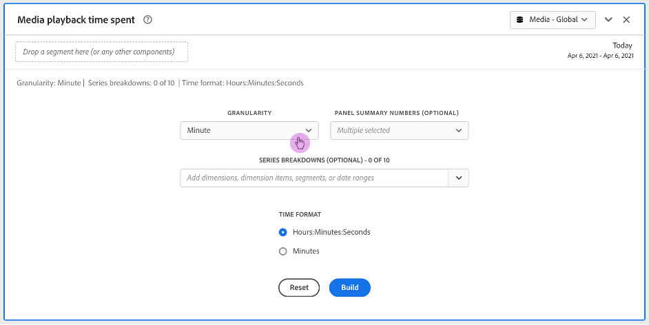

# Afspeeltijd van media in deelvenster {#media-playback-time-spent-panel}

<!-- markdownlint-disable MD034 -->

>[!CONTEXTUALHELP]
>id="cja_workspace_mediaplaybacktimespent_button"
>title="De afspeeltijd van media is verstreken"
>abstract="Maak een deelvenster voor het analyseren van het videoverbruik in de loop der tijd, met verschillende granulariteitsniveaus en de mogelijkheid om af te breken en te vergelijken."

<!-- markdownlint-enable MD034 -->

<!-- markdownlint-disable MD034 -->

>[!CONTEXTUALHELP]
>id="cja_workspace_mediaplaybacktimespent_panel"
>title="De afspeeltijd van media is verstreken"
>abstract="Analyseer het videoverbruik in de loop der tijd, selecteer verschillende granulariteiten, verdeel en vergelijk het.  **Korreligheid**: Selecteer tijdspanne om gezamenlijke kijkers door te bekijken. **de summiere aantallen van het Comité (facultatief)**: Optie om summiere aantallen met datum of tijddetails voor elke lijn te tonen. Bij Maximaal worden details voor de piekafspeeltijd weergegeven. Bij Minimaal worden details voor de trog weergegeven. De som zal details voor de totale som bestede playbacktijd tonen. **(Facultatieve) de indeling van de Reeks**: Onderbreking visualisatie door segmenten, dimensies, afmetingspunten of datumwaaiers. U kunt maximaal 10 regels tegelijk weergeven. Uitsplitsingen zijn beperkt tot één niveau. **formaat van de Tijd**: Optie om het tijdformaat voor visualisaties in of uren of notulen te tonen."

<!-- markdownlint-enable MD034 -->

>[!NOTE]
>
>Het deelvenster Mediapubliek met een gemiddelde minuut is alleen beschikbaar voor klanten die de invoegtoepassing voor het streamen van media-verzamelingen voor Customer Journey Analytics hebben aangeschaft.
>Neem voor meer informatie contact op met uw Adobe verkoper of Adobe accountteam.
>

In het deelvenster **[!UICONTROL Media playback time spent]** kunt u het afspelen in de loop van de tijd analyseren met details over de piekfrequentie en de mogelijkheid om af te breken en te vergelijken.

In Analysis Workspace is de afspeeltijd de tijd die nodig is om uw mediastreams op een bepaald tijdstip weer te geven. Het omvat pauze, buffer, en tijd om te beginnen.

Klanten die de invoegtoepassing voor de verzameling van streaming media hebben aangeschaft, kunnen de afspeeltijd analyseren om meer inzicht te krijgen in de kwaliteit van de inhoud en de betrokkenheid van de viewer. En om te helpen bij het oplossen van problemen of het plannen voor volume of schaal.

De bestede afspeeltijd kan u helpen begrijpen:

* waar de piek van de gelijktijdige optreden zich voordeed.

* Waar is een offsite opgetreden.

+++ Bekijk een videodemonstratie van deze functionaliteit.

>[!VIDEO](https://video.tv.adobe.com/v/338699)

+++

## Gebruiken

Een deelvenster **[!UICONTROL Media playback time spent]** gebruiken:

1. Maak een deelvenster **[!UICONTROL Media playback time spent]** . Voor informatie over hoe te om een paneel tot stand te brengen, zie [ een paneel ](panels.md#create-a-panel) creëren.

1. Zorg ervoor dat u een gegevensweergave selecteert voor het deelvenster waarvoor componenten zijn geconfigureerd via de invoegtoepassing voor het streamen van mediaconzameling.

1. Specificeer de [ input ](#panel-input) voor het paneel.

1. Neem de [ output ](#panel-output) voor het paneel waar.

### Deelvensterinvoer

U kunt het deelvenster Tijd voor afspelen van media configureren met de volgende invoerinstellingen:

| Instelling | Beschrijving |
|---|---|
| Datumbereik van deelvenster | Het standaarddatumbereik van het deelvenster is Vandaag. U kunt de presentatie bewerken om een enkele dag of maanden tegelijk weer te geven.  Deze visualisatie is beperkt tot 1440 rijen van gegevens (bijvoorbeeld, 24 uur bij miniem-vlakke granulariteit). Als een datumbereik en de combinatie van granulariteit meer dan 1440 rijen opleveren, wordt de granulariteit automatisch bijgewerkt om het volledige datumbereik te kunnen gebruiken. |
| Granulariteit | De standaardwaarde voor granulariteit is Minute.  Deze visualisatie is beperkt tot 1440 rijen van gegevens (bijvoorbeeld, 24 uur bij miniem-vlakke granulariteit). Als een datumbereik en de combinatie van granulariteit meer dan 1440 rijen opleveren, wordt de granulariteit automatisch bijgewerkt om het volledige datumbereik te kunnen gebruiken. |
| Samenvattingsnummers deelvenster | Er is een samenvattingsnummer beschikbaar om datum- of tijdgegevens voor de afspeeltijd te zien. Bij Maximaal worden details voor de piekfrequentie weergegeven. Bij Minimum worden details voor de dal weergegeven. De som verhoogt de totale playbacktijd die voor de selectie wordt doorgebracht. De paneelstandaard toont slechts Maximum, maar u kunt het veranderen om Minimum, Som, of om het even welke combinatie drie te tonen.  als u onderverdelingen gebruikt, wordt een samenvattingsaantal getoond voor elk. |
| Uitsplitsing naar serie | U kunt desgewenst de visualisatie opsplitsen in filters, dimensies, dimensiepunten of datumbereiken.
- U kunt maximaal 10 regels tegelijk weergeven. Uitsplitsingen zijn beperkt tot één niveau.

- Wanneer u een dimensie sleept, worden de bovenste dimensie-items automatisch geselecteerd op basis van het datumbereik van het geselecteerde deelvenster.
- Als u datumbereiken wilt vergelijken, sleept u twee of meer datumbereiken naar het filter voor reeksindeling. |
| Tijdnotatie | U kunt de afspeeltijd in `Hours:Minutes:Seconds` (standaard) of in `Minutes` (die in gehele getallen wordt weergegeven, naar boven afgerond op 0,5) weergeven. |
| Weergave datumvolgorde | Als u minstens twee filters van het datumbereik als reeksonderverdelingen hebt geplaatst, ziet u de optie om of bedekking (gebrek) of opeenvolgend te selecteren. Met Bedekking worden de lijnen weergegeven met een gemeenschappelijke beginpunt op de x-as, zodat deze parallel lopen. De lijnen met hun specifieke beginpunt op de x-as worden opeenvolgend weergegeven. Als de gegevensregels omhoog gaan (filter 1 eindigt bijvoorbeeld om 8:44 uur en filter 2 om 8:45 uur), worden de regels op volgorde weergegeven. |

### Deelvensteruitvoer

In het deelvenster Afspeeltijd van media worden een regeldiagram en samenvattingsnummers geretourneerd met gegevens over de maximale, minimale en/of totale afspeeltijd. Boven in het deelvenster ziet u een samenvattingsregel waarmee u de deelvensterinstellingen die u hebt geselecteerd, kunt herinneren.

Op elk ogenblik, uitgezocht  om het paneel uit te geven en opnieuw te bouwen.

Als u reeksindeling selecteert, worden een regel in het lijndiagram en een samenvattingsnummer voor elke regel weergegeven:

### Gegevensbron

De enige metrische waarde die in dit deelvenster kan worden gebruikt, is Afspeeltijd.

| Metrisch | Beschrijving |
|---|---|
| Afspeeltijd besteed | Totaal `hours:minutes:seconds` (of `minutes` ) van inhoud die tijdens de geselecteerde granulariteit wordt weergegeven, inclusief pauze, buffer en begintijd. |

## Veelgestelde vragen

| Vraag | Antwoord |
|---|---|
| Waar is de tabel voor vrije vorm? Hoe kan ik de gegevensbron zien? | 

De tabel Freeform is niet beschikbaar in deze weergave. Als u de gegevensbron wilt downloaden, selecteert u in het contextmenu in het lijndiagram de optie waarmee u het CSV-bestand wilt downloaden.
 |
| 
Waarom veranderde mijn granulariteit?
 | 
Deze visualisatie is beperkt tot 1440 rijen gegevens (bijvoorbeeld 24 uur bij granulariteit op minaniveau). Als een datumbereik en de combinatie van granulariteit meer dan 1440 rijen opleveren, wordt de granulariteit automatisch bijgewerkt om het volledige datumbereik te kunnen gebruiken.

Wanneer u overschakelt van een groter datumbereik naar een kleiner datumbereik, wordt de granulariteit bijgewerkt naar het laagste detailniveau dat is toegestaan als het datumbereik wordt gewijzigd. Als u een hogere granulariteit wilt weergeven, bewerkt u het deelvenster en maakt u het opnieuw.
 |
| 

Hoe vergelijk ik videonamen, filters, inhoudstypen en meer?
 | 
Als u deze in één visualisatie wilt vergelijken, sleept u filters, dimensies of specifieke dimensiepunten in het filter voor de reeksafbraak.

De weergave is beperkt tot tien uitsplitsingen. Als u meer dan 10 wilt weergeven, moet u meerdere deelvensters gebruiken.
 |
| Hoe vergelijk ik datumbereiken? | Om datumwaaiers in één enkele visualisatie te vergelijken, gebruik de reeksonderverdelingen door 2 of meer datumwaaiers te slepen. Deze datumbereiken overschrijven het datumbereik van het deelvenster. |
| Hoe kan ik het visualisatietype wijzigen? | 

In dit deelvenster kunt u alleen de lijnen voor de tijdreeks visualiseren.
 |
| Kan ik anomaliedetectie uitvoeren? | 

Nee. Anomaly-detectie is niet beschikbaar voor dit deelvenster.
 |

>[!MORELIKETHIS]
>
>[ creeer een paneel ](/help/analysis-workspace/c-panels/panels.md#create-a-panel)
>[Mediagemiddelde minieme publiekspaneel ](average-minute-audience-panel.md)
>[Deelvenster Mediagelijktijdige viewers ](media-concurrent-viewers.md)
>