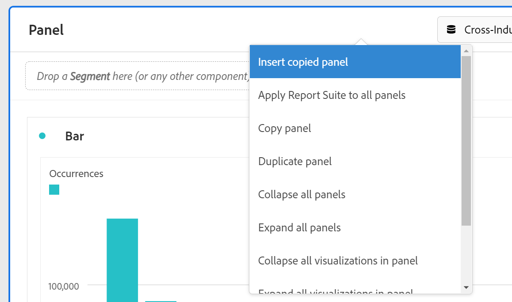

# Overzicht van deelvensters

A [!UICONTROL panel] is een verzameling tabellen en visualisaties. U kunt tot panelen van het top-linker pictogram in Workspace of a [ leeg paneel ](/help/analysis-workspace/c-panels/blank-panel.md) toegang hebben. Deelvensters zijn handig wanneer u uw projecten wilt ordenen op basis van tijdsperioden, gegevensweergaven of het geval waarin de analyse wordt gebruikt.

## Deelvenstertypen

De volgende deelvenstertypen zijn beschikbaar in Analysis Workspace voor [!UICONTROL Customer Journey Analytics] :

| Vensternaam | Beschrijving |
| --- | --- |
| [Leeg deelvenster](/help/analysis-workspace/c-panels/blank-panel.md) | Kies uit de beschikbare deelvensters en visualisaties om uw analyse te starten. |
| [ Attributie ](attribution.md) | Vergelijk en visualiseer snel om het even welk aantal attributiemodellen gebruikend om het even welke afmeting en omzettingsmetrisch. |
| [ Experimentatie ](experimentation.md) | Vergelijk verschillende gebruikerservaringen, marketing, of overseinenvariaties om te bepalen wat het best in het drijven van een specifiek resultaat is. |
| [ Vrije vorm ](freeform-panel.md) | Voer onbeperkte vergelijkingen en onderverdelingen uit, dan voeg visualisaties toe om een rijk gegevensverhaal te vertellen. |
| [ gemiddelde minieme publiek van Media ](average-minute-audience-panel.md) | Analyseer het gemiddelde minutenpubliek voor een specifiek stuk van inhoud, of over een aangepaste tijdspanne. |
| [ Medium gezamenlijke kijkers ](media-concurrent-viewers.md) | Analyseer gelijktijdige viewers in de loop van de tijd met details over de piekconsistentie en de mogelijkheid om af te breken en te vergelijken. |
| [ bestede tijd van de media playback ](/help/analysis-workspace/c-panels/media-playback-time-spent.md) | Analyseer de afspeeltijd die wordt doorgebracht om te begrijpen waar piekmomenten voorkomen of waar drop-outs optreden. |
| [ Volgende of vorig punt ](next-previous.md) | Toon de volgende of vorige pagina&#39;s waarnaar mensen gaan. |
| [ Snelle inzichten ](quickinsight.md) | Snel een vrije-vormlijst en een begeleidende visualisatie bouwen om inzichten sneller te analyseren en te ontdekken. |

Deelvensters [!UICONTROL Quick insights] , [!UICONTROL Blank] en [!UICONTROL Freeform] zijn ideale startpunten voor uw analyse, terwijl [!UICONTROL Attribution] zichzelf aan geavanceerdere analyses leent. A  is beschikbaar bij de bodem van uw canvas, zodat kunt u lege panelen op elk ogenblik toevoegen.

Het gebrek beginnende paneel is het [!UICONTROL Freeform] paneel, maar u kunt het [ Lege paneel ](/help/analysis-workspace/c-panels/blank-panel.md) of [ Snelle inzichten ](/help/analysis-workspace/c-panels/quickinsight.md) ook uw gebrek maken. Zie [ Projecten &amp; de voorkeur van de Analyse ](/help/analysis-workspace/user-preferences.md#projects--analyses-preferences).

## Een deelvenster maken

Een deelvenster maken:

* Sleep een deelvenster vanuit het linkerdeelvenster van **[!UICONTROL Panels]** naar het canvas.
* Selecteer een paneel van het [ Lege paneel ](blank-panel.md).
* Gebruik **[!UICONTROL Insert]** in Workspace en selecteer het deelvenster. Alternatief, kunt u om het even welke [ kortere weg ](../build-workspace-project/fa-shortcut-keys.md) gebruiken om een paneel op te nemen.

  

U kunt:

* Selecteer  **binnen** om het even welk paneel om een andere visualisatie toe te voegen. Er verschijnt een pop-up waarmee u een visualisatie kunt selecteren.

  

  | Selecteren... | Een... |
  |---|---|
  |  | [Vrije-vormentabel](/help/analysis-workspace/visualizations/freeform-table/freeform-table.md) |
  |  | [Lijn](/help/analysis-workspace/visualizations/line.md) |
  |  | [ Bar ](/help/analysis-workspace/visualizations/bar.md) |
  |  | [ Summiere aantal ](/help/analysis-workspace/visualizations/summary-number-change.md) |
  |  | [Tekst](/help/analysis-workspace/visualizations/text.md) |
  |  | [Uitval](/help/analysis-workspace/visualizations/fallout/fallout-flow.md) |
  |  | [Stroom](/help/analysis-workspace/visualizations/c-flow/flow.md) |
  |  | [ Gebied gestapeld ](/help/analysis-workspace/visualizations/area.md) |
  |  | [ Lijst van de Cohort ](/help/analysis-workspace/visualizations/cohort-table/t-cohort.md) |
  |  | [ Opsommingsteken ](/help/analysis-workspace/visualizations/bullet-graph.md) |
  |  | [Cirkeldiagram](/help/analysis-workspace/visualizations/donut.md) |
  |  | [ Summiere verandering ](/help/analysis-workspace/visualizations/summary-number-change.md) |
  |  | [Histogram](/help/analysis-workspace/visualizations/histogram.md) |
  |  | [ Spreiding ](/help/analysis-workspace/visualizations/scatterplot.md) |
  |  | [Venn](/help/analysis-workspace/visualizations/venn.md) |
  |  | [Boomstructuur](/help/analysis-workspace/visualizations/treemap.md) |

* Selecteer  **buiten** het laatste paneel in uw werkruimte om een ander [ Lege paneel ](blank-panel.md) toe te voegen.

## Gegevens, weergave

Elk paneel wordt geassocieerd met a [ gegevensmening ](/help/data-views/data-views.md), die door  wordt geïdentificeerd **[!UICONTROL *naam van gegevensmening *]**in het drop-down menu bij het hoogste recht van het paneel.

Wanneer u een Leeg Workspace-project maakt, is de standaardgegevensweergave voor het eerste deelvenster de gegevensweergave waarmee u het laatst in Customer Journey Analytics hebt gewerkt.

Wanneer u een nieuw deelvenster maakt, is de standaardgegevensweergave gebaseerd op de gegevensweergave van het deelvenster waarmee u het laatst hebt gewerkt in het Workspace-project.

>[!IMPORTANT]
>
>De geselecteerde gegevensweergave bepaalt welke afmetingen, maateenheden en filters beschikbaar zijn voor het maken van visualisaties in een deelvenster.
>
>
>Wanneer u een gegevensweergave schakelt voor een deelvenster, zijn sommige componenten mogelijk niet beschikbaar in die nieuwe gegevensweergave. Deze wijziging kan ertoe leiden dat uw visualisatie niet correct wordt weergegeven. U ziet mogelijk waarschuwingen zoals:
>
>* Dit deelvenster bevat componenten die niet zijn ingeschakeld in de geselecteerde gegevensweergave. Wijzig de gegevensweergave of schakel de vereiste componenten in de gegevensweergave in.
>* Kan visualisatie niet renderen: controleer de kolommen en rijen om te controleren of deze geldige componenten bevatten.
>

## Kalender

De paneelkalender bepaalt de rapportdatumwaaier voor lijsten en visualisaties binnen een paneel.

>[!NOTE]
>
>Als de waaier van de a  component van de Datum binnen een visualisatie of een paneel (bijvoorbeeld, als filter) wordt gebruikt, treedt de component van de datumwaaier de paneelkalender met voeten.
>

1. Selecteer een datumbereik door eerst de begindatum en vervolgens de einddatum te selecteren.
Alternatief, kunt u a **[!UICONTROL Preset]** van [!UICONTROL *selecteren selecteert vooraf ingesteld*] dropdown menu.

1. Selecteer indien nodig **[!UICONTROL Show advanced settings]** tot en met:

   * Geef **[!UICONTROL Start time]** en **[!UICONTROL End time]** anders op dan de standaardinstellingen `12:00 AM` (`0:00`) en `11:59 PM` (`23:59`). Eindtijden omvatten altijd 59 seconden. Voor een datumbereik dat vele dagen omvat, geldt de begintijd voor de eerste dag van het datumbereik en de eindtijd voor de laatste dag in het datumbereik. Met **[!UICONTROL (Reset time values)]** kunt u de standaardinstellingen van de begin- en eindtijd herstellen.
   * **[!UICONTROL Make date range components relative to panel calendar]**. Als deze optie is uitgeschakeld, zijn de componenten voor het datumbereik die in het deelvenster worden gebruikt relatief ten opzichte van de huidige tijd. Als deze optie is ingeschakeld, zijn de componenten voor het datumbereik die in het deelvenster worden gebruikt, relatief ten opzichte van de agenda van het deelvenster.
   * **[!UICONTROL Use rolling dates]**. Indien ingeschakeld, worden vooraf ingestelde datumbereiken zoals **[!UICONTROL Last 7 full days]** dynamisch bijgewerkt als huidige datum- en tijdvoortgang. Als deze optie is uitgeschakeld, worden deze voorinstellingen niet bijgewerkt nadat ze zijn toegepast.

     

     U kunt de tekst tussen haakjes selecteren (bijvoorbeeld **[!UICONTROL fixed start - rolling daily]** ) om het deelvenster uit te breiden en details voor **[!UICONTROL Start]** en **[!UICONTROL End]** op te geven.

      1. Selecteer **[!UICONTROL Start of]**, **[!UICONTROL End of]** of **[!UICONTROL Fixed day]** .
      1. Wanneer u **[!UICONTROL Start of]** of **[!UICONTROL End of]** hebt geselecteerd, kunt u een volledige expressie maken. Bijvoorbeeld: **[!UICONTROL End of]** **[!UICONTROL current year]** **[!UICONTROL plus]** `1` **[!UICONTROL day]** . Kies de juiste waarde voor elk afzonderlijk deel van de expressie.
         * Selecteer een waarde voor de huidige. Bijvoorbeeld **[!UICONTROL current year]** .
         * Selecteer een waarde voor extra berekening. Bijvoorbeeld **[!UICONTROL plus]** .
         * Geef een waarde op wanneer u een aanvullende berekening hebt opgegeven. Bijvoorbeeld `1` .
         * Wanneer u aanvullende berekening hebt opgegeven, selecteert u de periode die u voor de berekening wilt gebruiken. Bijvoorbeeld **[!UICONTROL day]** .

     Selecteer **[!UICONTROL Hide details]** om de details voor het rollen datumberekening te verbergen.

1. Selecteer **[!UICONTROL Apply]** om het datumbereik toe te passen op het deelvenster van waaruit u de kalender hebt aangeroepen.
Selecteer **[!UICONTROL Apply to all panels]** om het datumbereik toe te passen op alle deelvensters in het Workspace-project.

## Valzone {#dropzone}

Met de dropzone van het deelvenster kunt u filters en vervolgkeuzefilters toepassen op alle tabellen en visualisaties in een deelvenster. U kunt een of meerdere filters toepassen op een deelvenster.

### Filters

Sleep filters uit het linkerdeelvenster naar de dropzone van het deelvenster om het deelvenster te filteren. Herhaal dit proces om extra filters aan het paneel toe te voegen. Filters worden naast elkaar boven in het deelvenster weergegeven.

#### Snelle filters

De niet-filtercomponenten kunnen ook rechtstreeks in de dalingsstreek worden gesleept om snelle filters tot stand te brengen, die u de tijd en de inspanning sparen om naar de [ bouwer van de Filter ](/help/components/filters/filter-builder.md) te gaan. Filters die op deze manier worden gemaakt, worden automatisch gedefinieerd als filters op gebeurtenisniveau. Deze definitie kan snel worden gewijzigd door  naast de filternaam uit.

Voor meer informatie, zie [ Snelle filters ](/help/components/filters/quick-filters.md).

### Vervolgkeuzefilters

+++ Bekijk een video waarin dropdown-filters worden uitgelegd.

>[!VIDEO](https://video.tv.adobe.com/v/23877?quality=12&learn=on)

{{videoaa}}

+++

#### Statische vervolgkeuzefilters

Met statische vervolgkeuzefilters kunt u op een gecontroleerde manier met de gegevens werken. U kunt bijvoorbeeld een vervolgkeuzefilter toevoegen voor mobiele apparaattypen, zodat u het deelvenster kunt filteren op Tablet, Mobiele telefoon of Computer.

De statische drop-down filters kunnen ook worden gebruikt om vele projecten in te consolideren. Als er bijvoorbeeld veel versies van hetzelfde project met verschillende landfilters zijn toegepast, kunt u alle versies samenvoegen tot één project en een vervolgkeuzelijst Land toevoegen.

##### Statische vervolgkeuzefilters maken

* Voor drop-down filters die afmetingspunten gebruiken, selecteer één enkele afmeting van het linkerpaneel en laat vallen de afmeting in de gebied van de paneeldaling terwijl het houden van ⇧ (*verschuiving*). Deze actie leidt tot een drop-down filter met alle afmetingspunten die met die afmeting worden geassocieerd.

  Of als u wilt dat het vervolgkeuzefilter alleen bepaalde dimensies bevat die aan een dimensie zijn gekoppeld, selecteert u het pictogram met de pijl-rechts naast de gewenste dimensie in het linkerdeelvenster. Deze actie stelt alle beschikbare afmetingspunten bloot. Selecteer veelvoudige afmetingspunten van deze lijst gebruikend ⇧+  (*verschuiving* + *uitgezocht*) of ^+  (*controle* + *uitgezocht*), dan laat vallen hen in de gebied van de paneeldaling **terwijl het houden van** ⇧.

* Voor drop-down filters die één enkel componenttype gebruiken (bijvoorbeeld, slechts dimensies, of slechts filters, of slechts metriek), selecteer veelvoudige punten van het zelfde type in het linkerpaneel gebruikend ⇧+  of ^+ . Dan laat vallen de punten in het paneel dalingsstreek **terwijl het houden van** ⇧.

  Er wordt één vervolgkeuzemenu gemaakt met de componenten die u hebt geselecteerd.

* Voor drop-down filters die een mengeling van componententypes (zoals 2 metriek en 3 filters) gebruiken, selecteer veelvoudige componenten gebruikend ⇧+  of ^+ . Daling de selectie in het paneel drop zone **terwijl het houden van** ⇧. In dit verband worden alle componenttypen behandeld als afzonderlijke vervolgkeuzefilters. Als u bijvoorbeeld zowel metriek- als dimensie-items in uw selectie opneemt, worden twee aparte vervolgkeuzefilters gemaakt: een vervolgkeuzelijst bevat dimensie-items en het andere filter bevat metriek.

Een vervolgkeuzemenu bevat de volgende opties voor contextmenu&#39;s:

* **[!UICONTROL Delete drop-down]** : hiermee verwijdert u het vervolgkeuzefilter uit het deelvenster.
* **[!UICONTROL Delete label]**: verwijder de tekst die boven een vervolgkeuzefilter wordt weergegeven. Om het etiket te wijzigen, over het etiket te bewegen en  uit.
* **[!UICONTROL Add label]**: Wanneer u een vervolgkeuzefilter toevoegt aan een project, wordt automatisch een label ingesteld op de naam van de component. Als u het label verwijdert, kunt u het opnieuw toevoegen met deze optie.
* **[!UICONTROL Require selection]** - Er moet een filter op het deelvenster worden ingesteld.

##### Statische vervolgkeuzefilters gebruiken

Gebruikers kunnen het menu met vervolgkeuzelijsten op de volgende manieren gebruiken om het deelvenster te filteren:

* Pas één filter op het paneel toe door het filter van de drop-down filter te selecteren.

* Pas meerdere filters toe op het deelvenster door meer dan één filter te selecteren in de vervolgkeuzelijst. Het deelvenster wordt gefilterd met geselecteerde filters.

#### Dynamische vervolgkeuzefilters

Met dynamische vervolgkeuzefilters kunt u beschikbare waarden bepalen op basis van gegevens binnen het rapportagebereik van het deelvenster en waarden in andere vervolgkeuzefilters. U kunt bijvoorbeeld twee dynamische vervolgkeuzelijsten maken met de dimensie Landen en de dimensie Steden. Wanneer u een land in de vervolgkeuzelijst **[!UICONTROL Countries]** selecteert, wordt de vervolgkeuzelijst **[!UICONTROL Cities]** dynamisch aangepast, zodat alleen de steden in dat land worden weergegeven.

Dit concept is van toepassing op alle dimensies. Alleen dimensie-items die binnen het datumbereik van het deelvenster verschijnen en geselecteerde filters zijn zichtbaar. Items die in statische vervolgkeuzefilters zijn geselecteerd, beïnvloeden de beschikbare waarden in dynamische vervolgkeuzefilters. Het omgekeerde is echter niet waar. Dimension-items die zijn geselecteerd in dynamische vervolgkeuzefilters hebben geen invloed op de beschikbare waarden in statische vervolgkeuzefilters.

Handmatige selectie van dimensie-items is beschikbaar als u verwacht dat een bepaald dimensie-item in de toekomst wordt verzameld. U kunt ook een dynamisch vervolgkeuzefilter wissen, zodat het geen waarde bevat, zodat andere dynamische vervolgkeuzefilters meer waarden kunnen bevatten. Selecteer **[!UICONTROL Reset all]** om de selectie uit alle vervolgkeuzefilters voor dat deelvenster te verwijderen.

Een dynamisch vervolgkeuzemenu maken:

* De belemmering en laat vallen één enkele afmeting in de sectie van de paneeldaling **terwijl het houden van** ⇧.

De dynamische drop-down filters zijn niet beschikbaar voor metriek, filters, of datumwaaiers.

Een dynamisch vervolgkeuzemenu biedt dezelfde opties voor contextmenu&#39;s als statische vervolgkeuzefilters.

## Contextmenu

Extra functionaliteit voor een deelvenster is beschikbaar via een contextmenu (klik met de rechtermuisknop) in de koptekst van het deelvenster.

De volgende opties zijn beschikbaar:

| Optie | Beschrijving |
| --- | --- |
| **[!UICONTROL Insert copied panel]** | Hiermee kunt u een gekopieerd deelvenster op een andere plaats in het project of in een ander project plakken. |
| **[!UICONTROL Insert copied visualization]** | Plak een gekopieerde visualisatie naar een andere locatie in het deelvenster, het project of in een ander project. |
| **[!UICONTROL Apply Data view to all panels]** | Pas de gegevensweergave voor dit deelvenster toe op alle andere deelvensters in het project. |
| **[!UICONTROL Copy panel]** | Kopieer een deelvenster, zodat u het kunt invoegen op een andere locatie in het project of in een ander project. |
| **[!UICONTROL Duplicate panel]** | Hiermee maakt u een exacte kopie van het huidige deelvenster, dat u vervolgens kunt wijzigen. |
| **[!UICONTROL Collapse all panels]** | Vouw alle projectdeelvensters samen. |
| **[!UICONTROL Expand all panels]** | Vouw alle projectdeelvensters uit. |
| **[!UICONTROL Collapse all visualizations in panel]** | Vouw alle visualisaties in het huidige deelvenster samen. |
| **[!UICONTROL Expand all visualizations in panel]** | Vouw alle visualisaties in het huidige deelvenster uit. |
| **[!UICONTROL Edit Description]** | Voeg (of bewerk) een tekstbeschrijving voor het paneel toe. |
| **[!UICONTROL Get Panel Link]** | Stuur iemand naar een specifiek deelvenster in een project. Wanneer de koppeling is geselecteerd, moet de ontvanger zich aanmelden voordat deze wordt omgeleid naar het exacte deelvenster waarnaar deze is gekoppeld. |

## Configuratie

Sommige deelvensters (zoals [!UICONTROL Attribution] , [!UICONTROL Experimentation] , [!UICONTROL Media average minute audience] en andere) hebben een configuratiedialoogvenster dat u helpt bij het maken van de visualisatie. Het gebruik  bij de bovenkant van het paneel uit om tot de configuratie toegang te hebben en te veranderen.

