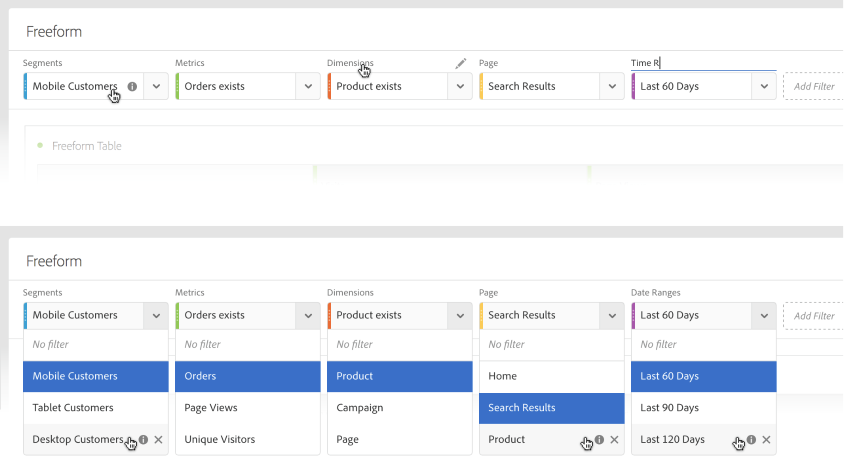
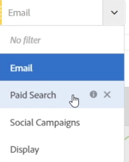

# Overzicht van deelvensters

>[!NOTE]
>
>U bekijkt de documentatie voor de Werkruimte van de Analyse in de Analyse van de Reis van de Klant. Zijn eigenschapreeks verschilt lichtjes van [De Werkruimte van de analyse in de traditionele Analyse van Adobe](https://docs.adobe.com/content/help/en/analytics/analyze/analysis-workspace/home.html). [Meer informatie...](/help/getting-started/cja-aa.md)

Een paneel is een inzameling van lijsten &amp; visualisaties. U kunt tot panelen van het hoogste linkerpictogram in Werkruimte toegang hebben. De Comités zijn nuttig wanneer u uw projecten volgens tijdsperioden, bedrijfseenheden, aardrijkskunde, enz. wilt organiseren. Deze vier soorten panelen zijn beschikbaar in de Werkruimte van de Analyse voor de Analyse van de Reis van de Klant:

* [Leeg deelvenster](blank-panel.md)
* [deelvenster Snelle inzichten](quickinsight.md)
* [Deelvenster voor attributie](attribution.md)
* [Deelvenster Vrije vorm](freeform-panel.md)

De snelle Inzichten, de Leeg en de panelen van de Freeform zijn grote plaatsen om uw analyse te beginnen, terwijl het paneel van IQ van de Attributie zich aan geavanceerdere analyses leent. A `"+"` de knoop is beschikbaar in projecten zodat kunt u lege panelen op elk ogenblik toevoegen.

Het standaardbeginnende paneel is het paneel Freeform, maar u kunt het [leeg paneel](/help/analysis-workspace/c-panels/blank-panel.md) ook uw standaard.

## Drop-down filters in panelen

De streek van de paneeldaling heeft drop-down het filtreren mogelijkheden. Deze filters laten u met de projectgegevens op een gecontroleerde manier in wisselwerking staan zodat u diepte-duik analyse kunt doen, uw projecten, en/of inzicht met anderen kunt vereenvoudigen delen.

Hier is een voorbeeld van een vereenvoudigd project: Veronderstel u verscheidene versies van een project/een paneel hebt om land-specifieke rapportering te verstrekken. U kunt die projecten/panelen in één enkel paneel nu doen ineenstorten, en in een landdrop-down in plaats daarvan toevoegen aan filter tussen verschillende gegevensreeksen.

Houd dit in gedachten:

* U kunt in veelvoudige componenten (of afmetingspunten) vallen, en dan tussen hen in een dropdown schakelen om de paneelinhoud te filtreren.
* U kunt veelvoudige drop-down lijsten op het zelfde paneel ook tot stand brengen.
* U kunt de titel van de drop-down lijst aanpassen door de titel te klikken en het te wijzigen, of de titel helemaal te verwijderen door de x naast het te klikken.
* U kunt drop-down filters tot stand brengen gebruikend om het even welk componententype: afmetingen, datumwaaiers, segmenten, en metriek. Merk op dat de drop-down datumwaaiers altijd de waaiers van de paneeldatum zullen met voeten treden.
* Wij handhaven de componentenkleuren van de linkerspoorstaaf: geel voor de dropdowns van het afmetingspunt, groen voor metriek, blauw voor segmenten, en paars voor datumwaaiers.
* De dropzone zal nog klap-vlakke segmenten voor punten creëren die binnen als segmenten worden gesleept. U kunt deze zoals gebruikelijk wijzigen door op het informatiepictogram (i) naast het segment te klikken, dan geeft het potlood-vormige pictogram uit en geeft het in de Bouwer van het Segment uit.

**Om drop-down filters tot stand te brengen en te gebruiken:**

1. Selecteer om het even welke punten van de linkerspoorstaaf en, **terwijl de sleutel wordt ingedrukt**, laat vallen hen in de gebied van de paneeldaling.

   

   Dit zal de componenten in een drop-down lijst, eerder dan in een segment veranderen. (U kunt segmenten ook nog toevoegen door de sleutel niet te onderdrukken.)

   

1. Selecteer één van de opties van dropdown om de gegevens in het hieronder paneel te veranderen. (U kunt ook verkiezen om het even welke paneelgegevens niet te filtreren door te selecteren **[!UICONTROL No filter]**.)
1. Bijvoorbeeld, als u ook de gegevens door marketing kanaal wilde snijden, kon u een andere dropdown toevoegen genoemd &quot;het Kanaal van de Marketing&quot;:

   

