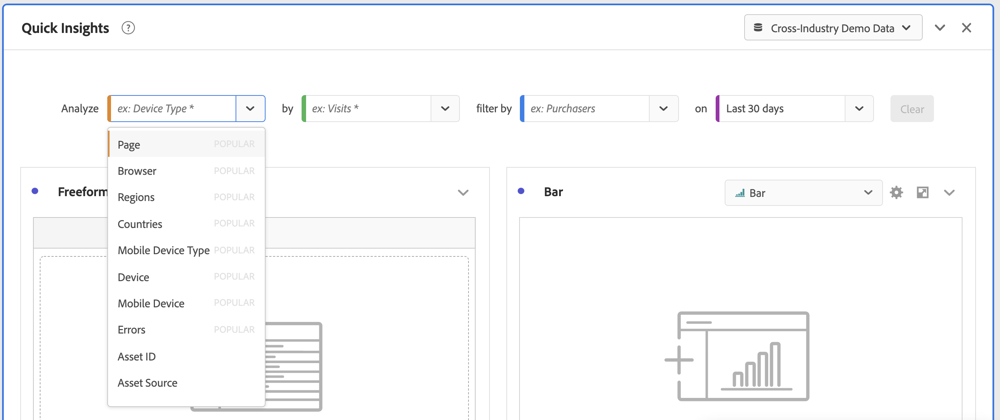

# Deelvenster Snelle inzichten

[!UICONTROL Quick Insights] biedt richtlijnen voor niet-analisten en nieuwe gebruikers van [!UICONTROL Analysis Workspace] over hoe ze zakelijke kwesties snel en eenvoudig kunnen beantwoorden. Het is ook een geweldig hulpmiddel voor geavanceerde gebruikers die snel een eenvoudige vraag willen beantwoorden zonder zelf een tabel te hoeven maken.

Wanneer u deze voor het eerst gebruikt [!UICONTROL Analysis Workspace]Misschien vraagt u zich af welke visualisaties het nuttigst zijn, welke dimensies en metriek inzichten kunnen vergemakkelijken, waar items moeten worden gesleept en neergezet, waar een filter moet worden gemaakt, enzovoort.

Om dit te helpen en op basis van het gebruik van gegevenscomponenten door uw eigen bedrijf in [!UICONTROL Analysis Workspace], [!UICONTROL Quick Insights] Gebruikt een algoritme dat u met de populairste afmetingen, metriek, filters, en datumwaaiers zal voorstellen uw bedrijf gebruikt. In feite ziet u afmetingen, metriek en filters die zijn gecodeerd als [!UICONTROL Popular] in de vervolgkeuzelijst, zoals u hier ziet:

[!UICONTROL Quick Insights] helpt u

* Een gegevenstabel en een bijbehorende visualisatie op de juiste wijze samenstellen in [!UICONTROL Analysis Workspace].
* Leer de terminologie en woordenschat voor basiscomponenten en stukken [!UICONTROL Analysis Workspace].
* Voer eenvoudige dimensies uit, voeg meerdere metriek toe of vergelijk filters eenvoudig binnen een [!UICONTROL Freeform table].
* U kunt verschillende visualisatietypen wijzigen of uitproberen om snel en intuïtief het zoekgereedschap voor uw analyse te vinden.

## Basistoets

Hier volgen enkele basistermen die u bekend moet maken. Elke gegevenslijst bestaat uit 2 of meer bouwstenen (componenten) die u gebruikt om uw gegevensverhaal te vertellen.

| Bouwsteen (component) | Definitie |
|---|---|
| [!UICONTROL Dimension] | Dimensionen zijn beschrijvingen of kenmerken van metrische gegevens die kunnen worden bekeken, opgesplitst en vergeleken in een project. Het zijn niet-numerieke waarden en datums die worden opgesplitst in dimensie-items. Bijvoorbeeld &#39;browser&#39; of &#39;pagina&#39; zijn afmetingen. |
| [!UICONTROL Dimension item] | Items van een Dimension zijn afzonderlijke waarden voor een dimensie. Dimensie-items voor de afmetingen van de browser zijn bijvoorbeeld &quot;Chrome&quot;, &quot;Firefox&quot;, &quot;Edge&quot;, enzovoort. |
| [!UICONTROL Metric] | De metriek zijn kwantitatieve informatie over persoonactiviteit, zoals meningen, klik-door, herladingen, gemiddelde tijd besteed, eenheden, orden, opbrengst, etc. |
| [!UICONTROL Visualization] | Werkruimte biedt [een aantal visualisaties](/help/analysis-workspace/visualizations/freeform-analysis-visualizations.md) om visuele weergaven van uw gegevens te maken, zoals staafdiagrammen, donutgrafieken, histogrammen, lijngrafieken, kaarten, scatterpercelen en andere. |
| [!UICONTROL Dimension Breakdown] | Een afbraak van dimensies is een manier om een dimensie letterlijk op andere dimensies in te delen. In ons voorbeeld kunt u de VS-staten opsplitsen op mobiele apparaten om de bezoeken aan mobiele apparaten per status op te halen, of u kunt mobiele apparaten opsplitsen op typen mobiele apparaten, op regio&#39;s, op interne campagnes, enz. |
| [!UICONTROL filter] | Met filters kunt u subsets van personen identificeren op basis van eigenschappen of interacties op de website. U kunt bijvoorbeeld [!UICONTROL Visitor] op kenmerken gebaseerde filters: browsertype, apparaat, aantal bezoeken, land, geslacht of op basis van interacties: campagnes, trefwoordzoekfunctie, zoekmachine of op basis van uitgangen en ingangen: personen uit Facebook, een gedefinieerde landingspagina, een verwijzingsdomein of op basis van aangepaste variabelen: formulierveld, gedefinieerde categorieën, klant-id. |

## Aan de slag met Quick Insights

1. Meld u aan bij de Customer Journey Analytics met de gegevens die u hebt ontvangen.
1. Ga naar [!UICONTROL Workspace] en klik op **[!UICONTROL Create New Project]** en klik vervolgens op **[!UICONTROL Quick Insights]**. (U kunt dit deelvenster ook openen via het dialoogvenster **[!UICONTROL Panel]** in de linkerspoorstaaf.)

   

   

1. Wanneer u voor het eerst begint, doorloopt u de korte zelfstudie die u een aantal van de [!UICONTROL Quick Insights panel] basisbeginselen. Of klik op **[!UICONTROL Skip Tutorial]**.
1. Selecteer uw bouwstenen (ook wel componenten genoemd): afmetingen (oranje), metriek (groen), filters (blauw), of datumwaaiers (paars) u moet minstens één afmeting en één metrisch voor een lijst selecteren die automatisch moet worden gebouwd.

   

   U kunt de bouwstenen op drie manieren selecteren:
   * Sleep en zet ze neer vanaf de linkerspoorstaaf.
   * Als u weet wat u zoekt: begin te typen en [!UICONTROL Quick Insights] vult de spaties in.
   * Klik op de vervolgkeuzelijst en zoek in de lijst.

1. Wanneer u minstens één afmeting en één metrisch hebt toegevoegd, zal het volgende voor u worden gecreeerd:

   * Een tabel met vrije vorm met de afmetingen (hier, Amerikaanse staten) verticaal en de metrische waarde (hier, Visit) horizontaal boven. Bekijk deze tabel:

   

   * Een begeleidende visualisatie, in dit geval een [staafdiagram](/help/analysis-workspace/visualizations/bar.md). De gegenereerde visualisatie is gebaseerd op het type gegevens dat u aan de tabel hebt toegevoegd. Op tijd gebaseerde gegevens (zoals [!UICONTROL Visits] per dag/maand) standaardinstellingen [!UICONTROL Line] grafiek. Alle gegevens die niet op tijd zijn gebaseerd (zoals [!UICONTROL Visits] per [!UICONTROL Device]) is standaard ingesteld op een [!UICONTROL Bar] grafiek. U kunt het type visualisatie wijzigen door op de vervolgkeuzepijl naast het visualisatietype te klikken.

1. (Optioneel) Klik op de pijl-rechts naast de dimensie om de afmetingen weer te geven en de dimensie weer te geven.

1. Voeg meer verfijningen toe zoals hieronder beschreven onder &quot;Meer tips.&quot;

1. Uw project opslaan door op **[!UICONTROL Project > Save]**.

## Meer tips

Andere handige tips worden weergegeven in het dialoogvenster [!UICONTROL Quick Insights Builder], sommige afhankelijk van uw laatste handeling.

* Voer eerst de **[!UICONTROL More tips]** zelfstudie: Toegang tot dit bestand via de Help (?) pictogram naast [!UICONTROL Quick Insights] titel. Dit leerprogramma toont omhoog 24 uren nadat u een project met minstens één afmeting en één metrisch hebt gecreeerd.

  

* **Uitsplitsing naar**: U kunt maximaal 3 niveaus van onderverdelingen op dimensies gebruiken om tot de gegevens te boren u echt nodig hebt.

  

* **Meer metriek toevoegen**: U kunt maximaal twee metriek toevoegen door de operator AND te gebruiken om ze aan de tabel toe te voegen.

  

* **Meer filters toevoegen**: U kunt maximaal twee filters toevoegen door de operatoren AND of OR te gebruiken om de tabel toe te voegen. Kijk wat er met de tabel gebeurt wanneer u mobiele gebruikers OF koninklijke bezoekers toevoegt. Ze zijn naast elkaar, boven de metriek. Als u Mobiele Gebruikers EN Weergavebezoekers toevoegt, ziet u de resultaten van beide filters bij elkaar en worden deze op elkaar gestapeld in de tabel.

  

## Bekende beperkingen

Als u rechtstreeks in de tabel probeert te bewerken, wordt de opdracht [!UICONTROL Quick Insights] niet meer gesynchroniseerd. U kunt de vorige versie herstellen [!UICONTROL Quick Insights] instellingen door te klikken **[!UICONTROL Resync Builder]** rechtsboven in het deelvenster.

Er verschijnt een waarschuwing voordat u iets rechtstreeks aan de tabel toevoegt:

Anders, zal het bouwen direct de lijst ertoe brengen om zich nu als traditionele lijst van de Vrije vorm te gedragen, zonder de nuttige eigenschappen voor nieuwe gebruikers.
