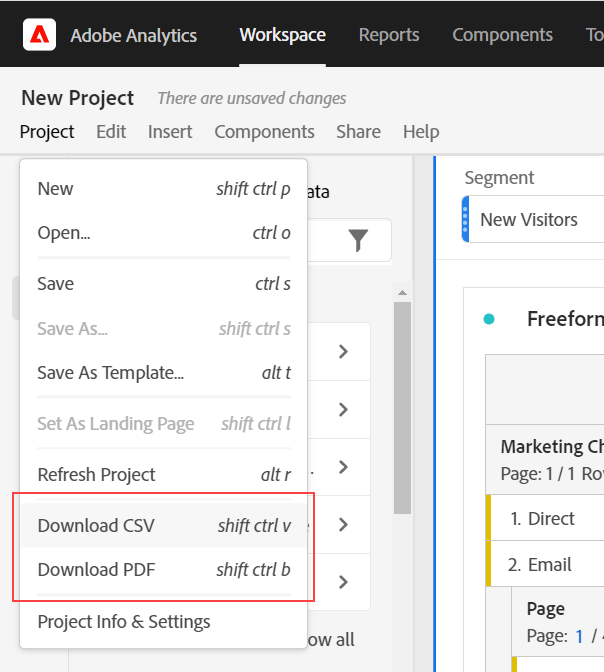

# PDF- of CSV-bestanden downloaden vanuit werkruimte

Er zijn verscheidene verschillende manieren u gegevens van de Werkruimte van de Analyse kunt uitvoeren, afhankelijk van welke reeks gegevens u buiten het hulpmiddel wilt analyseren en wie de informatie moet ontvangen. De uitgevoerde gegevens kunnen in de vorm van gekopieerde gegevens, CSV of Pdf- dossiers zijn. Een PDF wordt typisch aangewezen als u visualisaties inbegrepen in het dossier wilt, terwijl een CSV (of gekopieerde gegevens) de voorkeur hebben als u eenvoudig gewone-tekstgegevens wilt.

>[!IMPORTANT]
>
> Sommige opties waarnaar op deze pagina wordt verwezen, zoals **Objecten als CSV downloaden**, zijn momenteel beperkt getest. [Meer informatie](https://docs.adobe.com/content/help/nl-NL/analytics/landing/an-releases.html)

## Project downloaden als CSV of PDF {#download-project}

U kunt een volledig project downloaden door naar **[!UICONTROL Project > Download as PDF (or as CSV)]**. Het gedownloade dossier bevat alle getoonde (zichtbare) lijsten en visualisaties in het project. Een PDF wordt typisch de voorkeur gegeven als u visualisaties inbegrepen in het dossier wilt, terwijl een CSV de voorkeur heeft als u eenvoudig vlakke-tekstgegevens wilt.

Voor projectdownloads, houd in mening:

* Het project kan worden bewaard of unsaved wanneer u om een projectdownload verzoekt. Nochtans, slechts kunnen de bewaarde projecten zijn [gepland](https://docs.adobe.com/content/help/en/analytics/analyze/analysis-workspace/curate-share/t-schedule-report.html).
* PDFs die in browser wordt gedownload kan verscheidene notulen nemen om uit te voeren omdat het project op de servers van Adobe alvorens in formaat terug te geven PDF opnieuw in werking wordt gesteld. Wij adviseren niet het verlaten van het project tot PDF in uw browser downloadt. Nochtans, kunt u blijven veranderingen in het project aanbrengen terwijl u wacht. Als een PDF langer duurt dan 5 minuten om terug te geven, wordt u gevraagd het in plaats daarvan te emailen.
* PDF-downloads worden weergegeven als één pagina zonder paginering.
* Wanneer een project aan PDF wordt teruggegeven, geven wij wat op de pagina is. Als een project douane-gerangschikte visualisaties en panelen heeft, moet u hen veranderen om auto-gerangschikt (knoop in hoogste juiste hoek) te zijn zodat er geen beknot inhoud zal zijn.

## Gegevens kopiëren naar klembord (hotkey: Ctrl+C) {#copy-data}

De optie met de rechtermuisknop aanklikken **[!UICONTROL Copy to clipboard]** laat u snel gegevens van Werkruimte kopiëren en het elders kleven.

* Als u de getoonde gekopieerde lijst wilt, klik op de lijstkopbal met de rechtermuisknop aan en kies **Weergegeven gegevens kopiëren naar klembord**.
* Als u een ondergroep van gekopieerde gegevens wilt, maak een selectie in de lijst en klik dan met de rechtermuisknop > **Selectie kopiëren naar klembord**.

Bovendien, hotkey `Ctrl+C` kopieert uw selectie aan het klembord. Zodra gekopieerd, kunt u in een ander hulpmiddel gaan en de informatie kleven (of raken `Ctrl+V`).

## Gegevens downloaden als CSV {#download-data}

De optie met de rechtermuisknop aanklikken **[!UICONTROL Download data as CSV]** staat u toe om een lijst van gegevens of de gegevensbron van om het even welke visualisatie als CSV te downloaden.

* Van de kopbal van om het even welke lijst, klik met de rechtermuisknop aan **[!UICONTROL Download displayed data as CSV]**. Dit downloadt de getoonde gegevens in de lijst als CSV.
* Als een selectie in de lijst wordt gemaakt, zal de optie zeggen **[!UICONTROL Download selection as CSV]**. Slechts wordt de selectie gedownload met deze optie, in tegenstelling tot de volledige, getoonde lijst.
* Van de kopbal van om het even welke visualisatie, klik met de rechtermuisknop aan **[!UICONTROL Download data as CSV]**. Dit downloadt de gegevensbronlijst voor een visualisatie als CSV. Opmerking: de visualisatie van de Kaart steunt deze optie niet.

## Objecten als CSV downloaden {#download-items}

Als u meer dan de zichtbare 400 rijen van gegevens in een lijst wilt analyseren, klik de lijstkopbal of om het even welke rij met de rechtermuisknop aan en selecteer **Download items als CSV (Dimension-naam)**. Deze optie zal tot 50.000 afmetingspunten voor de geselecteerde afmeting (die op de lijstsoort wordt gebaseerd), met toegepaste filters en segmenten uitvoeren. Als u deze optie van de bovenkant van de lijst koos, zal de eerste afmeting in de lijst worden uitgevoerd. Terwijl geen grenzen in de freeform lijst worden afgedwongen, adviseert men dat de de puntenoptie van de Download in lijsten met minder dan 20 kolommen wordt gebruikt om optimale prestaties te verzekeren.

>[!TIP]
>
> Als uw afmeting 50.000 punten overschrijdt, download het dossier met verschillende toegepaste soortmetriek of pas een filter toe. Bijvoorbeeld, soort die door Bezoeken in één download daalt en dan oplopend door Bezoeken in een tweede download. Deze tip kan u helpen langere-staart punten terugwinnen.

U kunt multi-task binnen het project en zelfs aan een nieuw project van de Werkruimte in het zelfde lusje navigeren terwijl de download lopend is. De download zal pauzeren als u een nieuwe browser tabel opent. De download zal annuleren als u Werkruimte volledig verlaat of browser tabel sluit.

### Bestand met gedownloade items

De eigenschappen van de lijst zullen op het gedownloade dossier als volgt worden toegepast:

* Alle paneelsegmenten worden toegepast als filters.
* Uitsplitsingen **boven** de geselecteerde dimensie in de tabel wordt toegepast als filters boven elke kolom.
* Uitsplitsingen **hieronder** de geselecteerde dimensie in de lijst wordt verwijderd.

In het voorbeeld hierboven, worden de punten van de Pagina gedownload met het paneelsegment (de Nieuwe Klanten van Bezoekers) en de componenten hierboven (het Kanaal van de Marketing = E-mail) worden toegepast als filters, en de hieronder componenten (het Mobiele Type van Apparaat) worden verwijderd uit gedownloade CSV.

### Berichten downloaden

Aangezien het dossier downloadt, zult u een informatiebericht met de vooruitgang zien. U kunt de download op elk gewenst moment annuleren door op **[!UICONTROL Cancel download]**. Het sluiten van de toast **zal** annuleer de download.

Nadat het bestand is voltooid, ziet u een voltooiingsbericht en het bestand wordt naar uw browser gedownload.

Als u meer dan één download tegelijkertijd aanvraagt, ontvangt u een bericht dat elke extra download een rij zal worden gevormd tot de vroegere download voltooit.

## Veelgestelde vragen {#faq}

| Vraag | Antwoord |
| --- | --- |
| Waarom is mijn gedownloade PDF één pagina? | De werkruimte pagineert momenteel geen gedownloade PDFs. |
| Kan ik meer dan 50.000 items exporteren met de optie &quot;Objecten downloaden als CSV&quot;? | Terwijl elke download tot 50.000 afmetingspunten kan bevatten, kunt u de soort van uw lijst veranderen om langere staartpunten terug te winnen, of een filter toe te passen om specifiekere punten te downloaden. |
| Wat doet **[!UICONTROL Copy visualization]** doen? | **[!UICONTROL Copy visualization]** is geen exportoptie. Het staat u toe om een visualisatie of een paneel van één plaats in Werkruimte aan een andere te kopiëren. Bijvoorbeeld, van één paneel aan een andere in het zelfde project, of van één project aan een ander project. [Bekijk de video](https://www.youtube.com/watch?v=lvmAdKNfWQw) |

