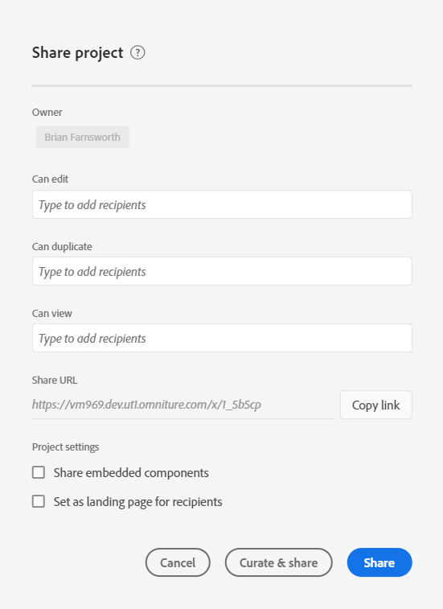

# Werkruimteprojecten delen

Het delen stelt een project ter beschikking van andere gebruikers van de Werkruimte van de Analyse in uw organisatie. Alle [kromming](curate.md) u hebt toegepast wordt weerspiegeld wanneer de ontvangers het project openen.

## Projectrollen {#Roles}

U kunt ontvangers aan één van drie projectrollen toevoegen. De rollen van het project zijn gebonden aan de gebruiker en specifieke projectidentiteitskaart De rollen van het project zijn onafhankelijk van gebruikerstoestemmingen die in worden beheerd [Adobe Experience Cloud Admin-console](https://docs.adobe.com/content/help/nl-NL/core-services/interface/manage-users-and-products/admin-getting-started.html).

| Rol | Projectcontrole |
|---|---|
| Kan bewerken | Ontvangers kunnen **[!UICONTROL Save]** veranderingen in een project en functie als mede-eigenaars. Deze rol is nuttig als u een project met andere collega&#39;s wilt mede beheren; dit omvat het uitgeven, het schrappen, en het wijzigen van ontvankelijke lijsten voor een gedeeld project.  Opmerking: De Werkruimte van de analyse steunt momenteel geen levende samenwerking, zodat adviseert men dat slechts één gebruiker een project in een bepaalde tijd uitgeeft. Als de projecten tezelfdertijd worden bewaard, zal de laatste versie worden gehouden. |
| Kan dupliceren | Ontvangers kunnen **[!UICONTROL Save as]** en toegang hebben tot de linker spoorstaaf. De interactie tussen projecten is in deze rol niet beperkt. Deze rol is nuttig als u een project aan gebruikers wilt delen die de gegevens van uw organisatie begrijpen en hoe te om de Werkruimte van de Analyse te gebruiken, maar u wilt uw project niet veranderen. |
| Kan worden weergegeven | De ontvangers kunnen niet sparen als en hebben geen toegang tot de linkerspoor. De interactie tussen projecten is ook beperkt. Deze rol is nuttig als u een project aan gebruikers wilt delen die minder vertrouwd met de de gegevensstructuur van uw organisatie, de Werkruimte van de Analyse of de Analyse van Adobe over het algemeen zijn. Nochtans, wilt u nog hen gegevens en inzichten in een veilige omgeving verbruiken. Meer weten over [Kan projectervaring bekijken](/help/analysis-workspace/curate-share/view-only-projects.md). |

>[!IMPORTANT]
> Projectontvangers die vóór 18 juni 2020 zijn toegevoegd, zijn naar een projectrol gemigreerd. Beheergebruikers migreren naar de **[!UICONTROL Can edit]** de rol en de gebruikers niet-admin migreerden aan **[!UICONTROL Can duplicate]** rol. Deze rollen verstrekken de zelfde projectervaring die zij eerder hadden. Bovendien zijn alle groepen (inclusief &quot;Alle&quot;) naar de **[!UICONTROL Can duplicate]** rol.

### Geen toegewezen rol (de verbindingsontvangers van het Project)

Als een ontvanger geen rol wordt toegewezen en een [koppeling](https://docs.adobe.com/content/help/en/analytics/analyze/analysis-workspace/curate-share/shareable-links.html) aan het project (**[!UICONTROL Share]>[!UICONTROL Get project link]**), zullen zij in een rol door gebrek worden geplaatst. Admins ontvangen **[!UICONTROL Can edit]** en Niet-admins ontvangen **[!UICONTROL Can duplicate]**.

### Meerdere toegewezen rollen

Als een ontvanger in veelvoudige rollen wordt geplaatst, zullen zij altijd de hoogste ervaring krijgen. Dit zou kunnen voorkomen als een ontvanger zowel als individu als als deel van een groep wordt toegevoegd. Bijvoorbeeld, als een ontvanger wordt gegeven **[!UICONTROL Can edit]** rol als individu en **[!UICONTROL Can view]** als lid van een groep ontvangen zij een **[!UICONTROL Can edit]** projectervaring.

### Beheer en rollen

In een **[!UICONTROL Can duplicate]** of **[!UICONTROL Can view]** bij de opening van een project zullen deze beperkte ervaringen worden opgedaan . Indien gewenst, kan Admin hun rol aan verhogen **[!UICONTROL Can edit]** op elk gewenst moment **[!UICONTROL Components]>[!UICONTROL Projects]**.

## Voeg ontvangers aan gedeeld project toe {#Add}

Om ontvangers aan uw gedeeld project toe te voegen:

1. Klik op **[!UICONTROL Share]** > **[!UICONTROL Share project]**.
Als er unsaved veranderingen zijn, zal u worden ertoe aangezet om uw project eerst te bewaren.
1. Voeg ontvangers of groepen ontvangers toe.
Verwijs het hulppictogram bij de bovenkant voor beschrijvingen van elke rol.
1. (Facultatief) aandeel ingebedde projectcomponenten (segmenten, berekende metriek, en datumwaaiers) met alle ontvangers.
Na wordt gedeeld, zullen deze componenten in de drop-down Componenten van de Werkruimte van de ontvanger verschijnen. Merk op dat dit het plaatsen niet voortduurt - het is een bijzondere actie op het tijdstip van het delen.
1. (Facultatief) plaats deze pagina als landende pagina voor ontvangers.
Dit het plaatsen blijft niet bestaan - het is een bijzondere actie op het ogenblik van het delen.
1. Klik op Delen.
U kunt ook klikken op **[!UICONTROL Curate and Share]** om automatisch projectcuratie toe te passen. Als een project reeds is gedeeld, zullen deze knopen zeggen **[!UICONTROL Update]** en **[!UICONTROL Curate & Update]**. Meer weten over [projectbeperking](https://docs.adobe.com/content/help/en/analytics/analyze/analysis-workspace/curate-share/curate.html).

## Aandeel in groepen ontvangers {#Groups}

Alle gebruikers kunnen projecten aan groepen delen, die een inzameling van ontvangers zijn. In de Analyse van Adobe, worden de groepen bepaald door productprofielen in [Adobe Experience Cloud Admin-console](https://docs.adobe.com/content/help/en/core-services/interface/manage-users-and-products/admin-getting-started.html).

* Admins kunnen aan om het even welke groep, met inbegrip van &quot;allen&quot; delen.
* Niet-admins kunnen aan groepen delen zij een lid van zijn, met uitzondering van &quot;allen&quot;.

## Deel een projectverbinding {#Links}

U kunt een link krijgen onder een project **[!UICONTROL Share]>[!UICONTROL Get project link]**. Wanneer geklikt, zullen de ontvangers aan login alvorens in het project te landen worden vereist. Als de ontvanger niet in een rol is geplaatst, zullen zij een standaardrol ontvangen. Admins ontvangen **[!UICONTROL Can edit]** en Niet-admins ontvangen **[!UICONTROL Can duplicate]**. [Meer weten?](https://docs.adobe.com/content/help/en/analytics/analyze/analysis-workspace/curate-share/shareable-links.html) over het creëren van aandeelbare verbindingen aan de projecten van de Werkruimte.

## Projecten delen in de projectmanager {#Manager}

De projecten kunnen ook van worden gedeeld **[!UICONTROL Components]>[!UICONTROL Projects]**. Één enkel project kan na de zelfde stappen hierboven worden gedeeld.  Als de veelvoudige projecten om worden geselecteerd worden gedeeld, zullen de ontvangers aan de bestaande lijst van ontvangers voor elk project worden toegevoegd.

Bijvoorbeeld:

* Project A wordt gedeeld met de ontvangers 1, 2, 3
* Project B wordt gedeeld met ontvangers 4, 5, 6

Met Project A en B geselecteerd, worden de ontvangers 4 en 7 toegevoegd aan de aandeellijsten. De nieuwe aandeellijst voor elk project is nu:

* Project A: 1, 2, 3, 4, 7
* Project B: 4, 5, 6, 7

## Veelgestelde vragen {#FAQs}

| Vraag | Antwoord |
|---|---|
| Wat gebeurt als twee redacteurs een project tezelfdertijd bewaren? | De veranderingen worden niet samengevoegd en de laatste bewaarde projectversie zal worden gehouden. De Werkruimte van de analyse steunt momenteel geen levende samenwerking. |
| Als beheerder, welke projectervaring zal ik zien? | In een **[!UICONTROL Can duplicate]** of **[!UICONTROL Can view]** bij de opening van een project zullen deze beperkte ervaringen worden opgedaan . Indien gewenst, kan Admin hun rol aan verhogen **[!UICONTROL Can edit]** op elk gewenst moment **[!UICONTROL Components]>[!UICONTROL Projects]**. |
| Wat gebeurt als een ontvanger in één rol als individu en een andere rol als lid van een groep wordt geplaatst? | Als een ontvanger in veelvoudige rollen wordt geplaatst, zullen zij altijd de hogere ervaring ontvangen. Bijvoorbeeld, als een ontvanger wordt gegeven **[!UICONTROL Can edit]** rol als individu en **[!UICONTROL Can view]** als lid van een groep ontvangen zij een **[!UICONTROL Can edit]** projectervaring. |
| Welke ervaring krijgt een ontvanger als zij een projectverbinding openen? | De ontvangers ontvangen de rol u hen in het aandeel modaal plaatste. Als een ontvanger geen rol wordt toegewezen en een verbinding aan het project ontvangt (**[!UICONTROL Share]>[!UICONTROL Get project link]**), zullen zij in een rol door gebrek worden geplaatst. Admins ontvangen **[!UICONTROL Can edit]** en Niet-admins ontvangen **[!UICONTROL Can duplicate]**. |
