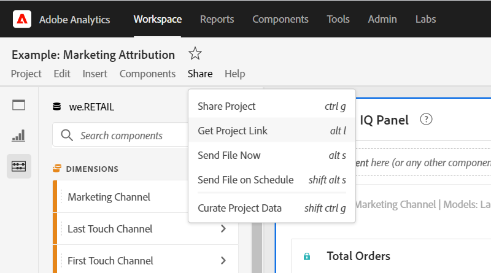

# Verdeelbare koppelingen maken

De Werkruimte van de analyse biedt vele manieren aan om een project aan uw gebruikers, met inbegrip van de capaciteit te delen om een verbinding aan een project of een specifiek deel van een project te krijgen. De gebruikers die een verbinding ontvangen worden vereist aan login aan de Analyse van Adobe alvorens zij aan het project kunnen krijgen.

## Projectlink ophalen {#project-link}

Om een verbinding met het volledige project te delen, ga naar **[!UICONTROL Share > Get project link]**. Als de ontvanger van de verbinding geen [projectrol](https://docs.adobe.com/content/help/nl-NL/analytics/analyze/analysis-workspace/curate-share/share-projects.html), Admins ontvangen **[!UICONTROL Can edit]** en Niet-admins ontvangen **[!UICONTROL Can duplicate]** ervaringen.

## Koppel paneel of visualisatie {#panel-link}

U kunt een verbinding aan een specifiek deel van een project, zoals een paneel of individuele visualisatie ook delen. Dit wordt soms aangeduid als intra-linking. Dit kan nuttig zijn om de aandacht van uw gebruikers op zeer belangrijke inzichten binnen het project te vestigen.

* Van om het even welke paneelkopbal, klik met de rechtermuisknop aan **[!UICONTROL Get panel link]**
* Van om het even welke lijst of visualisatiekopbal, klik met de rechtermuisknop aan **[!UICONTROL Get visualization link]**

[Bekijk de video](https://www.youtube.com/watch?v=lvmAdKNfWQw) op hoe te om verbindingen tot stand te brengen en hen te gebruiken om ontvangers aan specifieke delen van uw project te drijven.

## De verbindingen van het gebruik in een Inhoudstafel {#TOC}

Één uiteinde voor het leveraging van de diverse verbindingsopties moet altijd een inhoudstafel bij de bovenkant van uw project van de Werkruimte omvatten. In de inhoudstafel, kunt u met andere relevante projecten, specifieke panelen en specifieke visualisaties verbinden. Dit helpt de ontvanger van het project om gemakkelijker te navigeren.

[Bekijk de video](https://www.youtube.com/watch?v=Xo6fTguWm-M) op hoe te om een inhoudstafel te construeren gebruikend verbindingen en de rijke tekstredacteur van de Werkruimte.

