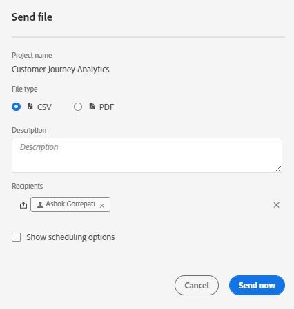
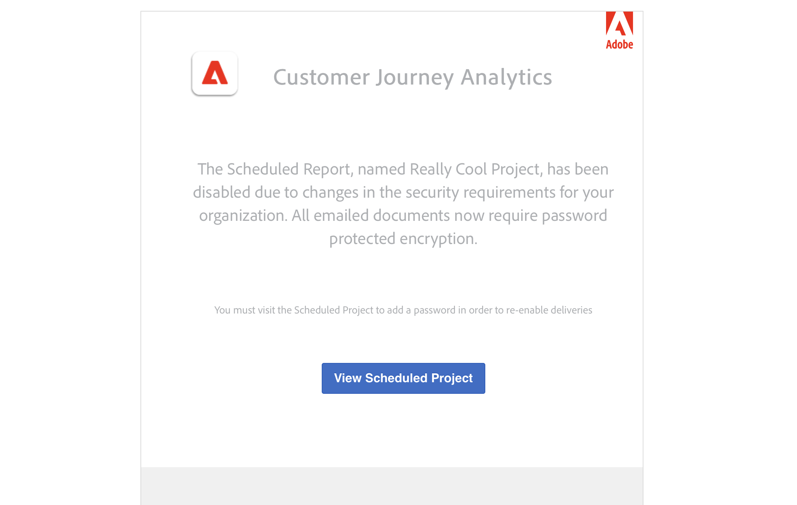

# Projecten plannen

Vanuit de werkruimte **[!UICONTROL Share]** kunt u Analysis Workspace-projecten via e-mail naar geselecteerde ontvangers verzenden. Bestanden kunnen in CSV- of PDF-indeling worden verzonden.

## Bestand nu verzenden {#now}

Een bestand direct via e-mail naar ontvangers verzenden:

1. Klik op **[!UICONTROL Share]>[!UICONTROL Export file]**.
1. Geef het bestandstype op:
   * [!UICONTROL **CSV**]: Kies deze optie als u gegevens in onbewerkte tekst wilt.
   * [!UICONTROL **PDF**]: Kies deze optie als het gedownloade bestand alle weergegeven (zichtbare) tabellen en visualisaties in het project moet bevatten.
1. (Optioneel) Voeg een beschrijving toe die u in de e-mail wilt opnemen om uit te leggen welk bestand wordt ontvangen.
1. Voeg ontvangers of groepen toe. U kunt ook e-mailadressen invoeren.
1. (Alleen voor klanten van het gezondheidsschild) Geef een wachtwoord op. Zie de sectie Wachtwoord-beschermt een gepland rapport.
1. Klik op **[!UICONTROL Send Now]**.
1. (Optioneel) Klik op **[!UICONTROL Show scheduling options]** om een leveringsschema op te geven.

## Bestand verzenden volgens schema {#schedule}

Een bestand volgens een terugkerend schema via e-mail naar ontvangers verzenden:

1. Klik op **[!UICONTROL Share]>[!UICONTROL Schedule file export]**.
1. Geef het bestandstype op (CSV of PDF).
1. (Optioneel) Voeg een beschrijving toe die in de e-mail wordt opgenomen om uit te leggen welk bestand wordt ontvangen.
1. Voeg ontvangers of groepen toe. U kunt ook e-mailadressen invoeren.
1. (Alleen voor klanten van het gezondheidsschild) Geef een wachtwoord op. Zie de sectie Wachtwoord-beschermt een gepland rapport.
1. Geef het bereik op waarover de planning moet worden geleverd door Starten op en Eindigen op de invoer te wijzigen. De einddatum moet binnen een jaar zijn vanaf de dag dat het schema wordt opgesteld of gewijzigd.
1. Geef de leveringsfrequentie op. Elke frequentie maakt verschillende aanpassingen mogelijk.
1. Klik op **[!UICONTROL Send on schedule]**.

## Geplande projectmanager {#manager}

Geplande Analysis Workspace-projecten kunnen worden beheerd in het kader van **[!UICONTROL Analytics]> [!UICONTROL Components] >[!UICONTROL Scheduled Projects]**.

In de Geplande Manager van Projecten, kunt u terugkomende projectprogramma&#39;s uitgeven en schrappen. Zoek naar een programma in de onderzoeksbar of door de filteropties in het linkerspoor te gebruiken. U kunt filteren op tag, goedgekeurde schema&#39;s, eigenaars en meer.

| Veld | Beschrijving |
| --- | --- |
| [!UICONTROL Favorites] | Als u het sterpictogram selecteert, wordt dit schema een favoriet. |
| [!UICONTROL Schedule ID] | Deze id wordt vooral gebruikt voor foutopsporingsdoeleinden. |
| [!UICONTROL Title and Description] | Titel en beschrijving van dit project. |
| [!UICONTROL Owner] | De persoon die het project heeft gemaakt en bezit. |
| [!UICONTROL Tags] | (facultatief) het etiketteren is een goede manier om projecten te organiseren. Alle gebruikers kunnen labels maken en een of meer tags toepassen op een project. U kunt echter alleen labels zien voor de projecten die u hebt of die met u zijn gedeeld. |
| [!UICONTROL Delivered To] | De ontvanger(s) van dit geplande project. |
| [!UICONTROL Expiration Date] | U kunt de vervaldatum instellen op maximaal één jaar, ongeacht de frequentie van de planning. |
| [!UICONTROL Frequency] | Hoe vaak wilt u dat dit planningsproject naar de ontvanger(s) wordt verzonden. |
| [!UICONTROL Execution Time] | Op welk tijdstip van de dag dit geplande project wordt verzonden. |
| [!UICONTROL Number of Queries] | Het aantal vragen tegen dit project. |

Het volgende is gemeenschappelijke acties in de Geplande Manager van Projecten:

| Handeling | Beschrijving |
|---|---|
| **[!UICONTROL Edit schedule]** | Klik op de titel van de planning om de leveringsinstellingen bij te werken. |
| **[!UICONTROL Delete schedule]** | Selecteer het geplande project in de lijst en klik dan Schrapping van het menu. Hiermee verwijdert u het geselecteerde schema voor het project. het project zelf wordt niet verwijderd . |
| **[!UICONTROL Add tags]** | Selecteer het geplande project in de lijst en kies &quot;Tag&quot; of &quot;Goedkeuren&quot; om uw schema&#39;s te ordenen en ze gemakkelijker te maken om naar te zoeken. |
| **[!UICONTROL View failed schedules]** | Navigeer naar de linkertrack > Overige filters > Kan geen mislukte planningen zien. |
| **[!UICONTROL View expired schedules]** | Navigeer naar de linkerrail > Andere filters > Verlopen om programma&#39;s te zien die zijn verlopen. Klik de titel van het programma aan opstelling een nieuw leveringsprogramma. |
| **[!UICONTROL View schedule ID]** | Navigeer naar kolomopties rechtsboven en voeg de kolom Id van planning toe aan de tabel. De geplande id is vaak handig voor foutopsporing. |

De Geplande Manager van Projecten toont de punten die een specifieke gebruiker heeft gecreeerd. Als de gebruikersaccount in de toepassing is uitgeschakeld, worden alle geplande leveringen gestopt.

## Wachtwoord-beschermt een gepland project {#password}

>[!NOTE]
>
>De optie om een gepland project met een wachtwoord te beveiligen, wordt alleen weergegeven voor Customer Journey Analytics-klanten die de [Gezondheidsschild](https://business.adobe.com/solutions/experience-cloud-for-healthcare.html) add-on product.

Adobe gebruikt het wachtwoord om geplande projecten te coderen, of zij in .pdf of .csv formaten worden verzonden.

Nadat uw bedrijf de SKU van het Schild van de Gezondheidszorg heeft gekocht en voor het is toegelaten, verschijnt de vraag om een wachtwoord voor een gepland project tot stand te brengen onder twee omstandigheden:

* Wanneer iemand een nieuw gepland project maakt.

* Wanneer een bestaand gepland project op het punt staat te worden verzonden. Het momenteel geplande project wordt uitgeschakeld totdat wachtwoordbeveiliging is ingesteld. De eigenaar van het geplande project ontvangt een e-mail met dit doel.

### Wachtwoordvereisten

De wachtwoordvereisten voldoen aan de Adobe-standaard, die minimaal 8 tekens vereist met ten minste één getal en één speciaal teken.

### Wachtwoord-beschermt een nieuw gepland project

1. Nadat u uw project hebt opgeslagen, ga naar **[!UICONTROL Share]** > **[!UICONTROL Send file now]**, of [!UICONTROL Share] > **[!UICONTROL Send file on schedule]**.
1. Volg de bovenstaande instructies onder [Bestand nu verzenden](https://experienceleague.adobe.com/docs/analytics-platform/using/cja-workspace/curate-share/t-schedule-report.html#now) of [Bestand verzenden volgens schema](https://experienceleague.adobe.com/docs/analytics-platform/using/cja-workspace/curate-share/t-schedule-report.html#schedule).

### Wachtwoord-beschermt een bestaand gepland project

Vóór de tijd waarvoor een project gepland is, zal de eigenaar van het project een e-mail gelijkaardig aan dit ontvangen:

1. Log terug in Customer Journey Analytics.
1. Klik op **[!UICONTROL View Scheduled Project]**.
1. In de **[!UICONTROL Edit scheduled project]** voert u een wachtwoord in en voert u dit opnieuw in.
1. (Slechts) de ontvangers van het geplande project weten over dit wachtwoord.

