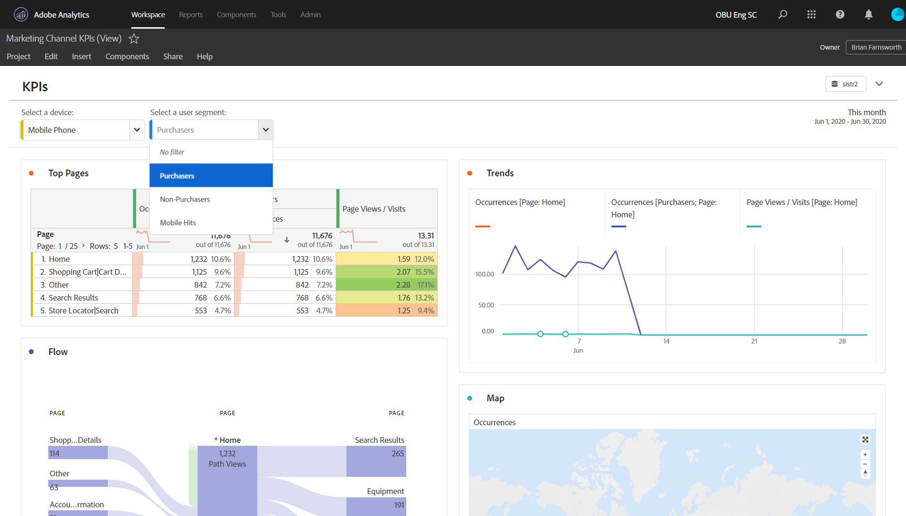

# Alleen-weergeven -projecten

>[!NOTE]
>
>U bekijkt de documentatie voor Analysis Workspace in Customer Journey Analytics. De functieset verschilt enigszins van [Analysis Workspace in traditionele Adobe Analytics](https://experienceleague.adobe.com/docs/analytics/analyze/analysis-workspace/home.html). [Meer informatie...](/help/getting-started/cja-aa.md)

U kunt projecten als &quot;mening-slechts&quot;aan ontvangers door [het werkschema van het aandeel van het Project](/help/analysis-workspace/curate-share/share-projects.md) delen. Ontvangers die in de rol van de Mening van het Kan worden geplaatst zullen een beperktere projectervaring ontvangen. Dit kan gewenst zijn als u een project deelt aan gebruikers die minder vertrouwd zijn met de gegevensstructuur van uw organisatie, Analysis Workspace of Adobe Analytics in het algemeen, maar u toch wilt dat zij gegevens en inzichten in een veilige omgeving gebruiken.

## Uitgeschakelde interacties

Uitgeschakelde interacties in een alleen-weergaveproject zijn onder meer:

* Verborgen linkerspoor
* Datumbereik paneelkalender. Opmerking: Als u kalendercontrole aan ontvangers wilt verlenen, voeg in een [drop-down filter met datumwaaiers](https://experienceleague.adobe.com/docs/analytics-learn/tutorials/analysis-workspace/using-panels/using-drop-down-filters.html) toe.
* Freeform-filtering
* Vrije vorm # van zichtbare rijen
* Instellingen voor rij, kolom of visualisatie voor vrije vorm
* Deelvensterfilters
* Menu&#39;s Bewerken, Invoegen en Component
* Tips voor werkruimte

## Ingeschakelde interacties

Enkele opmerkelijkere toegelaten interactie in een mening-slechts project omvatten:

| Gebied | Ingeschakelde interacties |
| --- | --- |
| Vrije-vormtabellen | <ul><li>Paginering en sorteren</li><li>Hovering</li><li>Celselecties waarmee gekoppelde visualisaties worden bijgewerkt</li><li>Klik met de rechtermuisknop > Visualisatiekoppeling ophalen</li><li>Klik met de rechtermuisknop > Kopiëren naar klembord</li></ul> |
| Visualisaties | <ul><li>Klikken om de legenda in of uit te schakelen</li><li>Hovering</li><li>Klik met de rechtermuisknop > Visualisatiekoppeling ophalen</li><li>Samenvouwen/uitvouwen</li><li>Stroom - Stroomknooppunten uitvouwen</li><li>Toewijzen - zoomen</li></ul> |
| Deelvensters | <ul><li>Interactieve dropdown-filters</li><li>Klik met de rechtermuisknop > Deelvensterkoppeling ophalen</li><li>Samenvouwen/uitvouwen</li></ul> |
| Project | <ul><li>Alle informatiepictogrammen controleren</li><li>Projectmenu - Nieuw, Openen, Instellen als bestemmingspagina, Vernieuwen, CSV/PDF downloaden, beperkte projectinfo en -instellingen</li><li>Menu Delen - Projectkoppeling ophalen, bestand nu verzenden</li><li>Menu Help - Alle handelingen behalve Opties voor Tips en Foutopsporing</li></ul> |
