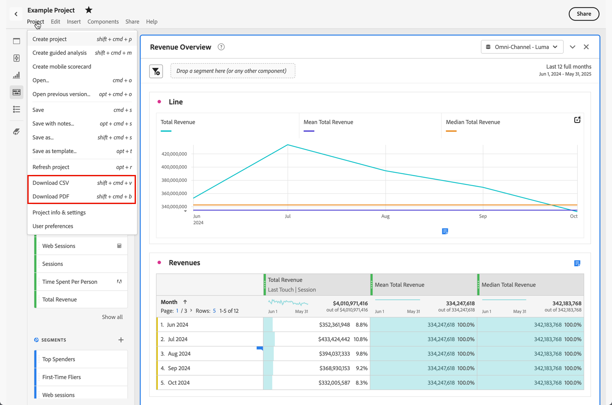

# Gegevens Customer Journey Analytics downloaden

U kunt gegevens van de Customer Journey Analytics downloaden naar uw persoonlijke werkstation. Dit kan in de vorm van gekopieerde gegevens, CSV, of PDF zijn. Een PDF heeft doorgaans de voorkeur als u visualisaties in het gedownloade bestand wilt opnemen. CSV en gekopieerde gegevens hebben de voorkeur als u gewoon gegevens zonder tekst wilt.

Er zijn ook andere methoden beschikbaar voor het exporteren van gegevens van Customers Journey Analytics, zoals beschreven in [Overzicht van exporteren](/help/analysis-workspace/export/export-project-overview.md).

## Downloaden als CSV of PDF {#download-project}

1. Voer een van de volgende handelingen uit, afhankelijk van de indeling waarin u de download wilt plaatsen:

   * **PDF:** Selecteren **[!UICONTROL Project]** > **[!UICONTROL Download PDF]**.

     Kies deze optie als het gedownloade bestand alle weergegeven (zichtbare) tabellen en visualisaties in het project moet bevatten.

   * **CSV:** Selecteren **[!UICONTROL Project]** > **[!UICONTROL Download CSV]**.

     Kies deze optie als het gedownloade bestand onbewerkte tekst moet zijn.

   

1. (Voorwaardelijk) als u verkoos om een PDF te downloaden, wordt een bericht getoond nadat het project klaar is om te worden gedownload. Selecteren [!UICONTROL **Downloaden**].

Houd bij het downloaden van projecten rekening met:

* Het project kan worden opgeslagen of niet opgeslagen wanneer u een projectdownload aanvraagt. Alleen opgeslagen projecten kunnen echter worden [gepland](/help/analysis-workspace/export/t-schedule-report.md).
* PDF die in de browser worden gedownload, kunnen enkele minuten in beslag nemen om te worden geëxporteerd, omdat het project opnieuw wordt uitgevoerd op Adobe-servers voordat het wordt gerenderd in PDF-indeling. We raden u aan het project pas te laten nadat de PDF in uw browser is gedownload. U kunt echter wijzigingen in het project blijven aanbrengen terwijl u wacht. Als een PDF langer dan 5 minuten duurt om te renderen, wordt u gevraagd om het te e-mailen.
* PDF-downloads worden weergegeven als één pagina zonder paginering.
* Wanneer een project aan PDF wordt teruggegeven, geven wij terug wat op de pagina is. Als een project visualisaties en deelvensters van aangepaste grootte heeft, moet u deze wijzigen om automatisch van grootte te zijn (knop in de rechterbovenhoek), zodat er geen afgekapte inhoud is.

## Kopiëren naar klembord (sneltoets: Ctrl+C) {#copy-data}

De optie Klikken met rechtermuisknop **[!UICONTROL Copy to clipboard]** Hiermee kunt u snel gegevens van Customers Journey Analytics uit Workspace kopiëren en in een hulpprogramma van derden plakken.

* Als u de weergegeven tabel wilt kopiëren, klikt u met de rechtermuisknop op de tabelkop en kiest u **Gegevens naar klembord kopiëren**.
* Als u een subset van gegevens wilt kopiëren, maakt u een selectie in de tabel en klikt u met de rechtermuisknop > **Selectie naar klembord kopiëren**.

>[!TIP]
>
>U kunt de sneltoets gebruiken `Ctrl+C` om uw selectie naar het klembord te kopiëren, dan gebruik `Ctrl+V` plakken in een gereedschap van derden.

## Downloaden als CSV {#download-data}

De optie Klikken met rechtermuisknop **[!UICONTROL Download data as CSV]** kunt u een Customer Journey Analytics gegevens of de gegevensbron van om het even welke visualisatie als CSV downloaden.

* Klik in de koptekst van een tabel of visualisatie met de rechtermuisknop en kies **[!UICONTROL Download data as CSV]**. Dit downloadt de getoonde gegevens van de Customer Journey Analytics in de lijst of de onderliggende gegevensbron voor visualisatie als CSV.

  >[!NOTE]
  >
  >  Opmerking: deze optie wordt niet ondersteund door de Kaartweergave.

* Klik in een tabel met de rechtermuisknop en kies **[!UICONTROL Download selection as CSV]**. Alleen de selectie wordt met deze optie gedownload, in tegenstelling tot de volledige weergegeven tabel.

## Items als CSV downloaden {#download-items}

Als u meer dan de zichtbare 400 rijen gegevens in een lijst wilt analyseren, klik de lijstkopbal of om het even welke rij met de rechtermuisknop aan en selecteer **Items als CSV downloaden (_Naam Dimension_)**. Met deze optie exporteert u maximaal 50.000 dimensieitems (op basis van de tabelsortering) voor de geselecteerde dimensie, met sorteeropties en toegepaste filters. Als u deze optie boven aan de tabel kiest, wordt de eerste afmeting in de tabel geëxporteerd. Hoewel er geen limieten gelden in de vrije-vormtabel, wordt aanbevolen de optie Items downloaden te gebruiken in tabellen met minder dan 20 kolommen om optimale prestaties te garanderen.

>[!TIP]
>
> Als uw afmeting groter is dan 50.000 items, downloadt u het bestand met verschillende maateenheden of past u een filter toe. U kunt bijvoorbeeld in één download aflopend sorteren op Bezoek en in een tweede download oplopend sorteren op Bezoek. Deze tip kan u helpen langer-staart punten terugwinnen.

U kunt meerdere taken uitvoeren binnen het project en zelfs naar een nieuw Workspace-project navigeren op hetzelfde tabblad terwijl de download bezig is. Het downloaden wordt onderbroken als u een nieuw browsertabblad opent. Het downloaden wordt geannuleerd als u Workspace volledig verlaat of het browsertabblad sluit.

### Bestand met gedownloade items {#items-file}

De functies van de tabel worden als volgt op het gedownloade bestand toegepast:

* Alle deelvensterfilters worden als filters toegepast.
* Uitsplitsingen **boven** de geselecteerde afmeting in de tabel wordt toegepast als filters boven elke kolom.
* Uitsplitsingen **onder** de geselecteerde afmeting in de tabel wordt verwijderd.

In het bovenstaande voorbeeld worden pagina-items gedownload met het deelvensterfilter (Nieuwe bezoekers) en de bovenstaande componenten (Marketing Channel = e-mail) toegepast als filters, en worden de onderliggende componenten (Type mobiel apparaat) verwijderd uit de gedownloade CSV.

### Meldingen downloaden {#notifications}

Terwijl het bestand wordt gedownload, wordt een informatieve melding over de voortgang weergegeven. U kunt de download op elk gewenst moment annuleren door op **[!UICONTROL Cancel download]**. De toast sluiten **niet** het downloaden annuleren.

Nadat het bestand is voltooid, wordt een voltooiingsbericht weergegeven en wordt het bestand naar uw browser gedownload.

Als u meer dan één download tegelijk aanvraagt, ontvangt u een melding dat elke extra download in de wachtrij wordt geplaatst totdat de vorige download is voltooid.

## Gevoelige gegevens downloaden {#sensitive}

Als de **[!UICONTROL Enforce Download]** [beleid inzake gegevensbeheer](/help/data-views/data-governance.md) wordt aangezet in de gegevensmening u rapporteert, om het even welke download (zoals het e-mailen of het delen van PDF dossiers) van de projecten van de Werkruimte zal de gegevensgebieden hakken die als gevoelig worden geëtiketteerd. U kunt deze velden nog steeds analyseren in Workspace, maar als u een project probeert te e-mailen of anderszins te delen, worden de geblokkeerde velden als leeg weergegeven in het .pdf- of .csv-bestand.

## Veelgestelde vragen {#faq}

| Vraag | Antwoord |
| --- | --- |
| Waarom is mijn gedownloade PDF één pagina? | De gedownloade PDF worden momenteel niet gepagineerd door de werkruimte. |
| Kan ik meer dan 50.000 items exporteren met de optie Items downloaden als CSV? | Terwijl elke download tot 50.000 afmetingspunten kan bevatten, kunt u het soort van uw lijst veranderen om langere eindpunten terug te winnen, of een filter toepassen om specifiekere punten te downloaden. |
| Wat doet **[!UICONTROL Copy visualization]** doen? | Anders [!UICONTROL **Gegevens naar klembord kopiëren**] of [!UICONTROL **Selectie naar klembord kopiëren**] de **[!UICONTROL Copy visualization]** De optie voor klikken met de rechtermuisknop is geen exportoptie. Hiermee kunt u een visualisatie of een deelvenster van de ene plaats in Workspace naar de andere kopiëren. Bijvoorbeeld van het ene naar het andere deelvenster in hetzelfde project of van het ene naar het andere project. [Intra-linking video](https://experienceleague.adobe.com/docs/analytics-learn/tutorials/analysis-workspace/visualizations/intra-linking-in-analysis-workspace.html) |
