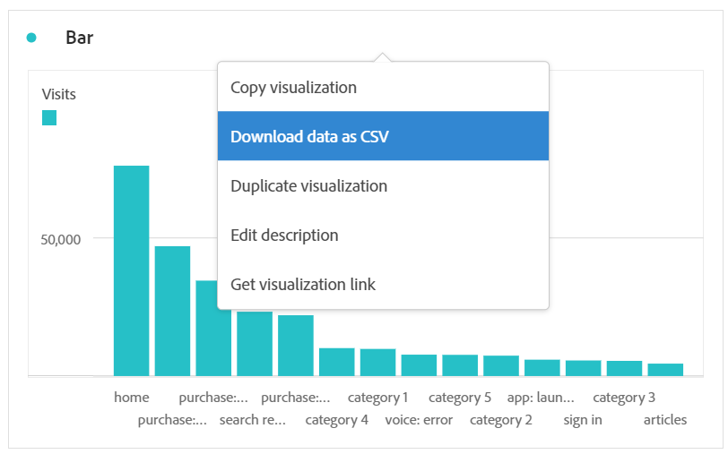

# Customer Journey Analytics-gegevens downloaden

U kunt Customer Journey Analytics-gegevens downloaden naar uw persoonlijke werkstation. Dit kan in de vorm van gekopieerde gegevens, CSV, of PDF zijn. Een PDF heeft doorgaans de voorkeur als u visualisaties in het gedownloade bestand wilt opnemen. CSV en gekopieerde gegevens hebben de voorkeur als u gewoon gegevens zonder tekst wilt.

Andere methodes om de gegevens van Customer Journey Analytics uit te voeren zijn ook beschikbaar, zoals die in [ wordt beschreven Overzicht van de Uitvoer ](/help/analysis-workspace/export/export-project-overview.md).

## Downloaden als CSV of PDF {#download-project}

Houd rekening met het volgende wanneer u projecten downloadt:

* Wanneer u projecten downloadt als CSV of PDF, kunt u het project opslaan of niet opslaan wanneer u een projectdownload aanvraagt. Nochtans, slechts kunnen de bewaarde projecten [ gepland ](/help/analysis-workspace/export/t-schedule-report.md) zijn.

* Bij het downloaden van projecten als een PDF:
   * Downloads kunnen enkele minuten duren om te exporteren, omdat het project opnieuw wordt uitgevoerd op Adobe-servers voordat het wordt gerenderd in PDF-indeling. We raden u aan het project pas te laten nadat de PDF in uw browser is gedownload. U kunt echter wijzigingen in het project blijven aanbrengen terwijl u wacht. Als een PDF meer dan 5 minuten nodig heeft om te renderen, wordt u gevraagd om het bestand via e-mail te verzenden.
   * Downloads worden weergegeven als één pagina zonder paginering.
   * PDF-weergaven bevatten wat er op de pagina in Workspace staat. Als een project visualisaties en deelvensters van aangepaste grootte heeft, moet u deze wijzigen om automatisch van grootte te zijn (knop in de rechterbovenhoek), zodat er geen afgekapte inhoud is.
   * Om het even welke [ hyperlinks ](/help/analysis-workspace/visualizations/freeform-table/freeform-table-hyperlinks.md) die binnen vrije vormlijsten bestaan zijn niet functioneel in gedownloade PDF.

Een project downloaden als CSV- of PDF-bestand:

1. Voer een van de volgende handelingen uit, afhankelijk van de indeling waarin u de download wilt plaatsen:

   * **PDF:** Uitgezocht **[!UICONTROL Project]** > **[!UICONTROL Download PDF]**.

     Kies deze optie als het gedownloade bestand alle weergegeven (zichtbare) tabellen en visualisaties in het project moet bevatten.

   * **CSV:** Uitgezocht **[!UICONTROL Project]** > **[!UICONTROL Download CSV]**.

     Kies deze optie als het gedownloade bestand onbewerkte tekst moet zijn.

   

1. (Voorwaardelijk) Als u een PDF wilt downloaden, wordt een bericht weergegeven nadat het project klaar is om te worden gedownload. Selecteer [!UICONTROL **Download**].

## Kopiëren naar klembord (sneltoets: Ctrl+C) {#copy-data}

Met de rechtermuisknop **[!UICONTROL Copy to clipboard]** kunt u snel Customer Journey Analytics-gegevens kopiëren van Workspace en deze in een gereedschap van derden plakken.

* Als u de getoonde gekopieerde lijst wilt, klik de lijstkopbal met de rechtermuisknop aan en kies **gegevens van het Exemplaar aan klembord**.
* Als u een ondergroep van gekopieerde gegevens wilt, maak een selectie in de lijst en klik dan met de rechtermuisknop > **selectie van het Exemplaar aan klembord**.

>[!TIP]
>
>U kunt de sneltoets `Ctrl+C` gebruiken om de selectie naar het klembord te kopiëren en deze vervolgens met `Ctrl+V` in een gereedschap van derden te plakken.

## Downloaden als CSV {#download-data}

Met de rechtermuisknop klikken **[!UICONTROL Download data as CSV]** kunt u een tabel met Customer Journey Analytics-gegevens of de gegevensbron van een visualisatie als CSV downloaden.

* Klik met de rechtermuisknop en kies **[!UICONTROL Download data as CSV]** in de koptekst van een tabel of visualisatie. Hiermee worden de weergegeven Customer Journey Analytics-gegevens in de tabel of de onderliggende gegevensbron gedownload voor visualisatie als een CSV-bestand.

  >[!NOTE]
  >
  >  Opmerking: deze optie wordt niet ondersteund door de Kaartweergave.

* Klik in een tabel met de rechtermuisknop en kies **[!UICONTROL Download selection as CSV]** . Alleen de selectie wordt met deze optie gedownload, in tegenstelling tot de volledige weergegeven tabel.

## Items als CSV downloaden {#download-items}

Als u meer dan de zichtbare 400 rijen van gegevens in een lijst wilt analyseren, klik de lijstkopbal of om het even welke rij met de rechtermuisknop aan en selecteer **punten van de Download als CSV (_naam van Dimension_)**. Met deze optie exporteert u maximaal 50.000 dimensieitems (op basis van de tabelsortering) voor de geselecteerde dimensie, met sorteeropties en toegepaste filters. Als u deze optie boven aan de tabel kiest, wordt de eerste afmeting in de tabel geëxporteerd. Hoewel er geen limieten gelden in de vrije-vormtabel, wordt aanbevolen de optie Items downloaden te gebruiken in tabellen met minder dan 20 kolommen om optimale prestaties te garanderen.

>[!TIP]
>
> Als uw afmeting meer dan 50.000 items bevat, downloadt u het bestand met verschillende maateenheden of past u een segment toe. U kunt bijvoorbeeld in één download aflopend sorteren op Bezoek en in een tweede download oplopend sorteren op Bezoek. Deze tip kan u helpen langer-staart punten terugwinnen.

U kunt meerdere taken uitvoeren in het project en zelfs naar een nieuw Workspace-project navigeren op hetzelfde tabblad terwijl het downloaden wordt uitgevoerd. Het downloaden wordt onderbroken als u een nieuw browsertabblad opent. Het downloaden wordt geannuleerd als u Workspace volledig verlaat of het browsertabblad sluit.

### Bestand met gedownloade items {#items-file}

De functies van de tabel worden als volgt op het gedownloade bestand toegepast:

* Alle deelvenstersegmenten worden als filters toegepast.
* De onderbrekingen **boven** de geselecteerde afmeting in de lijst worden toegepast als filters boven elke kolom.
* De onderbrekingen **onder** worden de geselecteerde afmeting in de lijst verwijderd.

In het bovenstaande voorbeeld worden pagina-items gedownload met het deelvenstersegment (Nieuwe bezoekers) en de bovenstaande componenten (Marketing Channel = e-mail) toegepast als filters, en worden de onderliggende componenten (Type mobiel apparaat) verwijderd uit de gedownloade CSV.

### Meldingen downloaden {#notifications}

Terwijl het bestand wordt gedownload, wordt een informatieve melding over de voortgang weergegeven. U kunt de download op elk gewenst moment annuleren door op **[!UICONTROL Cancel download]** te klikken. Het sluiten van toast **zal niet** de download annuleren.

Nadat het bestand is voltooid, wordt een voltooiingsbericht weergegeven en wordt het bestand naar uw browser gedownload.

Als u meer dan één download tegelijk aanvraagt, ontvangt u een melding dat elke extra download in de wachtrij wordt geplaatst totdat de vorige download is voltooid.

## Gevoelige gegevens downloaden {#sensitive}

Als het **[!UICONTROL Enforce Download]** [ beleid van het gegevensbeheer ](/help/data-views/data-governance.md) in de gegevensmening wordt aangezet u rapporteert, om het even welke download (zoals het e-mailen of het delen van de dossiers van PDF) van de projecten van Workspace zullen de gegevensgebieden hakken die als gevoelig worden geëtiketteerd. U kunt deze velden nog steeds analyseren in Workspace, maar als u probeert een project te e-mailen of anderszins te delen, worden de geblokkeerde velden als leeg weergegeven in het .pdf- of .csv-bestand.

Als gegevensvelden met de naam sensitive in [!UICONTROL Data View] worden opgenomen, is de optie om gegevens van het scherm te selecteren en te kopiëren beperkt voor alle gegevens in [!UICONTROL Data View] .

## Veelgestelde vragen {#faq}

| Vraag | Antwoord |
| --- | --- |
| Waarom is mijn gedownloade PDF één pagina? | Workspace pagineert momenteel geen gedownloade PDF&#39;s. |
| Kan ik meer dan 50.000 items exporteren met de optie Items downloaden als CSV? | Terwijl elke download tot 50.000 afmetingspunten kan bevatten, kunt u het soort van uw lijst veranderen om langere eindpunten terug te winnen, of een filter toepassen om specifiekere punten te downloaden. |
| Wat doet **[!UICONTROL Copy visualization]**? | In tegenstelling tot [!UICONTROL **gegevens van het Exemplaar aan klembord**] of [!UICONTROL **selectie van het Exemplaar aan klembord**], is de **[!UICONTROL Copy visualization]** met de rechtermuisknop aanklikken optie geen uitvoeroptie. Hiermee kunt u een visualisatie of een deelvenster van de ene plaats in Workspace naar de andere kopiëren. Bijvoorbeeld van het ene naar het andere deelvenster in hetzelfde project of van het ene naar het andere project. [ intra-linking video ](https://experienceleague.adobe.com/docs/analytics-learn/tutorials/analysis-workspace/visualizations/intra-linking-in-analysis-workspace.html?lang=nl-NL) |
