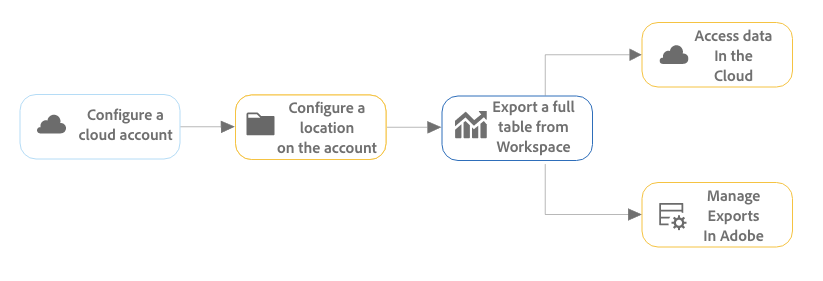

# Volledige tabellen exporteren naar de cloud {#full-table-export}

<!-- markdownlint-disable MD034 -->

>[!CONTEXTUALHELP]
>id="cja-upgrade-full-table-export"
>title="Volledige tabelexport maken, vergelijkbaar met Data Warehouse"
>abstract="De volledige tabelexport is beschikbaar zodra de gegevens in Analysis Workspace worden weergegeven. U kunt desgewenst volledige tabelexporten maken of plannen.   u kunt volledige lijstuitvoer in slechts een paar notulen tot stand brengen als u reeds weet welke gegevens in de uitvoer te omvatten."

<!-- markdownlint-enable MD034 -->

In Customer Journey Analytics kunt u volledige tabellen exporteren van Analysis Workspace naar opgegeven wolkdoelen.

Andere methodes om de rapporten van Customer Journey Analytics uit te voeren zijn ook beschikbaar, zoals die in [&#x200B; wordt beschreven Overzicht van de Uitvoer &#x200B;](/help/analysis-workspace/export/export-project-overview.md).

## Volledige tabelexport begrijpen

U kunt volledige tabellen exporteren van Analysis Workspace naar cloudproviders zoals Google, Azure, Amazon en Adobe.

[&#x200B; Voordelen van volledige lijstuitvoer &#x200B;](#advantages-of-full-table-export) omvatten de capaciteit om miljoenen rijen uit te voeren, berekende metriek, structuurgegevensoutput in samengevoegde waarden, en meer omvatten.

Houd rekening met het volgende wanneer u volledige tabellen exporteert:

* Alvorens u naar de wolk uitvoert, zorg ervoor dat uw lijsten, uw milieu, en uw toestemmingen aan de [&#x200B; minimumuitvoervereisten &#x200B;](#minimum-requirements) voldoen.

* Sommige [&#x200B; eigenschappen &#x200B;](#unsupported-features) en [&#x200B; componenten &#x200B;](#unsupported-components) worden niet gesteund wanneer het uitvoeren van volledige lijsten aan de wolk.

Gebruik het volgende proces bij het exporteren van volledige tabellen naar de cloud:

1. [Een cloudaccount configureren](/help/components/exports/cloud-export-accounts.md)

1. [Een locatie op de account configureren](/help/components/exports/cloud-export-locations.md)

1. [Een volledige tabel exporteren vanuit Workspace](#export-full-tables)

1. De gegevens van de toegang in uw wolkenrekening en [&#x200B; leiden de uitvoer in Adobe &#x200B;](/help/components/exports/manage-exports.md)

## Volledige tabellen exporteren  {#export-from-workspace}

<!-- markdownlint-disable MD034 -->

>[!CONTEXTUALHELP]
>id="cja-export-details"
>title="Details"
>abstract="Geef een naam op voor het exporteren. U kunt ook een beschrijving en alle tags toevoegen. Met deze informatie kunt u de exportbewerking herkennen in de exporttabel en in e-mailmeldingen."

<!-- markdownlint-enable MD034 -->

<!-- markdownlint-disable MD034 -->

>[!CONTEXTUALHELP]
>id="cja-export-data-structure"
>title="Gegevensstructuur"
>abstract="Dit is de tabel voor vrije vorm die u exporteert. U kunt de gegevensstructuur wijzigen door componenten van het linkerdeelvenster naar de tabel te slepen. U kunt een filter toepassen door een component naar het filtergebied te slepen. De tabel wordt dynamisch bijgewerkt terwijl u componenten toevoegt aan het canvas."

<!-- markdownlint-enable MD034 -->

<!-- markdownlint-disable MD034 -->

>[!CONTEXTUALHELP]
>id="export-manifest"
>title="Inclusief manifestbestand"
>abstract="Als deze optie is geselecteerd, wordt een manifestbestand opgenomen in alle exportbewerkingen die succesvol zijn. Met het manifestbestand kunt u bevestigen dat alle bestanden zijn geleverd."

<!-- markdownlint-enable MD034 -->

<!-- markdownlint-disable MD034 -->

>[!CONTEXTUALHELP]
>id="cja-export-schedule"
>title="Schema"
>abstract="Selecteer hoe vaak het exporteren moet plaatsvinden. Kies Nu verzenden (eenmalig) om het exporteren direct te starten. De geplande uitvoer wordt begonnen op de datum en de tijd u specificeert."

<!-- markdownlint-enable MD034 -->

<!-- markdownlint-disable MD034 -->

>[!CONTEXTUALHELP]
>id="cja-export-destination"
>title="Bestemming"
>abstract="Selecteer de cloudaccount en de locatie waar u de gegevens wilt verzenden. U kunt een bestaand account en een bestaande locatie kiezen of Nieuwe account toevoegen selecteren om deze te maken. Geef gebruikers en groepen op om te informeren over mislukte of verlopen exportbewerkingen."

<!-- markdownlint-enable MD034 -->

<!-- markdownlint-disable MD034 -->

>[!CONTEXTUALHELP]
>id="cja-export-file-format"
>title="Bestandsindeling"
>abstract="Bij het kiezen van de Parquet-bestandsindeling worden sommige speciale tekens in componentnamen vervangen door een onderstrepingsteken (_). Zie de koppeling hieronder voor een volledige lijst met vervangen tekens."

<!-- markdownlint-enable MD034 -->

<!-- markdownlint-disable MD034 -->

>[!CONTEXTUALHELP]
>id="cja-export-notifications"
>title="Meldingen"
>abstract="Voeg gebruikers en groepen toe die u meldingen wilt ontvangen wanneer deze exportbewerking mislukt of bijna verlopen is."

<!-- markdownlint-enable MD034 -->

>[!NOTE]
>
>Alvorens u gegevens uitvoert zoals die in deze sectie worden beschreven, leer meer over de volledige lijstuitvoer in [&#x200B; begrijpen volledige de lijstuitvoer &#x200B;](#understand-full-table-export) sectie hierboven.

Volledige tabellen exporteren uit Analysis Workspace:

1. Als u niet reeds hebt, vorm een de uitvoerrekening en plaats, zoals die in [&#x200B; wordt beschreven vormen de rekeningen van de wolkenuitvoer &#x200B;](/help/components/exports/cloud-export-accounts.md) en [&#x200B; vormen uitvoerplaatsen &#x200B;](/help/components/exports/cloud-export-locations.md).

1. In Analysis Workspace, klik de rubriek van een vrije vormlijst met de rechtermuisknop aan om het contextmenu te openbaren, dan uitgezochte [!UICONTROL **volledige lijst van de Uitvoer**].

   

1. In het [!UICONTROL **Nieuwe volledige de lijstuitvoer**] dialoogvakje, specificeer de volgende informatie:

   | Veldnaam | Functie |
   |---------|----------|
   | Naam | Geef een naam op voor het exporteren. Deze naam wordt weergegeven in de lijst Exporteren. |
   | Tags | U kunt een bestaande tag toepassen op de exportbewerking of u kunt een nieuwe tag maken en deze toepassen. 
Als u een bestaande tag op het exporteren wilt toepassen, selecteert u de gewenste tags in het keuzemenu. Alle tags in uw bedrijf kunnen worden toegepast.
 
Als u een nieuwe tag wilt maken, typt u de naam van de nieuwe tag en drukt u op Enter.

Houd rekening met het volgende wanneer u labels toepast op een exportbewerking: <ul><li>Tags die u toepast, kunnen in de exporttabel worden gefilterd of doorzocht.</li> <li>De markeringen die op een project worden toegepast worden niet automatisch toegepast wanneer het uitvoeren van een volledige lijst, zoals die in &quot;worden beschreven vormen kolommen op de de uitvoerpagina&quot;in [&#x200B; worden beschreven leiden uitvoer &#x200B;](/help/components/exports/manage-exports.md). (Alternatief, wanneer [&#x200B; een volledig project voor de uitvoer &#x200B;](/help/analysis-workspace/export/t-schedule-report.md) plant, worden om het even welke markeringen die op het project worden toegepast automatisch toegepast op de uitvoer.) </li></ul> |
   | Beschrijving | Voeg een beschrijving toe aan het exporteren. U kunt verkiezen om beschrijvingen als kolom in de [&#x200B; pagina van Uitvoer &#x200B;](/help/components/exports/manage-exports.md) te bekijken wanneer het bekijken van de uitvoer. |
   | Gegevens, weergave | Selecteer de gegevensweergave met de componenten die u wilt opnemen in het exporteren. Het  mening van Gegevens wordt gevestigd in de upper-left hoek van de dialoog.  
**Nota:** als u een gegevensmening selecteert die componenten mist die reeds inbegrepen in uw gegevenslijst zijn, dan wordt u ertoe aangezet om het paneel te ontruimen en opnieuw te creëren gebruikend componenten die in de geselecteerde gegevensmening inbegrepen zijn. 
 |
   | Gegevensstructuur | Hiermee geeft u de tabel voor vrije vorm weer die u exporteert. U kunt de gegevensstructuur wijzigen door componenten van het linkerdeelvenster naar de tabel te slepen. U kunt een filter toepassen door een component naar het filtergebied te slepen. De tabel wordt dynamisch bijgewerkt terwijl u componenten toevoegt aan het canvas. U kunt maximaal 10 kolommen opnemen.
Alle segmenten die zijn toegepast op de volledige tabel in het project, worden boven de tabel weergegeven. U kunt een segment of groep segmenten toepassen op een exportbewerking.
 |
   | Rapportvenster | Selecteer het rapporttijdkader dat u in elk exportbestand wilt opnemen. De opties omvatten [!UICONTROL **vandaag**], **[!UICONTROL Yesterday]**, **[!UICONTROL Last 7 days]**, **[!UICONTROL Last 30 days]**, **[!UICONTROL This week]**, en **[!UICONTROL This month]**. 
Deze optie wordt niet weergegeven wanneer de **[!UICONTROL Export frequency]** is ingesteld op **[!UICONTROL Send now (one-time)]** .
 |
   | Alles wissen | Wist de inhoud van de gegevenstabel. Zo kunt u direct een nieuwe tabel maken in het dialoogvenster Nieuwe volledige tabel exporteren. |
   | Bestandsindeling | Geef op of de geëxporteerde gegevens de indeling .csv, .json of .parquet moeten hebben. 
Wanneer u de bestandsindeling Parquet kiest, worden een van de volgende tekens in componentnamen vervangen door een onderstrepingsteken (_): <ul><li>&#39; &#39; - ASCII-spatie</li><li>&#39;,&#39; - ASCII-komma</li><li>&#39;;&#39; - ASCII-dubbelpunt</li><li>&#39;{&#39; of &#39;}&#39; - ASCII-accolade openen/sluiten</li><li>&#39;(&#39; of &#39;)&#39; - ASCII haakje openen/sluiten</li><li>&#39;\n&#39; - Nieuwe ASCII-regel</li><li>&#39;\t&#39; - tabblad ASCII</li><li>&#39;=&#39; - ASCII is gelijk aan</li></ul>
 |
   | Inclusief manifestbestand | Wanneer deze optie is ingeschakeld, wordt een manifestbestand opgenomen met alle gelukte exportbewerkingen. 
Met het manifestbestand kunt u bevestigen dat alle bestanden zijn geleverd. Het bevat de volgende informatie:
 <ul><li>Een lijst met alle geleverde bestanden</li><li>De MD5-controlesom van elk bestand</li></ul>
De uitgevoerde gegevens zijn beschikbaar als gecomprimeerd dossier in de wolkenbestemming die u vormde, zoals die in [&#x200B; wordt beschreven vormt wolkenuitvoerrekeningen &#x200B;](/help/components/exports/cloud-export-accounts.md) en [&#x200B; vormt wolkenuitvoerplaatsen &#x200B;](/help/components/exports/cloud-export-locations.md).

De bestandsnaam van het gecomprimeerde bestand is als volgt, afhankelijk van of u **[!UICONTROL csv]** , **[!UICONTROL json]** of **[!UICONTROL parquet]** als bestandsindeling hebt gekozen:
<ul> <li>`cja-export-{reportInstanceId}-{idx}.csv.gz`</li><li>`cja-export-{reportInstanceId}-{idx}.json.gz`</li><li>`cja-export-<instanceId>-<idx>.snappy.parquet`
Elke kolom in het parketbestand wordt gecomprimeerd.
</li></ul>
Kies de bestandsindeling in het bovenstaande veld **[!UICONTROL File format]** .
 |
   | Frequentie | Stel het schema in voor hoe vaak het exporteren moet plaatsvinden. 
U kunt kiezen [!UICONTROL **nu (eenmalig)**] verzenden om de uitvoer slechts eenmaal te verzenden. Wanneer u deze optie selecteert, wordt het exporteren onmiddellijk gestart.

U kunt er ook voor kiezen de exportbewerking volgens een bepaald schema te verzenden. Wanneer u een programma verzendt, zijn de opties **[!UICONTROL Daily]**, **[!UICONTROL Weekly]**, **[!UICONTROL Monthly by day of the week]**, **[!UICONTROL Monthly by day of the month]**, **[!UICONTROL Yearly by day of the month]** en **[!UICONTROL Yearly by specific date]** . 
 
Houd rekening met het volgende wanneer u een exportfrequentie selecteert:
<ul><li>De opties in het veld **[!UICONTROL Lookback window]** veranderen afhankelijk van wat u hier selecteert.</li><li>Afhankelijk van de optie die u kiest, worden extra configuratievelden weergegeven.</li></ul> |
   | Starten bij | De dag en tijd waarop de geplande export moet beginnen. 
Deze optie is alleen beschikbaar wanneer u een geplande exportfrequentie kiest.
 |
   | Einde op | De dag en tijd waarop de geplande export verloopt. De geplande export wordt niet meer uitgevoerd na de datum en tijd die u instelt. 
Deze optie is alleen beschikbaar wanneer u een geplande exportfrequentie kiest.
 |
   | Doelen voor alle gebruikers weergeven | Systeembeheerders kunnen deze optie selecteren om alle accounts en locaties weer te geven, ongeacht wie ze hebben gemaakt. |
   | Account | Selecteer de exportaccount voor de cloud waarin u de gegevens wilt verzenden. 
Of als u nog geen cloudaccount hebt geconfigureerd die u wilt gebruiken, kunt u een nieuwe account configureren:<ol><li>Selecteer **[!UICONTROL Account]** in de vervolgkeuzelijst **[!UICONTROL Add account]** en geef vervolgens de volgende informatie op:<ul><li>**[!UICONTROL Location account name]**: geef een naam op voor het locatieaccount. Deze naam wordt weergegeven wanneer u een locatie maakt </li><li>**[!UICONTROL Location account description]**: geef een korte beschrijving van de account zodat deze kan worden onderscheiden van andere accounts van hetzelfde accounttype.</li><li>**maak rekening beschikbaar aan alle gebruikers in uw organisatie**: Selecteer deze optie als u andere gebruikers in uw organisatie wilt toestaan om de rekening te gebruiken.</li><li>**[!UICONTROL Account type]**: selecteer het type cloudaccount waarnaar u exporteert. Beschikbare accounttypen zijn Amazon S3 Role ARN, Google Cloud Platform, Azure SAS, Azure RBAC, Snowflake en AEP Data Landing Zone.</li></ul><li>Als u de configuratie van uw account wilt voltooien, gaat u verder met de onderstaande koppeling die overeenkomt met de geselecteerde koppeling in **[!UICONTROL Account type]** :<ul><li>[&#x200B; AEP Gegevens die Zone &#x200B;](/help/components/exports/cloud-export-accounts.md#aep-data-landing-zone) aanvoeren</li><li>[&#x200B; Amazon S3 Rol ARN &#x200B;](/help/components/exports/cloud-export-accounts.md#amazon-s3-role-arn)</li><li>[&#x200B; Google Cloud Platform &#x200B;](/help/components/exports/cloud-export-accounts.md#google-cloud-platform)</li><li>[&#x200B; Azure SAS &#x200B;](/help/components/exports/cloud-export-accounts.md#azure-sas)</li><li>[&#x200B; Azure RBAC &#x200B;](/help/components/exports/cloud-export-accounts.md#azure-rbac)</li><li>[&#x200B; Snowflake &#x200B;](/help/components/exports/cloud-export-accounts.md#snowflake)</li></ul></ol> |
   | Locatie | Selecteer de locatie op de account waarnaar u de exportgegevens wilt verzenden.
Of als u nog geen cloudaccount hebt geconfigureerd die u wilt gebruiken, kunt u een nieuwe account configureren:<ol><li>Selecteer **[!UICONTROL Location]** in de vervolgkeuzelijst **[!UICONTROL Add location]** en geef vervolgens de volgende informatie op:<ul><li>**[!UICONTROL Name]**: De naam van de locatie.</li><li>**[!UICONTROL Description]**: geef een korte beschrijving van de locatie om deze te onderscheiden van andere locaties op de account.</li><li>**maak plaats beschikbaar aan alle gebruikers in uw organisatie**: Selecteer deze optie als u andere gebruikers in uw organisatie wilt toestaan om de plaats te gebruiken.</li><li>**[!UICONTROL Location account]**: selecteer de account waar u de locatie wilt maken.</li></ul><li>Als u de configuratie van uw locatie wilt voltooien, gaat u verder met de koppeling hieronder die overeenkomt met het accounttype dat u in het veld **[!UICONTROL Location account]** hebt geselecteerd:<ul><li>[&#x200B; AEP Gegevens die Zone &#x200B;](/help/components/exports/cloud-export-locations.md#aep-data-landing-zone) aanvoeren.</li><li>[&#x200B; Amazon S3 Rol ARN &#x200B;](/help/components/exports/cloud-export-locations.md#amazon-s3-role-arn)</li><li>[&#x200B; Google Cloud Platform &#x200B;](/help/components/exports/cloud-export-locations.md#google-cloud-platform)</li><li>[&#x200B; Azure SAS &#x200B;](/help/components/exports/cloud-export-locations.md#azure-sas)</li><li>[&#x200B; Azure RBAC &#x200B;](/help/components/exports/cloud-export-locations.md#azure-rbac)</li><li>[&#x200B; Snowflake &#x200B;](/help/components/exports/cloud-export-locations.md#snowflake)</li></ul> |
   | Meldingen | Voeg gebruikers en groepen toe die u meldingen wilt ontvangen wanneer deze exportbewerking mislukt of bijna verlopen is. Typ de naam of het e-mailadres van een gebruiker of typ de naam van een groep en selecteer deze wanneer deze in de vervolgkeuzelijst wordt weergegeven. |

   {style="table-layout:auto"}

1. Selecteer [!UICONTROL **sparen**] om de uitvoer te bewaren.

   Gegevens worden verzonden naar de cloudaccount die u hebt opgegeven met de opgegeven frequentie.

1. (Facultatief) na u creeert de uitvoer, of u verkoos om het nu of op een bepaald programma te verzenden, kunt u het bekijken en beheren op de [&#x200B; pagina van Uitvoer &#x200B;](/help/components/exports/manage-exports.md) en het bekijken in de [&#x200B; logboeken van de Uitvoer &#x200B;](/help/components/exports/manage-export-logs.md).

## Exporteren beheren

Nadat het gegeven van Analysis Workspace wordt uitgevoerd, kunt u uitgeven, opnieuw uitvoeren, dupliceren, markering, of bestaande uitvoer schrappen, zoals die in [&#x200B; wordt beschreven beheert uitvoer &#x200B;](/help/components/exports/manage-exports.md).

## Voordelen van volledige tabelexport {#advantages}

Door Customer Journey Analytics-gegevens naar de cloud te exporteren, kunt u:

* Exporteer naar een gedeelde locatie, zoals Adobe Experience Platform Data Landing Zone, Google Cloud Platform, Microsoft Azure, Amazon S3 of Snowflake.

* Sla grote hoeveelheden historische gegevens op.

  Dit type van gegevens kan worden gebruikt om tendensen op lange termijn te ontdekken om bedrijfsintelligentie te bereiken, en uiteindelijk tot betere bedrijfsbesluitvorming te leiden.

* Exporteer volledige tabellen die duizenden of miljoenen rijen bevatten (3 miljoen, 30 miljoen, 150 miljoen of 300 miljoen rijen, afhankelijk van het type licentie). Met andere exportmethoden kunt u maximaal 50.000 rijen exporteren.

* Berekende metriek opnemen in de geëxporteerde Customer Journey Analytics-gegevens.

* De gegevensoutput van de structuur als samengevoegde waarden.

* Eén keer of volgens een schema exporteren. (Ook beschikbaar met [&#x200B; andere uitvoeropties &#x200B;](/help/analysis-workspace/export/export-project-overview.md).)

* Bestanden exporteren in de indeling CSV, JSON of Parquet. (Ook beschikbaar met [&#x200B; andere uitvoeropties &#x200B;](/help/analysis-workspace/export/export-project-overview.md).)

* Tabellen exporteren die meerdere afmetingen bevatten.

## Minimumvereisten

Zorg ervoor dat uw lijsten, uw milieu, en uw toestemmingen aan de volgende vereisten voldoen:

* **Lijsten:** Alle lijsten moeten minstens één afmeting in de rij en één metrisch in elke kolom omvatten die met een full-table uitvoer moet worden gesteund.

* **Milieu:** zorg ervoor dat de [&#x200B; IP adressen &#x200B;](/help/technotes/ip-addresses.md) en [&#x200B; Domeinen &#x200B;](/help/technotes/domains.md) die door Customer Journey Analytics worden gebruikt door de firewall van hun organisatie worden toegestaan.

* **Toestemmingen:** in Adobe Admin Console, moeten de gebruikers een productprofiel worden toegewezen dat de **[!UICONTROL Full Table Export]** toestemming heeft die aan het wordt toegewezen om volledige lijsten uit te voeren. Voor informatie over het toewijzen van een toestemming aan een productprofiel in Admin Console, zie [&#x200B; toestemming van Customer Journey Analytics in Admin Console &#x200B;](/help/technotes/access-control.md).

  >[!NOTE]
  >
  >  De gebruikers die de [&#x200B; rol van Admin van het Product &#x200B;](/help/technotes/access-control.md#product-admin-role) worden toegewezen hebben altijd toegang tot de uitvoer volledige lijsten; deze gebruikers te hoeven niet om de **[!UICONTROL Full Table Export]** toestemming worden toegewezen.

## Niet-ondersteunde functies

De volgende functies worden niet ondersteund en worden automatisch verwijderd uit het exporteren van volledige tabellen:

* Percentage
* Totalen
* Zoeken, filteren
* Statische rijen
* Datum uitlijnen
* Metriek van samenvattingsgegevenssets
* Dynamische dimensie-items

  De dynamische afmetingspunten worden gecreeerd wanneer u een afmeting op een kolomkopbal in een vrije vormlijst laat vallen, resulterend in de kolom die dynamisch door top 5 afmetingspunten wordt gefiltreerd. In Analysis Workspace, werken deze hoogste 5 afmetingspunten bij telkens als u het project laadt. In een full-table uitvoer, worden deze afmetingspunten statisch. Voor meer informatie, zie [&#x200B; Dynamische versus statische afmetingspunten in vrije vormlijsten &#x200B;](/help/analysis-workspace/visualizations/freeform-table/column-row-settings/manual-vs-dynamic-rows.md).
* Dimensies in de eerste uitsplitsing worden omgezet en toegevoegd als een secundaire dimensie in de rij van de geëxporteerde tabel. Overige uitsplitsingen worden niet in de tabel opgenomen.
* Sorteren wordt niet ondersteund voor de meeste gegevenssets; gegevens kunnen worden gesorteerd voor kleine gegevenssets.

## Niet-ondersteunde componenten

De volgende componenten worden niet ondersteund en Analysis Workspace vraagt u deze uit uw tabel te verwijderen wanneer u een volledige-tabelexport uitvoert:

* Berekende metriek die niet gestaafde functies in de metrische definitie gebruiken (zie [&#x200B; Niet gestaafde berekende metrische functies &#x200B;](#unsupported-calculated-metric-functions) voor meer informatie)
* De componenten die door een beheerder van worden uitgevoerd beperkt zijn (zie het *Segment op het beleid van het Beleid van het Beleid van het Beleid van het Beleid van Gegevens in gegevensmeningen* sectie in [&#x200B; Etiketten en beleid &#x200B;](/help/data-views/data-governance.md) voor meer informatie)
* Elke dimensie die aan alle volgende criteria voldoet:
   * Wordt gecreeerd van een gebied dat deel van een [&#x200B; serie van voorwerpen &#x200B;](/help/use-cases/object-arrays.md) (gelijkend op multi-waardevariabelen in Adobe Analytics) uitmaakt.
   * Heeft [&#x200B; toegelaten persistentie &#x200B;](/help/data-views/component-settings/persistence.md).
   * Gebruikt geen a [&#x200B; bindende afmeting &#x200B;](/help/use-cases/data-views/binding-dimensions-metrics.md).
* De veelvoudige afmetingen die van gebieden zijn die verschillende [&#x200B; series van voorwerpen &#x200B;](/help/use-cases/object-arrays.md) van verwijzingen voorzien. (Meerdere afmetingen die verwijzen naar dezelfde array van objecten zijn toegestaan.)
* Meer dan 10 dimensies en 10 metriek per rapport (maximaal 10 dimensies en 10 metriek worden gesteund)
* In tabelkolommen:
   * Datumbereiken
   * Dimensies
* In tabelrijen:
   * Berekende cijfers
   * Metrics
   * Datumbereiken
   * Segmenten

## Ondersteuning voor berekende metrische functies

De volgende basis- en geavanceerde secties geven aan welke berekende metrische functies worden ondersteund bij het exporteren van volledige tabellen:

### Ondersteuning van basisfuncties

| Basisfunctie | Ondersteuningsstatus |
|---------|----------|
| Absolute waarde |  Ondersteunde |
| Maximum kolom |  Ondersteunde |
| Minimaal kolom |  Ondersteunde |
| Aantal kolommen |  Ondersteunde |
| Aantal |  Ondersteunde |
| Exponent |  Ondersteunde |
| Gemiddeld |  Ondersteunde |
| Mediaan |  niet gesteund |
| Modulo |  Ondersteunde |
| Percentage |  niet gesteund |
| Power Operator |  Ondersteunde |
| Kwart |  niet gesteund |
| Aantal rijen |  Ondersteunde |
| Max. rij |  Ondersteunde |
| Min. rij |  Ondersteunde |
| Rijsom |  Ondersteunde |
| Rond |  Ondersteunde |
| Vierkante hoofdmap |  Ondersteunde |
| Standaardafwijking |  niet gesteund |
| Variantie |  Gepland |

### Geavanceerde functieondersteuning

#### Algebra-functies

| Geavanceerde functie | Ondersteuningsstatus |
|---------|----------|
| Logbasis 10 (Exponential Algebra) |  Ondersteunde |
| Kubus (Exponential Algebra) |  Ondersteunde |
| Natuurlijk log (Exponential Algebra) |  Ondersteunde |
| Floor (Numeric Adjustment Algebra) |  Ondersteunde |

#### Logische functies

| Geavanceerde functie | Ondersteuningsstatus |
|---------|----------|
| Indien (logica) |  Ondersteunde |

#### Booleaanse functies

| Geavanceerde functie | Ondersteuningsstatus |
|---------|----------|
| Niet (Booleaanse operatorlogica) |  Ondersteunde |
| Of (Booleaanse operatorlogica) |  Ondersteunde |
| en (Booleaanse operatorlogica) |  Ondersteunde |

#### Vergelijkingsfuncties

| Geavanceerde functie | Ondersteuningsstatus |
|---------|----------|
| Minder dan (vergelijkingslogica) |  Ondersteunde |
| Minder dan of gelijk (vergelijkingslogica) |  Ondersteunde |
| Gelijk (vergelijkingslogica) |  Ondersteunde |
| Groter dan of gelijk (vergelijkingslogica) |  Ondersteunde |
| Groter dan (vergelijkingslogica) |  Ondersteunde |
| Niet gelijk (vergelijkingslogica) |  Ondersteunde |

#### Trigonometrische functies

| Geavanceerde functie | Ondersteuningsstatus |
|---------|----------|
| Pi |  Ondersteunde |
| Sinus (standaard) |  Ondersteunde |
| Cosinus (standaard) |  Ondersteunde |
| Raaklijn (standaard) |  Ondersteunde |
| Boogsinus (standaard) |  Ondersteunde |
| Boogcosinus (standaard) |  Ondersteunde |
| Booghoek (standaard) |  Ondersteunde |

#### Hyperbolische functies

| Geavanceerde functie | Ondersteuningsstatus |
|---------|----------|
| Hyperbolische cosinus |  Ondersteunde |
| Hyperbolische sinus |  Ondersteunde |
| Hyperbolische hoek |  Ondersteunde |

#### WASKR-functies

| Geavanceerde functie | Ondersteuningsstatus |
|---------|----------|
| Vertrouwen (WASKR) |  niet gesteund |
| Vertrouwen (onder) (WASKR) |  niet gesteund |
| Vertrouwen (bovenste) (WASKR) |  niet gesteund |

#### Verdeelfuncties

| Geavanceerde functie | Ondersteuningsstatus |
|---------|----------|
| T-score (T-Distribution van student) |  niet gesteund |
| T-Test (T-Distributie van student) |  niet gesteund |
| CDF-T (Student T-Distribution) |  niet gesteund |
| Z-score (normale distributie) |  niet gesteund |
| Z-test (normale distributie) |  niet gesteund |
| CDF-Z (normale distributie) |  niet gesteund |

#### Regressiefuncties

| Geavanceerde functie | Ondersteuningsstatus |
|---------|----------|
| Correlatiecoëfficiënt (exponentiële regressie) |  niet gesteund |
| Intercept (Exponential Regression) |  niet gesteund |
| Voorspelde Y (Exponential Regression) |  niet gesteund |
| Helling (Exponential Regression) |  niet gesteund |
| Correlatiecoëfficiënt (lineaire regressie) |  niet gesteund |
| Intercept (lineaire regressie) |  niet gesteund |
| Voorspeld Y (lineaire regressie) |  niet gesteund |
| Helling (lineaire regressie) |  niet gesteund |
| Correlatiecoëfficiënt (logboekregressie) |  niet gesteund |
| Intercept (logbestandregressie) |  niet gesteund |
| Voorspeld Y (logbestandregressie) |  niet gesteund |
| Helling (logbestandregressie) |  niet gesteund |
| Correlatiecoëfficiënt (stroomregressie) |  niet gesteund |
| Intercept (energieregressie) |  niet gesteund |
| Voorspeld Y (stroomregressie) |  niet gesteund |
| Helling (stroomonderdrukking) |  niet gesteund |
| Correlatiecoëfficiënt (kwadratische regressie) |  niet gesteund |
| Intercept (kwadratische regressie) |  niet gesteund |
| Voorspeld Y (kwadratische regressie) |  niet gesteund |
| Helling (kwadratische regressie) |  niet gesteund |
| Correlatiecoëfficiënt (wederkerige regressie) |  niet gesteund |
| Intercept (wederzijdse regressie) |  niet gesteund |
| Voorspeld Y (wederzijdse regressie) |  niet gesteund |
| Helling (wederzijdse regressie) |  niet gesteund |

#### Overige geavanceerde functies

| Geavanceerde functie | Ondersteuningsstatus |
|---------|----------|
| Telling bij benadering onderscheiden |  Gepland |
| Cumulatief |  Gepland |
| Cumulatief gemiddelde |  Gepland |
| Optillen |  Gepland |
| Samplevariatie |  Gepland |

## Attributiegedrag

De volledige lijstuitvoer steunt berekende metriek die een niet-standaardattributiemodel (zoals die in de *sectie van het niet-standaardattributiemodel van het Gebruik* in [&#x200B; montages van de Kolom &#x200B;](/help/analysis-workspace/visualizations/freeform-table/column-row-settings/column-settings.md) wordt beschreven) gebruiken.

Als een niet-gebrek attributiemodel in een rapport wordt gebruikt, wordt het toewijzingsmodel dat in het rapport wordt gebruikt of genegeerd, afhankelijk van of het rapport één enkele afmeting of veelvoudige dimensies heeft:

* **voor rapporten die metrische attributie in één enkele afmeting omvatten:** [&#x200B; Metrische attributie &#x200B;](/help/data-views/component-settings/attribution.md) treedt het [&#x200B; toewijzingsmodel &#x200B;](/help/data-views/component-settings/persistence.md) met voeten zoals normaal wanneer het gebruiken van metrische attributie.

  Een metrische kenmerk &quot;first touch&quot; heeft bijvoorbeeld voorrang op een &quot;meest recente&quot; dimensie-toewijzing.

* **voor rapporten die metrische attributie op veelvoudige dimensies tezelfdertijd omvatten:** [&#x200B; Metrische attributie &#x200B;](/help/data-views/component-settings/attribution.md) wordt toegepast naast het afmetings [&#x200B; toewijzingsmodel &#x200B;](/help/data-views/component-settings/persistence.md).

  Bijvoorbeeld, wordt een &quot;eerste aanraking&quot;metrische attributie toegepast naast een &quot;meest recente&quot;afmetingstoewijzing. Bovendien, wordt de metrische attributie toegepast op post-toegewezen de paren van het afmetingspunt alsof zij enkele afmetingspunten waren, eerder dan aan elk afmetingspunt onafhankelijk zoals normaal in een lijst van de Vrije vorm wordt gedaan.

  >[!NOTE]
  >
  >Multidimensionale rapporten worden alleen ondersteund wanneer u gegevens exporteert naar de cloud, zoals in dit artikel wordt beschreven.

## Vergelijking met Data Warehouse

Als u eerder Data Warehouse hebt gebruikt om Adobe Analytics-gegevens te exporteren, kunt u met de volgende tabel de verschillen zien tussen het exporteren van volledige tabellen in Customer Journey Analytics en het exporteren van gegevens met Data Warehouse in Adobe Analytics.

| Functie | Volledige tabelexport in Customer Journey Analytics | Data Warehouse in Adobe Analytics |
|---------|----------|---------|
| Een aangepast rapport maken | Ja | Ja |
| Berekende cijfers | Ja | Nee |
| Segmenten | Ja | Beperkt |
| Dimensies | Limiet 10 | Onbeperkt |
| Metrics | Limiet 10 | Onbeperkt |
| Rijen rapporteren | Limiet van 3 miljoen, 30 miljoen, 150 miljoen of 300 miljoen, afhankelijk van de omvang | Onbeperkt |
| Aantal rapporten | Onbeperkt | Onbeperkt |
| Ad hoc (eenmalige) levering | Ja | Ja |
| Terugkerende levering plannen | Ja | Ja |
| E-maillevering | Nee | Ja |
| FTP / SFTP | Nee | Verouderde ondersteuning |
| Azure | Ja | Ja |
| Amazon S3 | Ja | Ja |
| Google Cloud Platform | Ja | Ja |
| Snowflake | Ja | Nee |
| Leveringsfrequentie | Dagelijks | Uurlijks |
