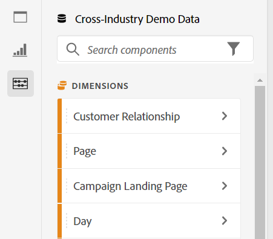

# Overzicht van Analysis Workspace

>[!NOTE]
>
>U bekijkt de documentatie voor Analysis Workspace in Customer Journey Analytics. De functieset wijkt enigszins af van [Analysis Workspace in het traditionele Adobe Analytics](https://experienceleague.adobe.com/docs/analytics/analyze/analysis-workspace/home.html?lang=en#analysis-workspace). [Meer informatie...](/help/getting-started/cja-aa.md)

Analysis Workspace is een flexibel browserprogramma waarmee u snel analyses kunt maken en inzichten kunt delen. Gebruikend de belemmering-en-dalingsinterface, kunt u uw analyse amberen, visualisaties toevoegen om gegevens aan het leven te brengen, een dataset te leiden, projecten met iedereen in uw organisatie te delen en te plannen.

Als u slechts een paar minuten hebt, bekijkt u dit korte overzicht om te zien wat mogelijk is.

>[!VIDEO](https://video.tv.adobe.com/v/26266/?quality=12)

## Customer Journey Analytics aanmelden {#login}

Als u Analysis Workspace wilt gaan gebruiken, meldt u zich aan bij Customer Journey Analytics door naar [experience.adobe.com/analytics](https://experience.adobe.com/analytics). U zult op de de lijsthomepage van het project van de Werkruimte landen, als een specifiek project niet eerder voor u is geselecteerd.

## De zelfstudie Training gebruiken {#training-tutorial}

Als u eenmaal bent aangemeld, moet de eerste stop de zelfstudie voor Analysis Workspace Training zijn, die u door algemene terminologie en stappen begeleidt voor het maken van uw eerste analyse in Workspace. Klik op **[!UICONTROL Create New Project]** en selecteer vervolgens **Lesbestand voor training** in het nieuwe project modal.

## Een nieuw project maken {#new-project}

Nu de zelfstudie is voltooid, kunt u beginnen met het bouwen van uw eerste project. De **nieuw project, modaal** biedt u verschillende opties om uw analyse te starten. U kunt ervoor kiezen om te beginnen met een leeg project of [leeg mobiel scorecard](/help/mobile-app/curator.md), afhankelijk van het feit of u uw analyse wilt delen vanuit de browser of de mobiele app Customer Journey Analytics dashboards.

## Uw analyse maken {#analysis}

In uw project van de Werkruimte, **deelvensters, tabellen, visualisaties en componenten** toegankelijk zijn vanaf de linkerspoorstaaf. Dit zijn uw projectbouwstenen.

### Onderdelen

**Componenten** zijn afmetingen, meetwaarden, filters, of datumwaaiers, die allen in kunnen worden gecombineerd **[!UICONTROL Freeform table]** om uw zakelijke vraag te beantwoorden. Zorg ervoor dat u zich vertrouwd maakt met elke [componenttype](/help/components/overview.md) voordat u in de analyse gaat duiken. Als u de componentterminologie hebt beheerst, kunt u beginnen met slepen en neerzetten naar [uw analyse maken](/help/analysis-workspace/build-workspace-project/freeform-overview.md) in een **[!UICONTROL Freeform table]**.

### Visualisaties

**Visualisaties**, zoals een staafdiagram of een lijndiagram, worden vervolgens boven op de gegevens toegevoegd om deze visueel tot leven te brengen. Selecteer het middelste spoor helemaal links **[!UICONTROL Visualizations]** pictogram om de volledige lijst van [visualisatie](/help/analysis-workspace/visualizations/freeform-analysis-visualizations.md) beschikbaar.

### Deelvensters

**Deelvensters** worden gebruikt om uw analyse binnen een project te organiseren en kunnen vele lijsten &amp; visualisaties bevatten. Veel van de deelvensters die in Analysis Workspace worden geleverd, genereren een volledige set analyses op basis van een paar gebruikersinvoer. Selecteer de bovenste spoorlijn helemaal links **[!UICONTROL Panels]** pictogram voor een volledige lijst met [deelvensters](/help/analysis-workspace/c-panels/panels.md) beschikbaar.

## Aanvullende bronnen {#resources}

* Adobe biedt honderden [Zelfstudies voor videotraining voor analyse](https://experienceleague.adobe.com/docs/analytics-learn/tutorials/overview.html).
