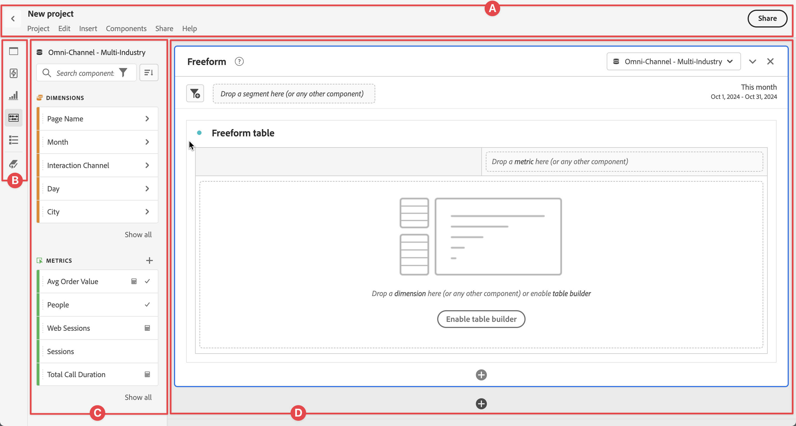

# Overzicht van Analysis Workspace {#analysis-workspace-overview}

Met Analysis Workspace kunt u snel analyses maken om inzichten te verzamelen en deze inzichten vervolgens met anderen te delen. Gebruikend de belemmering-en-dalings browser interface, kunt u uw analyse amberen, visualisaties toevoegen om gegevens aan het leven te brengen, een dataset in werking te stellen, en [ projecten ](/help/analysis-workspace/build-workspace-project/freeform-overview.md) met iedereen te delen en te plannen u kiest.

>[!BEGINSHADEBOX]

 [ de werkruimte van de Analyse ](https://video.tv.adobe.com/v/26266/?quality=12){target="_blank"}

>[!ENDSHADEBOX]

## Interface

In de volgende afbeelding en de bijbehorende tabel worden de belangrijkste elementen in de Analysis Workspace-gebruikersinterface uitgelegd:

| Locatie | Naam en functie |
|:---------:|----------|
| ?? | Bevat de naam van het project, een menustructuur aan toegangsfunctionaliteit, a knoop  om terug naar uw lijst van het Project terug te keren, en a **[!UICONTROL Share]** knoop aan [ deel uw project van Workspace ](/help/analysis-workspace/curate-share/share-projects.md).   selecteer de naam van uw project (bijvoorbeeld: Nieuw project) op elk ogenblik om de naam te veranderen.   Uitgezochte  om uw project als Favoriete project  te merken. |
| ?? | **paneel van de Knoop:** bevat knopen voor de toegang tot van de belangrijkste [ eigenschappen ](#features) van Analysis Workspace:<ul><li> [[!UICONTROL Panels]](/help/analysis-workspace/c-panels/panels.md)</li><li> [[!UICONTROL Guided Analysis]](/help/guided-analysis/overview.md)</li><li> [[!UICONTROL Visualizations]](/help/analysis-workspace/visualizations/freeform-analysis-visualizations.md)</li><li> [[!UICONTROL Components]](/help/components/overview.md)</li><li> [[!UICONTROL Table of contents]](/help/analysis-workspace/build-workspace-project/project-table-of-contents.md)</li><li> [[!UICONTROL Data Dictionary]](/help/components/data-dictionary/data-dictionary-overview.md)</li></ul> |
| ?? | **Linkerpaneel:** Dit gebied bevat individuele panelen, visualisaties, componenten, of lijsten. De inhoud is afhankelijk van de knop die in het deelvenster met knoppen is geselecteerd. |
| ?? | **Canvas:** het belangrijkste gebied waar u inhoud van het linkerpaneel sleept om uw project te bouwen. Het project wordt dynamisch bijgewerkt terwijl u deelvensters toevoegt, visualisaties toevoegt aan deelvensters en componenten toevoegt aan visualisaties. U kunt meerdere deelvensters maken en in elk deelvenster kunt u meerdere visualisaties maken.  elk paneel is gebaseerd op een geselecteerde gegevensmening. De geselecteerde gegevensweergave bepaalt de beschikbare componenten, zoals metriek en afmetingen. Zie [ Panelen - de mening van Gegevens ](/help/analysis-workspace/c-panels/panels.md#data-view) voor meer informatie. |

## Functies

De belangrijkste eigenschappen van Analysis Workspace zijn beschikbaar door het knooppaneel:

| Pictogram | Functie | Beschrijving |
|:---:|---|---|
|  | **[!UICONTROL Panels]** | [ de Comités ](/help/analysis-workspace/c-panels/panels.md) worden gebruikt om uw analyse binnen een project te organiseren en kunnen vele lijsten &amp; visualisaties bevatten. Veel van de deelvensters die in Analysis Workspace worden geleverd, genereren een volledige set analyses op basis van een paar gebruikersinvoer. |
|  | **[!UICONTROL Guided Analysis]** | [ Geleide analyse ](../guided-analysis/overview.md) staat u toe om hoogkwalitatieve gegevens en inzichten over de klantenreis door geleide werkschema&#39;s te dienen. U kunt een analyse maken voor opname in uw Workspace-project of een eerder opgeslagen bestaande analyse opnemen. |
|  | **[!UICONTROL Visualizations]** | [ Visualizations ](/help/analysis-workspace/visualizations/freeform-analysis-visualizations.md), zoals een bar of lijngrafiek, kan worden gebruikt om gegevens aan het leven visueel te brengen. Selecteer in het linkerbenedenpaneel het middelste pictogram **[!UICONTROL Visualizations]** om de volledige lijst met beschikbare visualisaties weer te geven. |
|  | **[!UICONTROL Components]** | [ Componenten ](/help/components/overview.md) omvatten de volgende elementen:<ul><li> [ Dimensionen ](/help/components/dimensions/overview.md)</li><li> [ Metriek ](/help/components/apply-create-metrics.md)</li><li>](/help/assets/icons/Segmentation.svg) [ Filters van de 1} Segmentatie </li><li> [ Datum ](/help/components/date-ranges/overview.md)</li></ul> |
|  | **[!UICONTROL Table of contents]** | De inhoudsopgave rangschikt alle deelvensters en visualisaties die deel uitmaken van het project in een inklapbare lijst, zodat u snel toegang hebt tot een specifiek deelvenster of een specifieke visualisatie. |
|  | **Woordenboek van Gegevens** | Het [ woordenboek van Gegevens ](/help/components/data-dictionary/data-dictionary-overview.md) helpt zowel gebruikers als beheerders spoor van houden en beter begrijpen de componenten in hun milieu van Analytics. |

## Menu

De meeste functies van Analysis Workspace zijn beschikbaar via slepen en neerzetten en via contextmenu&#39;s in deelvensters, visualisaties en componenten.

Functionaliteit is ook beschikbaar via het Workspace-menu en sneltoetsen of sneltoetsen. Sneltoetsen verschillen afhankelijk van het besturingssysteem waarop de browser wordt uitgevoerd. Zie de onderstaande tabellen voor een overzicht.

Op het toetsenbord kunnen de volgende symbolen worden gebruikt:

- **⇧** voor **[!UICONTROL *verschuiving *]**.
- **⌘** voor **[!UICONTROL *cmd *]**(bevel).
- **⌃** voor **[!UICONTROL *ctrl *]**(controle).
- **⌥** voor **[!UICONTROL *opt *]**(optie).
- **⎇** voor **[!UICONTROL *alt *]**(afwisselend).

Zie de onderstaande tabellen voor een overzicht van de beschikbare menu&#39;s.

| **[!UICONTROL Project]** | Sneltoets Mac | Sneltoetsvensters | Beschrijving |
|---|---|---|---|
| **[!UICONTROL Create project]** | **[!UICONTROL *shift+cmd+p *]** | **[!UICONTROL *shift+ctrl+p *]** | Maak een nieuw project. |
| **[!UICONTROL Create a mobile scorecard]** | | | [ creeer een nieuwe mobiele scorecard ](/help/mobile-app/create-scorecard.md). |
| **[!UICONTROL Open...]** | **[!UICONTROL *cmd+o *]** | **[!UICONTROL *ctrl+o *]** | [ Open een bestaand project ](/help/analysis-workspace/build-workspace-project/save-projects.md#open-another-project). |
| **[!UICONTROL Open previous version...]** | **[!UICONTROL *opt+cmd+o *]** | **[!UICONTROL *alt+ctrl+o *]** | [ Open vroegere versies van uw project ](/help/analysis-workspace/build-workspace-project/save-projects.md#open-previous-version). |
| **[!UICONTROL Save]** | **[!UICONTROL *cmd+s *]** | **[!UICONTROL *ctrl+s *]** | [ sparen uw project ](/help/analysis-workspace/build-workspace-project/save-projects.md#save-projects). |
| **[!UICONTROL Save with notes...]** | **[!UICONTROL *opt+cmd+s *]** | **[!UICONTROL *alt+ctrl+s *]** | [ voegt nota&#39;s aan de projectversie toe die u ](/help/analysis-workspace/build-workspace-project/save-projects.md#save-project-options) opslaat. |
| **[!UICONTROL Save as...]** | **[!UICONTROL *shift+cmd+s *]** | **[!UICONTROL *shift+ctrl+s *]** | [ sparen het project gebruikend een verschillende naam en details ](/help/analysis-workspace/build-workspace-project/save-projects.md#save-project-options). |
| **[!UICONTROL Refresh project]** | **[!UICONTROL *opt+r *]** | **[!UICONTROL *alt+r *]** | Vernieuw het project. |
| **[!UICONTROL Download CSV]** | **[!UICONTROL *shift+cmd+v *]** | **[!UICONTROL *shift+ctrl+v *]** | Download het project als CSV-bestand. |
| **[!UICONTROL Download PDF]** | **[!UICONTROL *shift+cmd+b *]** | **[!UICONTROL *shift+ctrl+b *]** | Download het project als een PDF-document. |
| **[!UICONTROL Project info & settings]** | | | Definieer instellingen voor uw projecten, zoals naam, labels, kleurenpalet en meer. |
| **[!UICONTROL User settings]** | | | [ vorm voorkeur voor het gebruiken van Analysis Workspace ](/help/analysis-workspace/user-preferences.md). |

| **[!UICONTROL Edit]** | Sneltoets Mac | Sneltoetsvensters | Beschrijving |
|---|---|---|---|
| **[!UICONTROL Undo]** | **[!UICONTROL *cmd+z *]** | **[!UICONTROL *ctrl+z *]** | Maak de vorige handeling ongedaan. |
| **[!UICONTROL Redo]** | **[!UICONTROL *cmd+shift+z *]** | **[!UICONTROL *ctrl+shift+z *]** | De vorige handeling opnieuw uitvoeren. |
| **[!UICONTROL Clear all]** | **[!UICONTROL *opt+w *]** | **[!UICONTROL *alt+w *]** | Alle deelvensters in het huidige project wissen. |

| **[!UICONTROL Insert]** | Sneltoets Mac | Sneltoetsvensters | Beschrijving |
|---|---|---|---|
| **[!UICONTROL Blank panel]** | **[!UICONTROL *opt+b *]** | **[!UICONTROL *alt+b *]** | Tussenvoegsel a [ Leeg paneel ](/help/analysis-workspace/c-panels/blank-panel.md). |
| **[!UICONTROL Media concurrent viewers]** | **[!UICONTROL *opt+h *]** | **[!UICONTROL *alt-h *]** | Tussenvoegsel a [ Medium gezamenlijke kijkers ](/help/analysis-workspace/c-panels/media-concurrent-viewers.md) paneel. |
| **[!UICONTROL Media playback time spent]** | **[!UICONTROL *opt+i *]** | **[!UICONTROL *alt+i *]** | Neem a [ doorgebrachte tijd van de media ](/help/analysis-workspace/c-panels/media-playback-time-spent.md) paneel op. |
| **[!UICONTROL Media average minute audience]** | **[!UICONTROL *opt+m *]** | **[!UICONTROL *alt+m *]** | Tussenvoegsel het gemiddelde minieme publiek van a [ Media ](/help/analysis-workspace/c-panels/average-minute-audience-panel.md) paneel. |
| **[!UICONTROL Attribution]** | **[!UICONTROL *opt+e *]** | **[!UICONTROL *alt+e *]** | Tussenvoegsel een [ paneel van de Attributie ](/help/analysis-workspace/c-panels/attribution.md). |
| **[!UICONTROL Freeform]** | **[!UICONTROL *opt+a *]** | **[!UICONTROL *alt+a *]** | Tussenvoegsel a [ vrije vorm ](/help/analysis-workspace/c-panels/freeform-panel.md) paneel. |
| **[!UICONTROL Quick insights]** | **[!UICONTROL *opt+j *]** | **[!UICONTROL *alt+j *]** | Tussenvoegsel a [ Snelle inzicht ](/help/analysis-workspace/c-panels/quickinsight.md) paneel. |
| **[!UICONTROL Experimentation]** | **[!UICONTROL *opt+x *]** | **[!UICONTROL *alt+x *]** | Tussenvoegsel een [ Experimentatie ](/help/analysis-workspace/c-panels/experimentation.md) paneel. |
| **[!UICONTROL Freeform table]** | **[!UICONTROL *opt+1 *]** | **[!UICONTROL *alt+1 *]** | Tussenvoegsel a [ Vrije vormlijst ](/help/analysis-workspace/visualizations/freeform-table/freeform-table.md) visualisatie. |
| **[!UICONTROL Line]** | **[!UICONTROL *opt+2 *]** | **[!UICONTROL *alt+2 *]** | Tussenvoegsel a [ lijn ](/help/analysis-workspace/visualizations/line.md) visualisatie. |
| **[!UICONTROL Bar]** | **[!UICONTROL *opt+3 *]** | **[!UICONTROL *alt+3 *]** | Tussenvoegsel a [ Bar ](/help/analysis-workspace/visualizations/bar.md) visualisatie. |
| **[!UICONTROL Combo]** | **[!UICONTROL *opt+4 *]** | **[!UICONTROL *alt+4 *]** | Tussenvoegsel a [ Combo ](/help/analysis-workspace/visualizations/combo-charts.md) visualisatie. |

| **[!UICONTROL Components]** | Sneltoets Mac | Sneltoetsvensters | Beschrijving |
|---|---|---|---|
| **[!UICONTROL Create filter...]** | **[!UICONTROL *shift+cmd+e *]** | **[!UICONTROL *shift+ctrl+e *]** | Creeer een nieuwe [ filter ](/help/components/filters/create-filters.md). |
| **[!UICONTROL Create metric...]** | **[!UICONTROL *shift+cmd+c *]** | **[!UICONTROL *shift+ctrl+c *]** | Creeer nieuw [ berekende metrisch ](/help/components/calc-metrics/calc-metr-overview.md). |
| **[!UICONTROL Create date range...]** | **[!UICONTROL *shift+cmd+d *]** | **[!UICONTROL *shift+ctrl+d *]** | Creeer een nieuwe [ datumwaaier ](/help/components/date-ranges/overview.md). |
| **[!UICONTROL Create annotation...]** | **[!UICONTROL *shift+cmd+o *]** | **[!UICONTROL *shift+ctrl+o *]** | Creeer een nieuwe [ aantekening ](/help/components/annotations/overview.md). |
| **[!UICONTROL Create audience...]** | **[!UICONTROL *shift+cmd+u *]** | **[!UICONTROL *shift+ctrl+u *]** | Creeer een nieuw [ publiek ](/help/components/audiences/audiences-overview.md). |
| **[!UICONTROL Refewsh components]** | **[!UICONTROL *opt+shift+r *]** | **[!UICONTROL *alt+shift+r *]** | Vernieuw de componenten in het project. |

| **[!UICONTROL Share]** | Sneltoets Mac | Sneltoetsvensters | Beschrijving |
|---|---|---|---|
| **[!UICONTROL Share with Workspace users]** | **[!UICONTROL *cmd+h *]** | **[!UICONTROL *ctrl+h *]** | [ Deel het project met andere gebruikers van Workspace ](/help/analysis-workspace/curate-share/share-projects.md#share-with-customer-journey-analytics-users-and-groups-in-your-organization). |
| **[!UICONTROL Share with anyone]** | **[!UICONTROL *opt+l *]** | **[!UICONTROL *alt+l *]** | [ Deel een read-only versie van het project met iedereen ](/help/analysis-workspace/curate-share/share-projects.md#share-a-link-to-a-project). |
| **[!UICONTROL Send file]** | **[!UICONTROL opt+s]** | **[!UICONTROL *alt+s *]** | [ verzend het project als CSV of PDF- dossier aan andere ontvangers ](/help/analysis-workspace/curate-share/send-schedule-files.md). |
| **[!UICONTROL Schedule file export]** | **[!UICONTROL *shift+opt+s *]** | **[!UICONTROL *shift+alt+s *]** | [ verzend het project op een programma als CSV of PDF- dossier aan andere ontvangers ](/help/analysis-workspace/curate-share/send-schedule-files.md). |
| **[!UICONTROL Curate project data]** | **[!UICONTROL *shift+cmd+g *]** | **[!UICONTROL *shift+ctrl+g *]** | [ Kromt de projectgegevens ](/help/analysis-workspace/curate-share/curate.md). |

| Help | Sneltoets Mac | Sneltoetsvensters | Beschrijving |
|---|---|---|---|
| **[!UICONTROL Videos]** | | | Open het Customer Journey Analytics YouTube-kanaal in een nieuw browsertabblad. |
| **[!UICONTROL Help documentation]** | | | Open de documentatie (u leest momenteel...) in een nieuw browser lusje. |
| **[!UICONTROL Help forum]** | | | Open het forum van Adobe Analytics Experience League-gemeenschappen in een nieuw browsertabblad. |
| **[!UICONTROL Hotkeys]** | | | Een overzicht weergeven van de sneltoetsen die u kunt gebruiken in Workspace. |
| **[!UICONTROL Enable debugger]** |  | | Schakel de foutopsporing in. Uw project wordt opnieuw geladen. |
| **[!UICONTROL Disable debugger]** | | | Schakel de foutopsporing uit. Uw project wordt opnieuw geladen. |
| **[!UICONTROL Performance]** | | | Een dialoogvenster weergeven met meetgegevens op de **[!UICONTROL Analysis Workspace performance]** . Gebruik **[!UICONTROL Download as CSV]** om een CSV-bestand met prestatiegegevens te downloaden. |
| **[!UICONTROL About Workspace]** | | | Dialoogvenster **[!UICONTROL About Analysis Workspace]** weergeven met versiegegevens, toegangsniveaus voor functies en markeringen voor actieve functies. |

## Gegevensbronnen

U synchroniseert visualisaties om te bepalen welke datatabel of gegevensbron met een visualisatie correspondeert. Zie [ gegevensbronnen ](/help/analysis-workspace/visualizations/t-sync-visualization.md) voor meer informatie beheren.

## Analysis Workspace gebruiken

Ga als volgt te werk om Analysis Workspace te gebruiken:

1. Login aan [ Adobe Experience Cloud ](https://experience.adobe.com).
1. Selecteer **[!UICONTROL Customer Journey Analytics]** van app schakelaar  bij het hoogste recht van de interface.
1. De pagina **[!UICONTROL Projects]** van Analysis Workspace wordt standaard weergegeven. Als een specifiek project voor u is geselecteerd of u onlangs hebt gewerkt, dan wordt dat project getoond door gebrek.

### Een project maken

Een analyse in Analysis Workspace wordt bedoeld als a [ project ](/help/analysis-workspace/build-workspace-project/freeform-overview.md).

U kunt een project in Analysis Workspace tot stand brengen zoals die in [ wordt beschreven leidt tot projecten ](/help/analysis-workspace/build-workspace-project/create-projects.md).

De projecten kunnen in omslagen en subfolders worden georganiseerd, zoals die in [ Omslagen in Analysis Workspace ](/help/analysis-workspace/build-workspace-project/workspace-folders/about-folders.md) worden beschreven.

### Een project opslaan en delen

Aangezien u een analyse in Analysis Workspace creeert, wordt uw werk [ automatisch bewaard ](/help/analysis-workspace/build-workspace-project/save-projects.md).

Wanneer je klaar bent met het uitbouwen van het project en het is het verzamelen van actioneerbare inzichten, kunnen anderen het project willen consumeren. U kunt het project met gebruikers en groepen in uw organisatie, of zelfs met mensen buiten uw organisatie delen. Voor informatie over het delen van een project, zie [ projecten van het Aandeel ](/help/analysis-workspace/curate-share/share-projects.md).

## Aanvullende bronnen {#resources}

- Het [ Leren die ](/help/getting-started/landing.md#learning) pagina in Customer Journey Analytics landen. Deze pagina is een uitstekende manier om kennis te maken met Analysis Workspace. Met name het leren van Workspace Fundamentaal. Deze sjabloon begeleidt u door algemene terminologie en stappen voor het maken van uw eerste analyse in Workspace
- De Adobe biedt honderden [ videoopleidingsleerprogramma&#39;s van Analytics ](https://experienceleague.adobe.com/en/docs/analytics-learn/tutorials/overview) aan.
- Zie [ de versienota&#39;s van Adobe Experience Cloud ](https://experienceleague.adobe.com/en/docs/release-notes/experience-cloud/current) voor updates over nieuwe eigenschappen.

