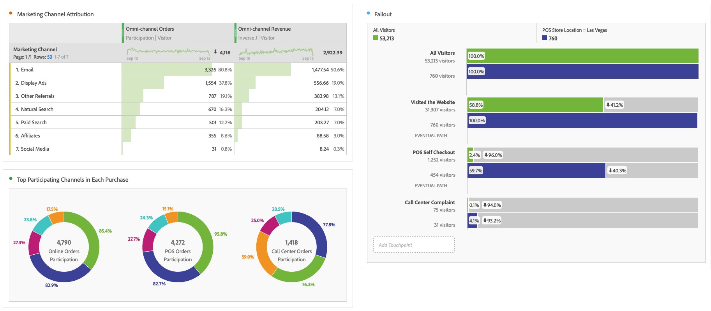

# Geavanceerde analyse uitvoeren

>[!NOTE]
>
>U bekijkt de documentatie voor Analysis Workspace in Customer Journey Analytics. De functieset verschilt enigszins van [Analysis Workspace in traditionele Adobe Analytics](https://experienceleague.adobe.com/docs/analytics/analyze/analysis-workspace/home.html). [Meer informatie...](/help/getting-started/cja-aa.md)

Geavanceerde analyse maakt gebruik van functies zoals [Flow](/help/analysis-workspace/visualizations/c-flow/flow.md) diagrammen, [Attribution IQ](/help/analysis-workspace/attribution/overview.md), [Fallout](/help/analysis-workspace/visualizations/fallout/fallout-flow.md) diagrammen, en [Dimensie destoringen](/help/components/dimensions/t-breakdown-fa.md).

