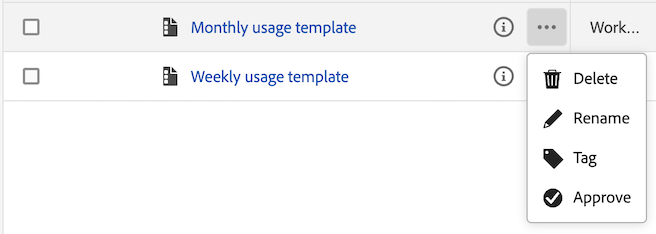

# Sjablonen maken en beheren

Beheerders kunnen sjablonen maken en deze opslaan voor gebruik door anderen in hun aanmeldingsbedrijf.

De mensen in het login bedrijf kunnen deze bedrijfmalplaatjes gebruiken zoals die in [ worden beschreven malplaatjes van het Gebruik ](/help/analysis-workspace/templates/use-templates.md).

## Een sjabloon maken

Om een nieuw malplaatje tot stand te brengen dat door mensen in uw login bedrijf kan worden gebruikt:

1. In Analysis Workspace, bouw een project aan uw gewenste staat.

1. Selecteer [!UICONTROL **Project**] > **[!UICONTROL Save as template…]**.

   

1. Geef de volgende informatie op in het dialoogvenster [!UICONTROL Save as template] :

   | Veld | Beschrijving |
   |---------|----------|
   | **[!UICONTROL Name]** | Geef een beschrijvende naam op voor de sjabloon. |
   | **[!UICONTROL Description]** | Geef een korte beschrijving voor de sjabloon waarin het beoogde gebruik wordt beschreven. |
   | **[!UICONTROL Why use this template]** | Geef een korte uitleg om mensen in de organisatie te informeren over de manier waarop deze sjabloon kan worden gebruikt. Deze uitleg wordt weergegeven op de voorbeeldpagina van de sjabloon. |
   | **[!UICONTROL Channels]** | Kies de kanalen die van toepassing zijn op deze sjabloon. U kunt meerdere kanalen selecteren: **[!UICONTROL Web]**, **[!UICONTROL Mobile]**, **[!UICONTROL Cross-channel]**, **[!UICONTROL Call center]** en **[!UICONTROL In-store]** .
De selecties die u kiest, bepalen waar de sjabloon wordt weergegeven en welke filters van toepassing zijn voor gebruikers die deze openen op de pagina Organisatiesjablonen.
 |
   | **[!UICONTROL Use cases]** | Kies de gebruikscategorieën die van toepassing zijn op deze sjabloon. U kunt meerdere gebruiksgevallen selecteren: **[!UICONTROL Engagement]**, **[!UICONTROL Conversion]**, **[!UICONTROL Audience]**, **[!UICONTROL Acquisition]** en **[!UICONTROL Journey Optimizer]** . 
De selecties die u kiest, bepalen de locatie van de sjabloon op de pagina Organisatiesjablonen. Gebruikers kunnen naar de sjabloon navigeren of de lijst filteren op gebruik. 

**Nota:** het kiezen **[!UICONTROL Journey Optimizer]** maakt het malplaatje ook beschikbaar in Adobe Journey Optimizer. In Journey Optimizer is op de pagina **[!UICONTROL Reports]** een vervolgkeuzemenu beschikbaar waarmee gebruikers deze sjabloon of de standaardsjabloon kunnen selecteren. Voor meer informatie, zie [ begonnen worden met de bijgewerkte rapporteringservaring ](https://experienceleague.adobe.com/en/docs/journey-optimizer/using/reporting/channel-report/report-gs-cja) in de documentatie van Journey Optimizer. |
   | **[!UICONTROL Journey Optimizer activity type]** | Kies het type Journey Optimizer-activiteit dat u aan deze sjabloon wilt koppelen: **[!UICONTROL Campaigns]** , **[!UICONTROL Journeys]** , **[!UICONTROL Landing pages]** , **[!UICONTROL Reports]** of **[!UICONTROL Subscriptions]** . 
Laat dit veld leeg als u deze sjabloon wilt koppelen aan alle typen activiteiten.

Dit veld wordt alleen weergegeven als **[!UICONTROL Journey Optimizer]** is geselecteerd in het veld **[!UICONTROL Use cases]** .
 |
   | **[!UICONTROL Journey Optimizer activity]** | Kies de Journey Optimizer-activiteit die u aan deze sjabloon wilt koppelen. 
Laat dit veld leeg als u wilt dat deze sjabloon wordt gekoppeld aan alle activiteiten van het geselecteerde type activiteit.

Dit veld wordt alleen weergegeven als **[!UICONTROL Journey Optimizer]** is geselecteerd in het veld **[!UICONTROL Use cases]** .
 |
   | **[!UICONTROL Tags]** | Geef de tags op die u op de sjabloon wilt toepassen. Mensen kunnen de lijst met sjablonen filteren op de tags die u toevoegt. |

1. Selecteer [!UICONTROL **sparen als malplaatje**].

Voor informatie over hoe de gebruikers een project kunnen tot stand brengen dat op een malplaatje wordt gebaseerd, zie [ een project creëren dat op een malplaatje ](/help/analysis-workspace/templates/use-templates.md#create-a-project-based-on-a-template) wordt gebaseerd in [ malplaatjes van het Gebruik ](/help/analysis-workspace/templates/use-templates.md).

## Een sjabloon bewerken of verwijderen

Beheerders kunnen bedrijfssjablonen bewerken of verwijderen.

1. In Analysis Workspace, selecteer het [!UICONTROL **Workspace**] lusje, dan onder **[!UICONTROL Templates]** in het linkerspoor, uitgezochte **[!UICONTROL _login_company_name _malplaatjes]**.

1. Als u malplaatjes in een pictogram van de kolommening  bekijkt:

   1. Ga naar de sjabloon die u wilt bewerken of verwijderen, selecteer het informatiepictogram naast de sjabloonnaam.

      

   1. Selecteer **[!UICONTROL Preview]** .

   1. Selecteer het pictogram Meer en selecteer vervolgens **[!UICONTROL Edit]** of **[!UICONTROL Delete]** .

       uit

1. Als u malplaatjes in een pictogram van de kaartmening  bekijkt:

   1. Zoek de sjabloon die u wilt bewerken of verwijderen.

      

   1. Houd de cursor boven de sjabloon en selecteer vervolgens **[!UICONTROL Preview]** .

   1. Selecteer het pictogram Meer en selecteer vervolgens **[!UICONTROL Edit]** of **[!UICONTROL Delete]** .

      

1. Als u een malplaatje uitgeeft, maak om het even welke gewenste uitgeeft, dan uitgezocht [!UICONTROL **Project**] > **[!UICONTROL Save as template…]**.

   

1. Geef de volgende informatie op in het dialoogvenster [!UICONTROL Save as template] :

   | Veld | Beschrijving |
   |---------|----------|
   | **[!UICONTROL Name]** | Geef een beschrijvende naam op voor de sjabloon. |
   | **[!UICONTROL Description]** | Geef een korte beschrijving voor de sjabloon waarin het beoogde gebruik wordt beschreven. |
   | **[!UICONTROL Why use this template]** | Geef een korte uitleg om mensen in de organisatie te informeren over de manier waarop deze sjabloon kan worden gebruikt. Deze uitleg wordt weergegeven op de voorbeeldpagina van de sjabloon. |
   | **[!UICONTROL Channels]** | Kies de kanalen die van toepassing zijn op deze sjabloon. U kunt meerdere kanalen selecteren: **[!UICONTROL Web]**, **[!UICONTROL Mobile]**, **[!UICONTROL Cross-channel]**, **[!UICONTROL Call center]** en **[!UICONTROL In-store]** . Als er geen kanalen zijn geselecteerd, wordt de sjabloon bij alle kanalen gevoegd.
De selecties die u kiest, bepalen waar de sjabloon wordt weergegeven en welke filters van toepassing zijn voor gebruikers die deze openen op de pagina Organisatiesjablonen.
 |
   | **[!UICONTROL Use cases]** | Kies de gebruikscategorieën die van toepassing zijn op deze sjabloon. U kunt meerdere gebruiksgevallen selecteren: **[!UICONTROL Engagement]**, **[!UICONTROL Conversion]**, **[!UICONTROL Audience]**, **[!UICONTROL Acquisition]** en **[!UICONTROL Journey Optimizer]** . 
De selecties die u kiest, bepalen de locatie van de sjabloon op de pagina Organisatiesjablonen. Gebruikers kunnen naar de sjabloon navigeren of de lijst filteren op gebruik. 

**Nota:** het kiezen **[!UICONTROL Journey Optimizer]** maakt het malplaatje ook beschikbaar in Adobe Journey Optimizer. In Journey Optimizer is op de pagina **[!UICONTROL Reports]** een vervolgkeuzemenu beschikbaar waarmee gebruikers deze sjabloon of de standaardsjabloon kunnen selecteren. Voor meer informatie, zie [ begonnen worden met de bijgewerkte rapporteringservaring ](https://experienceleague.adobe.com/en/docs/journey-optimizer/using/reporting/channel-report/report-gs-cja) in de documentatie van Journey Optimizer. |
   | **[!UICONTROL Journey Optimizer activity type]** | Kies het type Journey Optimizer-activiteit dat u aan deze sjabloon wilt koppelen: **[!UICONTROL Campaigns]** , **[!UICONTROL Journeys]** , **[!UICONTROL Landing pages]** , **[!UICONTROL Reports]** of **[!UICONTROL Subscriptions]** . 
Laat dit veld leeg als u deze sjabloon wilt koppelen aan alle typen activiteiten.

Dit veld wordt alleen weergegeven als **[!UICONTROL Journey Optimizer]** is geselecteerd in het veld **[!UICONTROL Use cases]** .
 |
   | **[!UICONTROL Journey Optimizer activity]** | Kies de Journey Optimizer-activiteit die u aan deze sjabloon wilt koppelen. 
Laat dit veld leeg als u wilt dat deze sjabloon wordt gekoppeld aan alle activiteiten van het geselecteerde type activiteit.

Dit veld wordt alleen weergegeven als **[!UICONTROL Journey Optimizer]** is geselecteerd in het veld **[!UICONTROL Use cases]** .
 |
   | **[!UICONTROL Tags]** | Geef de tags op die u op de sjabloon wilt toepassen. Mensen kunnen de lijst met sjablonen filteren op de tags die u toevoegt. |

1. Selecteer [!UICONTROL **sparen als malplaatje**].

## Sjablonen hernoemen, labelen of goedkeuren

Beheerders kunnen bedrijfssjablonen hernoemen, labelen en goedkeuren.

1. In Analysis Workspace, selecteer het [!UICONTROL **Workspace**] lusje, dan selecteer **[!UICONTROL Projects tab]** in het linkerspoor.

1. Selecteer het filterpictogram om de lijst met projecten te filteren.

1. In het filterspoor, uitgezochte **ANDERE FILTERS** en selecteer dan **de malplaatjes van het Bedrijf**.

   Er wordt een lijst met bedrijfssjablonen weergegeven. Alle gewone projecten worden niet weergegeven, tenzij ze vastgezet zijn.

   De malplaatjes van het bedrijf kunnen door het  worden geïdentificeerd die de malplaatjenaam voorafgaat.

   

1. Klik op het pictogram **...** elilpsis naast een sjabloon om de beschikbare opties weer te geven.

   

1. Selecteer **[!UICONTROL Rename]**, **[!UICONTROL Tag]** of **[!UICONTROL Approve]** .

   U kunt een malplaatje ook schrappen, of u kunt een malplaatje schrappen zoals die in [ wordt beschreven uitgeven of malplaatjes ](#edit-or-delete-templates) schrappen.

1. (Optioneel) Schakel **[!UICONTROL Company templates]** uit als u wilt terugkeren naar de standaardweergave in de filterrail.

## Ontbrekende componenten toevoegen aan de gegevensweergave voor een bepaalde sjabloon

Door gebrek, zullen sommige malplaatjes die door Adobe worden verstrekt niet werken omdat zij componenten bevatten die niet in uw gegevensmening zijn.

Voor elke ontbrekende component is er een contextlabel beschikbaar in de gegevensweergave. U moet het overeenkomende contextlabel toevoegen aan een component die zich al in de gegevensweergave bevindt, of u moet een nieuwe component aan de gegevensweergave toevoegen en er een contextlabel aan toevoegen.

Ontbrekende componenten toevoegen aan een sjabloon:

1. In Analysis Workspace, selecteer [!UICONTROL **Workspace**] tabel, dan onder **[!UICONTROL Templates]** in het linkerspoor, uitgezochte **[!UICONTROL Adobe templates]**.

1. Selecteer het filterpictogram om de lijst met sjablonen te filteren.

1. Selecteer **[!UICONTROL Not ready for use]** om sjablonen weer te geven waarvoor componenten nodig zijn die zich niet in de gegevensweergave bevinden.

    mist

1. Zoek een sjabloon die nog niet kan worden gebruikt in de gegevensweergave.

1. Voer een van de volgende handelingen uit:

   * **als u malplaatjes in een kolommening**  bekijkt:

      1. Ga naar de sjabloon die nog niet kan worden gebruikt in de gegevensweergave en selecteer vervolgens het informatiepictogram naast de sjabloonnaam.

         

      1. Selecteer **[!UICONTROL Preview]** .

         

   * **als u malplaatjes in een kaartmening**  bekijkt:

      1. Zoek de sjabloon die nog niet kan worden gebruikt in de gegevensweergave.

         

      1. Houd de cursor boven de sjabloon en selecteer vervolgens **[!UICONTROL Preview]** .

         

1. In de sectie **[!UICONTROL Missing components]** wordt een lijst met componenten weergegeven die ontbreken in de gegevensweergave. Selecteer **[!UICONTROL Add these components to your data view]** .

   De configuratiepagina voor de gegevensweergave wordt weergegeven op een nieuw tabblad.

1. Selecteer de tab **[!UICONTROL Components]** voor de gegevensweergave.

   

1. Voer een van de volgende handelingen uit op het tabblad **[!UICONTROL Components]** voor elke component die in de sjabloon als ontbrekend werd weergegeven:

   * Selecteer in de sectie **[!UICONTROL Included components]** een component die al is opgenomen in de gegevensweergave die u voor de ontbrekende component wilt gebruiken.

   * Voeg een nieuwe component aan de gegevensmening toe die u voor de ontbrekende component wilt gebruiken, dan selecteer de component.

     Als u een nieuwe component aan de gegevensweergave wilt toevoegen, zoekt u in de lijst met schemavelden en sleept u deze naar de sectie **[!UICONTROL Included components]** .

1. Selecteer de component en zoek het vervolgkeuzemenu **[!UICONTROL Context labels]** in de rechterkolom.

   

1. Selecteer in het vervolgkeuzemenu **[!UICONTROL Context labels]** het contextlabel dat dezelfde naam heeft als de ontbrekende component.

1. Selecteer **[!UICONTROL Save and continue]** .

1. Herhaal voor elke ontbrekende component het proces waarbij u het overeenkomende contextlabel toevoegt aan een component in de gegevensweergave.

## Toegang tot een bedrijfssjabloon

Net als met sjablonen die door Adobe worden verschaft, kunnen gebruikers in de organisatie toegang krijgen tot sjablonen die beheerders maken.

Voor informatie over hoe te om tot een bedrijfmalplaatje toegang te hebben, zie [ Toegang en stel een malplaatje ](/help/analysis-workspace/templates/use-templates.md#access-and-run-a-template) in [ malplaatjes van het Gebruik ](/help/analysis-workspace/templates/use-templates.md) in werking.
