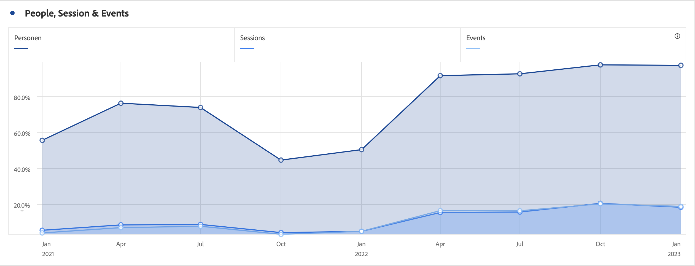

# Gebied (gestapeld)

>[!BEGINSHADEBOX]

_dit artikel documenteert het Gebied en Gebied gestapelde visualisaties in_  _&#x200B;**Customer Journey Analytics**._ _zie [&#x200B; Gebied en gebied gestapeld &#x200B;](https://experienceleague.adobe.com/nl/docs/analytics/analyze/analysis-workspace/visualizations/area) voor_  _&#x200B;**Adobe Analytics** versie van dit artikel._

>[!ENDSHADEBOX]

De gebiedvisualisatie heeft een standaard en gestapelde optie.

## Gebied {#area}

<!-- markdownlint-disable MD034 -->

>[!CONTEXTUALHELP]
>id="workspace_area_button"
>title="Vlakgrafiek"
>abstract="Maak een vlakgrafiekvisualisatie die de doorsnede van meerdere metingen vertegenwoordigt."

<!-- markdownlint-enable MD034 -->

 **[!UICONTROL Area]** visualisatie is als een lijngrafiek, maar met een gekleurd gebied onder de lijn. Voeg een vlakgrafiek toe wanneer u meerdere maateenheden hebt en u het gebied wilt visualiseren dat wordt uitgedrukt door het snijpunt van twee of meer maateenheden.

 tonen

## Gebied gestapeld {#area-stacked}

<!-- markdownlint-disable MD034 -->

>[!CONTEXTUALHELP]
>id="workspace_areastacked_button"
>title="Gebied gestapeld"
>abstract="Maak een vlakgrafiekvisualisatie die de stapeling van meerdere metingen vertegenwoordigt."

<!-- markdownlint-enable MD034 -->

De  **[!UICONTROL Area stacked]** visualisatie is als een Gebied, maar elke reeks begint bij de bovenkant van de vorige reeks.

Gebruik de **[!UICONTROL 100% stacked]** optie in  **[!UICONTROL Settings]** om de grafiek in een 100% gestapelde visualisatie te veranderen.

>[!BEGINSHADEBOX]

Zie  [&#x200B; visualisatie van het Gebied &#x200B;](https://experienceleague.adobe.com/nl/docs/customer-journey-analytics-learn/tutorials/analysis-workspace/visualizations/add-area-visualizations){target="_blank"} voor een demo video.

>[!ENDSHADEBOX]

>[!MORELIKETHIS]
>
>[&#x200B; voeg een visualisatie aan een paneel toe &#x200B;](/help/analysis-workspace/visualizations/freeform-analysis-visualizations.md#add-visualizations-to-a-panel)
>[Visualisatie-instellingen &#x200B;](/help/analysis-workspace/visualizations/freeform-analysis-visualizations.md#settings)
>[Contextmenu Visualisatie &#x200B;](/help/analysis-workspace/visualizations/freeform-analysis-visualizations.md#context-menu)
>
