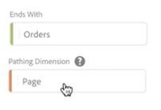

# Een stroomvisualisatie configureren

Stroomvisualisaties helpen u de reis te begrijpen die voortvloeit uit of leidt tot een specifieke conversiegebeurtenis op uw website of uw app. Het traceert een pad door uw dimensies (en dimensie-items) of metriek.

Met stroomvisualisaties kunt u het begin of einde van het pad configureren waarin u bent geïnteresseerd, of alle paden analyseren die door een dimensie- of dimensie-item lopen.

## Stroomvisualisatie maken {#configure}

1. Voeg een leeg paneel aan uw project toe, selecteer het pictogram Visualisaties in de linkerspoorstaaf, dan sleep [!UICONTROL **Stroom**] visualisatie in het deelvenster.

   of

   Voeg een visualisatie op om het even welke die manieren toe in de sectie &quot;van de Vormgeving aan een paneel&quot;worden beschreven in [Overzicht van visualisaties](/help/analysis-workspace/visualizations/freeform-analysis-visualizations.md).

1. Veranker uw stroomvisualisatie met een van de volgende opties:

   * [!UICONTROL **Begint met**] (maateenheden, afmetingen of items), of
   * [!UICONTROL **Bevat**] (dimensies, of items), of
   * [!UICONTROL **Eindigt met**] (maateenheden, afmetingen of items)

   Elk van deze categorieën wordt op het scherm weergegeven als een &quot;dropzone&quot;. U kunt de neerzetzone op drie manieren vullen:

   * Gebruik het keuzemenu om metriek of afmetingen te selecteren.
   * Sleep afmetingen of metriek van de linkerspoorstaaf.
   * Typ de naam van een dimensie of metrisch en selecteer deze wanneer deze in de vervolgkeuzelijst wordt weergegeven.

   >[!IMPORTANT]
   >
   >Berekende metriek kan niet worden gebruikt in de  **[!UICONTROL Starts with]** of **[!UICONTROL Ends with]** velden.

1. Als u metrisch kiest, moet u ook verstrekken [!UICONTROL **Paden, Dimension**] om te gebruiken als het pad dat naar of van de geselecteerde component leidt, zoals u hier ziet. De standaardwaarde is [!UICONTROL **Pagina**].

   

1. (Optioneel) Selecteer **[!UICONTROL Show advanced settings]** om een van de volgende opties te configureren:

   

   | Instelling | Beschrijving |
   | --- | --- |
   | **[!UICONTROL Wrap labels]** | Normaal gesproken worden de labels op de Flow-elementen ingekort om de schermruimte op te slaan, maar u kunt het volledige label zichtbaar maken door dit selectievakje in te schakelen.  Standaard = uitgeschakeld. |
   | **[!UICONTROL Include repeat instances]** | Stroomvisualisaties zijn gebaseerd op instanties van een dimensie. Met deze instelling kunt u herhaalde exemplaren, zoals opnieuw laden van pagina&#39;s, opnemen of uitsluiten. Herhalingen kunnen echter niet worden verwijderd uit Flow-visualisaties met multigetaxeerde afmetingen, zoals listVars, listProps, s.product, merchandising Vars, enz. 
Deze optie is standaard uitgeschakeld.
 |
   | **[!UICONTROL Limit to first/last occurrence]** | Beperk paden tot paden die beginnen/eindigen met de eerste/laatste instantie van een dimensie/item/metrisch. Zie de onderstaande paragraaf. [Voorbeeldscenario voor &#39;beperking tot eerste/laatste voorkomen&#39;](#example-scenario-for-limit-to-firstlast-occurrence)voor een nadere toelichting. |
   | **[!UICONTROL Number of columns]** | Het aantal kolommen u in uw diagram van de Stroom wilt. U kunt maximaal vijf kolommen opgeven. |
   | **[!UICONTROL Items expanded per column]** | Het aantal items dat u in elke kolom wilt opnemen. U kunt maximaal tien items opgeven die per kolom worden uitgevouwen. |
   | **[!UICONTROL Flow container]** | <ul><li>Bezoek</li><li>Bezoeker</li></ul> Hiermee kunt u schakelen tussen Bezoek en Bezoeker om het plakken van bezoekers te analyseren. Met deze instellingen kunt u de betrokkenheid van bezoekers op bezoekersniveau (verschillende bezoeken) begrijpen of de analyse beperken tot één bezoek. |

   >[!IMPORTANT]
   >
   >De combinatie van **[!UICONTROL Number of columns]** en **[!UICONTROL Items expanded per column]** bepaal het aantal onderliggende verzoeken die worden vereist om de stroomvisualisatie tot stand te brengen. Hoe hoger deze getallen, hoe langer het duurt om een visualisatie te renderen.

1. Selecteren **[!UICONTROL Build]**.

>[!INFO]
>
>**Voorbeeld:** Stel dat u het pad wilt overtrekken dat gebruikers naar en van de populairste pagina&#39;s op uw site hebben gekozen.
>
>Om dit te doen, zou u
>
>1. Beginnen met het maken van een stroomvisualisatie zoals hierboven beschreven.
>1. Sleep de [!UICONTROL **Pagina**] in de **[!UICONTROL Contains]** veld, selecteer vervolgens [!UICONTROL **Opbouwen**].
>1. De stroomvisualisatie bouwt verder met de meest bekeken pagina zichtbaar in het focusknooppunt in het midden van de visualisatie. U ziet ook de bovenste pagina&#39;s die naar die pagina lopen (links van het focusknooppunt) en de bovenliggende pagina&#39;s die uit die focuspagina lopen (rechts van het focusknooppunt).
>1. Gegevens in de flow analyseren, zoals beschreven in [De stroomuitvoer weergeven en wijzigen](#view-and-change-the-flow-output).

## De stroomuitvoer weergeven en wijzigen {#output}

Een samenvatting van de configuratie van de Stroom verschijnt bij de bovenkant van het diagram. De paden in het diagram zijn proportioneel. Paden met meer activiteit lijken dikker.

Als u verder naar de gegevens wilt gaan, hebt u verschillende opties:

* Het stroomdiagram is interactief. Plaats de muis boven het diagram om de weergegeven details te wijzigen.

* Wanneer u op een knoop in het diagram klikt, verschijnen de details voor die knoop. Klik nogmaals op het knooppunt om het samen te vouwen.

  

* U kunt een kolom filteren om alleen bepaalde resultaten weer te geven, zoals inclusief en exclusief, het opgeven van criteria enzovoort.

* Klik op het plusteken (+) links om een kolom uit te vouwen.

* Met de rechtermuisknop klikt u op de opties die hieronder worden uitgelegd, om de uitvoer verder aan te passen.

* Klik op het potloodpictogram naast het configuratieoverzicht om de flow verder te bewerken of opnieuw samen te stellen met andere opties.

* U kunt uw diagram van de Stroom als deel van het .CSV dossier van een project ook uitvoeren en verder analyseren door te gaan naar **[!UICONTROL Project]** > **[!UICONTROL Download CSV]**.

## Filteren

Boven elke kolom wordt een filter weergegeven wanneer u de muisaanwijzer op de kolom plaatst. Door op het filter te klikken, krijgt u hetzelfde filterdialoogvenster als dat in de tabel Freeform van vandaag bestaat. Dit filter werkt hetzelfde als in de tabel Freeform.

* Gebruik geavanceerde instellingen om bepaalde criteria op te nemen in of uit te sluiten van onze lijst met operatoren.
* Zodra u een punt van de lijst hebt gefiltreerd, zal die specifieke kolom het filtreren weerspiegelen. (Het filter verlaagt het zodat alleen het item wordt weergegeven dat in het filter is toegestaan, of verwijdert alle items behalve het item dat u in het filter wilt gebruiken.
* Alle stroomafwaartse en stroomopwaartse kolommen zouden moeten blijven, zolang er gegevens zijn die in de resterende knopen stromen.
* Nadat het filterpictogram is toegepast, wordt het in blauw weergegeven boven de kolom waarop het filter wordt toegepast.
* Als u een filter wilt verwijderen, klikt u op het filterpictogram om het filtermenu te openen. Verwijder alle toegepaste filters en klik vervolgens op **[!UICONTROL Save]**. De flow moet terugkeren naar de vorige ongefilterde toestand.

## Klikopties met de rechtermuisknop {#right-click}

| Optie | Beschrijving |
|--- |--- |
| [!UICONTROL Focus on this node] | Wijzig de focus in het geselecteerde knooppunt. Het focusknooppunt verschijnt in het midden van het stroomdiagram. |
| [!UICONTROL Start over] | Hiermee gaat u terug naar de constructor van het Freeform-diagram, waar u een nieuw stroomdiagram kunt maken. |
| [!UICONTROL Create filter for this path] | Maak een filter. Dit neemt u in de Bouwer van de Filter, waar u de nieuwe filter kunt vormen. |
| [!UICONTROL Breakdown] | Verdeel de knoop neer door beschikbare Dimensionen, Metriek, of Tijd. |
| [!UICONTROL Filter column] | Dezelfde filteropties worden weergegeven als beschikbaar zijn in de tabel Vrije vorm. Zie voor meer informatie over de beschikbare opties de sectie &quot;Een eenvoudig of geavanceerd filter toepassen op een tabel&quot; in [Tabellen filteren en sorteren](/help/analysis-workspace/visualizations/freeform-table/filter-and-sort.md). |
| [!UICONTROL Exclude item]/[!UICONTROL Restore excluded items] | Hiermee verwijdert u een specifiek knooppunt uit de kolom en maakt u het automatisch als filter boven aan de kolom. Als u het uitgesloten item wilt herstellen, klikt u nogmaals met de rechtermuisknop en selecteert u **[!UICONTROL Restore Excluded Item]**. U kunt het filter ook boven aan de kolom openen en de pillarbox verwijderen met het item dat u zojuist hebt uitgesloten. |
| [!UICONTROL Trend] | Creeer een trended diagram voor de knoop. |
| Volgende kolom tonen/Vorige kolom tonen | Geeft de volgende (rechts) of vorige (links) kolom van de visualisatie aan. |
| Kolom verbergen | Hiermee verbergt u de geselecteerde kolom uit de visualisatie. |
| [!UICONTROL Expand entire column] | Breid een kolom uit om alle knopen te tonen. Standaard worden alleen de bovenste vijf knooppunten weergegeven. |
| publiek maken van selectie | Hiermee maakt u een publiek op basis van de geselecteerde kolom. |
| [!UICONTROL Collapse entire column] | Alle knooppunten in een kolom verbergen. |

## Voorbeeldscenario voor &#39;beperking tot eerste/laatste voorkomen&#39;

Houd er bij het gebruik van deze optie rekening mee dat:

* **[!UICONTROL Limit to first/last occurrence]** alleen het eerste/laatste exemplaar in de reeks telt. Alle andere exemplaren van het **[!UICONTROL Starts with]** of **[!UICONTROL Ends with]** criteria worden genegeerd.
* Indien gebruikt met een **[!UICONTROL Starts with]** stroom, slechts wordt het eerste voorkomen dat de begincriteria aanpast inbegrepen.
* Indien gebruikt met een **[!UICONTROL Ends with]** flow, alleen de laatste instantie die aan de eindcriteria voldoet, wordt opgenomen.
* De gebruikte reeks verschilt op basis van de container. Als u de **[!UICONTROL Visit]** container, de reeks gebeurtenissen zal de zitting zijn. Als u de **[!UICONTROL Visitor]** container, zullen de reeks gebeurtenissen alle gebeurtenissen voor een bepaalde gebruiker in de verstrekte datumwaaier zijn.
* De **[!UICONTROL Limit to first/last occurrence]** Deze optie kan in de geavanceerde instellingen worden geconfigureerd wanneer u een Metrisch of Dimension-item gebruikt in de velden &quot;Begint met&quot; of &quot;Eindigt met&quot;.

Voorbeelden van gebeurtenissen:

Home > Producten > Toevoegen aan winkelwagentje > Producten > Toevoegen aan winkelwagentje > Facturering > Bevestiging bestellen

### Overweeg een stroomanalyse met behulp van de volgende instellingen:

* Beginnen met[!UICONTROL  Add to cart] (Dimension-item)
* [!UICONTROL Page] schilderdimensie
* [!UICONTROL Visit] container

Als &quot;Beperken tot eerste/laatste voorkomen&quot; is uitgeschakeld, telt deze enkele reeks gebeurtenissen 2 exemplaren van &quot;Toevoegen aan winkelwagentje&quot;.
Verwachte stroomuitvoer: &quot;Toevoegen aan winkelwagentje&quot; (2) —> &quot;Producten&quot; (1) -> &quot;Facturering&quot; (1)

Als &quot;Beperking tot eerste/laatste voorkomen&quot; echter is ingeschakeld, wordt alleen de eerste keer dat &quot;Toevoegen aan winkelwagentje&quot; voorkomt in de analyse opgenomen.
Verwachte stroomuitvoer: &quot;Toevoegen aan winkelwagentje&quot; (1) —> &quot;Producten&quot; (1)

### Bekijk dezelfde serie gebeurtenissen, maar gebruik daarbij de volgende instellingen:

* Eindigt met [!UICONTROL Add to cart] (Dimension-item)
* [!UICONTROL Page] schilderdimensie
* [!UICONTROL Visit] container

Indien **[!UICONTROL Limit to first/last occurrence]** is *uitgeschakeld*In dat geval telde deze enkele reeks gebeurtenissen twee exemplaren van &quot;Toevoegen aan winkelwagentje&quot;.
Verwachte stroomuitvoer: &quot;Producten&quot; (2) &lt;— &quot;Toevoegen aan winkelwagentje&quot; (2)

Als echter **[!UICONTROL Limit to first/last occurrence]** is *enabled*, alleen de laatste keer dat [!UICONTROL Add to cart] in de analyse worden opgenomen.
Verwachte stroomuitvoer: &quot;Producten&quot; (1) &lt;— &quot;Toevoegen aan winkelwagentje&quot; (1)
