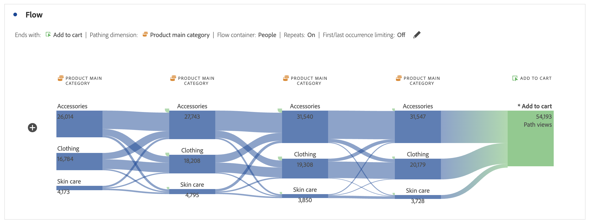

# Een stroomvisualisatie configureren

Stroomvisualisaties helpen u de reis te begrijpen die voortkomt uit een specifieke conversiegebeurtenis op uw website of uw app. Of leidt tot een specifieke conversiegebeurtenis. De visualisatie traceert een pad door uw dimensies (en dimensie-items) of metriek.

U kunt het begin of het eind van de weg vormen u in geinteresseerd bent. U kunt ook alle paden analyseren die door een dimensie- of dimensie-item lopen.

## Gebruiken

1. Voeg a  **[!UICONTROL Flow]** visualisatie toe. Zie [ een visualisatie aan een paneel ](../freeform-analysis-visualizations.md#add-visualizations-to-a-panel) toevoegen.

1. Veranker uw stroomvisualisatie met een van de volgende opties:

   * [!UICONTROL **begint met**] (metriek, dimensies, of punten), of
   * [!UICONTROL **bevat**] (afmetingen, of punten), of
   * [!UICONTROL **eindigt met**] (metriek, dimensies, of punten)

   Elk van deze categorieën wordt getoond op het scherm als a *dalingsstreek*. U kunt de neerzetzone op drie manieren vullen:

   * Gebruik het keuzemenu om metriek of afmetingen te selecteren.
   * Sleep afmetingen of metriek vanuit het linkerdeelvenster.
   * Typ de naam van een dimensie of metrisch en selecteer deze wanneer deze in de vervolgkeuzelijst wordt weergegeven.

   >[!IMPORTANT]
   >
   >Berekende metriek kunnen niet worden gebruikt in de velden **[!UICONTROL Starts with]** en **[!UICONTROL Ends with]** .

1. Als u metrisch kiest, moet u ook a [!UICONTROL **het Schilderen Dimension**] verstrekken om als uw weg te gebruiken die aan of uit uw geselecteerde component leiden, zoals hier getoond. Het gebrek is [!UICONTROL **Pagina**].

   

1. (Optioneel) Selecteer **[!UICONTROL Show advanced settings]** om een van de volgende opties te configureren:

   | Instelling | Beschrijving |
   | --- | --- |
   | **[!UICONTROL Wrap labels]** | Normaal gesproken worden de labels op de Flow-elementen ingekort om de schermruimte op te slaan, maar u kunt het volledige label zichtbaar maken door dit selectievakje in te schakelen.  Standaard = uitgeschakeld. |
   | **[!UICONTROL Include repeat instances]** | Stroomvisualisaties zijn gebaseerd op instanties van een dimensie. Deze instelling biedt u de mogelijkheid om herhaalde exemplaren op te nemen of uit te sluiten, bijvoorbeeld Pagina opnieuw wordt geladen. Herhalingen kunnen echter niet worden verwijderd uit Flow-visualisaties met multigetaxeerde afmetingen, zoals listVars, listProps, s.product, merchandising Vars, enz. 
Deze optie is standaard uitgeschakeld.
 |
   | **[!UICONTROL Limit to first/last occurrence]** | Beperk paden tot paden die beginnen of eindigen met de eerste of laatste instantie van een dimensie, item of metrische waarde. Zie [ Beperken tot eerste/laatste voorkomen ](#example-scenario-for-limit-to-firstlast-occurrence) voor een meer gedetailleerde verklaring. |
   | **[!UICONTROL Number of columns]** | Het aantal kolommen u in uw diagram van de Stroom wilt. U kunt maximaal vijf kolommen opgeven. |
   | **[!UICONTROL Items expanded per column]** | Het aantal items dat u in elke kolom wilt opnemen. U kunt maximaal tien items opgeven die per kolom worden uitgevouwen. |
   | **[!UICONTROL Flow container]** | U kunt schakelen tussen **[!UICONTROL Sessions]** en **[!UICONTROL Person]** om het plakken te analyseren. Met deze instellingen kunt u de betrokkenheid van een persoon op persoonlijk niveau (tijdens verschillende sessies) begrijpen of de analyse beperken tot één sessie. |

   >[!IMPORTANT]
   >
   >De combinatie van **[!UICONTROL Number of columns]** en **[!UICONTROL Items expanded per column]** bepaalt het aantal onderliggende aanvragen dat vereist is om de flowvisualisatie te maken. Hoe hoger deze getallen, hoe langer het duurt om een visualisatie te renderen.

1. Selecteer **[!UICONTROL Build]** .

### Voorbeeld

Stel dat u het pad wilt overtrekken dat gebruikers naar en van de populairste pagina&#39;s op uw site hebben gekozen.

1. Maak een stroomvisualisatie zoals hierboven beschreven.
1. Sleep de [!UICONTROL **dimensie van de Pagina**] in het **[!UICONTROL Contains]** gebied, dan uitgezocht [!UICONTROL **bouwt**].
1. De stroomvisualisatie bouwt, met de meest bekeken pagina zichtbaar in de nadrukknoop, bij het centrum van de visualisatie. U ziet ook de bovenste pagina&#39;s die naar die pagina lopen (links van het focusknooppunt) en de bovenliggende pagina&#39;s die uit die pagina lopen (rechts van het focusknooppunt).
1. Analyseer gegevens in de stroom, zoals die in [ wordt beschreven vormt ](#configure).

## Configureren

Een overzicht van de configuratie van de Stroom verschijnt bij de bovenkant van visualisaties. De paden in het diagram zijn proportioneel. Paden met meer activiteit lijken dikker.

Als u verder naar de gegevens wilt gaan, hebt u verschillende opties:

* Het stroomdiagram is interactief. Plaats de muis boven het diagram om de weergegeven details te wijzigen.

* Wanneer u op een knoop in het diagram selecteert, verschijnen de details voor die knoop. Selecteer opnieuw de knoop om het samen te vouwen.

  

* U kunt een kolom filteren om alleen bepaalde resultaten weer te geven, zoals inclusief en exclusief, het opgeven van criteria enzovoort.

* Selecteer  op de linkerzijde of de rechterkant om een kolom uit te breiden.

* Om de output aan te passen, gebruik de [ opties van het contextmenu ](#context-menu).

* Om de stroom uit te geven of het met verschillende opties te herbouwen, uitgezocht  naast de configuratiesamenvatting uit.

## Filter

Boven elke kolom, verschijnt een filter  wanneer u over het beweegt. Als u het filter selecteert, krijgt u hetzelfde filterdialoogvenster als in de tabel Vrije vorm. Zie [ Filter en soort ](freeform-table/../../freeform-table/filter-and-sort.md).

* Gebruik **[!UICONTROL Show advanced]** om geavanceerde instellingen te configureren, zodat bepaalde criteria in een lijst met operatoren worden opgenomen of uitgesloten. Zie [ Filters en soort ](../freeform-table/filter-and-sort.md) voor meer informatie.
* Zodra u een kolom hebt gefilterd, wijst die specifieke kolom op het filtreren. Een blauw  wijst erop dat de kolom wordt gefiltreerd.  Het filter reduceert de kolom zodat alleen het item wordt weergegeven dat in het filter is toegestaan. Of alle items worden verwijderd, behalve het gewenste item in het filter.
* Alle stroomafwaartse en stroomopwaartse kolommen blijven bestaan, zolang er gegevens in de resterende knopen stromen.
* Om een filter te verwijderen, uitgezochte  om het filtermenu te openen. Verwijder eventueel toegepaste filters en selecteer vervolgens **[!UICONTROL Save]** . De flow moet terugkeren naar de vorige ongefilterde toestand.

## Contextmenu

Gebruik een contextmenu op een knooppunt in de stroomvisualisatie met de volgende opties:

| Optie | Beschrijving |
|--- |--- |
| **[!UICONTROL Focus on this node]** | Wijzig de focus in het geselecteerde knooppunt. Het focusknooppunt verschijnt in het midden van het stroomdiagram. |
| **[!UICONTROL Start over]** | Ga terug naar de constructor van het Freeform-diagram, waar u een nieuw stroomdiagram kunt maken. |
| **[!UICONTROL Create a filter for this path]** | Maak een filter. Deze selectie neemt u in de Bouwer van de Filter, waar u de nieuwe filter kunt vormen. |
| **[!UICONTROL Breakdown]** | Verdeel de knoop neer door beschikbare Dimensionen, Metriek, of Tijd. |
| **[!UICONTROL Filter column]** | Dezelfde filteropties worden weergegeven als beschikbaar zijn in de tabel Vrije vorm. Voor meer informatie over de beschikbare opties, zie de sectie &quot;een eenvoudig of geavanceerd filter op een lijst&quot;in [ Filter en sorteerlijsten ](/help/analysis-workspace/visualizations/freeform-table/filter-and-sort.md) toepassen. |
| **[!UICONTROL Exclude item]** of **[!UICONTROL Restore excluded items]** | Hiermee verwijdert u een specifiek knooppunt uit de kolom en maakt u het automatisch als filter boven aan de kolom. Selecteer **[!UICONTROL Restore Excluded Item]** in het contextmenu om het uitgesloten item te herstellen. U kunt het filter ook boven aan de kolom openen en de pillarbox verwijderen met het item dat u zojuist hebt uitgesloten. |
| **[!UICONTROL Trend]** | Creeer een trended diagram voor de knoop. |
| **[!UICONTROL Show next column]** / **[!UICONTROL Show previous column]** | Geeft de volgende (rechts) of vorige (links) kolom van de visualisatie aan. |
| **[!UICONTROL Hide colum]**n | Hiermee verbergt u de geselecteerde kolom uit de visualisatie. |
| **[!UICONTROL Expand entire column]** | Breid een kolom uit om alle knopen te tonen. Standaard worden alleen de bovenste vijf knooppunten weergegeven. |
| **[!UICONTROL Create audience from selection]** | Hiermee maakt u een publiek op basis van de geselecteerde kolom. |
| **[!UICONTROL Collapse entire column]** | Alle knooppunten in een kolom verbergen. |

## Beperken tot eerste/laatste voorkomen

Houd er bij het gebruik van deze optie rekening mee dat:

* **[!UICONTROL Limit to first/last occurrence]** telt alleen het eerste/laatste exemplaar in de reeks. Alle andere gevallen van de criteria **[!UICONTROL Starts with]** of **[!UICONTROL Ends with]** worden genegeerd.
* Bij gebruik met een **[!UICONTROL Starts with]** -flow wordt alleen de eerste instantie die aan de begincriteria voldoet, opgenomen.
In het voorbeeld hieronder, **alle** voorkomen van *voeg aan kart* toe en *hoofdcategorie van het Product* in elke stap van de stroom is inbegrepen.
  

  In het voorbeeld hieronder, slechts worden de **eerste** voorkomen van *toegevoegd aan kart* en *de belangrijkste categorie van het Product* in elke stap van de stroom inbegrepen.
  
* Bij gebruik met een **[!UICONTROL Ends with]** -flow wordt alleen de laatste instantie opgenomen die aan de eindcriteria voldoet.
In het voorbeeld hieronder, **alle** voorkomen van *hoofdcategorie van het Product* en *voeg aan wortel* in elke stap van de stroom toe zijn inbegrepen.
  

  In het voorbeeld hieronder, slechts zijn de **laatste** voorkomen van *hoofdcategorie van het Product* en *toevoegen aan wortel* in elke stap van de stroom inbegrepen.
  
* De gebruikte reeks verschilt op basis van de container. Als u de container **[!UICONTROL Person]** gebruikt, is de reeks gebeurtenissen de sessie. Als u de container **[!UICONTROL Session]** gebruikt, zijn de reeks gebeurtenissen alle gebeurtenissen voor een bepaalde gebruiker in het opgegeven datumbereik.
* De optie **[!UICONTROL Limit to first/last occurrence]** kan in de geavanceerde instellingen worden geconfigureerd wanneer u een Metrisch of Dimension-item gebruikt in de velden **[!UICONTROL Starts with]** of **[!UICONTROL Ends with]** .

>[!MORELIKETHIS]
>
>[ voeg een visualisatie aan een paneel toe ](/help/analysis-workspace/visualizations/freeform-analysis-visualizations.md#add-visualizations-to-a-panel)
>[Visualisatie-instellingen ](/help/analysis-workspace/visualizations/freeform-analysis-visualizations.md#settings)
>[Contextmenu Visualisatie ](/help/analysis-workspace/visualizations/freeform-analysis-visualizations.md#context-menu)
>

