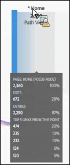
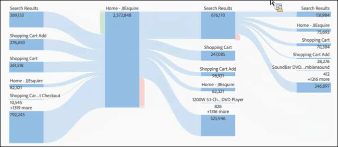

# Een stroomvisualisatie configureren

>[!NOTE]
>
>U bekijkt de documentatie voor de Werkruimte van de Analyse in de Analyse van de Reis van de Klant. Zijn eigenschapreeks verschilt lichtjes van [De Werkruimte van de analyse in de traditionele Analyse van Adobe](https://docs.adobe.com/content/help/en/analytics/analyze/analysis-workspace/home.html). [Meer informatie...](/help/getting-started/cja-aa.md)

De stroom laat u een weg door uw pagina&#39;s of afmetingen, zoals eVars volgen:

* Ingang (alleen afmetingen)
* Afmetingen of items
* Uitgang (alleen afmetingen)

Elk van deze categorieën wordt op het scherm getoond als &quot;dalingsstreek.&quot; De punten van de belemmering van de lijst en laten vallen hen in de gewenste dalingsstreek. De pagina&#39;s en andere punten die geen afmetingen zijn kunnen slechts in de middendalingsstreek worden geplaatst. Als u een afmeting in de middenstreek laat vallen, wordt een rapport automatisch in werking gesteld dat de hoogste punten voor die afmeting opneemt.

Wanneer u een punt in een dalingsstreek laat vallen, opent het diagram van de Stroom. De inhoud van het stroomdiagram hangt van de dalingsstreek af waar u een afmeting of een punt laat vallen. De uitgang en de Ingang tonen alle punten voor de afmeting (zoals pagina&#39;s) u in de de dalingsstreek van de Ingang of van de Uitgang laat vallen. Bijvoorbeeld, als u een afmeting in de centrale dalingsstreek laat vallen, opent het stroomdiagram voor die afmeting.

Beweeg over de Knoop van de Nadruk in het midden van het diagram om informatie over die knoop te bekijken.

Het stroomdiagram is interactief. Muis over het diagram om de details te veranderen die worden getoond.

De wegen in het diagram zijn proportioneel. De wegen met meer activiteit lijken dikker.

Wanneer u op een knoop in het diagram klikt, verschijnen de details voor die knoop. Bijvoorbeeld, als u klikt **[!UICONTROL Search Results]** bij het hoogste recht in het hoogste diagram hierboven, breidt het diagram zich uit om meer details over de knoop van onderzoeksresultaten te tonen. Klik opnieuw op een knoop om het te doen ineenstorten.

Door gebrek, toont het diagram de hoogste vijf stromen. Als u op de **[!UICONTROL More]** knoop bij de bodem van het diagram, breidt het diagram zich neer uit om vijf meer stromen te tonen. Doorgaan klikken **[!UICONTROL More]** om uit te breiden tot er geen extra te tonen stromen zijn.

Er zijn geen grenzen op hoeveel u binnen het diagram van de Stroom kunt onderzoeken.

U kunt uw diagram van de Stroom als deel van het .CSV dossier van een project ook uitvoeren en verder analyseren door naar te gaan **[!UICONTROL Project]** > **[!UICONTROL Download CSV]**.
