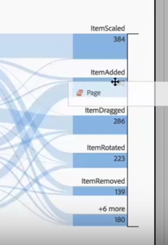

# Interdimensionale stromen

>[!NOTE]
>
>U bekijkt de documentatie voor Analysis Workspace in Customer Journey Analytics. De functieset verschilt enigszins van [Analysis Workspace in traditionele Adobe Analytics](https://experienceleague.adobe.com/docs/analytics/analyze/analysis-workspace/home.html). [Meer informatie...](/help/getting-started/cja-aa.md)

Met een interdimensionale stroom kunt u gebruikerspaden in verschillende dimensies bekijken.

Een afmetingslabel boven aan elke stroomkolom maakt het gebruik van meerdere dimensies in een stroomvisualisatie intuïtiever:

We zullen naar twee gebruiksgevallen kijken: een gebruiksgeval voor apps en een gebruiksgeval voor het web.

## Eerste hoofdletter gebruiken: app

De [!UICONTROL Action Name] dimensie werd toegevoegd aan de stroom, met het hoogste teruggekeerde punt dat [!UICONTROL ItemAdded] is:

Als u de interactie tussen schermen/pagina&#39;s en acties in deze app wilt verkennen, kunt u de paginadimensie naar meerdere plaatsen slepen, afhankelijk van wat u wilt verkennen:

* Sleep het naar een van de uiteinden van de neerzetzone (binnen de met zwart omgezette rechthoekige zone die wordt weergegeven) naar **vervang** de bovenste resultaten aan de uiteinden:

    

* Sleep het naar de witruimte aan het einde (let op de zwarte haak) om **aan** de visualisatie toe te voegen:

   

Hier is het resultaat als u besluit om het item ItemScaled in de juiste kolom met de dimensie van de Pagina te vervangen. Het bovenste resultaat wordt nu gewijzigd in het bovenste resultaat voor de pagina-afmeting:

Nu kunt u zien hoe klanten door acties en pagina&#39;s bewegen. U kunt de stroom verder verkennen door op verschillende knooppunten te klikken:

Dit is wat gebeurt als u een andere dimensie van de Naam van de Actie op het eind van visualisatie toevoegt:

Op deze manier kunt u diepgaande inzichten en mogelijke wijzigingen aanbrengen in de app die u analyseert.

## Hoofdlettergebruik twee: web

In dit geval kunt u zien hoe u kunt analyseren welke campagnes de meeste items naar een website sturen.

Sleep de dimensie van de Naam van de Campagne in een nieuwe stroom:

Nu wil ik zien aan welke pagina&#39;s die campagnes verkeer drijven, zodat sleep ik de dimensie van de Pagina rechts van de stroomresultaten om op visualisatie toe te voegen:

