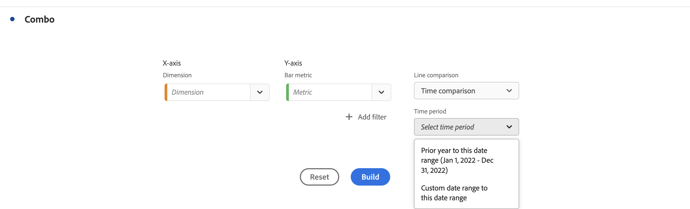

# Combo {#combo}

<!-- markdownlint-disable MD034 -->

>[!CONTEXTUALHELP]
>id="workspace_combo_button"
>title="Combo"
>abstract="Maak snel een combografievisualisatie zonder eerst een vrije-vormtabel te hoeven maken."

<!-- markdownlint-enable MD034 -->

>[!BEGINSHADEBOX]

*Dit artikel documenteert Combo visualization in **Customer Journey Analytics**.  zie [ Combo ](https://experienceleague.adobe.com/en/docs/analytics/analyze/analysis-workspace/visualizations/combo-charts) voor de **Adobe Analytics**versie van dit artikel.*

>[!ENDSHADEBOX]

De  **[!UICONTROL Combo]** visualisatie maakt het gemakkelijk om snel een vergelijkingsvisualisatie te bouwen zonder het moeten eerst een lijst bouwen. U kunt tendensen in uw gegevens in een lijn gemakkelijk bekijken/bar combinatie.

Een [!UICONTROL Combo] gebruiken om:

* Vergelijk de bestellingen van deze week met bestellingen op hetzelfde tijdstip in vorige maand (en vorig jaar).
* Analyseer en vergelijk snel meerdere meetgegevens (zoals [!UICONTROL Persons] en [!UICONTROL Revenue] ) met elkaar op hetzelfde diagram.
* Analyseer metrisch tegen een functie (zoals [!UICONTROL Cumulative Average]) over een tijdshorizon.

Houd er rekening mee dat:

* U kunt meerdere vergelijkingen toevoegen in één [!UICONTROL Combo chart] .
* Als u een of meer vergelijkingen toevoegt, moeten deze van hetzelfde type zijn, zoals [!UICONTROL Time comparison] .
* U kunt maximaal vijf vergelijkingen maken.
* U kunt maximaal drie filters toepassen op een metrische waarde.
* Berekende metriek worden niet ondersteund in Combo-diagrammen.

## Gebruiken

1. Voeg a  [!UICONTROL Combo] visualisatie toe. Zie [ een visualisatie aan een paneel ](freeform-analysis-visualizations.md#add-visualizations-to-a-panel) toevoegen

1. Selecteer in de vervolgkeuzelijsten een afmeting voor de X-as en een afmeting voor de Y-as.

1. Selecteer het type [!UICONTROL Line comparison] dat u wilt gebruiken.

   | Het vergelijkingstype Lijn | Definitie |
   | --- | --- |
   | **[!UICONTROL Time comparison]** | Het meest voorkomende type vergelijking: deze periode wordt bijvoorbeeld vergeleken met 4 weken geleden. Als u [!UICONTROL Time comparison] selecteerde, maak een secundaire selectie over welke tijdspanne u wilt vergelijken.
 |
   | **[!UICONTROL Function]** | U kunt een functie als [!UICONTROL Average] in de vergelijking introduceren. Zie de lijst van [ gesteunde functies ](#supported-functions).
 |
   | **[!UICONTROL Secondary metric]** | U kunt bijvoorbeeld [!UICONTROL Revenue] met een andere metrische waarde vergelijken.
 |

   {style="table-layout:auto"}

1. Selecteer **[!UICONTROL Build]** .

   De uitvoer ziet er ongeveer als volgt uit:

   

   De huidige periode wordt weergegeven in het staafdiagram. Het lijndiagram geeft de vergelijkingsperiode weer. De punten op het lijndiagram zijn gekend als *balken*.

## Ondersteunde functies

Wanneer u **[!UICONTROL Function]** als [!UICONTROL Line comparison type] selecteert, wordt een functie van de gekozen metrische waarde geretourneerd.

| Functie | Definitie |
| --- | --- |
| **[!UICONTROL Column Sum]** | Hiermee worden alle numerieke waarden toegevoegd voor een metrische waarde in een kolom (over de elementen van een dimensie) |
| **[!UICONTROL Cumulative Average]** | Retourneer het gemiddelde van de laatste N rijen. |
| **[!UICONTROL Median]** | Retourneert de mediaan voor een metrische waarde in een kolom. De mediaan is het getal in het midden van een reeks getallen. De helft van de getallen heeft waarden die groter zijn dan of gelijk zijn aan de mediaan, en de helft van het getal heeft waarden die kleiner zijn dan of gelijk zijn aan de mediaan. |
| **[!UICONTROL Cumulative]** | De cumulatieve som van N rijen. |
| **[!UICONTROL Column Maximum]** | Retourneert de grootste waarde in een set dimensieelementen voor een metrische kolom. |
| **[!UICONTROL Mean]** | Retourneert het rekenkundig gemiddelde (of gemiddelde) voor een metrische waarde. |
| **[!UICONTROL Column Minimum]** | Retourneert de laagste waarde in een set dimensieelementen voor een metrische kolom. |

{style="table-layout:auto"}

Hier is een voorbeeld van het cumulatieve gemiddelde van de metrische inkomsten:

 toont

Hier is een voorbeeld van een combo grafiek met zowel Cumulatieve gemiddelde als Gemiddelde functies:

>[!MORELIKETHIS]
>
>[ voeg een visualisatie aan een paneel toe ](/help/analysis-workspace/visualizations/freeform-analysis-visualizations.md#add-visualizations-to-a-panel)
>[Visualisatie-instellingen ](/help/analysis-workspace/visualizations/freeform-analysis-visualizations.md#settings)
>[Contextmenu Visualisatie ](/help/analysis-workspace/visualizations/freeform-analysis-visualizations.md#context-menu)
>