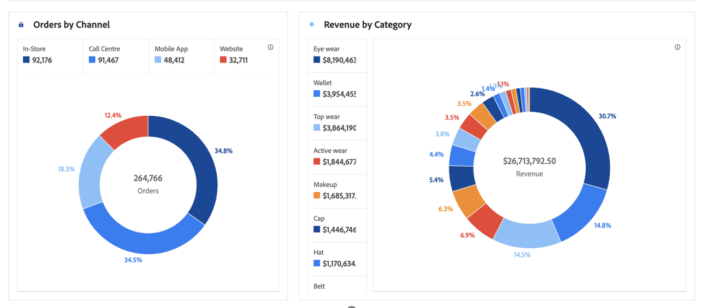

# Donut {#donut}

<!-- markdownlint-disable MD034 -->

>[!CONTEXTUALHELP]
>id="workspace_donut_button"
>title="Donut"
>abstract="Maak een donutvisualisatie om percentages van een totaal te vergelijken, meestal met een klein aantal items."

<!-- markdownlint-enable MD034 -->

>[!BEGINSHADEBOX]

_dit artikel documenteert de visualisatie van de Donut in_  _&#x200B;**Customer Journey Analytics**._ _zie [&#x200B; Donut &#x200B;](https://experienceleague.adobe.com/nl/docs/analytics/analyze/analysis-workspace/visualizations/donut) voor_  _&#x200B;**Adobe Analytics** versie van dit artikel._

>[!ENDSHADEBOX]

Gelijkaardig aan een cirkeldiagram,  **[!UICONTROL Donut]** visualisatie toont gegevens als delen of segmenten van een geheel. Gebruik een donutvisualisatie wanneer het vergelijken van percentages van een totaal, typisch met een klein aantal punten.

>[!BEGINSHADEBOX]

Zie  [&#x200B; een donutvisualisatie &#x200B;](https://experienceleague.adobe.com/nl/docs/customer-journey-analytics-learn/tutorials/analysis-workspace/visualizations/add-donut-visualizations){target="_blank"} voor een demo video toevoegen.

{{videoaa}}

>[!ENDSHADEBOX]

>[!MORELIKETHIS]
>
>[&#x200B; voeg een visualisatie aan een paneel toe &#x200B;](/help/analysis-workspace/visualizations/freeform-analysis-visualizations.md#add-visualizations-to-a-panel)
>[Visualisatie-instellingen &#x200B;](/help/analysis-workspace/visualizations/freeform-analysis-visualizations.md#settings)
>[Contextmenu Visualisatie &#x200B;](/help/analysis-workspace/visualizations/freeform-analysis-visualizations.md#context-menu)
>

