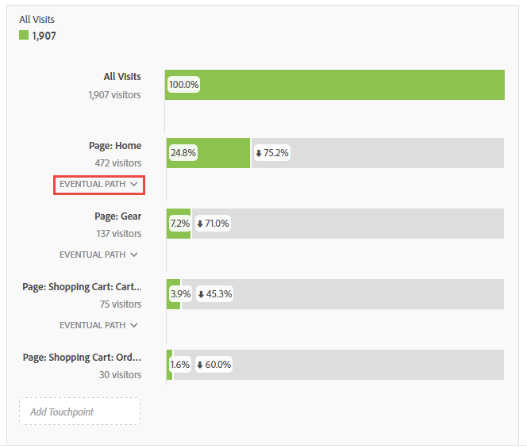

# Een uitvalvisualisatie configureren

U kunt de aanraakpunten opgeven om een multidimensionale fallout-reeks te maken. Doorgaans is een aanraakpunt een pagina op uw site. Aanraakpunten zijn echter niet beperkt tot pagina&#39;s. U kunt bijvoorbeeld gebeurtenissen, zoals eenheden, en unieke personen en terugkeerbezoeken toevoegen. U kunt ook dimensies toevoegen, zoals een categorie, type browser of interne zoekterm.

U kunt zelfs filters toevoegen binnen een aanraakpunt. U kunt bijvoorbeeld filters, zoals iOS- en Android-gebruikers, vergelijken. Sleep de gewenste filters naar de bovenkant van de uitval en de informatie over die filters wordt toegevoegd aan het uitvalrapport. Als u alleen die filters wilt tonen, kunt u de basislijn Alle bezoeken verwijderen.

Er geldt geen beperking voor het aantal stappen dat u kunt toevoegen of het aantal gebruikte dimensies.

U kunt op Vars plakken, waaronder eVars verhandelen en [listVars](https://experienceleague.adobe.com/docs/analytics/implementation/vars/page-vars/page-variables.html) (variabelen die meerdere waarden per gebeurtenis kunnen hebben, zoals producten, listVars, merchandising Vars en list props). Stel dat iemand bijvoorbeeld naar schoenen kijkt, naar shirt op de ene pagina, en op de volgende pagina die ze bekijken, naar shirt, sokken. Het volgende productflowrapport van schoenen is shirt en sokken, NOT shirt.

1. Sleep een [!UICONTROL Fallout] visualisatie via de keuzelijst Visualisaties in een [!UICONTROL Freeform Table].

1. Sleep de afmetingen van de pagina naar de tabel voor vrije vorm en sleep vanaf deze tabel een pagina (in dit geval Home - JJEsquire) naar de **[!UICONTROL Add TouchPoint]** veld als eerste aanraakpunt.

   

   Houd de muis boven een aanraakpunt om de fallout en andere informatie over dat niveau te zien, zoals de naam van het aanraakpunt, de persoon die op dat punt telt, en zie het succespercentage voor dat aanraakpunt (en vergelijk het succespercentage met andere aanraakpunten).

   De omcirkelde getallen in het grijze gedeelte van de balk geven de fallout tussen aanraakpunten aan (niet de totale fallout naar dat punt). Het aanraakpunt % toont de geslaagde fallthrough van de vorige stap naar de huidige stap in het falloutrapport.

   U kunt ook één pagina toevoegen aan het fallout-rapport in plaats van de volledige dimensie. Klik op de pijl naar rechts &#39;>&#39; op de pagina-dimensie om de specifieke pagina te kiezen die u wilt toevoegen aan het vervolgrapport.

1. Voeg aanraakpunten toe totdat de reeks is voltooid.

   U kunt **meerdere aanraakpunten combineren** door een of meer aanvullende aanraakpunten naar een aanraakpunt te slepen.

   >[!NOTE]
   >
   >De veelvoudige filters worden aangesloten bij EN, maar de veelvoudige punten zoals afmetingspunten en metriek worden aangesloten bij OF.

   

1. U kunt **afzonderlijke aanraakpunten beperken tot de volgende gebeurtenis** (in tegenstelling tot &quot;uiteindelijk&quot;) binnen het pad. Onder elk aanraakpunt bevindt zich een kiezer met de opties &quot;Eventueel pad&quot; en &quot;Volgend pad&quot;, zoals u hier ziet:

   

<table id="table_A91D99D9364B41929CC5A5BC907E8985"> 
 <tbody> 
  <tr> 
   <td colname="col1"> 
Eventueel pad 
 
(Standaard) 
 </td> 
   <td colname="col2"> 
Bezoekers worden meegeteld dat "uiteindelijk" zal landen op de volgende pagina in het pad, maar niet noodzakelijkerwijs op de volgende gebeurtenis. 
 </td> 
  </tr> 
  <tr> 
   <td colname="col1"> 
Volgende keer 
 </td> 
   <td colname="col2"> 
Bezoekers worden geteld die op de volgende pagina op het pad landen bij de volgende gebeurtenis. 
 </td> 
  </tr> 
 </tbody> 
</table>

## Fallout-instellingen {#section_0C7C89D72F0B4D6EB467F278AC979093}

| Instelling | Beschrijving |
|--- |--- |
| Container voor uitvallen <ul><li>Bezoek</li><li>Bezoeker</li></ul> | Hiermee kunt u schakelen tussen Bezoek en Bezoeker om het plakken van personen te analyseren. De standaardinstelling is Bezoeker.  Met deze instellingen kunt u de betrokkenheid van personen op het niveau van de persoon (tijdens verschillende bezoeken) begrijpen of de analyse beperken tot één bezoek. |

Wanneer u **met de rechtermuisknop op een aanraakpunt klikken** worden de volgende opties weergegeven:

| Optie | Beschrijving |
|--- |--- |
| Trend touchpoint | Zie trendgegevens voor een aanraakpunt in een lijngrafiek, met sommige vooraf gebouwde anomaliedetectiegegevens. |
| Trend touchpoint (%) | Hiermee wordt het totale uitvalpercentage verhoogd. |
| Alle aanraakpunten trenderen (%) | Trends all the touchpoint percentages in the fallout (behalve &quot;All Visits&quot;, if it is included), on the same chart. |
| De fallthrough van de onderbreking bij dit aanraakpunt | Bekijk wat personen deden tussen twee aanraakpunten (dit aanraakpunt en het volgende aanraakpunt) als ze doorgingen naar het volgende aanraakpunt. Hiermee maakt u een vrije-vormtabel waarin de afmetingen worden weergegeven. U kunt afmetingen en andere elementen van de tabel vervangen. |
| Uitval onderbreken bij dit aanraakpunt | Bekijk wat mensen die het niet door de trechter maakten onmiddellijk na de geselecteerde stap deden. |
| Filter maken van aanraakpunt | Maak een nieuw filter van het geselecteerde aanraakpunt. |
