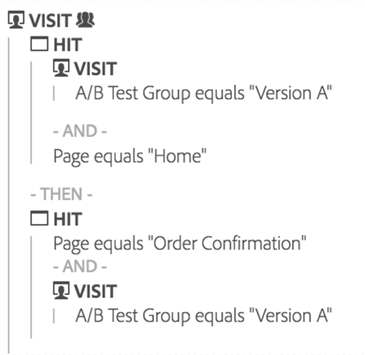

# Overzicht van uitval

>[!NOTE]
>
>U bekijkt de documentatie voor de Werkruimte van de Analyse in de Analyse van de Reis van de Klant. Zijn eigenschapreeks verschilt lichtjes van [De Werkruimte van de analyse in de traditionele Analyse van Adobe](https://docs.adobe.com/content/help/en/analytics/analyze/analysis-workspace/home.html). [Meer informatie...](/help/getting-started/cja-aa.md)

De visualisaties van de val verstrekken meer opties om uw reserverapporten te bouwen. De rapporten van de val tonen waar de bezoekers verlieten (vielen uit) en door (vielen door) een vooraf bepaalde opeenvolging van pagina&#39;s verdergingen.

Met een uitvalvisualisatie kunt u

* Voer zij aan zij vergelijkingen van twee verschillende segmenten in het zelfde rapport uit.
* Trechterstappen (aanraakpunten) slepen, neerzetten en opnieuw rangschikken
* Meng en pas waarden van verschillende afmetingen en metriek aan
* Creeer een multi-dimensionaal eindrapport
* Identificeer waar de klanten onmiddellijk na het vallen uit gaan

De de vertoningenomzetting van de val en fall-outtarieven tussen elke stap of touchpoint in een opeenvolging.

Bijvoorbeeld, kunt u de reservepunten van een bezoeker tijdens een aankoopproces volgen. Selecteer enkel een begin touchpoint en een conclusie touchpoint, en voeg middentouchpoints toe om een weg van de websitenavigatie tot stand te brengen. Maar je kunt ook multi-dimensionele uitvalsingen doen.

Een uitvalvisualisatie is nuttig om te analyseren:

* Conversiepercentages via specifieke processen op uw site (zoals een aankoop- of registratieproces).
* Algemene verkeersstromen met een breder bereik: Van de mensen die de homepage zagen, toont deze stroom hoeveel er verder gingen om een zoekopdracht uit te voeren, en hoeveel er uiteindelijk naar een specifiek item gingen kijken.
* Correlaties tussen gebeurtenissen op je site. Correlaties laten zien welk percentage van de mensen die naar je privacybeleid keken, een product ging kopen.

[Volledige visualisatie op YouTube](https://www.youtube.com/watch?v=VcrfHSyIoj8&amp;index=52&amp;list=PL2tCx83mn7GuNnQdYGOtlyCu0V5mEZ8sS) (4:15)

## Segmentering als basis voor stroom en uitval {#section_654F37A398C24DDDB1552A543EE29AA9}

De segmenten die op de panelen van de Werkruimte worden toegepast werken lichtjes verschillend dan segmenten die op reserve en stroomrapporten in Rapporten &amp; Analytics of Ad hoc Analyse worden toegepast. Meestal leveren ze precies dezelfde resultaten op. Het belangrijkste verschil is dat de Rapporten &amp; de Analyse en de Ad hoc Analyse het segment bij elke stap van de opeenvolging toepassen. Dit kan resulteren in enigszins verschillende uitkomsten.

Laten we een voorbeeld nemen van uitval met twee stappen:

Als u dan een segment op het het paneelniveau van de Werkruimte toepast, combineert het segment met de output als dit:

Wanneer rapporten en analyses en ad hoc analyse het segment daarentegen berekenen, wordt het segment op deze manier gecombineerd:

De rapporten &amp; de Analyse en de Ad hoc Analyse combineren het segment met elke stap. Wanneer de containers zich op hetzelfde niveau bevinden als de uitval (bv. bezoek of bezoekersniveau), zal dit ertoe leiden dat het aantal bezoeken of bezoekers wordt afgestemd.

Nochtans, als het segment dat op het paneel wordt toegepast kleiner is dan het niveau van de uitval (b.v. klapniveau), dan zal het segment verschillende resultaten wegens hoe het door het rapport wordt gecombineerd tonen. Om te herhalen, in de meeste omstandigheden passen de aantallen in de Werkruimte van de Analyse die in Rapporten &amp; Analytics en Ad hoc Analyse aan. Zij zullen **niet** pas aan als alle onderstaande gevallen waar zijn:

* Het segment is niet op het zelfde niveau als de uitval.
* Het segment heeft een variabele waarbij de bezoeker/bezoeker meerdere waarden kan hebben tijdens een bezoek/bezoeker.

In het zeldzame geval waar u de Werkruimte van de Analyse moet hebben past de manier van Rapporten &amp; van de Analyse om segmenten toe te passen om uit te vallen/stroom, eenvoudig laat vallen het segment in elke uitvalstap in Werkruimte en het zal in de zelfde aantallen resulteren.
