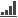
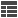
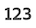
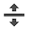
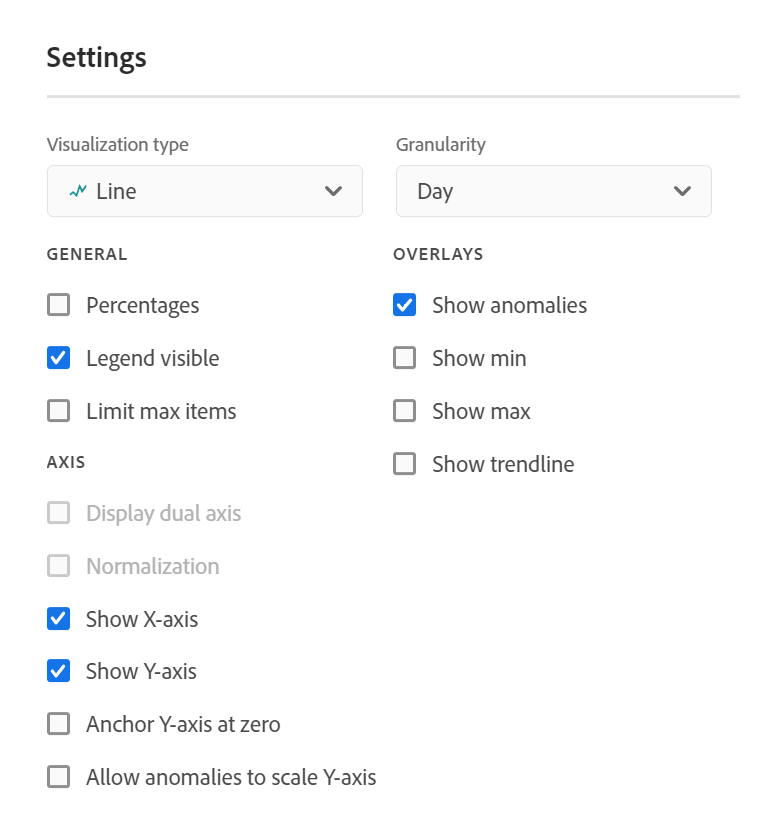

# Overzicht van visualisaties

De werkruimte biedt een aantal visualisaties die u visuele vertegenwoordiging van uw gegevens, zoals bar grafieken, donut grafieken, histogrammen, lijngrafieken, kaarten, scatterpercelen, en anderen laten produceren. De meeste visualisatietypen zijn u bekend als u Customer Journey Analytics gebruikt. Analysis Workspace biedt echter wel instellingen voor visualisatie en vele nieuwe of unieke visualisatietypen met interactieve mogelijkheden.

## Visualisatietypen

De volgende visualisatietypen zijn beschikbaar in Analysis Workspace:

| Visualisatienaam | Beschrijving |
| --- | --- | 
| [Gebied](/help/analysis-workspace/visualizations/area.md)

 | Als een lijngrafiek, maar met een gekleurd gebied onder de lijn. Gebruik een vlakgrafiek als u meerdere maateenheden hebt en u het gebied wilt visualiseren dat wordt uitgedrukt door het snijpunt van twee of meer meetgegevens. | Beantwoord vragen als: <ul><li> |
| [Balk](/help/analysis-workspace/visualizations/bar.md) 

 | Geeft verticale balken weer die diverse waarden vertegenwoordigen over een of meer metriek. |
| [Staafdiagram](/help/analysis-workspace/visualizations/bullet-graph.md) 

 | Toont hoe een waarde u in vergelijkt met of maatregelen tegen andere prestatieswaaiers (doelstellingen) geinteresseerd bent. |
| [Cohortingtabel](/help/analysis-workspace/visualizations/cohort-table/cohort-analysis.md)

 | A *`cohort`* is een groep personen die gemeenschappelijke kenmerken delen over een bepaalde periode. Cohortanalyse is nuttig voor retentie-, kleur- of latentieanalyse. |
| [Cirkeldiagram](/help/analysis-workspace/visualizations/donut.md) 

 | Net als bij een cirkeldiagram worden bij deze visualisatie gegevens weergegeven als delen of filters van een geheel. |
| [Uitval](/help/analysis-workspace/visualizations/fallout/fallout-flow.md)

 | Uit de uitvalrapporten blijkt waar personen een vooraf gedefinieerde reeks pagina&#39;s hebben verlaten (weggevallen) en doorlopen (doorlopen). Kan worden ingesteld op uiteindelijke of exacte reeksen |
| [Stroom](/help/analysis-workspace/visualizations/c-flow/flow.md)

 | Hiermee geeft u exacte klantpaden weer via uw websites en apps. |
| [Vrije-vormentabel](/help/analysis-workspace/visualizations/freeform-table/freeform-table.md)

 | Een tabel met vrije vorm is niet alleen een gegevenstabel, maar ook een interactieve visualisatie. Dit is de basis voor gegevensanalyse in Workspace. |
| [Histogram](/help/analysis-workspace/visualizations/histogram.md)

 | Een histogram omvat personen, bezoeken of gebeurtenissen in emmers op basis van een metrisch volume. |
| [Horizontale balk](/help/analysis-workspace/visualizations/horizontal-bar.md)

 | Hiermee geeft u horizontale balken weer die verschillende waarden voor een of meer metriek vertegenwoordigen. |
| [Lijn](/help/analysis-workspace/visualizations/line.md)

 | Vertegenwoordigt metriek die een lijn gebruiken om te tonen hoe de waarden over een periode veranderen. Een lijndiagram gebruikt tijd langs de x-as. |
| [Spreidingsdiagram](/help/analysis-workspace/visualizations/scatterplot.md) 

 | Toont het verband tussen afmetingspunten en tot drie metriek. |
| [Samenvattingsnummer](/help/analysis-workspace/visualizations/summary-number-change.md)

 | De geselecteerde cel wordt als 1 groot getal weergegeven. |
| [Samenvattingswijziging](/help/analysis-workspace/visualizations/summary-number-change.md)

 | Hiermee geeft u de wijziging tussen de geselecteerde cellen als 1 groot getal/percentage weer. |
| [Tekst](/help/analysis-workspace/visualizations/text.md)

 | Hiermee kunt u door de gebruiker gedefinieerde tekst toevoegen aan uw werkruimte. Het is handig om extra context toe te voegen aan uw analyse en inzichten, naast het gebruik van panel-/visualisatiebeschrijvingen |
| [Boomstructuur](/help/analysis-workspace/visualizations/treemap.md)

 | Hiermee worden hiërarchische gegevens (in een boomstructuur) weergegeven als een set geneste rechthoeken. |
| [Venn](/help/analysis-workspace/visualizations/venn.md)

 | Hiermee gebruikt u cirkels om de metrische overlapping van maximaal drie filters weer te geven. |

## Visualisaties toevoegen aan een deelvenster

1. Open het Analysis Workspace-project waar u een visualisatie wilt toevoegen.

1. Gebruik een van de volgende methoden om de visualisatie toe te voegen:

   * Selecteer in het linkerspoor de optie **Visualisaties** pictogram <!-- add icon -->Sleep vervolgens een visualisatie naar het deelvenster waaraan u de afbeelding wilt toevoegen.

     

   * Selecteer in het deelvenster waar u de visualisatie wilt toevoegen de optie **Plus** en kiest u vervolgens het pictogram dat de visualisatie vertegenwoordigt die u wilt toevoegen. Houd de muisaanwijzer boven het pictogram voor elke visualisatie om de naam ervan te zien.

     

   * Voeg een [leeg deelvenster](https://experienceleague.adobe.com/docs/analytics/analyze/analysis-workspace/panels/blank-panel.html)kiest u vervolgens de visualisatie die u wilt toevoegen.

     

   * Klik met de rechtermuisknop op een bestaand deelvenster in uw Analysis Workspace-project en selecteer [!UICONTROL **Dubbele visualisatie**] of [!UICONTROL **Visualisatie kopiëren**].

## Visualisatie-instellingen aanpassen

U kunt visualisatie-instellingen aanpassen voor een afzonderlijke visualisatie of voor alle visualisaties die u maakt.

### Visualisatie-instellingen aanpassen voor één visualisatie

Toegang tot [!UICONTROL Visualization Settings] voor een individuele visualisatie:

1. Houd in Analysis Workspace de muis boven de visualisatie waarvan u de instellingen wilt aanpassen.

1. Klik op het tandwielpictogram.

   Elk type visualisatie heeft unieke instellingen die u kunt aanpassen. Voor informatie over de beschikbare instellingen raadpleegt u [Instellingen](#settings).

### De visualisatie-instellingen aanpassen voor alle visualisaties die u maakt

U kunt instellingen aanpassen voor alle visualisaties die u maakt. Zie voor meer informatie [Gebruikersvoorkeuren](/help/analysis-workspace/user-preferences.md).

## Instellingen {#settings}

Elke visualisatie heeft eigen instellingen die u kunt beheren. Toegang tot [!UICONTROL Visualization Settings]klikt u op de knop [!UICONTROL Visualization Settings] tandwielpictogram.

| Instelling | Beschrijving |
| --- | --- |
| Visualisatietype | Wijzig het type visueel waarmee de gegevens worden weergegeven. |
| Granulariteit | Voor getreneerde visualisaties kunt u de tijdsgranulariteit (dag, week, maand, enz.) wijzigen in deze vervolgkeuzelijst. Deze wijziging geldt ook voor de gegevensbrontabel. |
| Percentage | Hiermee geeft u waarden weer in percentages. |
| 100% gestapeld | Met deze instelling op een gestapeld gebied, gestapelde staaf of horizontale staaf verandert u het diagram in een &#39;100% gestapelde&#39; visualisatie. Voorbeeld:  |
| Legenda zichtbaar | Hiermee kunt u de gedetailleerde legenda-tekst voor de visualisatie Samenvattingsnummer/Samenvattingswijziging verbergen. |
| Max. items beperken | Hiermee kunt u het aantal items beperken dat in een visualisatie wordt weergegeven. |
| Y-as verankeren op nul | Als alle waarden die in het diagram worden uitgezet aanzienlijk boven nul liggen, wordt de onderkant van de y-as NON-ZERO ingesteld als de standaardinstelling van het diagram. Als u dit vakje inschakelt, wordt de y-as gedwongen tot nul (en wordt het diagram opnieuw getekend). |
| Normalisatie | Dwingt metriek tot gelijke verhoudingen. Dit is handig wanneer uitgezette metriek van zeer verschillende grootten zijn. |
| Dual Axis weergeven | Is slechts van toepassing als u twee metriek hebt - u kunt een y-as op de linkerzijde (voor één metrisch) en op het recht (voor andere metrisch) hebben. Dit is handig wanneer uitgezette metriek van zeer verschillende grootten zijn. |
| Anomalies tonen | Verbetert lijngrafieken en vrije-vormlijsten door anomalieopsporing te tonen. Anomaliedetectie in lijnvisualisatie omvat een verwachte waarde (onderbroken lijn) en een verwacht bereik (gearceerde band). |

## Legenda {#legend}

Met een visuele legenda kunt u de datum in een brontabel koppelen aan de plotselinge reeksen in de visualisatie. De legenda is interactief. U kunt op een legenda-item klikken om een reeks in de visualisatie weer te geven of te verbergen. Dit is handig als u de gegevens die worden weergegeven, wilt vereenvoudigen.

Bovendien kunt u de naam van legenda-labels wijzigen om de visuele kwaliteit te verbeteren. Opmerking: legenda bewerken doet dit **niet** toepassen op: Treemap, Bullet, Summary Change/Number, Text, Freeform, Histogram, Cohort of Flow visualisaties.

Een label voor een legenda bewerken:

1. Klik met de rechtermuisknop op een van de legenda-labels.
1. Klik op **[!UICONTROL Edit Label]**.

   

1. Voer de nieuwe labeltekst in.
1. Druk **[!UICONTROL Enter]** opslaan.

## Klikken met rechtermuisknop {#right-click}

Aanvullende functionaliteit voor een visualisatie is beschikbaar door met de rechtermuisknop op de visualisatiekop te klikken. De instellingen variëren per visualisatie. Enkele beschikbare instellingen zijn:

| Instelling | Beschrijving |
| --- | --- |
| Gekopieerd deelvenster/visualisatie invoegen | Hiermee kunt u een gekopieerd deelvenster of een visualisatie plakken (&quot;invoegen&quot;) naar een andere locatie in het project of naar een geheel ander project. |
| Visualisatie kopiëren | Hiermee kunt u met de rechtermuisknop klikken en een visualisatie kopiëren, zodat u deze kunt invoegen op een andere locatie in het project of in een geheel ander project. |
| [Projectgegevens downloaden](/help/analysis-workspace/export/download-send.md) | Download maximaal 50.000 dimensiepunten voor de geselecteerde dimensie als CSV. |
| [Projectgegevens downloaden](/help/analysis-workspace/export/download-send.md) | Download visualisatiegegevensbron als CSV. |
| Dubbele visualisatie | Hiermee maakt u een exacte kopie van de huidige visualisatie, die u vervolgens kunt wijzigen. |
| Beschrijving bewerken | Voeg (of bewerk) een tekstbeschrijving voor visualisatie toe. |
| Visualisatiekoppeling ophalen | Hiermee kunt u iemand doorsturen naar een specifieke visualisatie binnen een project. Wanneer op de koppeling wordt geklikt, moet de ontvanger zich aanmelden voordat deze wordt omgeleid naar de exacte visualisatie die is gekoppeld aan. |
| Opnieuw starten | (Werkt voor stroom, venn, Histogram) Hiermee verwijdert u de configuratie voor de huidige visualisatie zodat u deze volledig opnieuw kunt configureren. |

## Visueel pictogram maken {#quick-viz}

Als u niet zeker weet welke visualisatie u wilt kiezen, klikt u op de knop **[!UICONTROL Create Visual]** in een tabelrij (beschikbaar op de muis). Dit is de snelste manier om een visualisatie toe te voegen. Als u erop klikt, vraagt Analysis Workspace om een goed opgeleide schatting te maken van de mate waarin visualisatie het beste aansluit bij uw gegevens. Als u bijvoorbeeld 1 rij hebt geselecteerd, wordt er een trendlijngrafiek gemaakt. Als u drie filterrijen hebt geselecteerd, wordt er een Venn-diagram gemaakt.

