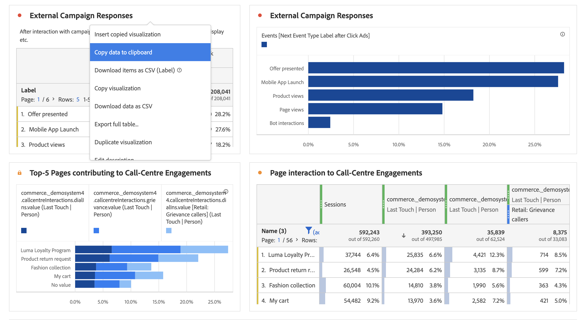

# Overzicht van visualisaties

Workspace biedt een aantal visualisaties waarmee u visuele weergaven van uw gegevens kunt genereren. Bijvoorbeeld staafgrafieken, donutgrafieken, histogrammen, lijngrafieken, kaarten, scatterpercelen en andere.

## Typen

De volgende visualisatietypen zijn beschikbaar in Analysis Workspace:

| Visualisatienaam   Visualisatiepictogram | Beschrijving |
| --- | --- | 
| [ Gebied ](/help/analysis-workspace/visualizations/area.md)

 | Een vlakgrafiekvisualisatie. Als een lijngrafiek, maar met een gekleurd gebied onder de lijn. Gebruik een vlakgrafiek als u meerdere maateenheden hebt en u het gebied wilt visualiseren dat wordt uitgedrukt door het snijpunt van twee of meer meetgegevens. |
| [ Bar ](/help/analysis-workspace/visualizations/bar.md) 

 | Een staafgrafiekvisualisatie met verticale balken die verschillende waarden over een of meer meeteenheden vertegenwoordigen. |
| [Staafdiagram](/help/analysis-workspace/visualizations/bullet-graph.md) 

 | Een grafiekvisualisatie van opsommingstekens, die toont hoe een waarde u in vergelijkt met of tegen andere prestatieswaaiers (doelstellingen) geinteresseerd bent. |
| [ Lijst van de Cohort ](/help/analysis-workspace/visualizations/cohort-table/cohort-analysis.md)

 | Een cohortvisualisatie is een groep mensen die gemeenschappelijke kenmerken gedurende een bepaalde periode delen. Een cohorttabel is handig voor analyse van retentie, churn of latentie. |
| [Cirkeldiagram](/help/analysis-workspace/visualizations/donut.md) 

 | Net als bij een cirkeldiagram worden gegevens in een donutvisualisatie weergegeven als delen of filters van een geheel. |
| [Uitval](/help/analysis-workspace/visualizations/fallout/fallout-flow.md)

 | Een fallout-visualisatie laat zien waar personen een vooraf gedefinieerde reeks pagina&#39;s hebben verlaten (uitgevallen) en doorlopen (doorvallen). |
| [Stroom](/help/analysis-workspace/visualizations/c-flow/flow.md)

 | Met een stroomvisualisatie kunt u via uw websites en apps precies zien wat de klanten precies doen. |
| [Vrije-vormentabel](/help/analysis-workspace/visualizations/freeform-table/freeform-table.md)

 | Een vrije tabelvisualisatie is een interactieve visualisatie. De visualisatie van de vrije-vormlijst is de stichting voor gegevensanalyse in Workspace. |
| [Histogram](/help/analysis-workspace/visualizations/histogram.md)

 | Een histogram visualisatieemmers, bezoeken of gebeurtenissen in emmers op basis van een metrisch volume. |
| [ Horizontale bar ](/help/analysis-workspace/visualizations/horizontal-bar.md)

 | Bij een horizontale staafvisualisatie worden horizontale balken weergegeven die verschillende waarden over een of meer meeteenheden vertegenwoordigen. |
| [ Zeer belangrijke metrische samenvatting ](/help/analysis-workspace/visualizations/key-metric.md)
 | Een zeer belangrijke samenvatting van metriek visualisatie combineert lijn, summiere verandering, en summiere aantalvisualisaties. |
| [Lijn](/help/analysis-workspace/visualizations/line.md)

 | Een lijnvisualisatie vertegenwoordigt metriek gebruikend een lijn om te tonen hoe de waarden over een periode veranderen. Een lijndiagram gebruikt tijd langs de x-as. |
| [Spreidingsdiagram](/help/analysis-workspace/visualizations/scatterplot.md) 

 | Een scatterplot visualisatie toont het verband tussen afmetingspunten en tot drie metriek. |
| [ Summiere aantal ](/help/analysis-workspace/visualizations/summary-number-change.md)

 | Bij een overzichtsnummervisualisatie wordt de geselecteerde cel weergegeven als één groot getal. |
| [ Summiere verandering ](/help/analysis-workspace/visualizations/summary-number-change.md)

 | Een overzicht van de visualisatie van de verandering toont de verandering tussen de geselecteerde cellen als één groot aantal of percentage. |
| [Tekst](/help/analysis-workspace/visualizations/text.md)

 | Met een tekstvisualisatie kunt u door de gebruiker gedefinieerde tekst toevoegen aan uw Workspace. Het is handig om extra context toe te voegen aan uw analyse en inzichten, naast het gebruik van panel-/visualisatiebeschrijvingen |
| [Boomstructuur](/help/analysis-workspace/visualizations/treemap.md)

 | Bij een treemapvisualisatie worden hiërarchische (gestructureerde) gegevens weergegeven als een set geneste rechthoeken. |
| [Venn](/help/analysis-workspace/visualizations/venn.md)

 | Bij een vlindervisualisatie worden cirkels gebruikt om de metrische overlapping van maximaal drie filters weer te geven. |

<!-- Add beneath Horizontal bar in the table above: | [Journey canvas](/help/analysis-workspace/visualizations/journey-canvas/journey-canvas.md) | Similar to Fallout, Journey canvas shows where persons left (fell out) and continued through (fell through) a predefined sequence of pages. 
Unlike Fallout, Journey canvas supports not only linear journeys, but any number of entry points and paths. Furthermore, journeys can be created in Adobe Journey Optimizer and then analyzed in Journey canvas.
 | -->

## Visualisaties toevoegen aan een deelvenster

1. Open het Workspace-project waar u een visualisatie wilt toevoegen.

1. Gebruik een van de volgende methoden om de visualisatie toe te voegen:

    toe

   * In het linkerpaneel, uitgezochte ](/help/assets/icons/GraphBarVertical.svg) GraphBarVertical **Visualizations**, dan sleep een visualisatie aan het paneel waar u de visualisatie aan wilt toevoegen., dan het pictogram kiezen dat de visualisatie vertegenwoordigt die u wilt toevoegen. Houd de muisaanwijzer boven het pictogram voor elke visualisatie om de naam weer te geven.

   * Voeg a [ leeg paneel ](https://experienceleague.adobe.com/en/docs/analytics/analyze/analysis-workspace/panels/blank-panel) toe, dan selecteer de visualisatie die u wilt toevoegen.

   * Selecteer **[!UICONTROL Duplicate visualization]** of **[!UICONTROL Copy visualization]** in het contextmenu van een bestaande visualisatie in uw Analysis Workspace-project.

   * Gebruik het menu Workspace **[!UICONTROL Insert]** om een visualisatie in te voegen.

   * Selecteer **[!UICONTROL Visualize]** in het contextmenu in een tabel voor vrije vorm. Selecteer vervolgens de visualisatie in het submenu. Op basis van de huidige selectie in de tabel bepaalt Workspace welke visualisatie moet worden aangeboden en welke gegevens moeten worden geïnterpreteerd om de gevraagde visualisatie te maken.

## Legenda

Met een visuele legenda kunt u de datum in een brontabel koppelen aan de plotselinge reeksen in de visualisatie. De legenda is interactief. U kunt een legenda-item selecteren om een reeks in de visualisatie weer te geven of te verbergen. Dit is handig als u de gegevens die worden weergegeven, wilt vereenvoudigen.

Bovendien kunt u de naam van legenda-labels wijzigen om de visuele kwaliteit te verbeteren. Nota: legenda het uitgeven is **niet** van toepassing op: Treemap, Bullet, Summiere Verandering/Aantal, Tekst, Vrije vorm, Histogram, Cohort of de visualisaties van de Stroom.

Een label voor een legenda bewerken:

1. Klik met de rechtermuisknop op een van de legenda-labels.
1. Klik op **[!UICONTROL Edit Label]**.

   

1. Voer de nieuwe labeltekst in.
1. Druk op **[!UICONTROL Enter]** om op te slaan.

## Instellingen

Elke visualisatie heeft zijn eigen instellingen. Om tot visualiseringsmontages toegang te hebben, uitgezochte  **[!UICONTROL Settings]** in de visualisatiekopbal om popup te tonen.

Afhankelijk van de visualisatie, kunt u vormen

* details voor de bron van gegevens van visualisatie door het [**[!UICONTROL Data source]**](#data-source) lusje, en
* instellingen voor de visualisatie via het tabblad [**[!UICONTROL Settings]**](#settings-1) .

### Gegevensbron

U kunt bepalen welke gegevensbron en punten of posities binnen die gegevensbron met een visualisatie beantwoorden. Zie [ gegevensbronnen beheren ](t-sync-visualization.md) voor meer informatie.

### Instellingen

Welke visualisatie-instellingen beschikbaar zijn, is afhankelijk van de visualisatie. De onderstaande tabel geeft een overzicht van de meest gebruikte instellingen. Sommige visualisaties hebben specifieke instellingen. Raadpleeg de afzonderlijke visualisatiedocumentatie voor meer informatie.

| Optie | Beschrijving |
| --- | --- |
| **[!UICONTROL Visualization type]** | Wijzig het type visualisatie dat wordt gebruikt om de gegevens te visualiseren. |
| **[!UICONTROL Granularity]** | Wijzig de tijdsgranulariteit voor trendvisualisaties. Deze wijziging geldt ook voor de gegevensbrontabel. |
| **[!UICONTROL Percentages]** | Waarden weergeven in percentages. |
| **[!UICONTROL 100% stacked]** | Zet het diagram om in een 100% gestapelde visualisatie.  Alleen van toepassing op een gebied, staaf en horizontale staaf met gestapelde visualisatie. |
| **[!UICONTROL Legend visible]** | De legenda-tekst weergeven. |
| **[!UICONTROL Limit max items]** | Beperk het aantal items dat zichtbaar is in een visualisatie. Als deze optie is geselecteerd, definieert u het aantal items dat maximaal kan worden gebruikt. |
| **[!UICONTROL Show annotations]** | De annotaties weergeven die voor deze visualisatie zijn gemaakt. |
| **[!UICONTROL Hide title]** | De titel van de visualisatie verbergen. |
| **[!UICONTROL Anchor y-axis at zero]** | Duw de bodem van de y-as aan nul. Als alle waarden die in het diagram worden uitgezet aanzienlijk boven nul liggen, wordt de onderkant van de y-as met de standaardinstelling van het diagram niet gelijk aan nul. Als u deze optie inschakelt, wordt de y-as naar nul geforceerd (en wordt de grafiek opnieuw getekend). |
| **[!UICONTROL Display dual axis]** | Geef de linker- en rechtery-as weer voor twee verschillende maateenheden. Deze optie is alleen van toepassing als u twee meetwaarden hebt. Dubbele assen zijn nuttig wanneer de uitgezette metriek van verschillende grootten zijn. |
| **[!UICONTROL Show x-axis]** | De x-as weergeven in de visualisatie. |
| **[!UICONTROL Show y-axis]** | Geef de y-as weer in de visualisatie. |
| **[!UICONTROL Show barbells on lines]** | Ballonnen tonen op de lijnvisualisatie in een combografievisualisatie. |
| **[!UICONTROL Normalization]** | Dwing metriek aan gelijke verhoudingen. Gelijke verhoudingen zijn handig wanneer uitgezette metriek van verschillende grootten zijn. |
| **[!UICONTROL Show anomalies]** | Verbeter lijngrafieken en vrije-vormlijsten door anomalieopsporing te tonen. Anomaliedetectie in lijnvisualisatie omvat een verwachte waarde (onderbroken lijn) en een verwacht bereik (gearceerde band). |
| **[!UICONTROL Show forecast]** | Verbeter lijngrafieken en vrije-vormlijsten door voorspelde waarden te tonen. |
| **[!UICONTROL Show min]** | De minimale waarde in de visualisatie weergeven. |
| **[!UICONTROL Show max]** | De maximale waarde in de visualisatie tonen. |
| **[!UICONTROL Show trendline]** | Toon een trendlijn in de visualisatie. Als deze optie is geselecteerd, kunt u het type trendline selecteren in het vervolgkeuzemenu. |

U kunt de instellingen aanpassen voor alle visualisaties die u maakt. Voor meer informatie, zie [ voorkeur van de Gebruiker ](/help/analysis-workspace/user-preferences.md).

## Contextmenu {#right-click}

Gebruik het contextmenu (beschikbaar via een alternatieve selectie, bijvoorbeeld door met de rechtermuisknop te klikken wanneer u een muis gebruikt) op een visualisatiekop voor toegang tot extra functionaliteit voor een visualisatie. Niet alle opties zijn beschikbaar voor alle visualisaties.

| Optie | Beschrijving |
| --- | --- |
| **[!UICONTROL Insert copied visualization]** | Plak (voeg) een gekopieerde visualisatie naar een andere plaats binnen het project of naar een geheel ander project. |
| **[!UICONTROL Copy data to clipboard]** | Kopieer gegevens van de visualisatie naar het klembord. |
| **[!UICONTROL Copy selection to clipboard]** | Kopieer de selectie van de visualisatie naar het klembord. |
| **[!UICONTROL Download items as CSV (*afmetingsnaam *)]** | Download de dimensie-items (tot een maximum van 50.000) van de visualisatie naar uw lokale apparaat. Maximaal 50.000 dimensieitems voor de geselecteerde dimensie. |
| **[!UICONTROL Copy visualization]** | Kopieer de visualisatie, zodat u de visualisatie aan een andere plaats binnen het project, of in een volledig verschillend project kunt opnemen. |
| **[!UICONTROL Download data CSV]** | Download de weergegeven gegevens van de visualisatie naar uw lokale apparaat. |
| **[!UICONTROL  Export full table...]** | Exporteer de volledige tabel naar een aangegeven locatie in de cloud. Zie [ de rapporten van de Customer Journey Analytics van Uitvoer aan de wolk ](../export/export-cloud.md) |
| **[!UICONTROL Duplicate visualization]** | Maak een exacte kopie van de visualisatie. |
| **[!UICONTROL Edit description]** | Voeg (of bewerk) een tekstbeschrijving voor visualisatie toe. Zie [ Tekst ](text.md). |
| **[!UICONTROL Get visualization link]** | Kopieer en deel een koppeling rechtstreeks naar de visualisatie. De koppeling wordt weergegeven in een dialoogvenster voor het delen van een koppeling. Selecteer Kopiëren om de koppeling naar het klembord te kopiëren. |
| **[!UICONTROL Start over]** | Verwijder de configuratie voor de huidige visualisatie zodat u deze volledig opnieuw kunt configureren. |

## Configuratie

Sommige visualisaties (zoals de lijst van de Cohort, Vallout, Stroom, en anderen) hebben een configuratiedialoog om u bij de bouw van de visualisatie te helpen. Het gebruik  bij de bovenkant van visualisatie uit om tot de configuratie toegang te hebben en te veranderen.

## Visualiseren

Als u niet zeker bent welke visualisatie om te plukken, uitgezochte  **[!UICONTROL Visualize]** in om het even welke vrije rij van de lijstlijst (beschikbaar bij aanwijzen). Deze selectie is de snelste manier om een visualisatie toe te voegen. Analysis Workspace neemt een goed doordachte veronderstelling waar visualisatie het beste aan uw gegevens zou voldoen. Bijvoorbeeld, als u één geselecteerde rij hebt, leidt het tot een trended [ lijngrafiek ](line.md). Als u drie geselecteerde filterrijen hebt, leidt het tot a [ vlinderdiagram ](venn.md).

