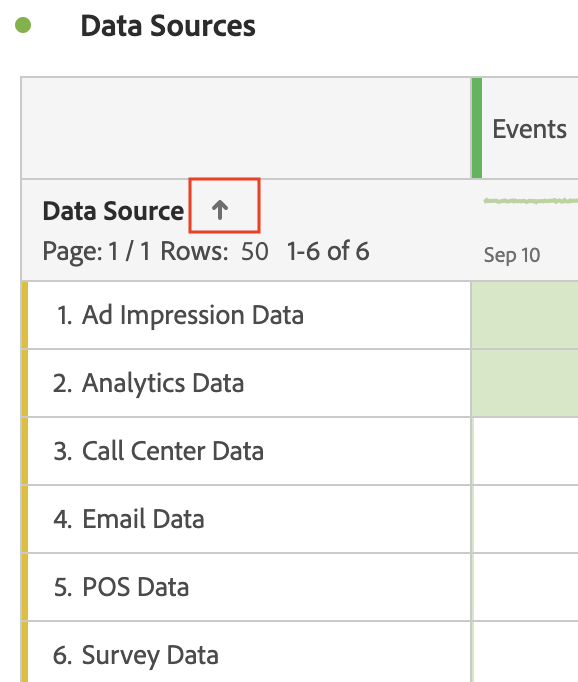

# Pagineren, filteren en tabellen sorteren

>[!NOTE]
>
>U bekijkt de documentatie voor Analysis Workspace in Customer Journey Analytics. De functieset verschilt enigszins van [Analysis Workspace in traditionele Adobe Analytics](https://docs.adobe.com/content/help/en/analytics/analyze/analysis-workspace/home.html). [Meer informatie...](/help/getting-started/cja-aa.md)

Bekijk de volgende videozelfstudie voor een overzicht van paginering, filteren en sorteren van tabellen in Analysis Workspace:

>[!VIDEO](https://video.tv.adobe.com/v/23968)

## Geavanceerde filteropties {#section_36E92E31442B4EBCB052073590C1F025}

Als u op het filterpictogram klikt en vervolgens **[!UICONTROL Show Advanced]** naast een dimensie in een vrije-vormtabel, kunt u filteren met de volgende criteria. U kunt veelvoudige het filtreren regels toepassen.

* Bevat
* Bevat niet
* Contains all terms (Bevat alle termen)
* Contains any term (Bevat een term)
* Contains the phrase (Bevat de woordgroep)
* Does not contain any term (Bevat geen enkele term)
* Does not contain the phrase (Bevat niet de woordgroep)
* Equals (Is gelijk aan)
* Does not equal (Is niet gelijk aan)
* Starts with (Begint met)
* Ends with (Eindigt met)

## Dimension sorteren in Freeform-tabellen

>[!NOTE]
>
>Dimension sorteren is alleen van toepassing op Freeform-tabellen in Customer Journey Analytics, niet in traditionele Adobe Analytics. Metrische sortering kan in beide versies van Analytics worden uitgevoerd.

1. In om het even welke lijst van de Vrije Vorm in een project, klik de pijl naast de afmetingsnaam:

* De pijl-omlaag sorteert in aflopende volgorde en de pijl-omhoog (standaard) in oplopende volgorde.
* U kunt de afmetingen alfabetisch of numeriek sorteren. U hebt bijvoorbeeld genummerde stappen in een werkstroom en wilt mogelijk sorteren op het stapnummer. U kunt een aan een datum gerelateerde dimensie op datum sorteren. U kunt gegevensbronnen ook alfabetisch sorteren, zoals in de bovenstaande schermafbeelding.
