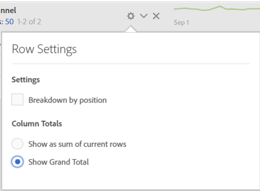

# Totalen werkruimte

In Freeform-tabellen wordt op elk uitsplitsingsniveau een totale rij weergegeven met twee totalen:

* **[!UICONTROL Grand Total]** (grijs &#39;van&#39; getal) - dit totaal vertegenwoordigt alle treffers die zijn verzameld. Wanneer een filter op paneelniveau of binnen de vrije vormlijst wordt toegepast, past dit totaal aan om op alle treffers te wijzen die de filtercriteria aanpassen.
* **[!UICONTROL Table Total]** (zwart getal) - dit totaal is doorgaans gelijk aan of een subset van de [!UICONTROL Grand Total]. Het geeft alle tabelfilters weer die binnen de vrije-vormtabel worden toegepast, inclusief de [!UICONTROL Include None] optie.

## Totale instelling weergeven

Onder **[!UICONTROL Column Settings]**, er zijn mogelijkheden om **[!UICONTROL Show Totals]** en **[!UICONTROL Show Grand Total]**. Als deze instellingen zijn uitgeschakeld, worden de totalen uit de tabel verwijderd. Dit kan gewenst zijn in gevallen waarin totalen bijvoorbeeld in bepaalde gevallen onzinnig zijn [Berekende metrische scenario&#39;s](https://experienceleague.adobe.com/docs/analytics/components/calculated-metrics/calcmetrics-reference/cm-totals.html).

## Statische rijtotaal, instellingen

[Statische rij](/help/analysis-workspace/visualizations/freeform-table/column-row-settings/manual-vs-dynamic-rows.md) de totalen gedragen zich verschillend en worden gecontroleerd onder **[!UICONTROL Row Settings]**.

* **[!UICONTROL Show sum of current rows as the total]** - dit toont een cliënt-zijsom van de rijen in de lijst die betekent het totale zal **niet** deduplicatie van metingen zoals bezoeken of bezoekers.
* **[!UICONTROL Show Grand Total]** - dit toont een bedrag aan serverzijde, wat betekent het totaal metriek zoals bezoeken of bezoekers zal dedupliceren.

## Veelgestelde vragen

| Vragen | Antwoord |
|---|---|
| Op welke &#39;total&#39; zijn de grijze kolompercentages gebaseerd? | Dit hangt af van de **[!UICONTROL Percentages]** selectie instellen onder **[!UICONTROL Row Settings]**:<ul><li>Percentage berekenen op kolom - Dit is de standaardinstelling. Percentages worden gebaseerd op het totaal van de tabel.</li><li>Percentage berekenen op rij - Percentages worden gebaseerd op het Eindtotaal.</li></ul> |
| Hoe doet het **[!UICONTROL Include Unspecified (None)]** effecttotalen instellen? | Als de **[!UICONTROL Include Unspecified (None)]** het plaatsen wordt ongecontroleerd, niets/niet gespecificeerde rij zal worden verwijderd uit de lijst, het Totaal van de Lijst, en zal door aan om het even welke berekende metriek uitvoeren die gebruiken [Metrische typen &#39;Totaal&#39;](https://experienceleague.adobe.com/docs/analytics/components/calculated-metrics/calcmetric-workflow/m-metric-type-alloc.html) |
| Wanneer de filters van de douanetabel op een vrije vormlijst worden toegepast, doe al mijn berekende metriek en voorwaardelijke het formatteren rekening voor de filter? | Momenteel niet. **[!UICONTROL Include Unspecified (None)]** worden in de berekening opgenomen, maar aangepaste tabelfilters hebben geen invloed op het volgende:<ul><li>Het max/min-bereik van de kolom dat bij voorwaardelijke opmaak wordt gebruikt, wordt door alle gegevens bekeken.</li><li>Berekende maatstaven die gebruikmaken van **[!UICONTROL Grand Total]** metrische typen.</li><li>Berekende metriek met functies die over rijen in een vrije-vormlijst - d.w.z. Kolomsom, Kolommaximum, Kolom min, Aantal, Gemiddeld, Mediaan, Percentage, Aantal, Rijen, Standaardafwijking, Variantie, Cumulatief, Cumulatief Gemiddelde, Regressievarianten, T-Score, T-Test, Z-Score, Z-Test berekenen.</li></ul> |
| Wat doet de functie **[!UICONTROL Grand Total]** metrisch type weerspiegelen? | **[!UICONTROL Grand Total]** blijft verwijzen naar de **[!UICONTROL Grand Total]** en geeft geen filters weer die zijn toegepast op een tabel of de **[!UICONTROL Table Total]**. |
| Welk totaal wordt getoond wanneer de gegevens of van een vrije vormlijst worden gekopieerd en worden gekleefd of via CSV worden gedownload? | De totale rij geeft de **[!UICONTROL Table Total]** alleen en respecteert de kolom **[!UICONTROL Show Totals]** instellen. |
