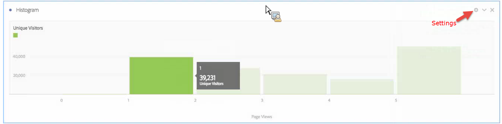
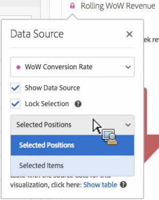

# Histogram

>[!NOTE]
>
>U bekijkt de documentatie voor de Werkruimte van de Analyse in de Analyse van de Reis van de Klant. Zijn eigenschapreeks verschilt lichtjes van [De Werkruimte van de analyse in de traditionele Analyse van Adobe](https://docs.adobe.com/content/help/en/analytics/analyze/analysis-workspace/home.html). [Meer informatie...](/help/getting-started/cja-aa.md)

Een histogram is gelijkaardig aan een grafiek van de bar, maar het groepeert aantallen in waaiers (emmers). Analytics automatiseert het &quot;bucketing&quot;van aantallen in waaiers, maar u kunt de montages in veranderen [Geavanceerde instellingen](#section_09D774C584864D4CA6B5672DC2927477).

## Een histogram maken {#section_74647707CC984A1CB6D3097F43A30B45}

Om een histogram te maken:

1. Klik **[!UICONTROL Visualizations]** in de linkerspoorstaaf.
1. Slepen **[!UICONTROL Histogram]** naar het paneel.
1. Kies een Metrisch om aan de visualisatie van de Histogram te slepen en klik **[!UICONTROL Build]**.

>[!NOTE]
>
>Histogrammen steunen slechts standaardmetriek, niet berekende metriek.

Hier hebben we de pagina Materieel voor unieke bezoekers gebruikt. De eerste (verlaten) emmer beantwoordt aan 1 paginamening per unieke bezoeker, het tweede emmer aan twee paginameningen, enz.

## Geavanceerde instellingen {#section_09D774C584864D4CA6B5672DC2927477}

Om uw histogram montages aan te passen, klik het pictogram van Montages (&quot;toestel&quot;) in de hogere juiste hoek. Hier zijn de montages u kunt wijzigen:

| Histogram Instellingen | Wat zij doet |
|---|---|
| Emmer | Bepaalt welke emmer de histogram met begint. &quot;1&quot; is de standaardwaarde. U kunt beginnende aantallen van 0 aan oneindig (geen negatieve aantallen) plaatsen. |
| metrische emmers | Laat u het aantal gegevenswaaiers (emmers.) verhogen/verminderen Het maximumaantal emmers is 50. |
| Metrische Emmergrootte | Laat u de grootte van elke emmer plaatsen. Bijvoorbeeld, kunt u de bucketgrootte van 1 paginamening in 2 paginameningen veranderen. |
| Telmethode | Laat u kiezen uit [Bezoeker](https://docs.adobe.com/content/help/en/analytics/components/metrics/unique-visitors.html), [Bezoek](https://docs.adobe.com/content/help/en/analytics/components/metrics/visits.html), of Sittype. Bijvoorbeeld, paginameningen per bezoek of paginameningen per bezoeker of paginameningen per klap. Voor Hit, wordt de &quot;Voorkomen&quot; gebruikt als y-as metrisch in een freeformlijst. |

<!--Russ or Meike - Check Hit Type link above. -->

**Voorbeelden**:

* Emmer starten: 1; metrische emmers: 5; Metrische Bucketgrootte: 2 zal in deze histogram resulteren: 1-2, 3-4, 5-6, 7-8, 9-10.
* Emmer starten: 0; metrische emmers: 3. Metrische Bucketgrootte: 5 zal in deze histogram resulteren: 0-4, 5-9, 10-14

## De mening en geeft histogram gegevens uit {#section_B2CD7CDF0F6B432F928103AE7AAA3617}

Om de gegevensbron voor de histogram grafiek te bekijken of te veranderen, klik de punt naast de kopbal van de Histogram om naar te gaan **[!UICONTROL Data Source Settings]** > **[!UICONTROL Show Data Source]**.

De pre-gebouwde segmenten die in de lijst verschijnen zijn interne segmenten en zullen niet in de selecteur van het Segment verschijnen. Klik op het pictogram &quot;i&quot; naast de segmentnaam en klik vervolgens op **[!UICONTROL Make public]** het segment openbaar te maken.

Om meer manieren te verkennen om de lijsten van Freeform- gegevens en andere visualisaties te beheren, zoals het doen van gegevensonderverdelingen, gaan [hier](https://docs.adobe.com/content/help/en/analytics/analyze/analysis-workspace/visualizations/freeform-analysis-visualizations.html).
