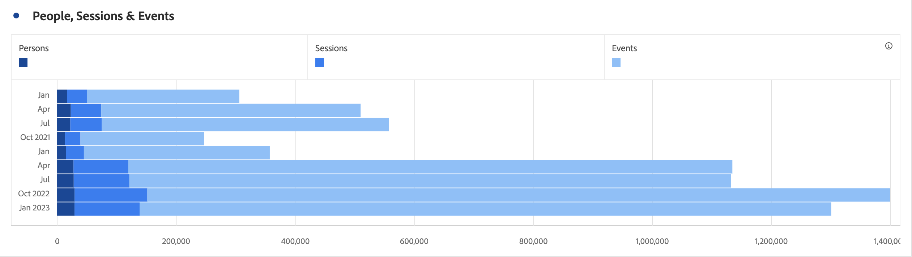

# Horizontale balk (gestapeld)

De horizontale balkvisualisatie heeft een standaard- en gestapelde optie.

## Rekstok {#horizontal-bar}

<!-- markdownlint-disable MD034 -->

>[!CONTEXTUALHELP]
>id="cja_workspace_horizontalbar_button"
>title="Rekstok"
>abstract="Maak een horizontale balkvisualisatie die verschillende waarden voor een of meer metrische gegevens vertegenwoordigt."

<!-- markdownlint-enable MD034 -->

 **[!UICONTROL Horizontal bar]** toont horizontale balken die verschillende waarden over een of meer metrische waarden vertegenwoordigen.

## Horizontale balk gestapeld {#horizontal-bar-stacked}

<!-- markdownlint-disable MD034 -->

>[!CONTEXTUALHELP]
>id="cja_workspace_horizontalbarstacked_button"
>title="Horizontale balk gestapeld"
>abstract="Maak een horizontale balkvisualisatie die verschillende waarden voor een of meer gestapelde metrische gegevens vertegenwoordigt."

<!-- markdownlint-enable MD034 -->

De  **[!UICONTROL Horizontal bar stacked]** lijkt op de , [!UICONTROL Horizontal bar]maar de reeksbalken zien er gestapeld uit.

Gebruik de **[!UICONTROL 100% stacked]** optie bij  **[!UICONTROL Settings]** om de grafiek om te zetten in een 100% gestapelde visualisatie.

>[!MORELIKETHIS]
>
>[Een visualisatie aan een deelvenster toevoegen](/help/analysis-workspace/visualizations/freeform-analysis-visualizations.md#add-visualizations-to-a-panel)
>[Visualisatie-instellingen](/help/analysis-workspace/visualizations/freeform-analysis-visualizations.md#settings)
>[Contextmenu visualiseren](/help/analysis-workspace/visualizations/freeform-analysis-visualizations.md#context-menu)
>

